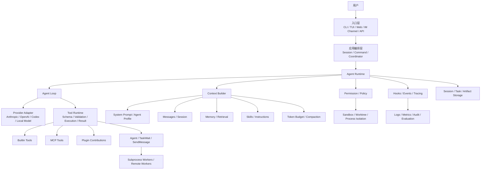
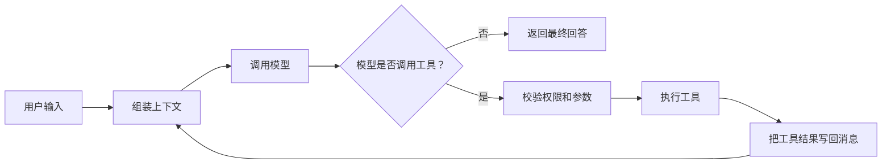
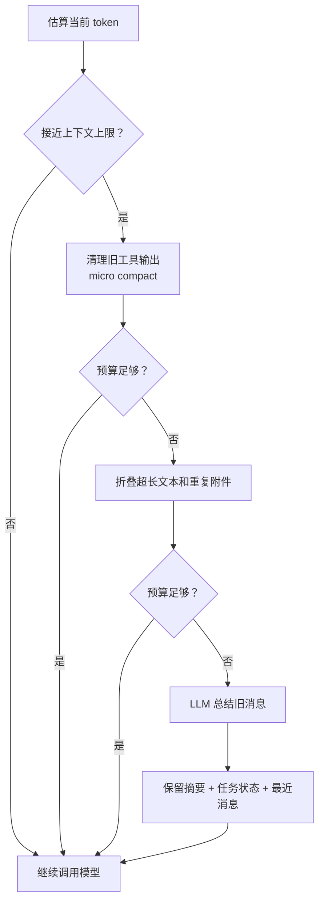
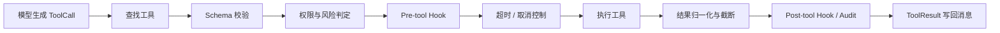
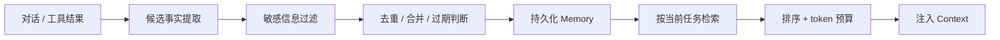
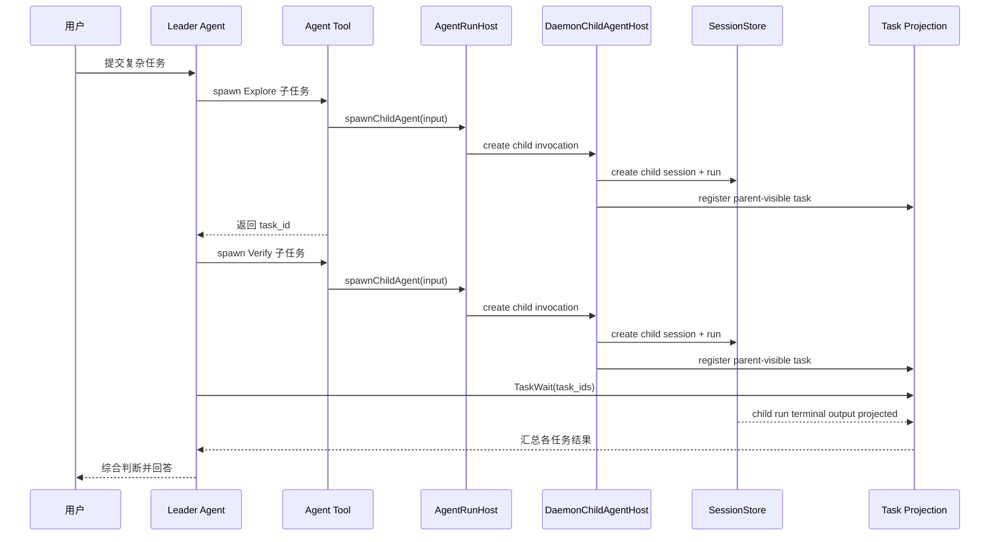
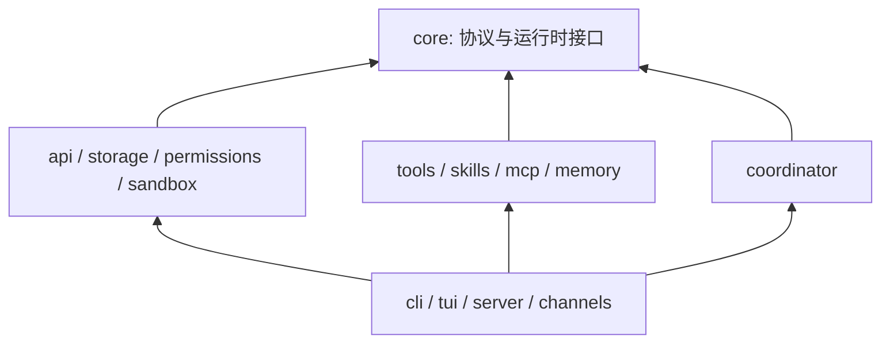

# 一个完整 Agent 应用需要什么

> 一份关于 Agent 功能、运行机制与工程架构的系统性笔记。

## 0. 先建立一个最重要的认识

LLM 本身不是 Agent。

LLM 更像一个“根据现有信息决定下一步”的推理器。只有当系统把它放进一个可重复运行的循环，给它工具、状态、权限和反馈，它才成为能够持续完成任务的 Agent。

可以先记住这个公式：

```text
Agent = Model
      + Instructions
      + Context
      + Tools
      + Loop
      + State
      + Guardrails
```

一个完整的 Agent 应用，则是在 Agent 外再补上用户入口、多 Agent 调度、持久化、扩展机制和可观测性：

```text
Agent Application = Agent Runtime
                  + Provider Layer
                  + Capability System
                  + Session / Memory
                  + Permission / Sandbox
                  + Swarm / Coordinator
                  + UI / Channels
                  + Observability / Evaluation
```

因此，Agent 开发的真正难点通常不是“调用一次模型”，而是：

1. 怎样把正确的信息放进上下文。
2. 怎样让模型可靠地调用工具并接收结果。
3. 怎样防止循环失控、权限越界和上下文爆炸。
4. 怎样在失败、重启、并发和长任务中保持状态一致。

---

## 1. 一张总图看懂完整架构



这张图可以分成四个问题：

| 问题 | 对应模块 |
|---|---|
| Agent 现在应该做什么？ | Model、Prompt、Context |
| Agent 怎样真正执行？ | Loop、Tools、MCP、Worker |
| Agent 被允许做什么？ | Permission、Sandbox、Policy |
| Agent 怎样长期稳定运行？ | Session、Memory、Compact、Tracing、Evaluation |

---

## 2. Agent Loop：整个系统的心脏

最小版本的 Agent Loop 非常简单：

```ts
async function runAgent(userInput: string) {
  const messages = [systemPrompt, { role: "user", content: userInput }];

  while (true) {
    const response = await model.generate({ messages, tools });
    messages.push(response);

    if (response.toolCalls.length === 0) {
      return response.text;
    }

    for (const call of response.toolCalls) {
      const result = await executeTool(call);
      messages.push({
        role: "tool",
        toolCallId: call.id,
        content: result,
      });
    }
  }
}
```

它的工作方式是：



但生产级循环要多处理很多事情：

- 流式输出和中途取消。
- 最大轮数、超时和费用预算。
- 多个工具并行执行。
- 参数 Schema 校验。
- 权限询问与用户批准。
- 工具结果截断和附件存储。
- 上下文压缩。
- Provider 错误重试和降级。
- Hook、日志、审计和会话快照。
- 模型返回异常结构时的修复。

一个更接近真实系统的伪代码如下：

```ts
async function runAgentTurn(input, runtime) {
  runtime.history.append(userMessage(input));
  await runtime.hooks.emit("user_message", input);

  for (let turn = 1; turn <= runtime.limits.maxTurns; turn++) {
    runtime.cancellation.throwIfAborted();

    const context = await runtime.contextBuilder.build({
      history: runtime.history,
      memories: await runtime.memory.retrieve(input),
      skills: runtime.skills.active(),
      tokenBudget: runtime.model.contextWindow,
    });

    const compacted = await runtime.compactor.fit(context);
    const response = await runtime.provider.stream(compacted);
    runtime.history.append(response.message);

    if (!response.toolCalls.length) {
      await runtime.session.checkpoint();
      return response.text;
    }

    const results = await Promise.all(
      response.toolCalls.map(async (call) => {
        const tool = runtime.tools.require(call.name);
        const args = tool.schema.parse(call.arguments);
        const decision = await runtime.permissions.check(tool, args);

        if (!decision.allowed) {
          return deniedToolResult(call, decision.reason);
        }

        await runtime.hooks.emit("pre_tool_use", { call, args });
        const result = await withTimeout((abortSignal) =>
          tool.execute(args, {
            ...runtime.toolContext,
            abortSignal,
          }),
          tool.timeout,
        );
        await runtime.hooks.emit("post_tool_use", { call, result });

        return runtime.toolOutputBudget.normalize(call, result);
      }),
    );

    runtime.history.appendMany(results);
    await runtime.session.checkpoint();
  }

  throw new MaxTurnsExceededError();
}
```

这里有一个关键设计原则：**模型负责决策，Runtime 负责执行和约束。**

不要指望 Prompt 替代权限检查、超时、参数校验或状态机。Prompt 是软约束，代码才是硬约束。

当前 OpenHarness 的工具调用硬约束按以下顺序落地：

```text
ToolCall
  → ToolDefinition 查找
  → inputSchema 校验
  → Permission
  → pre_tool_use hook
  → Timeout / AbortSignal
  → Execute
  → post_tool_use hook
  → Output Budget（写入 tool_result 时）
```

`ToolContext.abortSignal` 会传给工具，长耗时或第三方工具应主动监听；否则 Runtime 能超时返回，
但底层工作是否停止取决于工具自身是否配合取消。Output Budget 在工具结果写入 `tool_result`
消息时应用。独立 Audit 事件/日志还不是核心管线的一环，
现阶段审计类扩展可挂在 `post_tool_use` hook 上。

---

## 3. Message 是 Agent Runtime 的通用协议

Agent Loop 看似在调用模型，实际一直在维护一条结构化消息流：

```text
system      系统规则、人格、环境信息
user        用户输入
assistant   模型的思考结果、文本或工具调用
tool        工具执行结果，与 tool_call_id 对应
```

推荐在 Runtime 内部定义自己的统一消息格式，再由不同 Provider Adapter 转换成厂商协议：

```ts
type AgentMessage =
  | { role: "system"; content: ContentBlock[] }
  | { role: "user"; content: ContentBlock[] }
  | {
      role: "assistant";
      content: ContentBlock[];
      toolCalls?: ToolCall[];
      usage?: TokenUsage;
    }
  | {
      role: "tool";
      toolCallId: string;
      content: ContentBlock[];
      isError?: boolean;
    };
```

这样做的价值是：上层 Agent Loop 不需要知道 Anthropic 的 `tool_use`、OpenAI 的 `tool_calls` 或某个本地模型的特殊字段。

需要特别保证：

- 每个工具调用都必须有对应结果，即使结果是拒绝或失败。
- 消息顺序必须稳定，恢复会话时要修复不完整的调用配对。
- 文本、图片、音频、文件引用最好使用统一的 `ContentBlock`。
- Provider 特有信息放在可选 metadata 中，不要污染核心协议。

---

## 4. Provider 层：不只是换一个 API 地址

Provider 层负责把统一 Runtime 协议翻译成不同模型厂商的协议。

一个 Provider Adapter 至少要处理：

| 能力 | 说明 |
|---|---|
| 认证 | API Key、OAuth、订阅凭证、临时 Token |
| 消息转换 | system/user/assistant/tool 的字段差异 |
| 工具调用 | 工具 Schema、并行调用、结果回传格式 |
| 流式协议 | 文本增量、工具参数增量、usage、结束原因 |
| 模型能力 | context window、vision、reasoning、JSON mode |
| 参数适配 | `max_tokens`、`max_completion_tokens`、effort 等差异 |
| 错误归一化 | 限流、超时、认证失败、上下文过长、服务异常 |
| 重试策略 | 哪些错误可重试、退避时间、是否切换模型 |

推荐接口：

```ts
interface ModelProvider {
  readonly capabilities: ModelCapabilities;

  stream(request: ModelRequest): AsyncIterable<ModelEvent>;

  countTokens?(request: ModelRequest): Promise<number>;

  classifyError(error: unknown):
    | "auth"
    | "rate_limit"
    | "context_overflow"
    | "timeout"
    | "invalid_request"
    | "server_error";
}
```

Provider、Auth 和 Model 是三个概念：

- **Auth**：凭证从哪里来。
- **Provider**：请求发给谁、使用什么协议。
- **Model**：这个 Provider 下具体使用哪个模型及其能力。

不要把厂商判断散落在 Agent Loop 里，例如到处写 `if (provider === "openai")`。所有差异都应尽量封装在 Adapter 内。

---

## 5. Context Builder：决定模型“看见什么”

很多 Agent 问题表面上是模型能力问题，实际是上下文组织问题。

一次模型请求的上下文通常由这些部分组成：

```text
1. 平台安全规则
2. 应用 System Prompt
3. Agent Profile（角色、职责、工具限制）
4. 当前工作环境（cwd、时间、项目说明）
5. 激活的 Skill 指令
6. 检索到的长期记忆
7. 会话摘要 / 当前任务状态
8. 最近的原始对话
9. 当前用户输入和工具结果
```

不要简单地把所有信息全部拼进去。Context Builder 更像一个有预算的装箱器：

```ts
async function buildContext(input): Promise<Message[]> {
  const budget = new TokenBudget(model.contextWindow);

  budget.reserve("output", model.maxOutputTokens);
  budget.reserve("toolSchemas", estimateTools(activeTools));
  budget.addRequired("system", buildSystemPrompt());
  budget.addRequired("currentInput", input);
  budget.addRecent("history", recentMessages);
  budget.addRanked("memory", retrievedMemories);
  budget.addRanked("skills", relevantSkillInstructions);

  return budget.fit();
}
```

推荐将上下文分成三类：

| 类型 | 例子 | 策略 |
|---|---|---|
| 必须保留 | 安全规则、当前输入、未闭合工具调用 | 永不丢弃 |
| 尽量保留 | 最近消息、任务状态、关键文件摘要 | 按优先级裁剪 |
| 按需加载 | Skill 正文、历史记忆、大文件 | 检索后注入 |

这里最重要的不是“上下文越多越好”，而是**上下文中每一段信息都应有来源、优先级、生命周期和 token 预算**。

---

## 6. 上下文压缩：让 Agent 能持续工作

长会话一定会超过上下文窗口，所以压缩不是锦上添花，而是运行时的基础设施。

比较稳妥的压缩策略是分层处理：



可以把压缩理解为四层：

1. **输出预算**：工具结果刚产生时就限制大小，完整内容放入文件或 artifact。
2. **Micro compact**：旧工具结果替换为短占位符，不调用模型。
3. **Context collapse**：超长内容保留头尾，中间折叠。
4. **Semantic summary**：用模型总结旧对话，只保留最近若干轮原文。

压缩摘要至少要保存：

- 用户目标和验收条件。
- 已完成工作与关键结论。
- 修改过的文件和重要符号。
- 当前失败、风险和未决问题。
- 下一步动作。
- 仍然有效的用户约束。

一个常见错误是只总结“聊过什么”，却没有保存“现在做到哪里”。因此最好把语义摘要和结构化任务状态分开：

```ts
interface TaskCheckpoint {
  goal: string;
  constraints: string[];
  completed: string[];
  nextStep?: string;
  changedFiles: string[];
  openQuestions: string[];
}
```

---

## 7. Tool System：让推理变成行动

工具系统至少包含四部分：

```text
Tool Definition  工具名称、描述、输入 Schema、风险信息
Tool Registry    注册、查找、启用/禁用、命名冲突处理
Tool Executor    参数校验、权限、超时、取消、执行、错误归一化
Tool Result      统一结果格式、长度预算、附件和可压缩标记
```

推荐定义：

```ts
interface Tool<TArgs, TResult> {
  name: string;
  description: string;
  schema: Schema<TArgs>;
  risk: "read" | "write" | "execute" | "network" | "external_side_effect";
  timeoutMs?: number;

  execute(args: TArgs, context: ToolContext): Promise<TResult>;
}
```

一次工具调用应经过固定管线：



工具返回失败时不要直接让整个 Agent 崩溃。大多数工具错误应该变成结构化 `tool_result`，让模型看到错误并决定重试、换参数或换方案。

工具设计还应遵循：

- 工具职责单一，输入输出可预测。
- 描述告诉模型“何时使用”，Schema 告诉模型“怎样使用”。
- 写操作尽量支持 dry-run、diff 或幂等键。
- 大结果返回摘要和引用，不把几百 KB 全塞进消息。
- 并行工具只能并行执行真正相互独立的调用。

---

## 8. Tool、Skill、MCP、Plugin 到底有什么区别

这四个概念经常混在一起，可以用“代码、说明书、协议、安装包”来理解：

| 概念 | 类比 | 本质 | 典型内容 |
|---|---|---|---|
| Tool | 一台机器 | 可执行能力 | 读文件、搜索、发消息、建任务 |
| Skill | 操作手册 | 给 Agent 的领域流程和经验 | 如何审查 PR、如何生成报告 |
| MCP | 标准插座 | 连接外部能力的协议 | 第三方工具、资源、Prompt |
| Plugin | 扩展安装包 | 一组可安装贡献 | Tools + Skills + Hooks + Agents + MCP 配置 |

### Skill 的正确组织方式

Skill 不应只是一个更长的 System Prompt。好的 Skill 应具备：

- 清晰的触发条件。
- 可执行步骤和停止条件。
- 所需工具、权限和输入说明。
- 相关脚本、模板和参考资料。
- 渐进式加载，避免所有 Skill 全量进入上下文。

推荐目录：

```text
skills/
  code-review/
    SKILL.md
    scripts/
      collect-diff.ts
    references/
      severity-guide.md
    templates/
      review.md
```

加载过程可以是：

```text
启动时：只加载 skill 名称 + 简短描述
命中时：加载完整 SKILL.md
执行时：按 SKILL.md 指引加载某个 reference 或 script
```

这叫渐进式披露。它既节省 token，也能避免无关规则互相干扰。

### MCP 的边界

MCP Client 应负责：

- Server 生命周期和 transport（stdio、HTTP、SSE）。
- 能力发现和工具 Schema 转换。
- 认证、超时、断线和失败隔离。
- 工具命名空间，例如 `mcp__github__create_issue`。
- Resource、Prompt 与 Tool 的统一注册。

MCP 是能力接入层，不应接管 Agent Loop。即使 MCP Server 挂掉，Runtime 也应能隔离失败并继续使用其他工具。

---

## 9. Permission 与 Sandbox：决定“能不能做”

Agent 的安全不能只靠一句“请不要执行危险操作”。

建议把安全分成三层：

| 层 | 解决什么问题 | 示例 |
|---|---|---|
| Policy | 逻辑上是否允许 | 黑白名单、路径规则、命令规则 |
| Approval | 谁来作出高风险决定 | 本次允许、会话允许、拒绝 |
| Sandbox | 即使误判，影响范围有多大 | 容器、受限目录、网络隔离、worktree |

权限判断可以建模为：

```ts
async function authorize(call, context): Promise<Decision> {
  if (context.disallowedTools.has(call.name)) return deny("blocked by policy");
  if (!pathPolicy.allows(call.arguments)) return deny("path outside workspace");
  if (call.risk === "read") return allow("read-only auto approval");
  if (context.mode === "full_auto") return allow("full-auto policy");
  return await askUserForApproval(call);
}
```

要注意：

- Permission 是授权判断，Sandbox 是执行隔离，两者不能互相替代。
- 子 Agent 不应天然继承 Leader 的全部权限。
- 外部副作用，如发消息、付款、发布、删除远端数据，应单独分级。
- 审批信息应记录工具、参数、发起者、决策者和时间，形成审计链。

---

## 10. Session、Memory 与 Artifact：三种状态不要混在一起

Agent 系统里常见的“记住”至少有四种含义：

| 状态 | 生命周期 | 示例 |
|---|---|---|
| Working State | 当前循环 | 本轮工具调用、临时变量 |
| Session | 当前会话 | 完整消息、usage、当前任务状态 |
| Long-term Memory | 跨会话 | 用户偏好、项目约定、历史决策 |
| Artifact | 独立产物 | 文件、日志、报告、图片、完整工具输出 |

消息历史不是长期记忆，向量数据库也不等于记忆系统。

一个较完整的 Memory Pipeline 是：



长期记忆最好带结构化元数据：

```ts
interface MemoryRecord {
  id: string;
  scope: "user" | "project" | "team";
  kind: "preference" | "fact" | "decision" | "constraint";
  content: string;
  source: string;
  createdAt: string;
  expiresAt?: string;
  confidence: number;
  tags: string[];
}
```

没有来源、作用域、过期机制和删除能力的“记忆”，最终很容易变成持续污染上下文的旧信息。

---

## 11. Swarm 与 Subprocess：什么时候需要多 Agent

多 Agent 的本质不是“让几个模型聊天”，而是把任务拆成多个拥有独立上下文和执行生命周期的工作单元。

适合拆分的任务：

- 多个互不依赖的调研或代码区域。
- 需要不同角色约束，例如 Explore、Plan、Implement、Verify。
- 主上下文太拥挤，子任务可以隔离。
- 任务耗时长，适合后台运行。

不适合拆分的任务：

- 一两次工具调用就能完成。
- 子任务高度依赖同一份不断变化的状态。
- 协调成本大于执行成本。
- 多个 Worker 会同时修改同一文件。

### 为什么使用 daemon-owned child session

当前主线不再通过旧 `SwarmBackend` / subprocess registry 派发 Agent。`Agent` 工具只调用 `ToolRuntimeHost.spawnChildAgent()`；daemon 侧用 `DaemonChildAgentHost` 创建 child session、child run 和 parent-visible task projection。

这样做的实际收益：

- 子 Agent 复用同一套 `SessionRunEngine` / `SessionStore` / permission broker。
- parent 看到的是稳定 `task_id` projection，便于 `TaskWait`、SSE 和 `/tasks` 查询。
- live invocation handle 只留在当前 run 内存中，避免暴露 daemon 私有 session/run 句柄。
- `isolate: true` 时仍可使用独立 git worktree。

典型流程：



当前 runtime child-agent port 可以抽象为：

```ts
interface RuntimeChildAgentHost {
  spawnChildAgent(input: ChildAgentSpawnInput): Promise<ChildAgentInvocation>;
  sendChildInput(invocationId: string, input: ChildAgentInput): Promise<void>;
  interruptChildAgent(invocationId: string, reason?: string): Promise<void>;
  awaitChildAgent(invocationId: string): Promise<ChildAgentResult>;
}
```

`ChildAgentInvocation.taskId` 是模型和用户看到的 `task_id`；`ChildAgentInvocation.id` 是 runtime host 内部 live handle。`TaskWait` 等的是 task projection，不直接访问 invocation id。

任务状态最好使用明确状态机：

```text
queued -> running -> waiting_permission -> running -> completed
                    \-> rejected
queued -> running -> failed
queued -> cancelled
queued -> timed_out
```

### Coordinator 和 Worker 的职责边界

Coordinator 负责：

- 分解任务和建立依赖关系。
- 选择 Agent Profile、模型、预算和隔离方式。
- 简单委托用 `Agent`；有明确 DAG / 重试 / 失败策略时提交 `Workflow` spec。
- 汇总结构化结果、判断是否需要 reconcile。

硬调度器（代码）负责：

- 按 `parallel` / `sequential` / `pipeline` 排班；
- 并发上限、失败传播、retry、timeout、writeScope 串行、budget；
- 把 run 快照落到 `.openharness/workflows`（可 resume）。

Worker 负责：

- 在明确边界内完成一个子任务。
- 输出结构化结果、证据和未决问题。
- 不私自扩大任务范围。

调用链见 [`coordinator-hard-scheduler-flow.md`](./coordinator-hard-scheduler-flow.md)。

并行编排伪代码（软编排，适合一次性调研）：

```ts
async function mapReduceResearch(topics: string[]) {
  const tasks = await Promise.all(
    topics.map((topic) => swarm.spawn({
      agent: "Explore",
      prompt: `研究 ${topic}，返回结论、证据和风险`,
      permissionMode: "read_only",
    })),
  );

  const results = await swarm.wait(tasks.map((task) => task.taskId));
  return coordinator.synthesize(results);
}
```

硬编排则一次提交 `Workflow` spec（`dependsOn` / `failurePolicy` / `maxConcurrency`），由 `runWorkflow` 保证顺序与失败策略。

多 Agent 最难的不是 spawn，而是：任务依赖、结果契约、写冲突、权限转发、取消传播和失败恢复。

---

## 12. Hooks、Events 与 Observability：让系统可扩展、可解释

核心 Runtime 不应直接依赖所有外围功能。可以通过事件和 Hook 暴露生命周期：

```text
session_start
user_message
before_model
after_model
pre_tool_use
post_tool_use
permission_requested
compact_start
compact_end
session_end
agent_spawned
agent_completed
```

Hook 适合做：

- 审计和日志。
- 企业策略检查。
- Prompt 或上下文补充。
- 工具调用拦截。
- 消息通知和 UI 状态更新。

但要避免 Hook 悄悄修改过多核心状态，否则执行路径会很难推理。建议每个 Hook 明确：

- 是否可以修改输入。
- 是否可以阻断流程。
- 超时和失败是否影响主任务。
- 执行顺序和优先级。

一次 Agent Run 至少应该能观察到：

```ts
interface RunTrace {
  runId: string;
  sessionId: string;
  modelCalls: number;
  toolCalls: number;
  inputTokens: number;
  outputTokens: number;
  compactCount: number;
  latencyMs: number;
  estimatedCost?: number;
  stopReason: string;
  errors: NormalizedError[];
}
```

日志告诉你“发生了什么”，评测则回答“完成得好不好”。生产系统还需要建立任务集，持续评测成功率、工具选择、权限误判、幻觉、成本和耗时。

---

## 13. UI 与 Channels：入口不同，Runtime 应该相同

CLI、TUI、Web、HTTP API、飞书或 Slack 都只是不同入口。它们最好共用同一个 Agent Runtime，而不是各自实现一套 Agent Loop。

Channel Adapter 的职责通常是：

- 将外部消息转换为统一 `InboundMessage`。
- 根据用户、群组或线程解析 Session。
- 做 ACL、@bot 过滤、限流和去重。
- 将流式事件或最终结果转换回渠道格式。
- 处理长消息分片、图片、附件和引用回复。

```ts
interface ChannelAdapter {
  receive(handler: (message: InboundMessage) => Promise<void>): Promise<void>;
  send(target: ChannelTarget, message: OutboundMessage): Promise<void>;
}
```

UI 不应只显示最终文字。一个可用的 Agent UI 通常还需要显示：

- 当前模型和会话。
- 流式文本与工具执行状态。
- 权限请求、diff 和风险说明。
- 子 Agent 状态。
- 取消、重试、继续会话。
- token、费用或上下文压力的适度提示。

---

## 14. 推荐的代码组织方式

推荐按“稳定内核、能力扩展、运行时装配、用户入口”分层：

```text
packages/
  core/                 # 消息协议、Agent Loop、Context、Compact 接口
  api/                  # Provider Adapter、模型能力、流式事件
  tools/                # Tool Registry、内置工具、Tool Executor
  permissions/          # Policy、Approval、路径和命令规则
  sandbox/              # 进程、文件系统、容器隔离
  sessions/             # 会话消息、checkpoint、恢复
  memory/               # 提取、检索、长期记忆
  skills/               # Skill 发现与渐进式加载
  mcp/                  # MCP Client 与工具注册
  plugins/              # 插件发现、信任与贡献装配
  swarm/                # Agent task、subprocess、通信、等待与取消
  coordinator/          # 分解、DAG、调度、结果汇总
  hooks/                # 生命周期扩展
  channels/             # 消息总线和渠道适配器
  observability/        # trace、metrics、audit、evaluation

apps/
  cli/                  # 配置解析与 runtime bootstrap
  tui/                  # 终端 UI
  server/               # HTTP / WebSocket API
  web/                  # Web UI
```

推荐依赖方向：



这里的关键是 **bootstrap 位于应用层**。应用层负责创建 Provider、Registry、Storage、PermissionChecker、Hooks 等实例，再注入 Runtime。底层 package 不要反过来 import CLI。

```ts
async function bootstrap(config): Promise<AgentRuntime> {
  const provider = createProvider(config.provider);
  const tools = createToolRegistry();
  const permissions = createPermissionChecker(config.permission);
  const sessions = createSessionStore(config.dataDir);
  const memory = createMemoryService(config.memory);

  registerBuiltinTools(tools);
  registerMcpTools(tools, await connectMcpServers(config.mcp));
  registerPluginContributions(tools, await loadPlugins(config.plugins));
  registerAgentTools(tools);

  return new AgentRuntime({
    provider,
    tools,
    permissions,
    sessions,
    memory,
    hooks: createHooks(config),
    compactor: createCompactor(config),
  });
}
```

daemon mode 下，child-agent 能力不在 bootstrap 时注入为 `swarm` 对象，而是在每次 run 由 `SessionRunExecutor` 创建 `AgentRunHost`，再经 `ToolContext.runtimeHost.childAgentHost.spawnChildAgent()` 暴露给 Agent/Workflow 工具。

---

## 15. 如何映射到 OpenHarness-ts

当前仓库已经基本按照上述思路拆分：

| 通用能力 | OpenHarness-ts 位置 |
|---|---|
| Agent Loop / Context / Compact | `packages/core` |
| Provider Adapter | `packages/api` |
| Builtin Tools / Agent Tool / TaskWait | `packages/tools` |
| 权限策略 | `packages/permissions` |
| Skill 发现与加载 | `packages/skills` |
| MCP Client | `packages/mcp` |
| Plugin 贡献 | `packages/plugins` |
| 子进程 Swarm 与权限同步 | `packages/swarm` |
| Agent Profile 与 Coordinator | `packages/coordinator` |
| Session、Task 等运行服务 | `packages/services` |
| 长期记忆 | `packages/memory` |
| 生命周期 Hook | `packages/hooks` |
| 渠道和消息总线 | `packages/channels` |
| CLI 装配与启动入口 | `apps/cli` |
| TUI | `apps/frontend` |

相关专题文档：

- [Provider、认证与模型](./auth-provider-model.md)
- [上下文压缩](./compact-service-design.md)
- [记忆系统](./memory-system.md)
- [Swarm 子进程历史归档](./swarm-subprocess-flow.md)
- [Swarm worktree 隔离](./swarm-worktree-design.md)
- [权限流](./permission-flow.md)
- [Skill 流程](./skills-flow.md)
- [Plugin 贡献](./plugins-contributions-design.md)
- [Channel Bridge](./channels-bridge-design.md)

---

## 16. 从零开发时，应该按什么顺序建设

### 阶段一：最小闭环

- 一个 Provider。
- 统一 Message 类型。
- Agent Loop。
- 3 到 5 个基础工具。
- 最大轮数、超时和错误回传。
- 一个 CLI 入口。

目标：Agent 可以完成一个需要多步工具调用的任务。

### 阶段二：可日常使用

- Session 保存和恢复。
- Tool Registry 与 Schema 校验。
- 权限询问、路径限制和取消。
- 流式事件。
- 工具结果预算与基础压缩。
- 配置、日志和基础测试。

目标：长时间使用不会轻易失控或丢状态。

### 阶段三：平台化

- 多 Provider 和能力探测。
- Skills、MCP、Plugin。
- 长期记忆和检索。
- 完整 Compact Pipeline。
- TUI/Web/Channels 共用 Runtime。
- Hook、Trace、Metrics、Audit。

目标：新能力通过扩展接入，而不是不断修改核心循环。

### 阶段四：多 Agent 与生产治理

- TaskManager 和 subprocess Worker。
- Coordinator、并行、pipeline、DAG。
- worktree、容器或远程 Sandbox。
- 权限跨进程同步、取消传播和失败恢复。
- 评测集、成本预算、限流和容量治理。

目标：能够可靠地运行复杂、长时、并发任务。

---

## 17. 最常见的架构误区

### 误区一：把所有逻辑写进 Agent Loop

结果是 Provider、权限、工具、会话和 UI 全部耦合。正确做法是让 Loop 只编排接口，具体能力由注入的服务实现。

### 误区二：Prompt 能解决所有问题

Prompt 可以告诉模型不要删文件，但不能阻止进程真的删文件。安全、预算、超时、Schema 必须由代码保证。

### 误区三：上下文越多越聪明

无关信息会降低注意力，陈旧记忆会造成错误。上下文需要检索、排序、预算和过期。

### 误区四：一上来就做 Swarm

如果单 Agent 的消息、工具、权限和 session 还不稳定，多 Agent 只会把问题放大。Worker 本质上仍然是一个 Agent Runtime。

### 误区五：只实现 happy path

真实系统必须考虑取消、超时、半截流、工具崩溃、模型限流、进程退出、重复消息和恢复后的 tool-call 配对。

### 误区六：有日志就算可观测

日志需要统一 `runId/sessionId/taskId/toolCallId` 才能串起完整链路；还需要指标和评测判断系统是否真的变好。

### 误区七：过早抽象所有东西

核心边界应该稳定，但不要在只有一个实现时设计过度通用的框架。先打通闭环，再从真实重复中提取接口。

---

## 18. 一份完整性检查清单

### 核心运行时

- [ ] 统一 Message 和流式 Event 协议
- [ ] Agent Loop、最大轮数、取消和超时
- [ ] 并行工具调用与结果配对
- [ ] 上下文构建与 token 预算
- [ ] 上下文压缩与任务 checkpoint

### 能力系统

- [ ] Tool Schema、Registry、Executor
- [ ] Skill 发现和渐进式加载
- [ ] MCP transport、认证和失败隔离
- [ ] Plugin 发现、信任、冲突和卸载

### 模型层

- [ ] Provider Adapter
- [ ] Auth、Provider、Model 分离
- [ ] 能力探测与参数适配
- [ ] 错误归一化、重试和限流

### 状态与安全

- [ ] Session 保存、恢复和迁移
- [ ] 长期记忆的来源、作用域、过期和删除
- [ ] Permission、Approval 和 Audit
- [ ] Sandbox、路径边界和网络边界
- [ ] 密钥不进入 Prompt、日志和子进程参数

### 多 Agent

- [ ] Task 状态机
- [ ] Spawn、Wait、Message、Cancel
- [ ] Worker 上下文和权限隔离
- [ ] 串行、并行、pipeline 和依赖关系
- [ ] 写冲突、失败恢复和结果契约

### 产品与运维

- [ ] CLI/TUI/Web/Channel 共用 Runtime
- [ ] Trace、Metrics、Cost、Audit
- [ ] 回归评测集
- [ ] 配置版本、数据迁移和兼容性
- [ ] 崩溃恢复与可诊断错误信息

---

## 19. 最后，用三句话记住整套架构

第一，**Agent Loop 是控制循环**：模型决定下一步，工具执行动作，结果返回模型，直到任务结束。

第二，**Context 是 Agent 的工作台**：Prompt、Skill、Memory、History 和 Tool Result 都必须在有限 token 中被组织，而不是简单堆叠。

第三，**完整 Agent 应用是一套受治理的执行系统**：Provider 提供智能，Tools 提供能力，Permission 和 Sandbox 限制边界，Session 和 Memory 保持连续性，Swarm 扩展并发，Observability 保证它可理解、可改进。

如果只把模型接上工具，你得到的是 Demo；当执行、状态、安全、扩展和评测形成闭环时，才真正得到一个可以长期演进的 Agent 平台。
