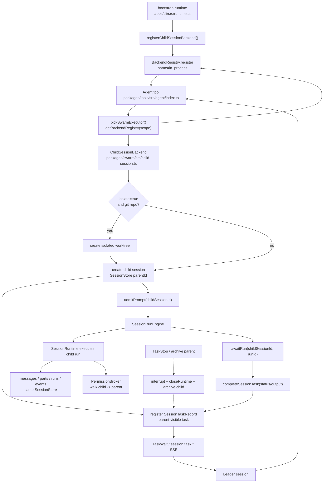

# Agent child session 流程

当前 daemon/TUI/print 主路径中的 `Agent` 使用进程内 child session。旧的 `ohs --task-worker` subprocess 路径已从运行时代码退场，不再作为兼容 fallback。

## 一句话模型

```text
Leader session 调用 Agent
  -> ChildSessionBackend 创建 child SessionStore session
  -> daemon SessionRuntime 执行 child prompt
  -> SessionTaskBridge 把 child run 投影成 parent 可见 task
  -> TaskWait / session events 返回完成状态
```

## 流程图



## 启动注册

是的，`Agent` 工具执行前，运行时需要先把可用的 `SwarmBackend` 注册进对应 scope 的 `BackendRegistry`。

daemon/TUI/print 的 child-session 主路径在 `apps/cli/src/runtime.ts` 的 `bootstrap()` 中完成注册：

```text
bootstrap({ cwd, sessionId, childSessionHost, sessionTaskBridge })
  -> registerChildSessionBackend({ cwd, sessionId, host, taskBridge })
  -> getBackendRegistry({ cwd, sessionId })
  -> backendRegistry.register("in_process", new ChildSessionBackend(...))
```

这里的 scope 必须和 `Agent` 工具取 executor 时一致。`Agent.execute()` 会优先查：

```text
getBackendRegistry({ cwd: context.cwd, sessionId: context.sessionId })
```

因此 `registerChildSessionBackend()` 也按 `{ cwd, sessionId }` 注册 `in_process`，这样 leader session 里调用 `Agent` 时才能拿到同一个 `ChildSessionBackend`。

如果 `bootstrap()` 没有拿到 `childSessionHost` 或 `sessionId`，当前代码不会注册 Agent swarm backend；后续调用 `Agent` 会明确报 `No swarm backend registered for mode in_process_teammate`，而不是退回旧 subprocess 路径。

## 运行流程

```text
apps/cli/src/runtime.ts
  bootstrap()
    -> registerChildSessionBackend()
    -> getBackendRegistry({ cwd, sessionId }).register("in_process", ChildSessionBackend)

packages/tools/src/agent/index.ts
  Agent.execute()
    -> mode=in_process_teammate 时选择 "in_process" swarm backend
    -> getBackendRegistry({ cwd, sessionId }).getExecutor("in_process")
    -> executor.spawn(TeammateSpawnConfig)

packages/swarm/src/child-session.ts
  ChildSessionBackend.spawn()
    -> 可选创建 isolated worktree
    -> host.createChildSession({ parentId, cwd, title, agent, metadata })
    -> taskBridge.registerSessionTask({ sessionId: parent, childSessionId, onInput, onStop })
    -> host.admitPrompt(childSessionId, prompt)
    -> taskBridge.bindSessionTaskRun(taskId, runId)
    -> 监听 host.awaitRun(childSessionId, runId)
    -> taskBridge.completeSessionTask(taskId, status/output)

packages/server/src/http.ts
  childSessionHost
    -> createChildSession(): store.createSession({ parentId, ... }) + warm runtime
    -> admitPrompt(): SessionRunEngine.admitPromptAndMaybeRun()
    -> awaitRun(): SessionRunEngine.awaitRun()
    -> interrupt(): SessionRunEngine.interruptSession()
    -> closeRuntime(): SessionRunEngine.closeRuntime()
    -> archive(): archiveSessionTree()

packages/server/src/http/session-task-bridge.ts
  SessionTaskBridgeManager
    -> 创建持久化 SessionTaskRecord
    -> 绑定 task 与 child run id
    -> 更新 task status/output/error
    -> 通过同一套 SessionStore/SSE 广播 session.task.* events
```

## 状态归属

| 状态 | 归属 |
|------|------|
| parent session | `SessionStore` |
| child session | `SessionStore`，带 `parentId` |
| child messages / parts / runs | `SessionStore` |
| permission requests | `PermissionBroker`，可沿 parent/child 关系追溯 |
| parent 可见 task | 持久化 `SessionTaskRecord` + 运行时 `TaskManager` callback |
| 内存中的 child runtime | daemon `SessionRunEngine` |
| 可选 isolated worktree | `ChildSessionBackend` / `WorktreeManager` |

持久化 task 是投影，不是 child 对话本体。即使 task 已 completed、stopped、interrupted 或 archived，child session 仍然保留可审计的消息、run 和事件。

## Follow-up 与 Stop

`SendMessage` 支持两种目标：

- `taskId` 形如 `agent@team`：走 `ChildSessionBackend.sendMessage()`，写入映射到的 session task。
- 普通 task id：走 `TaskManager.writeToTask()`。

对 child-session task 来说，写入 input 会触发注册时传入的 `onInput`，也就是向现有 child session admit 一条新 prompt，并监听新的 run。

停止 child task 时调用：

```text
host.interrupt(childSessionId)
host.closeRuntime(childSessionId)
host.archive(childSessionId)
taskBridge.completeSessionTask(status="stopped")
```

归档 parent session 会递归归档 children。归档流程会先 interrupt active/queued runs，等待它们收口，关闭 runtimes，然后把 sessions 标记为 archived。

## 权限

Child session 共享 daemon 的 `PermissionBroker`。权限查找可以通过 `parentId` 从 child 追溯到 parent，所以审批仍集中在 leader/client session，不由独立 worker 进程自行决定。

Agent 级别的 `permissionMode`、`allowedTools`、`disallowedTools`、`maxTurns` 和 persona 相关 metadata 会在创建 child session 时写入 session metadata。

## 重启边界

Daemon restart 不会复活内存中的 callback、provider stream、child runtime 或旧 TaskManager listener。持久化的 sessions、messages、runs、events 和 task projections 会留在 `SessionStore`。

启动恢复时，失去内存所有权的未终态 session runs/tasks 会被标记为 interrupted。用户可以显式 resume 带原始 prompt 的 interrupted run，但 daemon 不能假装旧 child runtime 仍在执行。

## 代码入口

| 区域 | 文件 |
|------|------|
| Agent 工具入口 | `packages/tools/src/agent/index.ts` |
| child session backend | `packages/swarm/src/child-session.ts` |
| daemon child host | `packages/server/src/http.ts` |
| session run engine | `packages/server/src/http/session-run-engine.ts` |
| durable task projection | `packages/server/src/http/session-task-bridge.ts` |
| runtime backend 注册 | `apps/cli/src/runtime.ts` |
| child backend 测试 | `packages/swarm/src/child-session.test.ts` |
| server child-session 测试 | `packages/server/src/http.test.ts` |

## 历史归档

下面两份 subprocess 文档只记录已经退场的历史设计，不对应当前运行时代码：

- `docs/swarm-subprocess-flow.md`
- `docs/swarm-task-worker-design.md`
