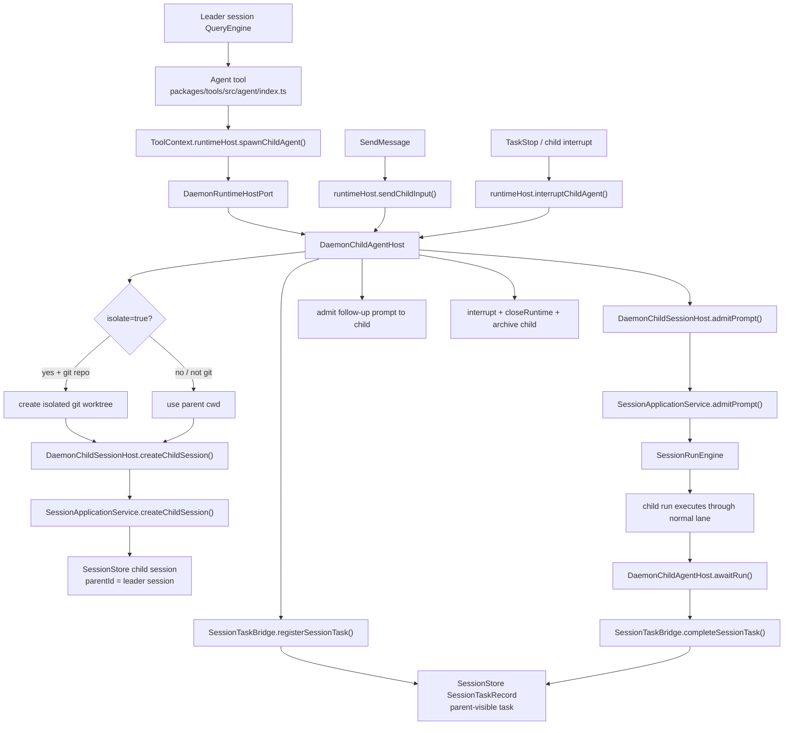

# Agent Child Session Flow

> 状态：当前主线文档。旧的 `ChildSessionBackend` / `registerChildSessionBackend()` bootstrap 路径已经退出 Agent tool 主路径。

## 一句话模型

```text
Leader QueryEngine 调用 Agent tool
  -> Agent tool 调 context.runtimeHost.spawnChildAgent()
  -> DaemonRuntimeHostPort 委托 DaemonChildAgentHost
  -> DaemonChildAgentHost 创建 child session + parent task projection
  -> child prompt 进入普通 SessionRunEngine lane
  -> parent 通过 task projection / TaskWait / SSE 看到结果
```

## 当前流程图



## 运行步骤

```text
packages/tools/src/agent/index.ts
  Agent.execute()
    -> validate mode/permissionMode
    -> require context.runtimeHost
    -> context.runtimeHost.spawnChildAgent({
         description,
         prompt,
         agent,
         team,
         cwd,
         sessionId,
         model,
         systemPrompt,
         permissionMode,
         isolate,
         allowedTools,
         disallowedTools,
         maxTurns,
         effort
       })
    -> return task_id/session_id/worktree to model

packages/server/src/http/session-run-executor.ts
  execute()
    -> childAgentHostFactory.create({ scope, session })
    -> new DaemonRuntimeHostPort({ scope, childAgentHost, ... })
    -> runtime.runPrompt(input, host)

packages/server/src/http/daemon-child-agent-host.ts
  spawnChildAgent()
    -> optionally create worktree
    -> childSessionHost.createChildSession()
    -> sessionTaskBridge.registerSessionTask()
    -> childSessionHost.admitPrompt()
    -> sessionTaskBridge.bindSessionTaskRun()
    -> monitor childSessionHost.awaitRun()
    -> sessionTaskBridge.completeSessionTask()
```

## 状态归属

| 状态 | 归属 |
|---|---|
| parent session | `SessionStore` |
| child session | `SessionStore`，带 `parentId` |
| child messages / parts / runs | `SessionStore` |
| parent 可见 task | durable `SessionTaskRecord` |
| live child invocation handle | `DaemonChildAgentHost` 当前 run 内存 |
| permission request | `StorePermissionBroker` + `PermissionController` |
| isolated worktree | `DaemonChildAgentHost` |

durable task 是 projection，不是 child session 本体。即使 parent task completed/stopped/interrupted，child session 的 messages/runs/events 仍保留用于审计。

## Follow-up / Stop

`SendMessage` 当前规则：

- 如果目标是 `agent@team`，用 Agent tool 保存的 invocation id 调 `runtimeHost.sendChildInput()`。
- 如果目标是 Agent 返回的 `task_id`，同样先查 invocation id；能命中则调 `runtimeHost.sendChildInput()`。
- 未命中的普通 task id 才回退到 `TaskManager.writeToTask()`。

child follow-up 会：

```text
write parent task input
  -> admit new prompt to child session
  -> bind new run id
  -> monitor new child run
```

停止 child invocation 会：

```text
interrupt child session
close child runtime
archive child session
complete parent task as stopped
remove clean isolated worktree
```

## 权限

Child session 共享 daemon permission infrastructure。工具授权仍从 child QueryEngine 调 `RuntimeHostPort.requestPermission()` 进入 daemon host，再由 `StorePermissionBroker` 投影到 store/SSE。

Agent 级字段会写入 child session metadata：

| 字段 | metadata |
|---|---|
| `tools` | `allowedTools` |
| `disallowedTools` | `disallowedTools` |
| `maxTurns` | `maxTurns` |
| `effort` | `effort` |
| `permissionMode` | `permissionMode` |
| agent prompt | `systemPrompt` |
| `isolate` | `isolate` + optional `worktree` |

## 重启边界

daemon restart 不会恢复 live child invocation handle、provider stream 或 permission promise。持久的 sessions/messages/runs/events/tasks 会留在 `SessionStore`；未终态 run/task 会在启动恢复时标记 interrupted。

## 代码入口

| 区域 | 文件 |
|---|---|
| Agent / SendMessage | `packages/tools/src/agent/index.ts` |
| Workflow child worker | `packages/tools/src/agent/workflow-runner.ts` |
| run-scoped host 创建 | `packages/server/src/http/session-run-executor.ts` |
| daemon child invocation adapter | `packages/server/src/http/daemon-child-agent-host.ts` |
| child session host | `packages/server/src/http/daemon-child-session-host.ts` |
| session/run use cases | `packages/server/src/http/session-application-service.ts` |
| durable task projection | `packages/server/src/http/session-task-bridge.ts` |
| runtime host types | `packages/server/src/runtime-host.ts`, `packages/core/src/types/runtime.ts` |
