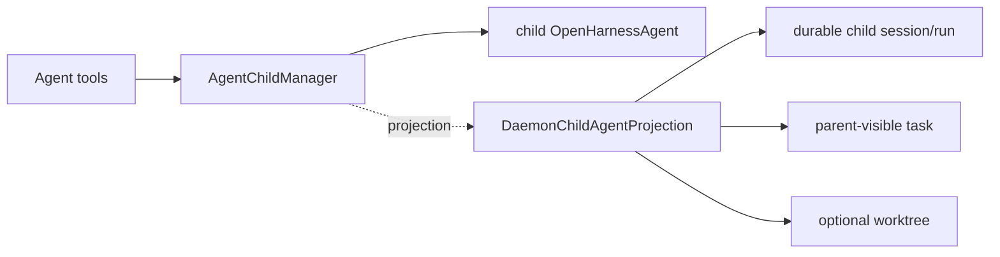

# Agent Child Session Flow

> 当前实现。核心边界：framework owns child execution/live handles；daemon owns durable child projection。

## 总图



## Spawn

1. Agent tool 调用 framework 生成的 `AgentChildAgentHost.spawnChildAgent()`。
2. `AgentChildManager` 生成 invocation ID。
3. daemon projection 创建 child session、task 和可选 worktree，返回 sessionId/cwd/taskId。
4. framework 递归调用 `createOpenHarnessAgent()` 创建 child 实例。
5. framework 启动 child run；daemon projection 创建 durable input/run 和 child-scoped host。
6. child 完成后 framework 返回 result，daemon 完成 run/task projection。

## Follow-up / stop / await

```text
SendMessage -> AgentChildManager.send()
Task input  -> SessionTaskBridge callback -> framework controls.send()
Task stop   -> SessionTaskBridge callback -> framework controls.interrupt()
HTTP child interrupt -> LiveChildAgentRegistry -> framework controls.interrupt()
TaskWait    -> AgentChildManager.awaitResult()
```

active run 的 follow-up 进入 QueryEngine `pullFollowUps`；已完成 child 的新输入会开始下一轮 run，并继续复用同一 child agent history。

parent run 的 AbortSignal 会终止该 run 创建的 child。parent agent `close()` 会关闭所有剩余 child 和资源。

## 所有权

| 状态 | 所有者 |
|---|---|
| child agent 与 invocation map | `AgentChildManager` |
| abort controller / result promise | `AgentChildManager` |
| child session/input/run/task records | daemon `SessionStore` |
| sessionId -> controls 路由 | `LiveChildAgentRegistry`，只持引用 |
| worktree create/cleanup | daemon projection |

## 代码位置

```text
packages/agent-runtime/src/child-agent.ts
packages/server/src/http/daemon-child-agent-projection.ts
packages/server/src/http/child-agent-projection-factory.ts
packages/server/src/http/live-child-agent-registry.ts
packages/server/src/http/session-task-bridge.ts
packages/server/src/http/child-agent-worktree.ts
```

不存在 `DaemonChildAgentHost`、`ChildSessionHost` 或 child runtime factory。
