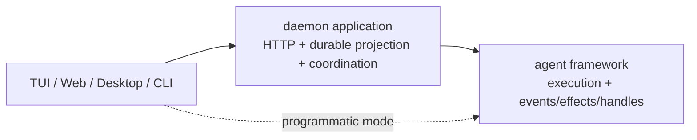

# Agent Framework Capability Boundary

> 状态：当前架构约束。代码与本文冲突时，应先修改所有权设计，不新增 compatibility adapter。

## 一句话边界

```text
framework 管执行、live state 与 live handles
daemon 管 durable session/task/run/transcript projection 与多客户端策略
surface 管交互和展示
```



真实依赖方向：

```text
@openharness/core <- @openharness/agent-runtime <- @openharness/server <- clients/apps
```

`agent-runtime` 禁止依赖 server、HTTP、SSE、daemon store 或 durable session schema。

## Kernel 与默认 Node 组装

`@openharness/agent-runtime` 现在有两个入口，名字代表它们会做多少事：

| 入口 | 实际做什么 |
|---|---|
| `createAgentKernel()` | 只运行 Agent/Run/Child；settings、runtime 和宿主能力都必须由调用方交进来 |
| `createDefaultNodeAgent()` | 读取本机配置并组装 provider、工具、插件、Skill、MCP、Memory、Sandbox 和 Git child environment |

`createOpenHarnessAgent()` 已删除，不提供兼容别名。调用方必须明确选择最小 Kernel 或 Node 默认组装。

能力归属清单：

| 能力 | 放在哪里 | 原因 |
|---|---|---|
| Agent/Run/Child 状态、event/effect/handle、关闭 | Kernel | 这是一次 Agent 执行本身 |
| QueryEngine turn loop | Kernel 接收的 runtime | Kernel 使用它，但不替宿主选择 provider |
| `StreamingMessageClient` 接口 | Kernel runtime contract | 可以用 fake client、远程 client 或 Node client |
| Anthropic/OpenAI/Codex client | 默认 Node 组装 | 会处理真实网络端点和凭据 |
| settings 和 CredentialStorage | 默认 Node 组装 | 会读取本机和用户目录 |
| 插件、Skill、MCP、Memory | 默认 Node 组装 | 会发现或连接外部资源 |
| Sandbox、process exit cleanup、Git worktree | 默认 Node 能力 | 都依赖具体操作系统环境 |
| Permission effect | `effects.requestPermission` | 宿主交互副作用；未提供时默认拒绝 |
| Terminal、后台 Shell | `capabilityOverrides` | 接受 Host `{ value, jobs }` bundle，逐项替换或关闭；Kernel 不创建 Node 备用实现 |
| child environment、Workflow repository、Schedule | `capabilityOverrides` | 接受 Host 对象，或用 `false` 逐项关闭 |
| Jobs、Memory | `capabilityOverrides` | 只接受 `false`；不能传入 Host 对象替换 |
| 附件读取、图生文、文生图 | daemon Tool 组装 | 默认 Agent 不认识附件协议，也不默认注册视觉 Tool；daemon 按服务配置增加或覆盖 Tool |
| HTTP、SQLite、SSE、durable Session/Run | Durable Application | 这是多客户端和进程重启后的状态 |

Kernel 的硬规则：

- 不调用 `loadSettings()`；
- 不创建 `CredentialStorage`；
- 不发现插件、Skill 或 MCP；
- 不启动 Sandbox；
- 不写 `process.stderr`；
- 不创建 `LocalAgentJobHost`；
- child 继承 root session tree 的同一份 capability overrides；Host 覆盖必须支持整棵树；
- 没有显式 child environment 时只沿用 cwd，不查 Git、不建 worktree。

可传入 Host 对象的 override 是 `terminal`、`backgroundShell`、`childEnvironment`、`workflowRepository` 和 `schedules`；Terminal 与后台 Shell 都使用 `{ value, jobs }`，确保其 Job 可观察。`jobs` 与 `memory` 只能设为 `false`，分别禁用本地 Jobs 或受管 Memory，不能用 Host 对象替换。若设 `jobs: false`，还必须同时设 `terminal: false`、`backgroundShell: false`、`childEnvironment: false` 和 `workflowRepository: false`，因为这些能力会产生或依赖 Job。权限通过 `effects.requestPermission` 提供。Artifact 与更细的 Workspace 操作还没有稳定接口，因此本阶段没有添加两个只占名字、不能工作的空对象；以后出现真实调用方时再加入。

附件与视觉能力走 Tool 扩展边界：`DefaultNodeAgent` 保留纯本地 `Read`，默认 Registry 不注册 `ImageToText` 或 `ImageGeneration`；daemon 用第一方可信 `Read` 覆盖处理授权附件，用普通 Tool 注册图生文与文生图。附件存储、Child → Root 授权、本地 OCR 和附件 compact 文案都留在 server。core 和 agent-runtime 只看到 ToolDefinition 与通用 compact 章节，不看到附件类型。

## 发布形式

当前明确公开发布 `@openharness/agent-runtime`，其他 workspace 包仍按内部包处理。发布包提供两个路径：

```text
@openharness/agent-runtime          默认 Node 入口
@openharness/agent-runtime/kernel   只包含 Kernel、最小 runtime builder 和显式能力类型
```

构建结果在 `dist`，`main`、`types` 和 `exports` 不再指向 TypeScript 源码。Kernel ESM bundle 不需要仓库源码就能运行；完整入口也会生成可直接加载的 ESM bundle。workspace 包只作为开发期和类型 peer，`pnpm pack` 会把发布清单中的 `workspace:*` 转成正常版本号。

`pnpm run test:pack` 每次都会：

1. 重新生成 JavaScript bundle 和声明文件；
2. 创建 npm tarball；
3. 检查 tarball 的 manifest 不含 `workspace:`；
4. 安装到仓库外的临时目录；
5. 用 fake provider 跑完 root Agent、child Agent 和 close。

## Framework 边界

Kernel 负责：

- 使用宿主已经准备好的 runtime、model、tools 和 hooks
- history、usage、当前 run 与资源生命周期
- 单实例 `idle/running/maintaining/closing/closed` operation state machine
- permission wait 的执行语义
- child identity、实例、递归执行、tree-wide descendant directory、follow-up、interrupt、suspend/resume 和宿主提供的环境 lease
- 有序 reliable `onEvent`、隔离 `subscribe`、permission effect 和 run/child handles
- compact、remember、inspect 等 Agent 操作；没有 Memory 能力时 `remember` 明确跳过

默认 Node 组装负责：

- provider client、默认工具和 prompt；
- settings、凭据、插件、Skill、MCP 和 Memory；
- Sandbox 和进程退出清理；
- 选择 Git worktree child environment；
- 安装本地 Terminal、Jobs、后台 Shell、Memory、Workflow repository 和默认 child environment；
- 对每个未覆盖的能力保留它自己的默认值；Attachments 与 Schedules 在没有 Host 覆盖时为 unavailable；
- 释放 runtime 自己创建的默认资源；Host 覆盖是借用对象，必须支持 root session tree 且始终由 Host 自己释放。

framework 不负责：

- durable session/input/run/message/task schema
- HTTP route、Bearer auth、SSE 或多客户端 permission prompt
- daemon restart recovery、archive、rewind、export
- 每 session 的多请求 queue policy

## Daemon 边界

daemon 负责：

- root prompt durable admission 与 per-session run lane
- 每个 pool-owned session 的 warm agent cache
- 实现 `requestPermission` callback
- 每个 root agent 注入一次可靠 `onEvent` sink
- 把 `AgentEvent` 单向归约为 durable transcript/run/task/session/event 和 SSE
- 把 HTTP/task commands 路由到 framework-owned run/child handles
- restart recovery、maintenance 与 product APIs
- session/cwd/global admission barrier 与 daemon stop-and-drain

daemon 可以保存 `rootAgent + childId` 的路由索引，但不复制 child controls，也不拥有 child instance。

## 状态归属

| 状态 | 唯一所有者 |
|---|---|
| agent history / usage / model loop | framework |
| active run、steer queue、abort | framework |
| run started/terminal delivery barrier | framework |
| child instance / handle / worktree lease | framework |
| durable session/input/run/transcript | daemon |
| durable permission request/reply | daemon |
| durable child session/task/run | daemon |
| per-session request lane | daemon |
| warm root agent cache | daemon `AgentPool` |
| 单 agent operation 互斥 | framework `OpenHarnessAgent.state` |
| session/cwd/global 请求互斥 | daemon `DaemonOperationGate` |
| UI selection/render/prompt controls | surface |

## 边界协议

```text
framework -> daemon : ordered AgentEvent facts through onEvent
framework -> daemon : requestPermission call when a result is required
daemon -> framework : run.steer / run.interrupt / child.send / child.interrupt
```

事件绝不携带 live capability。effect 绝不兼任 telemetry。handle 绝不写入 durable store。

## 扩展判断

1. programmatic agent 是否也需要？需要则优先进入 framework。
2. 是否必须等待外部返回值？是则定义窄 callback/effect。
3. 是否只是已发生事实？是则扩展 `AgentEvent` union，并由 `onEvent`/`subscribe` 消费。
4. 是否控制 live execution？是则扩展 handle。
5. 是否操作 HTTP、SSE、durable schema 或多客户端策略？是则进入 daemon。
6. 是否只影响 TUI/Web 的交互与渲染？是则留在 surface。

## 已退场抽象

以下名称不应恢复：

```text
SessionRuntime / AgentSessionRuntime / RuntimeFactory
AgentRunHost / QueryRuntimeHost / ToolRuntimeHost
DaemonRuntimeHostPort / DaemonRunProjection
AgentChildProjection / DaemonChildAgentProjection
ChildAgentProjectionFactory / LiveChildAgentRegistry controls copy
pullFollowUps / wakeCount / mergeWake
```
