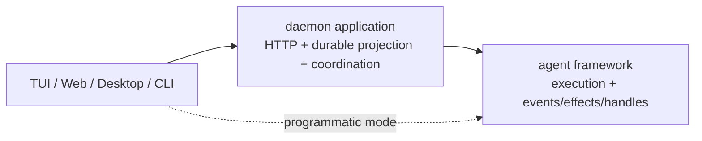

# Agent Framework Capability Boundary

> 状态：当前架构约束。代码与本文冲突时，应先修改所有权设计，不新增 compatibility adapter。

## 一句话边界

```text
framework 管执行、live state 与 live handles
daemon 管 durable session/task/run/transcript projection 与多客户端策略
surface 管交互和展示
```



真实依赖方向：

```text
@openharness/core <- @openharness/agent-runtime <- @openharness/server <- clients/apps
```

`agent-runtime` 禁止依赖 server、HTTP、SSE、daemon store 或 durable session schema。

## Framework 边界

framework 负责：

- provider、model、QueryEngine、tools、hooks、skills、plugins、MCP、sandbox 的默认组装
- history、usage、当前 run 与资源生命周期
- permission wait 的执行语义
- child identity、实例、递归执行、tree-wide descendant directory、follow-up、interrupt、suspend/resume、worktree lease
- 有序 `AgentEvent`、`AgentEffects` 和 run/child handles
- compact、remember、inspect 等 agent 能力

framework 不负责：

- durable session/input/run/message/task schema
- HTTP route、Bearer auth、SSE 或多客户端 permission prompt
- daemon restart recovery、archive、rewind、export
- 每 session 的多请求 queue policy

## Daemon 边界

daemon 负责：

- root prompt durable admission 与 per-session run lane
- 每个 pool-owned session 的 warm agent cache
- 实现 `AgentEffects.requestPermission`
- 每个 root agent 一次 required event subscription
- 把 `AgentEvent` 单向归约为 durable transcript/run/task/session/event 和 SSE
- 把 HTTP/task commands 路由到 framework-owned run/child handles
- restart recovery、maintenance 与 product APIs

daemon 可以保存 `rootAgent + childId` 的路由索引，但不复制 child controls，也不拥有 child instance。

## 状态归属

| 状态 | 唯一所有者 |
|---|---|
| agent history / usage / model loop | framework |
| active run、steer queue、abort | framework |
| run started/terminal delivery barrier | framework |
| child instance / handle / worktree lease | framework |
| durable session/input/run/transcript | daemon |
| durable permission request/reply | daemon |
| durable child session/task/run | daemon |
| per-session request lane | daemon |
| warm root agent cache | daemon `AgentPool` |
| UI selection/render/prompt controls | surface |

## 边界协议

```text
framework -> daemon : ordered AgentEvent facts
framework -> daemon : AgentEffects call when a result is required
daemon -> framework : run.steer / run.interrupt / child.send / child.interrupt
```

事件绝不携带 live capability。effect 绝不兼任 telemetry。handle 绝不写入 durable store。

## 扩展判断

1. programmatic agent 是否也需要？需要则优先进入 framework。
2. 是否必须等待外部返回值？是则定义窄 effect。
3. 是否只是已发生事实？是则扩展 `AgentEvent` union。
4. 是否控制 live execution？是则扩展 handle。
5. 是否操作 HTTP、SSE、durable schema 或多客户端策略？是则进入 daemon。
6. 是否只影响 TUI/Web 的交互与渲染？是则留在 surface。

## 已退场抽象

以下名称不应恢复：

```text
SessionRuntime / AgentSessionRuntime / RuntimeFactory
AgentRunHost / QueryRuntimeHost / ToolRuntimeHost
DaemonRuntimeHostPort / DaemonRunProjection
AgentChildProjection / DaemonChildAgentProjection
ChildAgentProjectionFactory / LiveChildAgentRegistry controls copy
pullFollowUps / wakeCount / mergeWake
```
