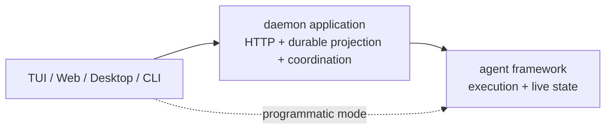

# Agent Framework Capability Boundary

> 状态：当前架构约束。代码与本文冲突时，应先确认是否需要修改边界，而不是新增兼容 adapter。

## 一句话边界

```text
framework 管执行和 live handle
daemon 管 durable session / child session / task / run projection
surface 管交互和展示
```

`@openharness/agent-runtime` 是可以独立运行的、带 OpenHarness 默认配置的 agent framework。daemon 是它的一种托管应用，不是 agent 的组成部分。

```ts
import { createOpenHarnessAgent } from "@openharness/agent-runtime";

const agent = await createOpenHarnessAgent({ cwd: process.cwd() });
const result = await agent.runMessage("hi");
await agent.close();
```

这条路径不依赖 `@openharness/server`、HTTP 或 daemon store。

## 三层模型



真实 package 依赖方向是：

```text
@openharness/core
  <- @openharness/agent-runtime
  <- @openharness/server
  <- @openharness/client / apps
```

禁止反向依赖：`agent-runtime` 不得引用 server、HTTP、SQLite session schema 或 daemon application service。

## Framework 负责什么

### 默认组装

`createOpenHarnessAgent()` 在 `packages/agent-runtime/src/agent.ts` 闭环：

- provider、credential、model 与 API client
- QueryEngine 和默认 tools
- permission checker、hooks、prompt、sandbox
- bundled/user/project skills
- plugin skills/tools/hooks/MCP/agent definitions
- MCP 连接及释放
- memory retrieval 与 `remember()`
- child agent 的实例、运行、follow-up、interrupt、await 和 close

调用方不需要自己组装 QueryEngine，也不需要接触 `RuntimeBundle`。

### 执行和 live state

一个 `OpenHarnessAgent` 拥有：

- message history 与累计 usage
- 当前 model 和执行配置
- tool/hook/skill registry
- MCP、sandbox 等资源
- child invocation map 与 child agent 实例

completed child 的重资源不是永久驻留：默认 idle TTL 后由 framework suspend，history 与 invocation handle 保留，follow-up 可透明恢复。

稳定 API：

```text
submitMessage() / runMessage()
getHistory() / loadHistory() / clear()
setModel()
compact() / remember() / getUsage() / inspect()
close()
```

`OpenHarnessAgent` 不公开内部 `runtime`，daemon 不能通过 `queryEngine`、`apiClient` 或 registry 穿透 facade。

### Permission 语义

framework 在工具执行前发起 `AgentPermissionRequest`，等待 `AgentPermissionDecision`，并在 denied、expired 或 abort 时终止对应工具执行。

Host 决定交互方式：

- standalone：终端回调、桌面对话框或固定策略
- daemon：持久化请求、SSE 通知、HTTP reply 后 resolve

durable permission record 属于 daemon；暂停工具并等待 decision 的语义属于 framework。

### Child agent 语义

`AgentChildManager` 位于 `packages/agent-runtime/src/child-agent.ts`，负责：

- 递归创建 `OpenHarnessAgent`
- 保存 invocation -> child agent/live controls
- 执行 prompt 和 follow-up
- parent run abort 时终止 child
- `SendMessage`、interrupt、await 与资源释放

`AgentChildProjection` 是可选观察接口。没有 projection 时 child 仍可在单进程模式运行。

## Daemon 负责什么

`@openharness/server` 是产品应用层，负责：

- HTTP、Bearer auth、CORS、SSE、request trace
- `SessionStore` 及 session/input/run/message/part/event
- prompt queue/steer admission 与每 session run lane
- 非 live-child durable session 的 warm `OpenHarnessAgent` `AgentPool`；live child 由 registry 仲裁，禁止重复实例
- transcript、permission、child session/task/run 的 durable projection
- daemon restart recovery、archive、rewind、export
- settings/provider/auth/memory/plugin/git 等资源 API
- daemon 进程组合与默认服务

daemon 可以保存 framework live controls 的路由引用，但不能接管其所有权。`LiveChildAgentRegistry` 只完成 `childSessionId -> AgentChildControls` 路由。

## 状态归属表

| 状态 | 唯一所有者 | 说明 |
|---|---|---|
| agent history / usage | `OpenHarnessAgent` | live state |
| tool loop / permission wait | framework | execution semantics |
| child instance / invocation handle | `AgentChildManager` | live handle |
| durable session/input/run | daemon `SessionStore` | restart 后可恢复查询 |
| durable transcript | daemon projection | framework history 的产品投影 |
| durable permission request/reply | daemon broker/store | 多客户端交互 |
| durable child session/task/run | daemon child projection | 对 live child 的产品投影 |
| per-session concurrency lane | daemon run engine | 多客户端准入策略 |
| warm agent cache | daemon `AgentPool` | `sessionId -> Promise<OpenHarnessAgent>` |

## 明确不存在的层

当前代码不再存在以下抽象：

```text
SessionRuntime
SessionRuntimeFactory
AgentSessionRuntime
SessionRuntimePool
DaemonChildAgentHost
DaemonChildAgentHostFactory
@openharness/agent-runtime/host
@openharness/agent-runtime/daemon
```

不要以兼容为理由恢复这些名称。daemon 直接依赖 framework API。

## 扩展判断规则

新增能力时依次判断：

1. 单进程 programmatic agent 是否也需要它？需要则优先进入 framework。
2. 它是否操作 HTTP、SSE、durable schema 或多客户端协调？是则进入 daemon。
3. 它是否只是把 framework event/handle 映射到产品状态？是则定义窄 projection，不定义 runtime adapter。
4. 它是否属于 TUI/Web 的按键、弹窗或渲染？是则留在 surface。

最终标准不是“代码放在哪更方便”，而是执行状态和 durable 产品状态是否各自只有一个所有者。
