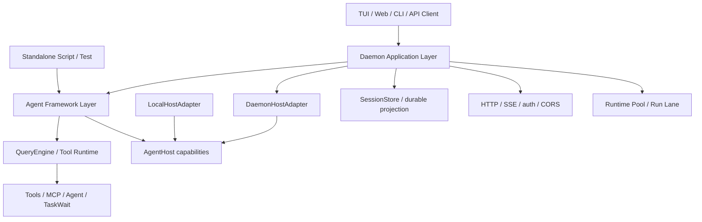

# Agent Framework Layer Architecture

> 当前状态：设计文档。目标不是把 OpenHarness 做成通用 agent framework，而是把现有 daemon / QueryEngine / tools / child-agent 的职责重新摆正，形成一个低心智负担、可嵌入、可由 daemon 托管的内部 Agent Framework 层。
>
> 关联文档：[`daemon-application-architecture.md`](./daemon-application-architecture.md)、[`runtime-host-port-design.md`](./runtime-host-port-design.md)、[`daemon-runtime-flow-map.md`](./daemon-runtime-flow-map.md)。

## 0. 结论

我们要的不是这个具体名字：

```ts
const agent = createQueryEngineAgent(params);
await agent.submitMessage(...);
```

而是这种架构形态：

```text
framework exposes a good agent API
daemon hosts that API with durable store + HTTP + SSE + multi-client projection
TUI/Web/CLI are interaction surfaces
```

一句话：

```text
daemon should host agents, not define what an agent is.
```

当前 Phase 0-18 已经把 daemon 和 QueryEngine 之间的回调、bridge、handle 收束到 framework-level `AgentRunHost`，补出最小 standalone `AgentSession` facade，让 `CliSessionRuntime` 复用这层 facade，把 child-agent lifecycle 从 generic run host 中拆成可选能力，并把 daemon durable projection / transcript projection 分别收进明确 adapter：

```text
Agent Framework Layer
  -> owns ergonomic agent/session/run API
  -> owns agent loop composition around QueryEngine
  -> defines host capability interfaces
  -> has no dependency on daemon HTTP or SessionStore

Daemon Application Layer
  -> implements host capabilities
  -> projects framework events into durable store
  -> exposes HTTP/SSE API
  -> manages runtime pool, run lane, attach/replay, multi-client
```

---

## 1. 主流设计启发

这里只取对我们有用的架构启发，不照搬产品形态。

| 来源 | 关键设计 | 对 OpenHarness 的启发 |
|---|---|---|
| Deep Agents JS | `createDeepAgent()` 返回一个可直接 invoke/stream 的 agent harness；内置 planning、filesystem、subagents、context management；底层利用 LangGraph 的 streaming/persistence 能力 | framework 应提供可直接运行的 agent facade；daemon 不应该是唯一能装配 agent loop 的地方 |
| OpenAI Agents SDK JS | primitives 少：Agent、tools、handoffs/agents-as-tools、guardrails、sessions、tracing；context 是传给 tools/guardrails/handoffs 的依赖注入对象 | OpenHarness 应把复杂度藏在少数 primitives 和 host context 后面，而不是把 daemon bridge 暴露给业务 |
| LangGraph | interrupt + checkpoint 区分 live pause 与 durable resume；human-in-the-loop 依赖持久化 checkpoint | 我们要明确 live handle 与 durable projection 的边界；daemon restart 不能假装恢复 live stack |
| Claude Agent SDK TS | `query(options)` 形态可嵌入；`canUseTool` 作为 permission callback；hooks 覆盖 tool、session、permission、subagent、worktree 等事件；programmatic subagents 可配置 tools/model/permission/background | permission/child lifecycle 更适合变成 framework-level hooks/callbacks，由 daemon 实现 transport/projection |
| Mastra | Agent 可直接 `.generate()` / `.stream()`，也可注册到应用实例获得 shared storage/logging/registry | standalone agent 与托管 agent 应该共用同一套 framework API，差异在 host/services |

外部设计有一个共同点：

```text
Agent API first.
Application hosting second.
UI surface last.
```

OpenHarness 现在的 daemon 已经承担了 application hosting，但 framework API 还没有显性成型，所以业务链路看起来像 daemon 与 agent runtime 缠在一起。

---

## 2. 当前问题

当前代码已经比最初清楚很多：

```text
SessionRunExecutor
  -> creates DaemonRuntimeHostPort
  -> runtime.runPrompt(input, host)
  -> CliSessionRuntime
  -> QueryEngine.submitMessage(... runtimeHost)
```

但从“用 OpenHarness 构建一个 agent”这个角度看，API 仍然偏底层：

```text
caller must understand:
  session/history/parts
  runtime factory
  runtime pool
  run lane
  stream event renderer
  permission broker
  child session host
  task projection
```

这导致 daemon 看起来像“业务和 framework 混在一起”。实际上 daemon 里有两类东西：

| 类型 | 例子 | 是否应该留在 daemon |
|---|---|---|
| agent framework concern | agent run API、tool permission lifecycle、child/sub-agent invocation、stream event contract、run cancellation | 不应该只属于 daemon |
| daemon application concern | HTTP routes、SSE replay、durable session store、multi-client attach、runtime pool、run lane、permission/task durable projection | 应该属于 daemon |

当前最绕的地方不是代码文件多，而是这两类 concern 的边界还不够显性。

---

## 3. 目标分层



期望形态：

```text
packages/core
  QueryEngine and low-level tool contracts

packages/agent-runtime or packages/framework
  AgentSession / AgentRunner / AgentHost interfaces
  InMemoryTranscript
  run/stream/submitMessage API
  default local host behavior

packages/server
  DaemonHostAdapter
  durable projection adapters
  HTTP routes and application services

apps/cli / apps/frontend
  surfaces only
```

---

## 4. Framework API 形态

下面只是形态，不是最终命名。

```ts
const runtime = createAgentRuntime({
  model,
  tools,
  systemPrompt,
  cwd,
  permissions,
  host,
});

const session = runtime.createSession({
  history,
  metadata,
});

const run = session.submit({
  content: "Help me inspect this code path",
  signal,
});

for await (const event of run.stream()) {
  // render, persist, inspect, or ignore
}

const result = await run.result;
```

更简化的 facade：

```ts
const agent = createAgent({
  cwd,
  model,
  tools,
  systemPrompt,
  host,
});

const result = await agent.submitMessage("...");
```

这个 facade 应该隐藏：

- QueryEngine 初始化。
- transcript/history 管理。
- stream event 转发。
- permission callback 调用。
- cancellation。
- tool context 注入。
- usage 统计。
- child-agent capability 是否可用。

但它不应该内置 daemon store、HTTP、SSE、session list、多客户端 attach。

---

## 5. Host Capability 设计

`AgentRunHost` 是当前雏形。framework 层可以继续把它升级成更完整的 agent host contract。

```ts
interface AgentRunHost {
  readonly scope: AgentRunScope;
  readonly childAgentHost?: AgentChildAgentHost;

  emit(event: AgentRuntimeEvent): void | Promise<void>;
  emitStream(event: StreamEvent): void | Promise<void>;

  requestPermission(request: ToolPermissionRequest): Promise<ToolPermissionDecision>;
}

interface AgentChildAgentHost {
  spawnChildAgent(input: AgentChildAgentSpawnInput): Promise<AgentChildAgentInvocation>;
  sendChildInput(invocationId: string, input: ChildAgentInput): Promise<void>;
  interruptChildAgent(invocationId: string, reason?: string): Promise<void>;
  awaitChildAgent(invocationId: string): Promise<ChildAgentResult>;
}
```

设计原则：

| 原则 | 说明 |
|---|---|
| framework 定义能力 | permission、events、child-agent 是 agent run 能力，不是 daemon 私有概念 |
| host 决定投影 | daemon host 会落库/SSE；local host 可以 console/in-memory/test double |
| child-agent 可选 | standalone runner 可以不提供 `childAgentHost`；daemon runner 提供完整 child session/task/run projection |
| 不泄露 daemon 类型 | framework contract 不应引用 `SessionStore`、HTTP route、`SessionApplicationService` |

当前映射：

| 当前类型 | 未来位置 |
|---|---|
| `AgentRunHost` | framework host contract |
| `DaemonRuntimeHostPort` | server/daemon host adapter |
| `DaemonChildAgentHost` | server/daemon child-agent adapter |
| `ChildSessionHost` | server-local adapter port，不进入 framework |
| `SessionTaskBridge` | server-local durable projection bridge，不进入 framework |

---

## 6. Permission 应该怎么建模

现在：

```text
QueryEngine/tool
  -> AgentRunHost.requestPermission()
  -> DaemonRuntimeHostPort
  -> StorePermissionBroker
  -> PermissionController live waiter
  -> /permissions reply
```

更好的 framework 视角：

```ts
type ToolPermissionHandler = (
  request: {
    toolName: string;
    input: Record<string, unknown>;
    reason?: string;
    toolUseId?: string;
    agentId?: string;
    suggestions?: PermissionSuggestion[];
    signal: AbortSignal;
  },
) => Promise<{
  status: "approved" | "denied" | "expired";
  decision?: "once" | "session";
  updates?: PermissionUpdate[];
  reason?: string;
}>;
```

daemon 实现：

```text
handler
  -> create durable permission request
  -> publish SSE
  -> wait live controller
  -> resolve from HTTP reply
```

local 实现：

```text
handler
  -> auto approve/deny by permissionMode
  -> or prompt terminal callback
```

关键边界：

- framework 可以定义 permission request/decision 数据结构。
- daemon 负责把 request 投影给 UI，并把 reply 转回 decision。
- live resolve handle 不进 durable store。
- durable request/decision 不等于 live continuation。

这符合 LangGraph/Claude SDK 一类设计的共同点：approval 是 agent run 的中断点或 callback，但应用层决定如何展示、持久化、恢复。

---

## 7. Child Agent 应该怎么建模

现在 daemon 做了完整闭环：

```text
Agent tool
  -> runtimeHost.childAgentHost.spawnChildAgent()
  -> DaemonChildAgentHost
  -> create child session
  -> register parent-visible task
  -> admit child prompt/run
  -> await child run
  -> complete task projection
```

framework 视角可以更简单：

```ts
interface ChildAgentRuntime {
  spawn(input: AgentChildAgentSpawnInput): Promise<AgentChildAgentInvocation>;
}

interface AgentChildAgentInvocation {
  id: string;
  taskId?: string;
  sessionId?: string;
  runId?: string;
  worktree?: { path: string; branch: string };
  result: Promise<AgentChildAgentResult>;
}
```

daemon host 的复杂度是合理的，但它应该被解释为 host implementation：

```text
DaemonChildAgentHost = ChildAgentRuntime implementation
  + durable child session projection
  + parent-visible task projection
  + optional isolated worktree
  + permission lineage
```

standalone host 可以先提供：

```text
LocalChildAgentRuntime
  -> inline nested agent, or unsupported
```

不要一开始强行做 daemon 外的 full child lifecycle。目标是先让 API 边界正确：

- Agent tool 依赖 framework `ChildAgentRuntime`。
- daemon 只是一个实现。
- `TaskWait` 继续等待 task projection；如果 local host 没有 task projection，则可以直接 await invocation result 或提供 local task projection。

---

## 8. State 与 Projection

framework 和 daemon 的核心区别是 state 层级不同。

| 层级 | framework standalone | daemon hosted |
|---|---|---|
| transcript | in-memory 或用户传入 storage | `SessionStore` messages/parts |
| run state | `AgentRun` object | `SessionRunRecord` + run promise |
| stream events | callback/async iterator | store projection + SSE |
| permission | callback result | durable request + live waiter |
| child invocation | in-memory handle | in-memory handle + child session/task/run projection |
| attach/replay | caller 自己处理 | daemon 提供 snapshot + cursor + SSE |

原则：

```text
framework owns live execution contract
daemon owns durable product projection
```

所以不要把 daemon 的 `SessionStore` 抽成 framework 必选依赖。应该抽象成可选 projection/storage adapter：

```ts
interface AgentProjectionSink {
  onRunStarted?(event): void | Promise<void>;
  onStreamEvent?(event): void | Promise<void>;
  onRunCompleted?(event): void | Promise<void>;
  onPermissionRequested?(event): void | Promise<void>;
  onChildAgentStarted?(event): void | Promise<void>;
}
```

daemon 实现 sink 后写 store；standalone 可以不传。

---

## 9. Daemon 未来应该变薄到什么程度

daemon 不需要变成“薄到没有业务”。它仍然是应用层，应该保留这些复杂度：

| daemon 继续负责 | 原因 |
|---|---|
| HTTP routes / auth / CORS | application transport |
| SSE replay / attach snapshot | multi-client UI projection |
| durable `SessionStore` | product state |
| runtime pool | daemon 托管多 session，需要缓存 runtime |
| session run lane | 多客户端提交需要串行化 |
| permission request projection | UI 审批需要 durable request |
| task projection | UI 和 `TaskWait` 需要 task_id |
| child session archive/cleanup | product lifecycle |

daemon 应该释放这些职责：

| 应下沉到 framework | 原因 |
|---|---|
| ergonomic agent/session/run API | standalone/daemon/test 都需要 |
| permission request/decision shape | tools 和 QueryEngine 不应依赖 daemon |
| stream event contract | UI/daemon/local 都要消费 |
| child invocation interface | Agent tool 不应关心 daemon child session |
| default in-memory transcript/session | 单进程 runner 需要 |
| run cancellation semantics | agent execution 基础能力 |

---

## 10. 渐进迁移路线

### Phase A：定义内部 Agent API 文档与类型

新增 framework-facing types，不移动实现：

```text
packages/core or packages/agent-runtime
  AgentRunHost
  AgentSession
  AgentRun
  AgentRuntimeEvent
  ToolPermissionHandler
  ChildAgentRuntime
```

历史 `RuntimeHostPort` 已被 `AgentRunHost` 取代，server 不再保留旧类型出口。

状态：已落地。`packages/core/src/types/runtime.ts` 已提供 `AgentRunHost`、`AgentRunScope`、`AgentRuntimeEvent`、`AgentPermissionRequest/Decision`、`AgentChildAgentHost` 等 daemon-neutral host 类型；server 的 `DaemonRuntimeHostPort` 已实现 `AgentRunHost`。

### Phase B：实现 standalone runner

新增最小 facade：

```text
createAgentSession()
submitMessage()
stream()
```

先支持：

- single process。
- in-memory transcript。
- normal tools。
- permission callback。
- stream event callback。
- child agent unsupported。

状态：已落地到 `packages/core/src/agent-session.ts`。`createAgentSession({ queryEngine, cwd, ...callbacks })` 包装已构造的 `QueryEngine`，提供 `submitMessage()` async iterable、`runMessage()` 聚合结果、`getHistory()`、`clear()` 和 `createHost()`。它不依赖 daemon store/HTTP/SSE；默认权限为 deny；child agent 显式 unsupported。

### Phase C / Phase 15：让 `CliSessionRuntime` 复用 facade

现在 `CliSessionRuntime` 直接装配 `QueryEngine.submitMessage()`。改成：

```text
CliSessionRuntime
  -> AgentSession facade
  -> QueryEngine internally
```

状态：已落地到 `apps/cli/src/session-runtime.ts`。daemon 仍通过 `SessionRunExecutor` 提供 `DaemonRuntimeHostPort`，但 CLI runtime 不再自己手写 `QueryEngine.submitMessage()` 的循环，而是调用 `AgentSession.submitMessage(..., { host })`。

### Phase D：收口 child agent API

把 Agent tool 依赖的 runtime host child capability 挪到 framework-level `ChildAgentRuntime` contract。

daemon 的 `DaemonChildAgentHost` 继续作为实现。

### Phase E：投影 adapter 化

把 durable run projection 和 transcript projection 明确成 daemon adapters：

```text
framework emits stream/run events
DaemonRunProjection owns run/store/SSE/permission projection
SessionTranscriptProjection owns message/part projection
```

这一步完成后，daemon 复杂度会更像“托管实现”，而不是 agent runtime 主体。

---

## 11. 非目标

明确不做：

- 不做对外通用 agent framework 产品。
- 不追求兼容 LangGraph / DeepAgents / OpenAI Agents SDK API。
- 不把 daemon durable store 强塞进 framework。
- 不要求 standalone runner 一开始支持 daemon 等价的 child session/task/run 投影。
- 不重写 QueryEngine。

目标是：

```text
用更好的内部 API 把复杂度放在正确层级。
```

---

## 12. 当前落地状态与下一步

Phase 13 已落地为很小的命名边界代码改造：

```text
Phase 13: introduce AgentRunHost naming boundary
```

已完成动作：

1. 在 framework/core 侧定义 daemon-neutral host type。
2. 让 `SessionRuntime.runPrompt(input, host)` 接收 `AgentRunHost`。
3. 让 server `DaemonRuntimeHostPort` / `DaemonChildAgentHost` / `DaemonChildAgentHostFactory` 使用 `Agent*` host 类型。
4. 删除 `packages/server/src/runtime-host.ts` 旧命名出口，避免继续保留兼容层。

Phase 14 也已落地为最小 standalone facade：

```text
Phase 14: standalone in-memory AgentSession facade
```

已完成动作：

1. 提供一个不依赖 daemon store/HTTP 的单进程 agent session。
2. 复用 `QueryEngine.submitMessage()` 和 `AgentRunHost`。
3. 默认 host 支持 stream/event callbacks、permission callback、child agent unsupported。
4. 不改变 daemon 当前运行行为。
5. 补充 `packages/core/src/agent-session.test.ts` 覆盖 stream 转发、permission callback、默认 deny 与 child unsupported。

这才对应你说的“这种形态”：

```ts
const session = createAgentSession({ queryEngine, cwd });
await session.runMessage(...);
```

Phase 15 已落地：

```text
Phase 15: make CliSessionRuntime reuse AgentSession
```

已完成动作：

1. `createCliSessionRuntimeFactory()` 为每个 daemon session 创建 `AgentSession`。
2. `CliSessionRuntime.runPrompt()` 复用 `AgentSession.submitMessage()`。
3. stream event 转发回到 `AgentSession` facade 内部，减少应用层重复循环。
4. `@openharness/server/runtime` 与 `@openharness/services/session-runtime/types` 提供轻量类型 subpath，CLI runtime contract 不再通过大 barrel 触碰 HTTP/store 模块。

Phase 16 已落地：

已完成动作：

1. `AgentRunHost` / `QueryRuntimeHost` 不再继承 child-agent host。
2. child lifecycle 通过可选 `childAgentHost?: AgentChildAgentHost` 暴露。
3. `AgentSession.createHost()` 不再实现 unsupported child 方法；standalone host 默认就是无 child 能力。
4. `DaemonRuntimeHostPort` 仍提供 daemon child 能力，但作为 `.childAgentHost` 属性。
5. Agent / Workflow 工具通过 `ToolContext.runtimeHost.childAgentHost` 调用 child lifecycle。

Phase 17 已落地：

已完成动作：

1. 新增 `packages/server/src/http/session-run-projection.ts`。
2. `DaemonRunProjection` 负责 runtime event、stream event、permission ask、run start/complete/fail 的 daemon projection。
3. `SessionRunExecutor` 不再内联 `emitEvent` / `emitStreamEvent` / `requestPermission` callback 细节，只创建 projection、child host、runtime host，并调用 runtime。
4. 补充 `session-run-projection.test.ts` 覆盖 host callback -> store/publisher/broker/log 的闭环。

Phase 18 已落地：

```text
Phase 18: transcript projection sink boundary
```

已完成动作：

1. `packages/server/src/http/transcript-projection.ts` 新增 `SessionTranscriptProjection`。
2. message/part 渲染规则从 run projection 语义中独立出来，成为 transcript projection sink。
3. `DaemonRunProjection` 只持有 run-scoped daemon projection：runtime event、stream event 分发、permission ask、run 终态、SSE/log。
4. 删除旧 `run-renderer.ts` / `SessionRunRenderer` 命名，不保留兼容 alias。

---

## 13. 参考资料

- Deep Agents JS overview: <https://docs.langchain.com/oss/javascript/deepagents/overview>
- Deep Agents JS repository: <https://github.com/langchain-ai/deepagentsjs>
- OpenAI Agents SDK JS: <https://openai.github.io/openai-agents-js/>
- OpenAI Agents SDK agents guide: <https://openai.github.io/openai-agents-js/guides/agents/>
- LangGraph interrupts: <https://langchain-ai.github.io/langgraph/how-tos/human_in_the_loop/breakpoints/>
- LangGraph JS persistence: <https://langchain-ai.github.io/langgraphjs/how-tos/subgraph-persistence/>
- Claude Agent SDK TypeScript reference: <https://code.claude.com/docs/en/agent-sdk/typescript>
- Claude Agent SDK hooks guide: <https://code.claude.com/docs/en/agent-sdk/hooks>
- Mastra agents overview: <https://github.com/mastra-ai/mastra/blob/main/docs/src/content/en/docs/agents/overview.mdx>
