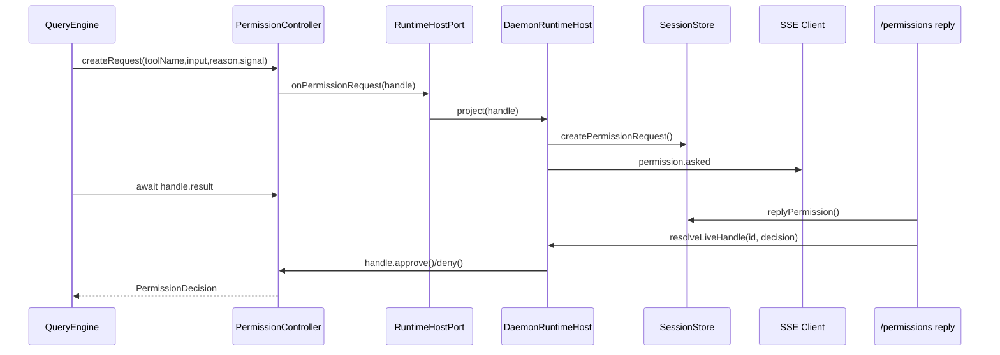
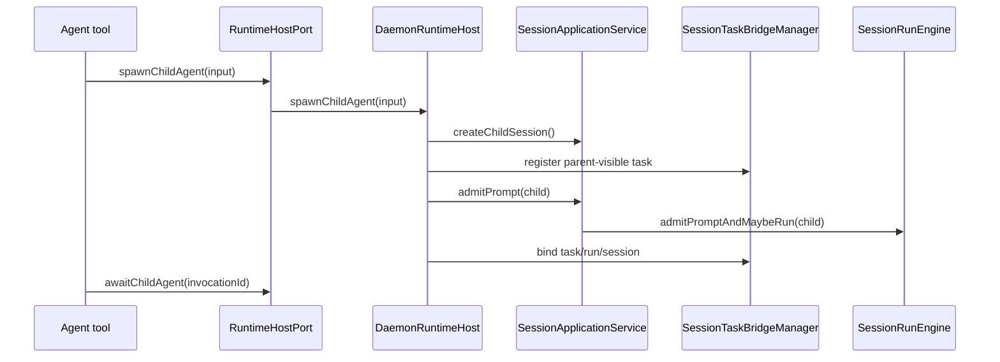

# Agent Host Boundary 可行性调研

> 日期：2026-08-07
>
> 目标：评估是否可以把 permission approval 和 child agent lifecycle 从 daemon 专属回调/桥，演进为 framework 层管理的 request/handle，再由 daemon 作为 host 做持久化投影、SSE 和 HTTP reply。
>
> 结论先行：方向可行，而且和主流 agent runtime 的 HITL / interrupt / sub-agent-as-tool 设计一致。需要避免的陷阱是：函数句柄只能代表 live continuation，不能代表 durable truth；daemon 重启后必须依赖可序列化 run state 或把 pending handle 明确终态化。

## 1. 问题背景

当前 OpenHarness daemon 和 QueryEngine 之间有多条能力线：

```text
SessionRunExecutor
  -> CliSessionRuntime
  -> bootstrap()
  -> QueryEngine
       permissionPrompt
       runtimeEventSink
       childSessionHost
       sessionTaskBridge
       mcpManager
       hooks
```

这些能力不是纯技术 callback，它们承载了应用语义：

| 能力 | 当前归属 | 实际语义 |
|---|---|---|
| `permissionPrompt` | `CliSessionRuntime` 闭包 + `SessionRunExecutor.askPermission()` | 工具执行前暂停，等待用户/客户端批准 |
| `StorePermissionBroker` | daemon server | 持久 request、SSE、HTTP reply、waiter resolve、session approval 复用 |
| `ChildSessionHost` | daemon adapter | child session/run/archive/interrupt |
| `SessionTaskBridge` | daemon task bridge | parent-visible durable task projection |
| `runtimeEventSink` | QueryEngine option | runtime/tool 事件回灌 daemon event stream |

问题不在于这些边界存在，而在于它们以零散 callback / bridge / handle 的形式穿过多层：

```text
daemon state owner
  <-> runtime execution owner
  <-> tool loop
```

这导致两个后果：

1. daemon 看起来越来越像 agent framework 的一部分。
2. framework 层无法独立表达“我现在需要外部批准”或“我现在启动了一个子 agent invocation”这种通用运行时事件。

## 2. 外部调研摘要

### 2.1 OpenAI Agents SDK

OpenAI Agents SDK 把 human approval 建模为 run interruption：工具声明 `needs_approval`，运行结果暴露 `interruptions`，调用方把结果转成 `RunState` 后 `approve()` / `reject()`，再用原始 top-level agent resume。

关键点：

- approval surface 是 run-wide，不局限当前 agent；handoff 或 nested `Agent.as_tool()` 里的 approval 也浮到 outer run。
- approval 可以手动 interruption，也可以通过 programmatic callback 自动批准/拒绝。
- long-running approvals 依赖 `RunState` 序列化，pending work 可以存进数据库或队列，之后再恢复。
- 文档提醒 pending tasks 应存 agent definition / SDK version marker，避免长时间挂起后代码不兼容。

来源：

- OpenAI Agents SDK HITL: https://openai.github.io/openai-agents-python/human_in_the_loop/
- OpenAI Agents SDK Handoffs: https://openai.github.io/openai-agents-js/guides/handoffs/

对 OpenHarness 的启发：

```text
Permission request 应该是 runtime/run state 的一等 interruption。
daemon 可以投影它，但不应该是唯一 live waiter 的创造者。
child agent 内部 approval 应该浮到 parent/top-level run 的 approval 面。
```

### 2.2 LangGraph

LangGraph 的 `interrupt()` 是更底层的通用 primitive。节点里调用 `interrupt(payload)` 后，graph 暂停并把 payload 返回给 caller；resume 时用 `Command(resume=...)`，resume 值会成为 `interrupt()` 的返回值。

子图方面，LangGraph 明确区分：

| subgraph persistence | 行为 |
|---|---|
| per-invocation | 每次调用 fresh，但继承 parent checkpointer，可支持 interrupt 和 durable execution |
| per-thread | 子图跨调用保留状态 |
| stateless | 像普通函数调用，不支持 pause/resume 和 durable execution |

来源：

- LangGraph interrupt guide: https://langchain-ai.github.io/langgraph/how-tos/human_in_the_loop/wait-user-input/
- LangGraph subgraphs: https://docs.langchain.com/oss/python/langgraph/use-subgraphs
- LangChain handoffs: https://docs.langchain.com/oss/python/langchain/multi-agent/handoffs

对 OpenHarness 的启发：

```text
permission / child agent 都可以统一看成 runtime interrupt 或 invocation。
是否可跨重启恢复，取决于是否有 checkpointer / serialized run state。
child agent 可以有三档状态策略：per-invocation、per-thread、stateless。
```

### 2.3 Microsoft Agent Framework / AutoGen

Microsoft Agent Framework 的 tool approval 用 middleware intercept 工具调用，并等待 approval 后执行。AutoGen 则更偏 multi-agent conversation/team orchestration：team 是多个 agent 协作的运行单元，Swarm 使用 handoff message 进行 agent 间转移。

来源：

- Microsoft Agent Framework tool approval: https://learn.microsoft.com/hi-in/agent-framework/agents/tools/tool-approval
- AutoGen Teams: https://microsoft.github.io/autogen/stable/user-guide/agentchat-user-guide/tutorial/teams.html

对 OpenHarness 的启发：

```text
tool approval 放在 framework/middleware 层是常见做法。
multi-agent lifecycle 可以是 framework orchestration，但 host 仍要决定观察、持久化、终止条件和展示。
```

### 2.4 LlamaIndex

LlamaIndex 明确列了三种 multi-agent pattern：

1. `AgentWorkflow` 内置 handoff。
2. Orchestrator agent，把 sub-agents 暴露成 tools。
3. Custom planner，应用自己写计划和调用。

来源：

- LlamaIndex multi-agent patterns: https://llamaindex.openml.io/python/framework/understanding/agent/multi_agent/

对 OpenHarness 的启发：

```text
OpenHarness 当前 Agent tool 更接近 “sub-agent as tool / orchestrator pattern”。
如果 framework 化，应先抽象 child invocation handle，而不是直接把 daemon child session 作为唯一实现。
```

## 3. 总体判断

你的建议可以落地，但要分成两层：

```text
framework owns live lifecycle
host owns transport + projection
durable store owns audit/recovery truth
```

更具体：

| 能力 | 应该放到 framework | 应该放到 host/daemon |
|---|---|---|
| permission 策略判断 | `PermissionChecker` 判断 allow/deny/ask | 配置来源、UI 呈现、HTTP reply |
| permission live request | 创建 request id、Deferred/handle、abort/timeout、resolve/reject 工具执行 | 将 request 投影到 store/SSE；reply 时调用 handle |
| permission durable recovery | 可选：若有 serialized run state，则恢复 pending interruption | 当前阶段：daemon 重启后 expire/interrupted，不伪恢复 |
| child agent 工具定义 | `Agent` tool schema、subagent selection、invocation contract | child session/task projection、权限归属、SSE、archive |
| child agent live invocation | `ChildAgentInvocationHandle`、await/interrupt/complete | daemon 实现 handle 绑定 session/run/task |
| child agent durability | 可选：framework run state/checkpointer | daemon store 记录 parent/child/run/task 审计 |

核心原则：

```text
framework can own handles
host can persist projections
only serialized state can survive process restart
```

## 4. 目标形态

### 4.1 RuntimeHostPort

把现在分散的 `permissionPrompt`、`runtimeEventSink`、`childSessionHost`、`sessionTaskBridge` 收敛成一个运行时端口。

```ts
export interface RuntimeHostPort {
  emit(event: RuntimeHostEvent): void;
  requestPermission(input: PermissionRequestInput): Promise<PermissionDecision>;
  spawnChildAgent(input: ChildAgentSpawnInput): Promise<ChildAgentInvocation>;
}
```

这不是要求 QueryEngine 直接知道 daemon；相反，它只知道一个抽象 host port。

```text
QueryEngine
  -> RuntimeHostPort.requestPermission()
  -> RuntimeHostPort.spawnChildAgent()
  -> RuntimeHostPort.emit()
```

daemon 是一个实现：

```text
DaemonRuntimeHost
  requestPermission -> PermissionController live handle + StorePermissionProjection + SSE
  spawnChildAgent   -> child session + run + task projection
  emit              -> SessionRunRenderer / SessionEventPublisher
```

简单进程内实现可以很轻：

```text
InProcessRuntimeHost
  requestPermission -> callback / stdin / auto policy
  spawnChildAgent   -> run nested QueryEngine directly
  emit              -> event emitter
```

### 4.2 PermissionRequestHandle

framework 层可以创建一个 live handle：

```ts
export interface PermissionRequestHandle {
  id: string;
  toolName: string;
  input: Record<string, unknown>;
  reason?: string;
  scope: {
    sessionId?: string;
    runId?: string;
    parentRequestId?: string;
  };
  signal: AbortSignal;
  approve(input?: { decision?: "once" | "session" }): void;
  deny(input?: { reason?: string }): void;
  expire(input?: { reason?: string }): void;
  result: Promise<PermissionDecision>;
}
```

更推荐的是 controller 创建 handle，host 只监听：

```ts
const request = permissionController.createRequest(input);
host.onPermissionRequest(request);
const decision = await request.result;
```

daemon 投影：

```text
onPermissionRequest(handle)
  -> store.createPermissionRequest(handle.id, ...)
  -> events.publishSince()
  -> keep liveHandles.set(handle.id, handle)

POST /permissions/:id/reply
  -> store.replyPermission(...)
  -> liveHandles.get(id)?.approve()/deny()
```

### 4.3 ChildAgentInvocationHandle

child agent 也可以用同一思路：

```ts
export interface ChildAgentInvocation {
  id: string;
  parentRunId?: string;
  agentName?: string;
  description: string;
  input: string;
  signal: AbortSignal;
  send(input: string): Promise<void>;
  interrupt(reason?: string): Promise<void>;
  result: Promise<ChildAgentResult>;
}
```

framework 层负责 contract：

```text
Agent tool
  -> host.spawnChildAgent(input)
  -> return { task_id, session_id? } or wait result depending mode
```

daemon 实现负责 heavy state：

```text
spawnChildAgent()
  -> SessionApplicationService.createChildSession()
  -> SessionTaskBridgeManager.registerSessionTask()
  -> SessionApplicationService.admitPrompt(child)
  -> bind taskId / childSessionId / childRunId
  -> handle.result waits SessionApplicationService.awaitRun()
```

简单 host 实现可以不创建 session：

```text
spawnChildAgent()
  -> create nested runtime
  -> run prompt
  -> return output
```

这就是把 daemon 从“唯一 child agent 模型”降级为“一种 host 实现”。

## 5. 对当前 OpenHarness 的可行性

### 5.1 Permission：高可行，适合先做

当前链路：

```text
QueryEngine.executeToolCalls()
  -> PermissionChecker.checkTool()
  -> permissionPrompt()
  -> CliSessionRuntime.setPermissionPrompt()
  -> SessionRunExecutor.askPermission()
  -> StorePermissionBroker.ask()
  -> waiter Promise<boolean>
```

可以改成：

```text
QueryEngine.executeToolCalls()
  -> PermissionChecker.checkTool()
  -> runtimeHost.requestPermission()
  -> PermissionController live handle
  -> DaemonPermissionProjection
```

为什么适合先做：

- `QueryEngine` 已经在工具执行前有明确 `ask` 分支。
- `StorePermissionBroker.ask()` 已经是一个等待 boolean 的状态机，可以拆成 controller + projection。
- daemon 当前重启策略已经是 interrupted/expired，不需要第一步就实现 true durable resume。

第一阶段不追求：

```text
approve after daemon restart resumes old stack
```

第一阶段只保证：

```text
live run 等待 approval handle
daemon projection 可查、可回复、可审计
daemon restart 后 pending live handle 消失，store request 变 expired/interrupted
```

这和当前语义兼容。

### 5.2 Child agent：中等可行，建议第二步

当前链路：

```text
Agent tool
  -> ChildSessionBackend
  -> ChildSessionHost
  -> SessionApplicationService
  -> SessionRunEngine
  -> SessionTaskBridgeManager
```

这条链路比 permission 重，因为它同时管理：

- child session
- child run
- parent-visible task
- worktree isolation
- permission lineage
- interrupt/archive
- TaskWait/SendMessage

建议先抽 contract，不急着改行为：

```ts
interface ChildAgentHostPort {
  spawn(input): Promise<ChildAgentInvocation>;
  send(id, input): Promise<void>;
  interrupt(id): Promise<void>;
  await(id): Promise<ChildAgentResult>;
}
```

然后把现有 `ChildSessionHost + SessionTaskBridge` 适配成一个 daemon implementation。

### 5.3 Durable resume：低到中等可行，属于后续大工程

真正主流的 long-running approval 是这样的：

```text
pause run
serialize run state
store pending approval
later deserialize run state
apply approve/reject
resume exact continuation
```

OpenHarness 当前 `QueryEngine` 是 live async loop，permission ask 是 Promise wait。它能 live pause，但不能把“暂停在这个 tool call 前”的 continuation 序列化出来。

因此：

| 能力 | 当前是否可做 |
|---|---|
| live approval handle | 可以 |
| daemon 投影 pending request | 已有，能重构 |
| HTTP reply resolve live handle | 可以 |
| daemon restart 后 approval 继续旧 run | 当前不应做 |
| serialize QueryEngine run state | 需要新设计 |

这也是为什么第一阶段必须坚持：

```text
handles are live only
store projections are durable audit
```

## 6. 推荐架构

### 6.1 分层

```text
packages/core or packages/runtime
  PermissionController
  RuntimeHostPort
  RuntimeHostEvent
  ChildAgentInvocation interfaces

packages/server
  DaemonRuntimeHost
  PermissionProjectionStore adapter
  ChildSessionInvocation adapter

apps/cli
  createCliSessionRuntimeFactory()
  bootstrap(hostPort)
```

### 6.2 新旧对象映射

| 当前对象 | 目标对象 |
|---|---|
| `permissionPrompt` | `RuntimeHostPort.requestPermission()` |
| `StorePermissionBroker.ask()` waiter 部分 | `PermissionController` |
| `StorePermissionBroker` 持久部分 | `DaemonPermissionProjection` |
| `runtimeEventSink` | `RuntimeHostPort.emit()` |
| `ChildSessionHost` | `ChildAgentHostPort` daemon adapter |
| `SessionTaskBridge` | child invocation projection 的一部分 |
| `DaemonChildSessionHost` | `DaemonChildAgentHost` 或 `DaemonRuntimeHost.spawnChildAgent()` |

### 6.3 Permission 目标流程



### 6.4 Child agent 目标流程



这一步可以保持当前 daemon 行为，只是把能力入口收束。

## 7. 迁移计划

### Phase 0：命名边界，不改行为

新增类型和文档：

```text
RuntimeHostPort
PermissionRequestHandle
ChildAgentInvocation
```

把当前文档中的：

```text
permissionPrompt / runtimeEventSink / childSessionHost / sessionTaskBridge
```

标记为未来要收束到 host port 的 capabilities。

验收：

- 无运行时行为变更。
- 文档能解释当前 callback 为什么会被收束。

### Phase 1：PermissionController live handle

新增 framework-level controller：

```text
PermissionController.createRequest()
PermissionRequestHandle.approve/deny/expire
```

daemon 先用 adapter 包住现有 `StorePermissionBroker` 行为，或从 broker 中拆出 waiter 部分。

验收：

- 现有 permission tests 通过。
- `GET /permissions` / `POST /permissions/:id/reply` 行为不变。
- run abort 时 pending permission expire。
- child permission 仍路由到 parent session。

### Phase 2：RuntimeHostPort 替换 `permissionPrompt` 和 `runtimeEventSink`

让 `QueryEngine` 或 `CliSessionRuntime` 依赖一个 host port：

```text
host.requestPermission()
host.emit()
```

验收：

- `SessionRunExecutor` 不再分别传 `askPermission` / `onEvent` / `onStreamEvent` 的散 callback，而是构造 run-scoped host。
- `CliSessionRuntime` 不再维护 `setPermissionPrompt` 闭包。

### Phase 3：ChildAgentInvocation adapter

把 `ChildSessionHost` 和 `SessionTaskBridge` 收束成 child invocation adapter。

验收：

- Agent tool 行为不变。
- `TaskWait` / `SendMessage` 行为不变。
- daemon restart 后 task interruption 语义不变。
- 代码阅读入口从两个 bridge 变成一个 child invocation boundary。

### Phase 4：可选 durable run state

如果未来要支持 daemon 重启后继续 pending approval，需要新建可序列化 run state：

```text
RunState
  messages
  current tool call
  pending interruptions
  approval decisions
  nested child invocation states
  version marker
```

验收会很重：

- daemon 重启后 pending approval 仍可 approve/reject 并恢复 run。
- tool schema/model/prompt 版本不兼容时能 fail closed。
- nested child agent approval 能恢复到 parent/top-level run。

这不是短期必要项。

## 8. 风险和取舍

### 8.1 不要把 closure handle 当 durable state

`approve()` / `deny()` 是内存句柄。它可以让 live run 暂停/恢复更清晰，但进程退出后一定失效。

因此 daemon store 中的 permission request 只能是：

```text
projection / audit / resume pointer
```

不能是：

```text
the continuation itself
```

除非同时有 serialized `RunState`。

### 8.2 不要一次把 daemon durable model 塞进 framework

framework 应该知道：

```text
permission request
child invocation
event
abort
```

但不应该知道：

```text
SQLite session table
SSE cursor
HTTP route
parent/child UI projection details
```

否则只是把 daemon 耦合从 server 包挪到 core 包。

### 8.3 child agent 比 permission 更容易失控

permission 是单点暂停。child agent 是一个子 runtime 生命周期，涉及：

- 多轮 input
- cancellation
- output aggregation
- task UI
- child permissions
- worktree / cwd isolation
- parent-child archive

所以 child agent 建议先定义 invocation contract，再做内部替换。

## 9. 推荐结论

建议采纳这个方向：

```text
framework manages live request/invocation handles
daemon implements host projection and transport
durable recovery remains explicit and conservative
```

短期最值得做的是 permission：

```text
StorePermissionBroker
  -> PermissionController live handles
  -> DaemonPermissionProjection
```

然后再做 child agent：

```text
ChildSessionHost + SessionTaskBridge
  -> ChildAgentInvocationHost
  -> DaemonChildAgentInvocationAdapter
```

这样 OpenHarness 的边界会变成：

```text
Agent Framework
  QueryEngine
  ToolRegistry
  PermissionChecker
  PermissionController
  RuntimeHostPort
  ChildAgentInvocation contract

Daemon Host
  SessionStore
  RuntimePool
  RunLane
  PermissionProjection
  ChildSessionProjection
  SSE / HTTP
```

一句话：这个方向符合主流，也适合 OpenHarness。它不会让 daemon 变少，但会让 daemon 从“和 agent 纠缠在一起”退回成“高级 host 实现”。
