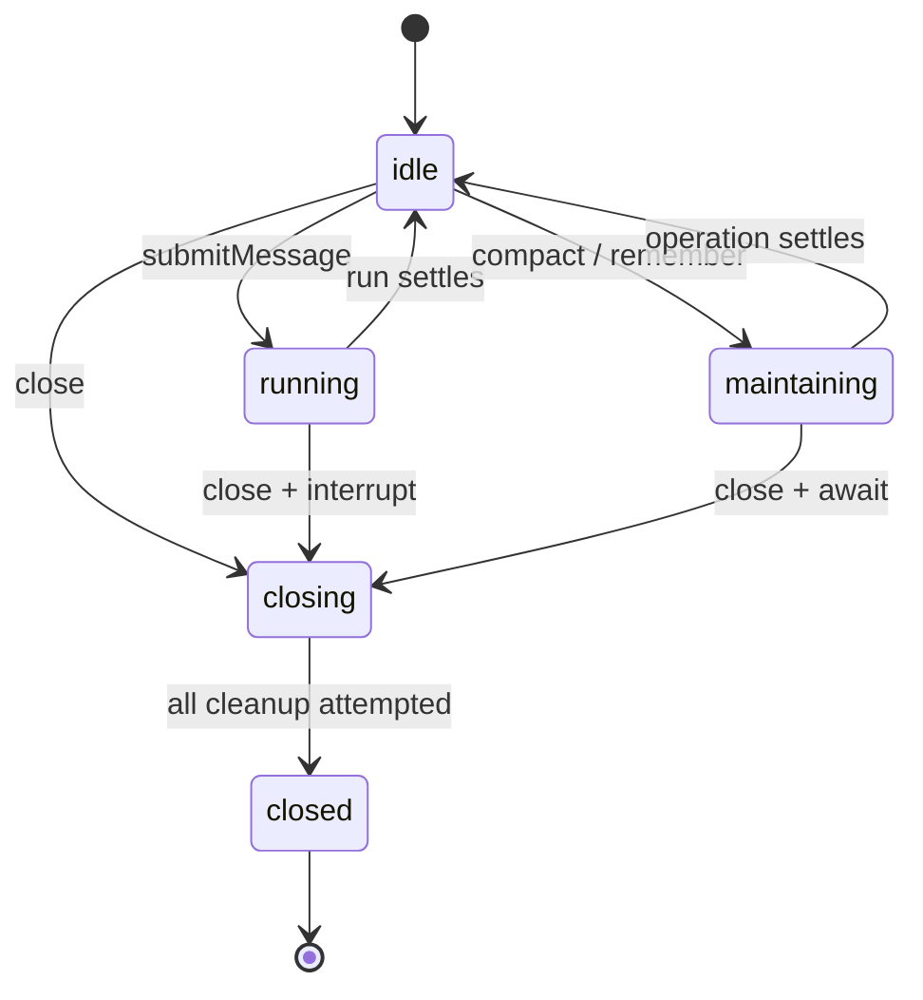
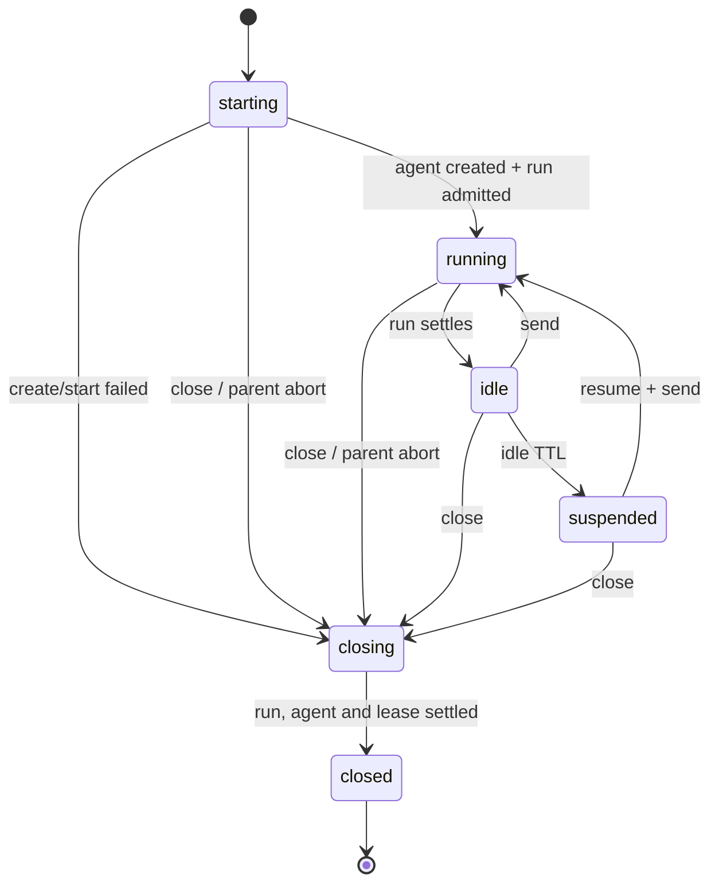
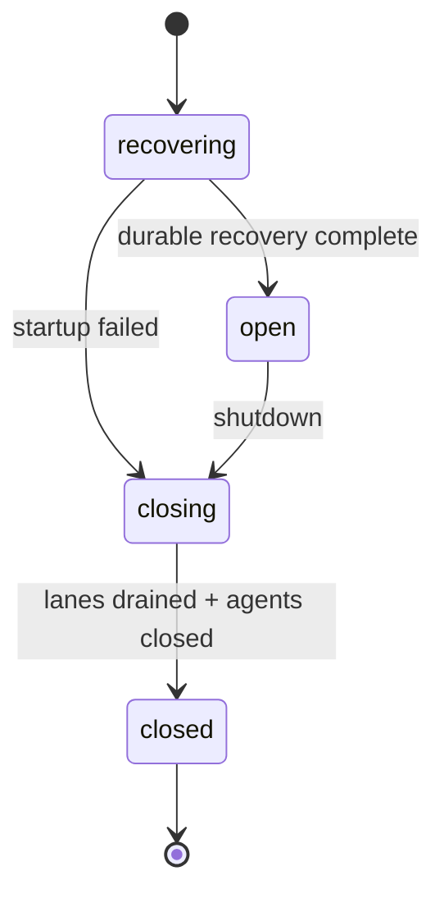

# Agent Lifecycle Contract

> 状态：framework 与 daemon 生命周期的权威契约。API 用法见 [OpenHarness Agent SDK](./agent-sdk.md)，内部结构见 [Agent Runtime Framework Architecture](./agent-runtime-framework-architecture.md)，daemon 请求链见 [Daemon Application Architecture](./daemon-application-architecture.md)。

## 目的

本文只定义跨模块必须保持的生命周期语义：谁拥有状态、何时允许新操作、事件何时算已交付、失败时哪些终态不可回退、关闭时哪些资源必须继续释放。具体类名可以调整，下面的契约编号和可观察行为不能静默改变。

```text
framework = execution + live state + events/effects + live handles
daemon    = durable session/input/run/task/transcript + multi-client policy
transport = listener + HTTP request + SSE client lifetime
surface   = interaction state and rendering
```

## 所有权

| 资源 | 唯一所有者 | 释放边界 |
|---|---|---|
| root run、maintenance、child live handle | `OpenHarnessAgent` | `agent.close()` |
| child worktree/environment lease | 创建该 child 的 `AgentChildManager` | child suspend/close，失败也必须尝试 |
| per-session agent generation | `AgentPool` | archive、配置失效或 daemon shutdown |
| durable run/task/transcript | `SessionStore` + daemon services | terminal projection 或 recovery |
| session run lane | `SessionRunCoordinator` | run terminal、interrupt 或 drain |
| HTTP listener、SSE clients | `OpenHarnessHttpServer` | `server.close()` |

live handle 不进入 durable store；durable ID 和状态不反向塞进 framework 私有对象。daemon 可以持有 framework handle，但不能成为 handle 生命周期的第二所有者。

## 状态机

### Agent



- **A1**：一个 agent 最多一个 active root run；`submitMessage()` 必须同步预占 `running`。
- **A2**：history/model mutation、run、maintenance 互斥；冲突必须在开始副作用前失败。
- **A3**：进入 `closing` 后永久拒绝新操作；`close()` 幂等并共享同一个 settle 结果。
- **A4**：close 按 active run、maintenance、children、event sink、runtime 的顺序尝试全部阶段；单阶段失败不能跳过后续阶段。
- **A5**：所有 close 阶段尝试后先进入 `closed`，再原样抛出单错误或按发生顺序抛出 `AggregateError`。

### Child



- **C1**：canonical `childId`/`sessionId` 在获取环境资源前完成冲突检查。
- **C2**：创建、启动或事件投影失败后，不得留下可寻址的半初始化 handle。
- **C3**：close/suspend 必须尝试 interrupt、等待创建、关闭 agent、释放 lease、注销 registry；失败汇总后仍进入终态。
- **C4**：`child.closed` 只发布一次；daemon durable settlement 可重试，但不能重新激活 live child。
- **C5**：root tree 共享查询目录，生命周期释放仍由创建 child 的 manager 负责。
- **C6**：创建 child 前必须在 root tree 共享预算中原子预留 depth、active 和 total 名额；申请环境失败必须退回预留。suspend 不释放 active，close 只释放 active、不退回 total，详细计算见 [Agent Child Session Flow：Child 预算](./agent-child-session-flow.md#child-预算防止无限叫人)。

### Daemon



- **D1**：`listen()` 必须等待 durable recovery；recovery 失败不能暴露 ready listener。
- **D2**：shutdown 先封闭 operation gate，再 drain run lane，最后关闭 agent pool。
- **D3**：run terminal state 不可被迟到或重放的 `run.started` 重新打开。
- **D4**：projection 失败不能推进 event source waterline；后续事件必须先解决 pending settlement。
- **D5**：framework run 已失败但 durable run 尚未 terminal 时，`SessionRunExecutor` 必须执行 infrastructure fallback。
- **D6**：同一 session 同一时刻最多一个 AgentPool generation；关闭中的旧 generation 释放完成后才能创建 replacement。
- **D7**：正常 shutdown 后不得留下 running run、pending steer、live child route 或 pending permission。

### Transport

- **T1**：`server.close()` 同时启动 daemon shutdown 和 listener close，并独立尝试关闭 SSE clients 与 store。
- **T2**：transport cleanup 的单错误原样抛出，多错误按阶段顺序聚合；store close 不因上游失败被跳过。
- **T3**：startup/listen 失败必须调用同一条 close 路径；startup error 与 cleanup error 同时存在时两者都保留。

## Event / Effect / Handle

| 边界 | 语义 | 失败影响 |
|---|---|---|
| `onEvent(event)` | 单一、ordered、awaited reliable sink | 当前 operation 失败 |
| `agent.subscribe(listener)` | ordered invocation、non-blocking observation | listener 被隔离 |
| `requestPermission(request, scope)` | framework 必须等待的 application effect | 按拒绝/过期/执行失败收束 |
| `AgentRunHandle` / `AgentChildHandle` | 调用方控制 live execution | 不可序列化，不进入 store |

- **E1**：`run.started` 被 reliable sink 消费后，`handle.started` 才能 settle。
- **E2**：terminal event 被 reliable sink 消费后，`handle.result` 才能 settle。
- **E3**：可靠 sink 失败后不能通过同一个失败 sink 递归补发 terminal event。
- **E4**：observer 的异常或异步耗时不能阻塞 framework 执行。
- **E5**：permission event 只用于观察；批准/拒绝结果必须来自显式 effect。

## Durable Projection

- **P1**：`input.accepted`、`run.started`、turn/tool boundary 和 terminal projection 使用事务维护 store/read-model 一致性。
- **P2**：`output.text.delta` 立即走 live SSE，但只按 checkpoint 合并持久化 text part；delta 本身不进入 durable replay log。
- **P3**：part complete、tool boundary、run terminal、store close 必须强制 flush dirty text。
- **P4**：客户端用 transient cursor 去重 SSE 重连后的 delta；durable event cursor 可以留洞但不能复用。
- **P5**：create-or-validate 必须拒绝相同 ID 的不同 payload/ownership，不能用后到数据覆盖事实。
- **P6**：每条 durable event 必须携带 `schemaVersion`；消费者只有在理解该版本后才能应用事件并推进 cursor，未知版本必须明确报错，不能静默跳过。
- **P7**：durable event 必须在集中 registry 中登记并通过 payload/scope 校验；旧版本只在读取边界逐版升级，不得为了方便读取而静默覆盖原始事件行。
- **P8**：child required projection 失败必须先持久化可序列化 Settlement；同一 root 的 pending Settlement 未解决前不得应用后续事件，重启只能恢复 durable 状态，不能假装复活旧 live Handle。

## 失败矩阵

| 阶段 | 主要失败 | 必须保持的终态 | 调用方可见结果 |
|---|---|---|---|
| agent create | runtime/MCP/child setup 失败 | 已获得资源全部尝试释放；无 live handle | create reject；cleanup 失败聚合 |
| run start | input/start projection 失败 | agent 回到 idle；durable run 不悬空 | handle reject；daemon fallback terminalize |
| run execute | provider/tool/effect 失败 | pending steer 全部 reject；run terminal | failed/interrupted result |
| projection | store/SSE durable apply 失败 | waterline 不越过失败事件 | framework operation reject |
| interrupt | provider/child interrupt 失败 | lane 和 handle 最终 settle，不接收新 steer | interrupt reject 或聚合错误 |
| child close | run/agent/lease/event 任一失败 | registry 不留 live child；state closed | 单错误或有序聚合错误 |
| daemon shutdown | drain/pool close 任一失败 | gate closed；两阶段均尝试 | 单错误或有序聚合错误 |
| server close | SSE/daemon/listener/store 任一失败 | listener/store 均已尝试；close 幂等 | 单错误或有序聚合错误 |
| restart | 上次进程留下 running/pending 或无 owner input | stale run/task interrupted，orphan input 获得 interrupted owner run，permission expired | recovery 完成后才 ready |

## 可执行索引

| 契约 | 回归测试 |
|---|---|
| A1-A5、E1-E4 | `packages/agent-runtime/src/agent.test.ts`, `sdk.test.ts`, `event-source.test.ts` |
| C1-C6 | `packages/agent-runtime/src/child-agent.test.ts` |
| D2、T1-T3 | `packages/server/src/application/control/__test__/daemon-control-service.test.ts`, `packages/server/src/http/__test__/http.test.ts` |
| D3-D5、P1-P5 | `packages/server/src/application/agent/__test__/daemon-agent-event-projector.test.ts`, `packages/server/src/application/session/__test__/session-run-executor.test.ts` |
| D6 | `packages/server/src/application/agent/__test__/agent-pool.test.ts` |
| D1、D7、restart | `packages/server/src/http/__test__/http.test.ts`, `packages/server/src/daemon/__test__/daemon-lifecycle.soak.test.ts` |

## 变更检查

涉及 lifecycle、events、projection、pool、lane 或 shutdown 的改动，合并前必须回答：

1. 状态的唯一所有者是谁，终态是否不可逆？
2. 失败后是否仍尝试所有已获得资源的释放？
3. 单错误和多错误是否都保留原始 cause 与顺序？
4. reliable sink settle 与 public handle settle 的先后是否保持？
5. restart 后能否仅从 durable state 恢复，不依赖旧 live handle？
6. 对应契约编号是否已有回归测试；没有则随改动新增。
