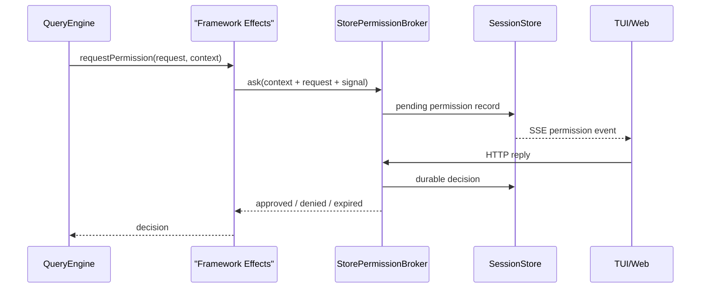
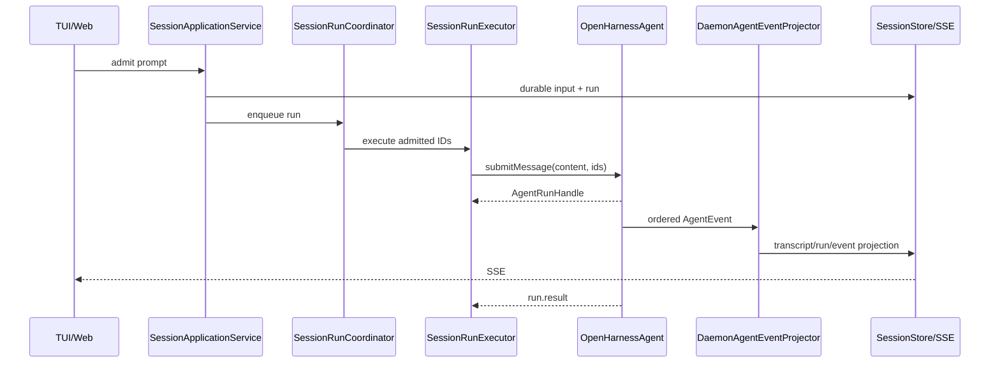
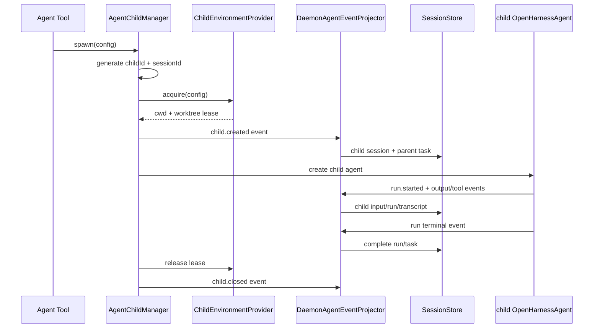

# Agent Run Events / Effects Architecture

> 状态：**已实现的架构决策记录**。当前运行索引见 [Agent Runtime Framework Architecture](./agent-runtime-framework-architecture.md) 和 [Daemon Application Architecture](./daemon-application-architecture.md)。本文保留改造前问题、决策理由与验收约束。
>
> 决策摘要：删除 daemon 注入的 run host 和 child projection。framework 通过 `OpenHarnessAgent`、`AgentRunHandle`、`AgentChildHandle`、统一 `AgentEvent` 与少量 `AgentEffects` 暴露能力；daemon 只消费事件、实现 effects，并维护 durable projection。

## 1. 为什么要改

改造前的边界已经比旧 runtime factory 世界清晰，但一轮执行仍按下面的方式接线：

```text
SessionRunExecutor
  -> new DaemonRunProjection(...)
  -> projection.createHost(scope)
  -> new DaemonRuntimeHostPort(...)
  -> agent.submitMessage(content, { host, childProjection })
  -> AgentSession -> QueryEngine
  -> host.emitStreamEvent / emitEvent / requestPermission
  -> DaemonRuntimeHostPort
  -> DaemonRunProjection
```

child 路径更重：

```text
AgentChildManager
  -> projection.createChild(..., controls)
  <- sessionId / cwd / taskId / worktree / opaque state
  -> projection.startRun(...)
  <- inputId / runId / child-scoped AgentRunHost / opaque state
  -> projection.steerRun / finishRun / closeChild
```

这里的主要问题不是 HTTP，而是 framework 的执行过程被表示成一组 daemon 回调：

1. **事实通知和请求应答混在同一个 host。** `emitStreamEvent()` 是事实，`requestPermission()` 却必须返回 decision。
2. **durable projection 进入了执行控制流。** child 必须等待 daemon projection 返回 host、ID 和 opaque state 才能继续。
3. **同一身份有多套句柄。** invocationId、taskId、sessionId、runId、controls 在 framework 与 daemon 之间双向穿梭。
4. **steer 使用反向回拉。** daemon 增加 `wakeCount`，executor 再用 `pullFollowUps()` 从 store 拉输入。
5. **扩展成本按方法数增长。** 新增一种 runtime 动作，通常要同时修改 core host、agent wrapper、daemon port、projection 和测试替身。

真正需要保留的不是这些方法，而是两条稳定边界：

```text
framework -> application : 已发生的执行事实
framework -> application : 必须等待外部回答的 effect request
application -> framework : 对 live run / child 的显式控制
```

## 2. 设计目标

1. `createOpenHarnessAgent()` 返回一个可以脱离 daemon 使用的完整 programmatic agent。
2. `agent.submitMessage()` 立即建立并启动一轮执行，返回 framework-owned live handle。
3. stream、tool、usage、run、permission observation、child lifecycle 使用一个有序事件模型。
4. permission 等需要返回结果的动作使用显式 effect，不伪装成事件。
5. interrupt、steer、child follow-up 使用 live handle，不通过 store wake + callback 回拉。
6. daemon 保留 HTTP、SSE、durable session/input/run/task/transcript、准入和多客户端协调。
7. child 可以在没有 daemon 的情况下完整运行；daemon 只为它建立 durable 产品视图。
8. 删除旧接口，不维护双路径、兼容 adapter 或 deprecated facade。

## 3. 非目标

- 不把 OpenHarness 做成通用 agent SDK 或任意插件事件总线。
- 不把 `SessionStore`、HTTP DTO、SSE schema 下沉到 framework。
- 不把 QueryEngine 每个内部步骤都做成可持久化事件。
- 不用 event sourcing 重建 framework 的全部内存状态。
- 不让 daemon 接管 model/tool loop、permission wait、child instance 或 abort controller。
- 不要求 standalone 模式模拟 daemon 的 session/task 产品模型。

## 4. 三种交互原语

所有跨边界动作必须先归入以下三类，不能再增加含义模糊的 `Host` 方法。

| 原语 | 方向 | 是否等待返回值 | 例子 |
|---|---|---:|---|
| `AgentEvent` | framework -> application | 否，但可等待 listener 完成 | text delta、tool completed、run failed、child created |
| `AgentEffects` | framework -> application | 是 | permission decision |
| live handle | application -> framework | 是 | `run.steer()`、`run.interrupt()`、`child.send()` |

判断规则：

1. **事情已经发生，外部只能观察或投影**：event。
2. **framework 没有外部结果就不能继续**：effect。
3. **外部主动要求 live execution 改变状态**：handle method。

因此：

- `tool.started` 是 event。
- “这个工具是否允许执行”是 permission effect。
- `permission.requested/resolved` 可以作为可观测 event，但不能携带 `resolve()`。
- child create/start/finish/close 是 event。
- child `send/interrupt` 是 `AgentChildHandle` 方法。
- durable task/session/run 的创建不是 framework callback，而是 daemon 对 event 的投影。

## 5. 目标公开 API

以下代码是接口方向，不要求逐字采用命名，但语义和所有权必须保持。

```ts
const agent = await createOpenHarnessAgent({
  cwd,
  settings,
  effects: {
    requestPermission: async (request, context) => {
      return await permissionUI.ask(request, context.signal);
    },
  },
});

const subscription = agent.events.subscribe(async (event) => {
  console.log(event.type, event.context.runId);
});

const run = agent.submitMessage("hi");
const result = await run.result;

subscription.unsubscribe();
await agent.close();
```

### 5.1 OpenHarnessAgent

```ts
interface OpenHarnessAgent {
  readonly id: string;
  readonly events: AgentEventSource;
  readonly children: AgentChildDirectory;

  submitMessage(
    content: string | ContentBlock[],
    options?: AgentSubmitOptions,
  ): AgentRunHandle;

  runMessage(
    content: string | ContentBlock[],
    options?: AgentSubmitOptions,
  ): Promise<AgentRunResult>;

  // history / compact / remember / usage / inspect / close 保持 framework 能力
}
```

`submitMessage()` 不再返回裸 `AsyncIterable<StreamEvent>`。它返回一个已经启动、可观察、可控制、最终可等待的 run 实例。`runMessage()` 是只关心最终结果的便捷 API。

### 5.2 AgentRunHandle

```ts
interface AgentRunHandle {
  readonly id: string;
  readonly inputId: string;
  readonly sessionId: string;
  readonly traceId: string;
  readonly started: Promise<AgentInputReceipt>;
  readonly result: Promise<AgentRunResult>;

  steer(input: AgentSteerInput): Promise<AgentInputReceipt>;
  interrupt(reason?: string): Promise<void>;
}
```

run handle 的唯一所有者是 framework。daemon lane 可以保存引用并调用它，但不能复制它的状态机。

`started` 是 required `run.started` event 的交付屏障；它不是“已排队”，而是 application 已成功消费 start fact。child prompt/spawn 只有在该 promise settle 后才返回 run receipt。

`steer()` receipt 采用同样的事实屏障，但发生在 QueryEngine 的可用 turn boundary：同步调用只预占 pending slot；`input.accepted` 成功交付且输入即将进入下一模型回合后 receipt 才 resolve。run 在此之前失败、终止或耗尽 turn 时，receipt 以 typed `AgentRunNotAcceptingInputError` reject。application 可以据此实施 durable replacement policy，framework 自身不创建 durable run。

`AgentSubmitOptions` 允许 daemon 提供已经准入的身份：

```ts
interface AgentSubmitOptions {
  ids?: {
    inputId: string;
    runId: string;
    traceId: string;
  };
  signal?: AbortSignal;
  metadata?: Record<string, unknown>;
}
```

standalone 模式省略 `ids` 时由 framework 生成；daemon root run 使用 store 已生成的 ID。这样 framework event 与 durable record 使用同一身份，不再翻译句柄。`metadata` 随 `input.accepted` 事实传播，主要用于 framework-owned child 新输入；daemon root input 已在 submit 前 durable admit。

### 5.3 AgentChildHandle

```ts
interface AgentChildHandle {
  readonly id: string;        // canonical child invocation id
  readonly sessionId: string;
  readonly state: "starting" | "running" | "idle" | "suspended" | "closed";
  readonly result: Promise<AgentChildResult>;

  send(input: AgentChildInput): Promise<AgentInputReceipt>;
  interrupt(reason?: string): Promise<void>;
  close(): Promise<void>;
}

interface AgentChildDirectory {
  get(childId: string): AgentChildHandle | undefined;
  getBySessionId(sessionId: string): AgentChildHandle | undefined;
  list(): AgentChildHandle[];
}
```

framework 工具只返回和接收 canonical `childId`，不再把 daemon `taskId` 当成执行句柄。daemon task record 保存 `childId` 作为 live routing key。

## 6. AgentEvent 模型

### 6.1 Envelope

所有事件是可序列化 discriminated union；禁止包含 `Error`、function、Promise、AbortSignal、agent instance 或 controls。

```ts
interface AgentEventEnvelope<TType extends string, TData> {
  id: string;
  sequence: number;
  type: TType;
  occurredAt: string;
  context: {
    agentId: string;
    sessionId: string;
    inputId?: string;
    runId?: string;
    traceId?: string;
    childId?: string;
    parentSessionId?: string;
    parentRunId?: string;
  };
  data: TData;
}
```

- `id` 是事件身份；daemon projector 使用单调 `sequence` 成功水位做进程内幂等，避免维护无界 event ID 集合。
- `sequence` 在一个 root agent event source 内单调递增；descendant child event 汇入同一 source。
- daemon 自己的 durable event sequence 仍由 `SessionStore` 生成，不能复用 framework sequence。
- error 必须转成 `{ name, message, code?, stack? }` DTO。

### 6.2 首版事件族

| 事件族 | 首版事件 | daemon 用途 |
|---|---|---|
| input | `input.accepted` | 校验/创建 input，绑定 steer/follow-up 到 active run |
| run | `run.started/completed/failed/interrupted` | run 状态、日志、terminal SSE |
| output | `output.text.delta` | message/part/delta transcript |
| tool | `tool.started/completed` | tool part、结果、错误日志 |
| usage | `usage.updated` | live usage / observability |
| domain | `domain.event` | workflow 等 typed name + payload |
| permission | `permission.requested/resolved` | 审计与观测；durable request 由 effect 实现 |
| child | `child.created/suspended/resumed/closed` | child session/task/live directory |
| child run | 使用普通 run/input/tool/output 事件并携带 child context | child input/run/transcript/task 状态 |

不再同时维护 `AgentRuntimeEvent` 与 `StreamEvent` 两条向外协议。QueryEngine 的低层 provider stream 在 framework 内部归一化成 `AgentEvent`。

### 6.3 交付语义

`agent.events.subscribe(listener)` 是有序、可等待的订阅，不是 fire-and-forget `EventEmitter`：

1. 同一 source 的 listener 按 event sequence 观察事件。
2. framework 在进入依赖该事实的下一状态前等待 listener 完成。
3. required listener 抛错会让当前 run 失败并触发中断清理。
4. 没有 listener 时 standalone 执行不受影响。
5. daemon 在 agent 进入 pool 时订阅，在关闭/驱逐 agent 时取消订阅，因此第一轮 run 不存在订阅竞态。

首版只提供一个 agent-level required subscriber，不再叠加 run-scoped callback，不设计通用多播、replay 或事件优先级系统。daemon SSE replay 来自 `SessionStore`，不是 framework event source。

### 6.4 完成屏障

`run.result` 只能在 terminal event 已被 required listener 成功处理后 settle：

```text
all output/tool/usage events projected
  -> run.completed | run.failed | run.interrupted projected
  -> run.result settles
```

因此 `SessionRunExecutor` 不需要再调用 `projection.complete()` 或 `projection.fail()`。若 event listener 本身失败，executor 只执行基础设施兜底：interrupt live run，并将尚未终态化的 durable run 标为 failed。

## 7. AgentEffects

首版 `AgentEffects` 只承载真正的请求/应答边界：

```ts
interface AgentEffects {
  requestPermission(
    request: AgentPermissionRequest,
    context: AgentEffectContext,
  ): Promise<AgentPermissionDecision>;
}

interface AgentEffectContext {
  agentId: string;
  sessionId: string;
  inputId: string;
  runId: string;
  traceId: string;
  childId?: string;
  signal: AbortSignal;
}
```

约束：

- effect callback 在 `createOpenHarnessAgent()` 时注入，child agent 自动继承。
- 每次调用都带完整 run context，callback 不捕获某一轮 run 的 projection。
- 没有 permission effect 时默认拒绝，不能隐式批准。
- effect 必须响应 `AbortSignal`；interrupt 后 pending permission 返回 `expired`。
- effect 返回的是值，不是暴露给 durable event 的 `resolve/reject` function。

daemon 的实现仍使用 `StorePermissionBroker`：



这里仍然有 callback，但它表达的是 framework 必须等待的外部 effect，不是把每个执行事实逐方法投给 daemon。

## 8. QueryEngine 内部边界

`QueryRuntimeHost` / `AgentRunHost` 不再是 daemon 扩展点。framework 内部建立 execution context：

```ts
interface AgentExecutionContext {
  scope: AgentRunScope;
  effects: AgentEffects;
  children: AgentChildController;
  emit(event: AgentEventInput): Promise<void>;
  takeSteeredInputs(options?: { closeIfEmpty?: boolean }): Promise<AgentChildInput[]>;
  closeSteering(): void;
}
```

QueryEngine、tool context 和 workflow runner 可以依赖这个内部 context，但 application 不能构造它。对应替换：

| 改造前调用 | 当前调用 |
|---|---|
| `runtimeHost.emitEvent()` | `execution.emit()` |
| `host.emitStreamEvent()` | framework 归一化 provider stream 后 emit |
| `runtimeHost.requestPermission()` | `execution.effects.requestPermission()` |
| `runtimeHost.childAgentHost.spawnChildAgent()` | `execution.children.spawnChildAgent()` |

这样 child/permission 是 framework 本身的执行能力，daemon 不再“注入出一个 Agent”。

## 9. Daemon 目标链路

### 9.1 Agent 创建

`AgentPool` 仍按 durable `sessionId` 缓存一个 root `OpenHarnessAgent`。创建时完成一次绑定：

```text
AgentPool.create(session)
  -> createOpenHarnessAgent({ effects: daemonEffects })
  -> agent.events.subscribe(daemonEventProjector.apply)
  -> hydrate durable transcript
  -> cache agent
```

subscription 与 agent pool entry 同生命周期，不是 run-scoped adapter。

### 9.2 Root run



`SessionRunExecutor` 的职责收缩为：acquire agent、submit、把 active handle 注册给 lane、await result、处理基础设施异常。

### 9.3 Steer 与 interrupt

改造前的 `mergeWake -> wakeCount -> drainSteeredInputs -> pullFollowUps` 已改为显式 handle：

```text
HTTP steer
  -> daemon durable admit input
  -> SessionRunCoordinator.activeHandle(sessionId)
  -> run.steer({ content, id, traceId })

HTTP interrupt
  -> SessionRunCoordinator.activeHandle(sessionId)
  -> run.interrupt(reason)
```

lane 仍负责多客户端准入和 per-session 串行，但不再让 framework 反向查询 daemon store。

steer 可能在 executor 注册 handle 前已经被 HTTP durable admit。lane 保留这段短暂窗口中的 pending steer，并在 `registerHandle()` 时按准入顺序主动 flush。`run.steer()` 接受 daemon 已生成的 input ID/trace ID；framework 在 QueryEngine 真正消费它的 turn boundary 发出 `input.accepted`，projector 据此把该 input 绑定到 active run 并投影 transcript，随后 receipt 才返回。每个 boundary 只消费一个 pending steer；并发输入 FIFO 推进，已消费 receipt 不会因后续输入投影失败而回滚。

最终无工具 turn 与 max-turn boundary 会在没有下一模型回合时关闭 steering，不取走 pending input。若 daemon lane 先接收、framework 后确认 run 已关闭，typed `AgentRunNotAcceptingInputError` 触发 durable replacement run；lane delivery 返回 replacement run ID，HTTP 不会把输入错误归到旧 run。provider/tool/projection failure 也会拒绝所有尚未消费的 receipt，不会留下“已成功但模型未收到”的输入。

## 10. Child agent 目标链路

### 10.1 所有权调整

| 状态/资源 | 目标所有者 |
|---|---|
| child instance、history、result、abort、idle suspend | framework |
| childId、child sessionId、child input/run ID 的 live identity | framework；外部已准入 ID 可显式传入 |
| child worktree/environment lease | framework child environment provider |
| durable child session/input/run/task/transcript | daemon projector/store |
| taskId | daemon，仅用于产品 task record |
| childSessionId -> live child route | daemon directory 指向 `agent.children`，不持有 controls 副本 |

worktree 与 child instance 同生共死，属于 live execution resource。实现应从 server 移到 agent-runtime 的 child environment provider；daemon 只持久化 path/branch metadata。

### 10.2 事件驱动闭环



关键变化：

- `child.created` listener 是有序且 awaited 的，所以 durable child 建模失败时 framework 不会继续启动 child。
- framework 先把 handle 放入 `agent.children`，再发 `child.created`；listener 失败时回滚 directory 和 environment lease。
- event 不返回 `taskId`。agent tool 使用 `childId`；daemon task 保存 `childId` 用于路由。
- child run 使用与 root run 相同的 run/output/tool event，不再创建 child-scoped `AgentRunHost`。
- descendant event 自动汇入 root agent event source，且所有 manager 共享一个 tree-wide child registry；grandchild 不需要复用一个带 opaque state 的 daemon projection 对象，root directory 也能直接路由它。
- live HTTP/task input 通过 `agent.children.getBySessionId()` 找到 handle；不再把 `AgentChildControls` 注册进 daemon。

### 10.3 Durable 幂等

root run 的 session/input/run 已由 daemon 准入；child 内部创建的 ID 由 framework 生成。projector 对两种来源都按 ID upsert/validate：

1. record 不存在则创建。
2. record 已存在且 identity/content 相同则视为幂等 replay。
3. ID 相同但 payload 不同则失败关闭，不静默覆盖。
4. projector 只在事件成功应用后推进 root event sequence 水位，失败可重试且内存占用恒定。

## 11. Daemon 中保留的 projection

“不再做一堆 projection 方法”不等于取消 durable projection。framework event 与产品数据模型不同，daemon 仍需要一个明确 reducer：

```ts
class DaemonAgentEventProjector {
  apply(event: AgentEvent): Promise<void>;
}
```

它可以内部委托现有的窄模块：

- `SessionTranscriptProjection`
- `SessionEventPublisher`
- `SessionTaskBridge` 或其后继 reducer
- `SessionStore`
- observability logger

但它不再：

- `createHost()`
- 返回 child handle/host/opaque state
- 暴露 `startRun/finishRun/closeChild` 生命周期接口
- 被 framework import 或调用

projection 是 daemon 对事实的单向消费，不再是 framework 执行协议。

## 12. 类型和类的退场表

| 当前类型/类 | 目标 |
|---|---|
| `AgentRunHost` | 删除；由 internal execution context + events/effects/handles 替代 |
| `QueryRuntimeHost` | 从 application boundary 删除；改为 framework internal context |
| `AgentSessionHostCallbacks` | 删除；agent instance events/effects 替代 |
| `DaemonRuntimeHostPort` | 删除 |
| `DaemonRunProjection` | 替换为单入口 `DaemonAgentEventProjector.apply()` |
| `AgentChildProjection` | 删除 |
| `AgentChildProjectionHandle/RunProjection` | 删除 |
| `DaemonChildAgentProjection` | 合并到 event projector 的 child reducer |
| `ChildAgentProjectionFactory` | 删除 |
| `LiveChildAgentRegistry` | 替换为基于 `agent.children` 的 live directory，或并入 AgentPool |
| `pullFollowUps/wakeCount` | 删除；改为 `AgentRunHandle.steer()` |
| `StreamEvent` 对外协议 | 收口为 `AgentEvent`；provider stream 只留在 framework 内部 |

以下模块继续存在：

- `SessionRunEngine`
- `SessionRunCoordinator`
- `SessionRunExecutor`
- `AgentPool`
- `SessionStore`
- `SessionTranscriptProjection`
- `StorePermissionBroker`
- HTTP routes / SSE / client reducer

## 13. 故障与一致性规则

1. daemon 必须先 durable admit root input/run，再调用 `submitMessage()`。
2. `run.started` 前的 listener failure 不允许执行 model/tool。
3. required event projection failure 会 interrupt live run。
4. terminal event 投影成功后 `run.result` 才 settle。
5. permission effect failure 默认等价于 denied/expired；基础设施错误可使 run failed，但绝不默认批准。
6. parent interrupt 由 framework 传播到其创建的 child；daemon 不遍历 child controls。
7. agent close 必须等待 run/child 清理和 event listener drain。
8. daemon restart 后 live handles 不恢复；durable active run/task 和开放 transcript part 标记 interrupted，pending permission 标记 expired。
9. event payload 必须可序列化并限制 tool output/delta 大小；大内容继续由 transcript/store 分块处理。
10. listener 不能反向调用同一 agent 的阻塞方法造成重入；daemon 路由在 event apply 完成后再执行 live command。
11. required listener 失败后 dispatcher 立即熔断该 run；不得再通过同一个失败 listener 递归发送 `run.failed`。executor 使用 durable fallback 收口未终态 run。

## 14. 被否决的替代方案

### 14.1 保留 Host，只减少方法

这只能缩短类型定义，不能改变 daemon 构造 framework execution context、child 返回 opaque projection state、steer 反向回拉等问题，因此不采用。

### 14.2 用普通 EventEmitter

同步 `emit()` 无法等待 durable projection，也无法把 listener failure 纳入 run settlement；异步 listener 的 rejection 容易丢失，因此不采用 fire-and-forget EventEmitter 作为 required delivery。

### 14.3 在 permission event 中携带 resolve/reject

这会让 event 不可序列化，把 live capability 混入 durable fact，并重新制造句柄双向穿梭。permission 必须是 typed effect，request/resolved event 只做观测。

### 14.4 daemon 继续生成 child/task/run 身份并返回 framework

这会保留 child projection 的请求/返回协议。目标方案由 framework 生成 child live identity，daemon 复用同一 ID 做 durable projection；daemon 自己的 taskId 永不进入 framework 控制面。

## 15. 复杂度变化

当前每新增一种动作，常见改动路径是：

```text
core host type
  -> AgentSession wrapper
  -> OpenHarnessAgent compose host
  -> DaemonRuntimeHostPort
  -> DaemonRunProjection method
  -> child projection variant
```

目标路径：

```text
不需要返回值：AgentEvent union -> DaemonAgentEventProjector switch
需要返回值：AgentEffects interface -> daemon effect implementation
外部控制：Run/Child handle method -> daemon application use case
```

复杂度不会消失：durable 状态、SSE、permission wait、child lifecycle 都仍然存在。减少的是重复表达、反向 callback 和句柄翻译。

## 16. 验收标准

- `createOpenHarnessAgent()` 不依赖 server/daemon 包即可完成多轮对话、工具授权和 child agent。
- `agent.submitMessage()` 返回 `AgentRunHandle`，调用者可 await、steer、interrupt。
- framework public API 中不存在 `AgentRunHost`、`AgentChildProjection`。
- server 中不存在 `DaemonRuntimeHostPort`、`DaemonRunProjection.createHost()`、`DaemonChildAgentProjection`。
- daemon 只通过一个 required event subscription 和 `AgentEffects` 接入 framework。
- root/child 的 stream、tool、permission、terminal 状态均可 durable replay 到第二个客户端。
- child 工具不接收 daemon taskId；framework 与 daemon 之间不传 controls、resolve 或 opaque projection state。
- steer 不再依赖 `wakeCount`、`drainSteeredInputs()` 或 `pullFollowUps()`。
- permission interrupt、recursive child、idle suspend/resume、daemon restart recovery 保持现有行为。
- 全量 package typecheck 和 root/child/permission/TUI integration tests 通过。

## 17. 最终心智模型

```text
OpenHarnessAgent
  owns QueryEngine + history + run handles + child handles
  emits ordered AgentEvent facts
  awaits explicit AgentEffects

Daemon
  admits root work and coordinates clients
  subscribes once per pooled agent
  projects AgentEvent into durable session/run/task/transcript/SSE
  routes commands to framework-owned handles

Surface
  talks only to daemon HTTP/SSE, or directly hosts the same agent API
```

一句话：**framework 是动作和 live state 的来源；daemon 是 durable 产品事实的解释者，不再是 framework 每一步执行所需的宿主插座。**
