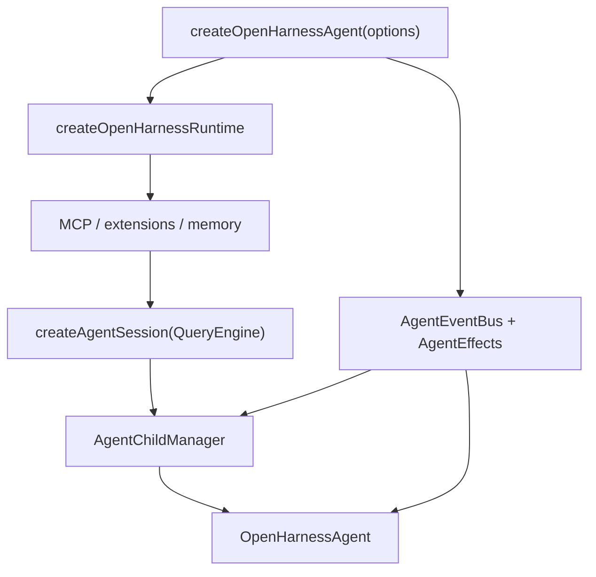
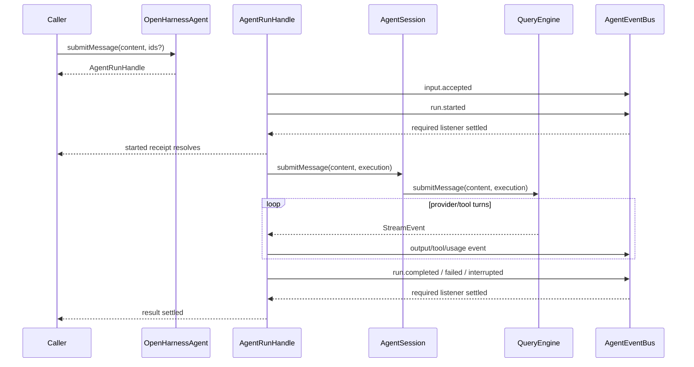

# Agent Runtime Framework Architecture

> 状态：当前实现与权威代码索引。边界约束见 [Agent Framework Capability Boundary](./agent-framework-capability-boundary.md)，daemon 托管流程见 [Daemon Application Architecture](./daemon-application-architecture.md)。

## 一句话模型

```text
OpenHarnessAgent = QueryEngine + history + resources + active run + child directory
AgentEvent       = framework 已经发生的执行事实
AgentEffects     = framework 必须等待外部返回值的决策
Run/ChildHandle  = 调用方控制 live execution 的能力
```

framework 不依赖 HTTP、daemon、SQLite session schema 或 UI。最小使用形态是：

```ts
const agent = await createOpenHarnessAgent({ cwd: process.cwd() });
const run = agent.submitMessage("hi");
const result = await run.result;
await agent.close();
```

## 核心对象

| 对象 | 文件 | 职责 |
|---|---|---|
| `OpenHarnessAgent` | `packages/agent-runtime/src/agent.ts` | public facade、资源与 active run 所有权 |
| `FrameworkAgentRun` | `packages/agent-runtime/src/agent.ts` | 一轮执行、事件归一化、steer、interrupt、terminal barrier |
| `AgentEventBus` | `packages/agent-runtime/src/event-source.ts` | agent 级有序、awaited required event delivery |
| `AgentChildManager` | `packages/agent-runtime/src/child-agent.ts` | 当前 agent 的 direct child 生命周期与资源所有权 |
| `AgentChildRegistry` | `packages/agent-runtime/src/child-agent.ts` | 一个 root tree 共享的全部 descendant handle 索引 |
| child environment | `packages/agent-runtime/src/child-environment.ts` | worktree acquire/release |
| `AgentSession` | `packages/core/src/agent-session.ts` | QueryEngine 的薄 session facade |
| `QueryEngine` | `packages/core/src/engine/query-engine.ts` | model/tool loop 与 history |
| execution contracts | `packages/core/src/types/runtime.ts` | events、effects、handles、internal execution context |

## 创建流程



`createOpenHarnessRuntime()` 组装 provider、QueryEngine、tools、hooks、permission policy、prompt、skills、plugins 与 sandbox。`createOpenHarnessAgent()` 再补上 event/effect 边界、session facade、memory 和 child lifecycle。

## 一轮 submitMessage



关键语义：

- `submitMessage()` 同步返回 live handle，执行在 microtask 中启动。
- 同一 agent 同时只允许一个 active root run。
- provider `StreamEvent` 只在 framework 内部存在；外部只观察 `AgentEvent`。
- terminal event 被 required listener 消费后，`run.result` 才 settle。
- `run.started` 被 required listener 消费后，`run.started` receipt 才 settle；child/HTTP 调用方不会拿到尚未 durable start 的 run。
- listener 失败会使 run 失败；不会再通过同一个失败 listener 递归发送 terminal event。
- `runMessage()` 只是 `await submitMessage(...).result` 的 convenience API。

## Event / Effect / Handle

选择规则：

| 需要 | 使用 |
|---|---|
| 通知“已经发生”，无需返回值 | `AgentEvent` |
| 执行必须等待外部决策 | `AgentEffects` |
| 外部主动控制仍存活的执行 | `AgentRunHandle` / `AgentChildHandle` |

当前 event 包含 input、run terminal、text delta、model turn boundary、tool、usage、domain、permission observation 和 child lifecycle。事件 payload 可序列化，不携带 Promise、resolver、AbortSignal 或 controls。

当前唯一 effect 是 `requestPermission(request, scope)`。未配置时 framework 默认拒绝。

`AgentRunHandle` 提供：

```text
started
result
steer(input)
interrupt(reason?)
```

steer 在同步检查后先预占 framework pending 队列，但此时 receipt **不会**成功。QueryEngine 到达仍有下一模型回合的 turn boundary 后，framework 才投递 `input.accepted(delivery=steer)`、把输入交给 QueryEngine，并结算 receipt；因此 receipt 表示“已被本轮执行消费”，不是“已进入内存队列”。若 provider/tool/event projection 先失败、run 被中断，或已没有剩余 turn，所有未消费 receipt 都以 `AgentRunNotAcceptingInputError` 拒绝。批量 steer 也只有整批 `input.accepted` 投递成功后才统一结算，不报告部分成功。

最终无工具回合和 max-turn boundary 会先关闭 steering，不再取走无法触发下一模型回合的输入。framework 只负责拒绝未消费 handle 请求；是否把 durable 输入转成 replacement run，是 daemon 的应用策略。

## Tool 与权限

```text
QueryEngine
  -> permission checker
  -> execution.emit(permission.requested)
  -> execution.effects.requestPermission(request, scope)
  -> execution.emit(permission.resolved)
  -> approved: execute tool
  -> denied/expired: return denied tool result
```

工具通过 `ToolContext.agent` 获得 framework-internal execution context。Agent、SendMessage、Workflow 使用 `context.agent.children`；domain telemetry 使用 `context.agent.emit(domain.event)`。

## Child agent

`AgentChildManager` 完整拥有 child live lifecycle：

1. 生成 canonical `childId` 与 `sessionId`。
2. 通过 `AgentChildEnvironmentProvider` 获取 cwd/worktree lease。
3. 把 handle 注册到 root tree 共享的 `AgentChildRegistry`，再发布 `child.created`。
4. 递归创建共享 event bus/effects 的 `OpenHarnessAgent`。
5. 启动 child run；child run 使用普通 input/run/output/tool events。
6. active follow-up 调用当前 run 的 `steer()`；queue follow-up 串行启动下一轮。
7. idle TTL 到期后保存 history、关闭重资源并发布 suspended；后续输入恢复同一 child。
8. close/parent abort 终止 run、释放环境并发布 `child.closed`。

child run 返回的 `started` receipt 必须逐项匹配 manager 预分配的 `sessionId/inputId/runId`；不一致时 framework 中断该 run、关闭 child，并拒绝调用方，不能用本地 ID 覆盖 framework receipt。

每个 `AgentChildManager` 只 close 自己直接拥有的 child；root 与所有递归 child 共享一个 `AgentChildRegistry`。因此 `rootAgent.children.get(id|getBySessionId)` 可以定位任意深度 descendant，而生命周期释放仍由创建它的 manager 负责。daemon 不向 framework 回传 taskId、host、controls 或 opaque projection state。

## 维护 API

| API | 行为 |
|---|---|
| `getHistory/loadHistory/clear` | 管理 live conversation history |
| `setModel` | 更新当前 model 与 QueryEngine |
| `compact` | 压缩 live history |
| `remember` | 从 history 提取 memory |
| `getUsage` | 累计 token usage |
| `inspect` | model/tools/hooks/MCP/sandbox 快照 |
| `close` | interrupt run、close children、drain events、释放 runtime |

## 不变量

- agent-runtime 不 import server/daemon。
- framework 拥有执行状态和 live handles。
- application 只通过 events、effects 与 handles 接入。
- child 递归继承同一 effects 和 event source。
- child 递归共享同一个 tree-wide handle directory，但不共享 manager ownership。
- `AgentSession` 不再生成 ID、保存 callbacks 或组装 host。
- 不存在 daemon adapter、run host 或 child projection public API。
