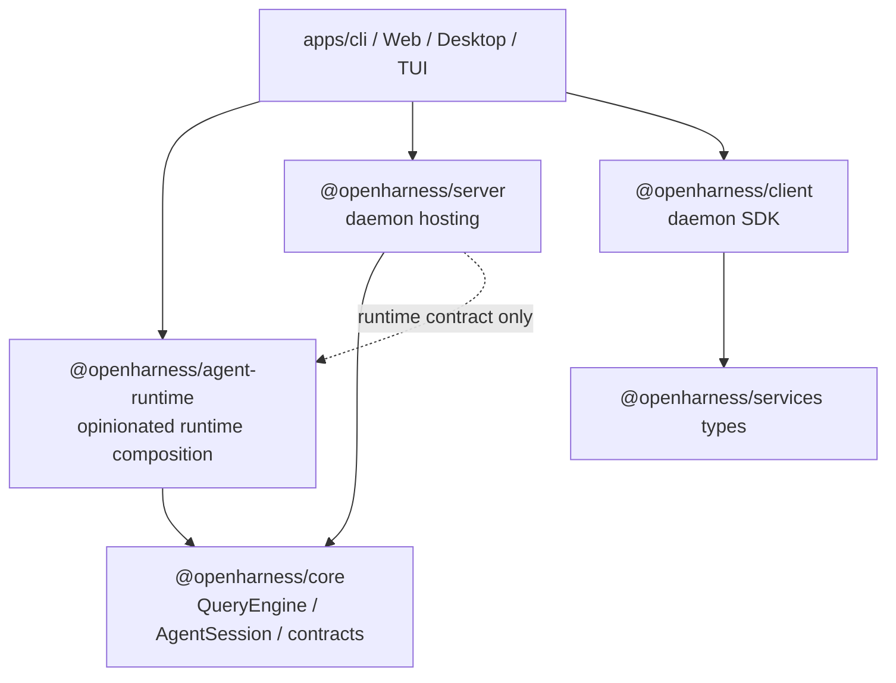

# Agent Runtime Framework Architecture

> 当前状态：框架化方向文档。本文描述下一阶段目标边界，不代表所有代码已经完成迁移。
>
> 关联文档：[`agent-framework-layer-architecture.md`](./agent-framework-layer-architecture.md)、[`daemon-application-architecture.md`](./daemon-application-architecture.md)、[`runtime-host-port-design.md`](./runtime-host-port-design.md)。

## 0. 核心判断

OpenHarness 应该形成三层：

```text
agent-runtime framework
  -> daemon hosting layer (server/client)
  -> application surfaces (TUI / Web / Desktop / CLI / scripts)
```

daemon 是一种托管形态，不应该是 agent 的出生地。TUI、Web、Desktop、CLI 也只是入口形态，不应该知道 `QueryEngine` 怎样被完整组装。

目标不是做通用 agent framework，而是做一个 **OpenHarness 内部固执己见的 Agent Runtime**：

```text
默认使用 QueryEngine
默认使用 AgentSession
默认装配工具、权限、hooks、MCP、memory、compact、usage
默认可以被 daemon 托管
默认也可以 programmatic 单进程运行
```

## 1. 当前代码事实

现在已经成立的是：

```text
QueryEngine.submitMessage()
  -> 可以直接运行一个对话回合
  -> 支持 stream、tool call、permission、follow-up、abort signal

AgentSession.submitMessage()
  -> 包装 QueryEngine.submitMessage()
  -> 注入 AgentRunHost
  -> 统一 stream event callback

SessionRuntimeFactory
  -> 让 daemon 只依赖 runtime contract
```

但默认 runtime composition 仍在 CLI：

```text
apps/cli/src/runtime.ts
  -> bootstrap()
  -> new QueryEngine(...)
  -> new RuntimeBuilder().setXxx().build()

apps/cli/src/session-runtime.ts
  -> createCliSessionRuntimeFactory()
  -> load skills/plugins/MCP
  -> createAgentSession()
  -> return CliSessionRuntime
```

这意味着 `/apps/cli` 还不是纯入口层，它仍然承担了默认 Agent Runtime 的 composition root。

## 2. 目标形态

纯 programmatic 运行：

```ts
const agent = await createOpenHarnessAgent({
  cwd,
  settings,
});

const result = await agent.runMessage("hi");
```

daemon 托管运行：

```ts
const runtimeFactory = createOpenHarnessAgentRuntimeFactory({
  settings,
  getSettings,
});

const server = new OpenHarnessHttpServer({
  runtimeFactory,
});
```

TUI/Web/Desktop 接入 daemon：

```text
surface
  -> @openharness/client
  -> daemon HTTP/SSE
  -> SessionRuntimeFactory
  -> OpenHarness Agent Runtime
```

旧世界式 CLI 也可以不启 daemon：

```text
CLI command
  -> createOpenHarnessAgent()
  -> agent.runMessage()
  -> render stream directly to stdout
```

## 3. Package 边界

建议新增中层 package：

```text
packages/agent-runtime
```

职责：

| 职责 | 说明 |
|---|---|
| default agent construction | 创建 API client、tool registry、permission checker、hook executor、QueryEngine |
| AgentSessionRuntime | 把 `AgentSession` 适配成 daemon 的 `SessionRuntime` |
| SessionRuntimeFactory | 提供 daemon 可注入的默认 runtime factory |
| transcript codec | `SessionMessageRecord/Part` 和 core `Message` 互转 |
| runtime capabilities | compact、usage、remember、inspect、close |
| extension wiring | skills、plugins、MCP、hooks、sandbox 的默认接入协议 |

不应该放进 `agent-runtime` 的内容：

| 不放入 | 原因 |
|---|---|
| HTTP routes / Hono / SSE | daemon hosting concern |
| `SessionStore` durable projection | daemon application concern |
| run lane / runtime pool | daemon hosting concern |
| CLI flags / TUI process spawn | surface concern |
| daemon registry / attach | surface + daemon lifecycle concern |

## 4. 依赖方向

理想依赖方向：



`server` 最好继续只依赖 `SessionRuntimeFactory` contract。默认 OpenHarness agent runtime 由应用入口注入：

```text
apps/cli
  -> createOpenHarnessAgentRuntimeFactory()
  -> OpenHarnessHttpServer({ runtimeFactory })
```

这样 daemon 仍然可以托管别的 runtime，不被默认 agent 实现绑死。

## 5. 三层职责

### Agent Runtime Framework

负责“agent 怎么被组装和运行”：

- `QueryEngine` 创建和默认参数。
- `AgentSession` 生命周期。
- tools / MCP / hooks / permission checker 装配。
- history/parts 转 core messages。
- direct `submitMessage()` / `runMessage()`。
- daemon `SessionRuntime` adapter。
- compact / usage / remember 等 agent 能力。

### Daemon Hosting Layer

负责“多客户端如何托管 agent”：

- HTTP routes。
- `SessionStore`。
- prompt admission。
- run lane。
- runtime pool。
- permission durable projection。
- transcript durable projection。
- task/child session projection。
- SSE attach/replay。

### Application Surfaces

负责“用户如何进入系统”：

- CLI flags。
- TUI/Web/Desktop UI。
- daemon 启动/attach。
- print mode stdout rendering。
- app-specific settings loading。

## 6. 为什么不直接用 QueryEngine

`QueryEngine.submitMessage()` 是真实的一轮对话执行入口，但它偏底层：

```ts
for await (const event of queryEngine.submitMessage("hi", { runtimeHost })) {
  // consume events
}
```

调用者必须自己保证：

- `QueryEngine` 已经有 API client。
- 工具、权限、hooks、MCP 已注册。
- session id / cwd / model / system prompt 正确。
- history 已加载。
- runtimeHost 能处理 permission/event/child-agent。
- 输出事件有人持久化或渲染。

所以 framework API 应该落在 `AgentRuntime` / `AgentSession`，而不是让应用直接操作 `QueryEngine`。

## 7. Phase 19 迁移建议

第一步不要改 daemon 行为，只移动 composition 边界。

```text
Phase 19A: create package boundary
  -> packages/agent-runtime
  -> export transcript codec
  -> export AgentSessionRuntime shell

Phase 19B: move CLI session runtime internals
  -> move toCoreMessages/coreMessagesToTranscript
  -> move CliSessionRuntime class and rename to AgentSessionRuntime
  -> keep CLI wrapper as thin compatibility-free caller

Phase 19C: move default runtime factory
  -> createOpenHarnessAgentRuntimeFactory()
  -> CLI passes settings/getSettings/credentialStorage/plugin loader adapters

Phase 19D: expose standalone agent API
  -> createOpenHarnessAgent()
  -> agent.submitMessage()
  -> agent.runMessage()

Phase 19E: update docs and examples
  -> pure CLI direct mode
  -> daemon hosted mode
```

每一步都应该保持一个原则：

```text
daemon behavior unchanged, ownership changed.
```

## 8. 完成后的读代码路径

查 agent 如何运行一轮：

```text
packages/agent-runtime
packages/core/src/agent-session.ts
packages/core/src/engine/query-engine.ts
```

查 daemon 如何托管：

```text
packages/server/src/http/session-run-executor.ts
packages/server/src/http/session-run-projection.ts
packages/server/src/http/transcript-projection.ts
```

查 TUI/Web/Desktop 如何接入：

```text
@openharness/client
apps/*
```

最终心智模型：

```text
QueryEngine is the loop.
AgentSession is the session facade.
AgentRuntime is the opinionated OpenHarness framework.
Daemon is a hosting mode.
TUI/Web/Desktop/CLI are surfaces.
```
