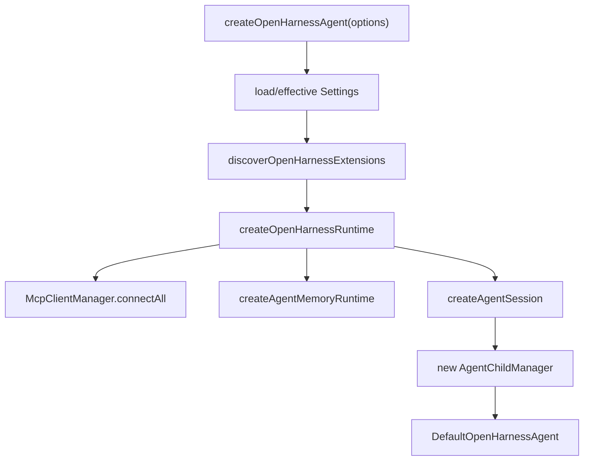
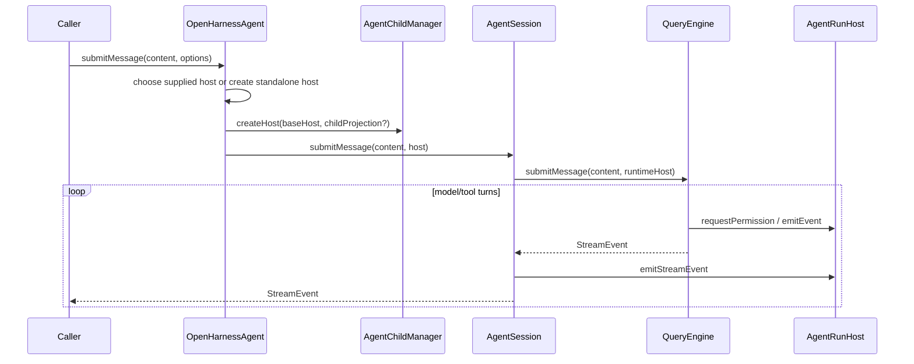
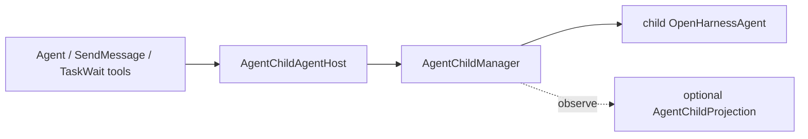

# Agent Runtime Framework Architecture

> 状态：当前代码事实。边界约束见 [agent-framework-capability-boundary.md](./agent-framework-capability-boundary.md)。daemon 运行流程见 [daemon-application-architecture.md](./daemon-application-architecture.md)。

## 核心对象

```text
QueryEngine      = model/tool agent loop
AgentSession     = 单 agent session facade 与 run host 注入点
OpenHarnessAgent = 带默认组装、维护 API 和 child lifecycle 的公开框架对象
AgentChildManager = framework-owned child instances 与 live handles
```

`createOpenHarnessAgent()` 返回一个长期存活的 `OpenHarnessAgent`。一次 `submitMessage()` 是一个对话回合；同一实例上的后续调用复用 history、usage、MCP、sandbox 和扩展资源。

## 创建流程

入口：[agent.ts](../packages/agent-runtime/src/agent.ts)



主要文件：

| 文件 | 职责 |
|---|---|
| `packages/agent-runtime/src/agent.ts` | public facade 与资源生命周期 |
| `packages/agent-runtime/src/default-runtime.ts` | provider、tools、hooks、prompt、permission、sandbox、QueryEngine 组装 |
| `packages/agent-runtime/src/extensions.ts` | skills/plugins/MCP/agent definitions 发现 |
| `packages/agent-runtime/src/memory-runtime.ts` | retrieval 与 remember |
| `packages/agent-runtime/src/child-agent.ts` | child live lifecycle |
| `packages/core/src/agent-session.ts` | run scope、host callbacks、QueryEngine 调用 |
| `packages/core/src/engine/query-engine.ts` | model/tool loop |

## 一轮 submitMessage



`runMessage()` 只是在 `submitMessage()` 上聚合 text delta、events 和最终 history，不存在另一套执行链。

## Tool 与权限

QueryEngine 执行工具时使用 runtime host：

```text
QueryEngine tool loop
  -> permission checker
  -> AgentRunHost.requestPermission(request)
  -> approved: tool.execute()
  -> denied/expired/abort: stop tool execution
  -> tool result returns to QueryEngine
```

standalone 默认没有 permission callback 时拒绝；daemon 提供 `DaemonRuntimeHostPort`，把 request 转给 `StorePermissionBroker`。

## Child agent

Agent tool 看到的是 `AgentChildAgentHost`，它由 `AgentChildManager.createHost()` 生成，不由 daemon 生成。



有 daemon 时，projection 负责 durable child session/task/run 与 child-scoped `AgentRunHost`；没有 daemon 时，manager 创建内存 session/run scope，child 仍可执行。

同一 child 的 run 严格串行；`finishRun()` 完成前 invocation 不进入 idle。interrupt 等待当前 run settlement。completed child 默认在 5 分钟 idle TTL 后 suspend MCP/sandbox/runtime，同时保留 history 与 live handle；后续输入使用同一 session ID 恢复。

## 维护 API

| API | framework 行为 |
|---|---|
| `compact()` | 压缩并替换 live history |
| `remember()` | 从 live history 提取并写 memory store |
| `getUsage()` | 返回累计 token usage |
| `inspect()` | 返回 model/tools/hooks/MCP/sandbox 快照 |
| `loadHistory()` | 导入 domain messages |
| `clear()` | 清空 history 与 QueryEngine 状态 |
| `close()` | 关闭 children、MCP、sandbox 和 runtime resources |

daemon maintenance service 调这些公开 API，然后只持久化 daemon 自己的结果。

## 两种使用形态

### Programmatic

```ts
const agent = await createOpenHarnessAgent({
  cwd,
  requestPermission: askUser,
});

for await (const event of agent.submitMessage("hi")) {
  render(event);
}

await agent.close();
```

### Daemon-hosted

```text
SessionRunExecutor
  -> AgentPool.acquire(sessionId)
  -> agent.submitMessage(content, { host, childProjection, pullFollowUps })
  -> daemon projections persist events and transcript
```

daemon 缓存真实 agent，不存在 runtime adapter：

```text
Map<sessionId, Promise<OpenHarnessAgent>>
```

## Public API 原则

- 公开 domain operation，不公开内部 bundle。
- construction-time 扩展使用 `OpenHarnessAgentExtension`。
- host callback 只表达 framework domain request/event。
- durable record 类型不能进入 agent-runtime。
- 新增 daemon hosting 需求时优先增加 projection，而不是恢复 `SessionRuntime`。
