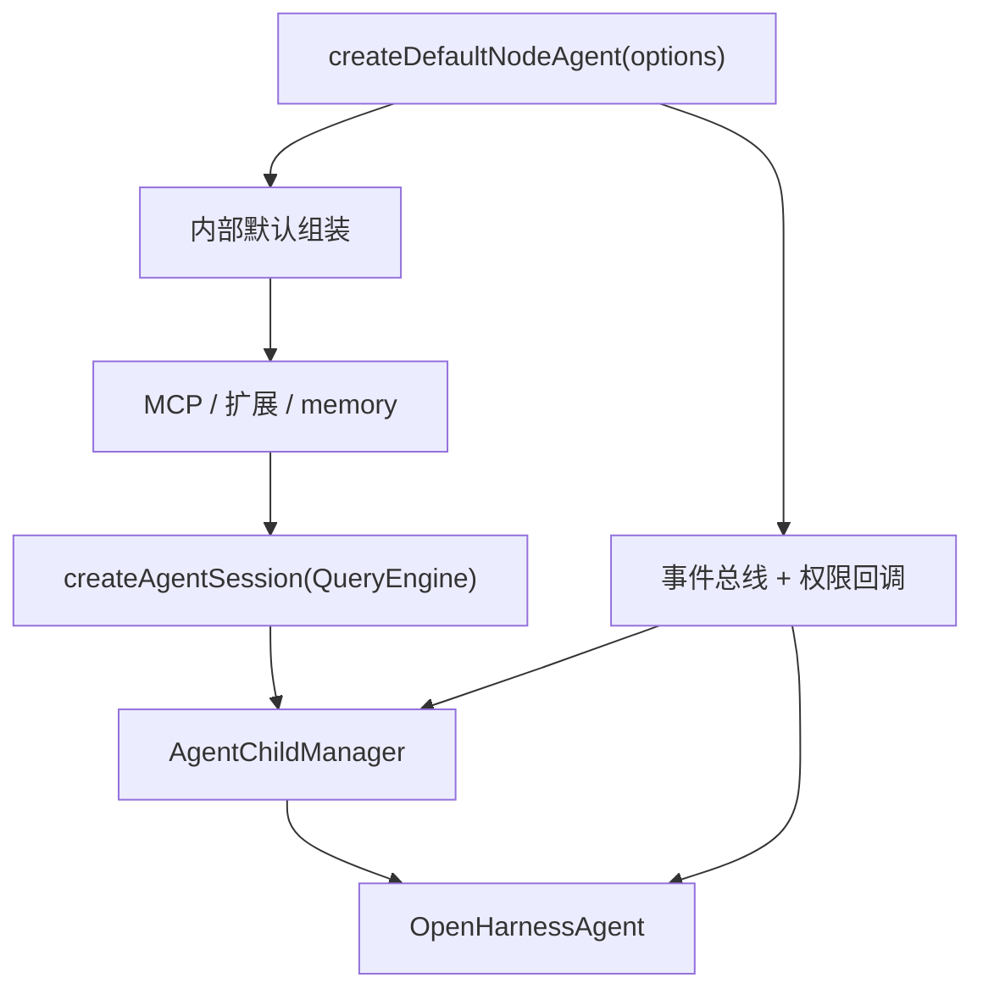
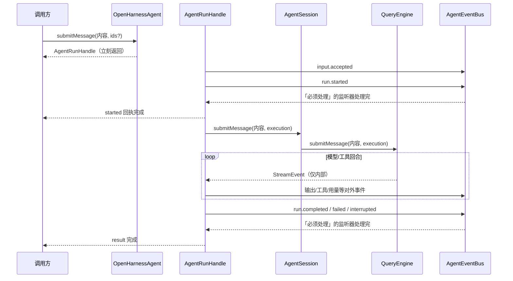

# Agent Runtime 框架架构

> 状态：描述当前实现，并作为内部代码索引。
>
> 用代码直接调用 agent 时，见 [OpenHarness Agent SDK](./agent-sdk.md)。
>
> 一次运行怎样算成功/失败，见 [Agent Lifecycle Contract](./agent-lifecycle-contract.md)。
>
> 框架和 daemon 各管什么，见 [Agent Framework Capability Boundary](./agent-framework-capability-boundary.md)。
> daemon 如何托管 agent，见 [Daemon Application Architecture](./daemon-application-architecture.md)。

## 一句话模型

把整套东西想成：

```text
OpenHarnessAgent = 对话引擎 + 历史记录 + 资源 + 当前这一轮运行 + 子 agent 目录
AgentEvent       = 「已经发生了什么」的事实记录
onEvent          = 框架要求上层「必须可靠地处理」这些事实
subscribe        = 旁观记录/渲染，不参与执行结果
requestPermission = 执行卡住，等外部点同意或拒绝
Run/ChildHandle  = 调用方用来控制「还在跑的那一轮」的把手
```

框架本身不依赖 HTTP、daemon、SQLite 会话表或 UI。最小用法：

```ts
import { createDefaultNodeAgent } from "@openharness/agent-runtime";

const agent = await createDefaultNodeAgent({ cwd: process.cwd() });
const unsubscribe = agent.subscribe((event) => console.log(event.type));
const run = agent.submitMessage("hi");
const result = await run.result;
unsubscribe();
await agent.close();
```

## 核心对象

| 对象 | 文件 | 职责（白话） |
|---|---|---|
| `OpenHarnessAgent` | `packages/agent-runtime/src/agent.ts` | 对外主入口；管资源，以及当前这一轮运行归谁 |
| `FrameworkAgentRun` | `packages/agent-runtime/src/agent.ts` | 一轮执行：把内部事件整理成对外事件，支持中途插话、打断、等结束 |
| `AgentEventBus` | `packages/agent-runtime/src/event-source.ts` | 按顺序把事件交给「必须处理」的监听器；旁观者不互相拖累 |
| `AgentChildManager` | `packages/agent-runtime/src/child-agent.ts` | 管当前 agent **直接创建** 的子 agent：创建、运行、关闭 |
| `AgentChildRegistry` | `packages/agent-runtime/src/child-agent.ts` | 整棵子树共用的「按 ID 查 handle」目录 |
| child environment | `packages/agent-runtime/src/child-environment.ts` | 给子 agent 申请/释放工作目录（worktree） |
| `AgentSession` | `packages/core/src/agent-session.ts` | 对 QueryEngine 的薄包装 |
| `QueryEngine` | `packages/core/src/engine/query-engine.ts` | 真正跑「模型 ↔ 工具」循环，并维护历史 |
| execution contracts | `packages/core/src/types/runtime.ts` | 事件、回调、handle、内部执行上下文的类型约定 |

## 创建流程



需要 OpenHarness 默认 Node 能力的应用调用 `createDefaultNodeAgent()`。它在内部组装：模型提供方、QueryEngine、工具、hooks、权限策略、prompt、skills、插件、MCP、memory、沙箱、事件/回调边界，以及子 agent 生命周期。只需要执行内核的宿主改用 `createAgentKernel()`，并显式提供 runtime 和宿主能力。
`createOpenHarnessRuntime()` 已不再从包的公开入口导出。

## 一轮 submitMessage



关键约定：

- `submitMessage()` **同步**返回一个还活着的 handle；真正执行在之后的 microtask 里启动。
- 同一个 agent **同时只能有一轮**根级运行。
- 模型流式事件（`StreamEvent`）只在框架内部流转；外面只看 `AgentEvent`。
- 结束类事件被「必须处理」的监听器消费完之后，`run.result` 才会完成。
- `run.started` 同理：必须处理的监听器消费完后，`run.started` 回执才完成。这样子 agent / HTTP 调用方不会拿到「其实还没真正开跑」的 run。
- 监听器自己抛错，会让这一轮 run 失败；框架不会再通过**同一个已经失败的监听器**递归发结束事件。
- `runMessage()` 只是 `await submitMessage(...).result` 的快捷写法。

## 事件 / 回调 / Handle：怎么选？

| 你需要的是… | 用这个 |
|---|---|
| 上层必须可靠地处理「已经发生的事」（例如持久化、记账） | `onEvent` |
| 打日志、画界面等旁观，不影响执行结果 | `agent.subscribe()` |
| 执行必须等外部决定（同意/拒绝） | `requestPermission` |
| 主动控制还在跑的一轮（插话、打断） | `AgentRunHandle` / `AgentChildHandle` |

当前事件涵盖：输入受理、运行结束、文本增量、模型回合边界、工具、用量、领域事件、权限过程观察、子 agent 生命周期。
事件载荷可序列化，**不带** Promise、resolver、AbortSignal 或控制方法。

补充说明：

- `onEvent`：整条 agent 上只有一个；按顺序调用，且会 `await`。它失败 → 当前框架操作失败。
- `subscribe()`：可以挂多个旁观者；按事件顺序调用，但**不等待**它们的异步结果。某个旁观者抛错或拖慢，不会拖垮框架。
- 目前唯一需要「等返回值」的回调是 `requestPermission(request, scope)`。没配置时，框架默认拒绝。

`AgentRunHandle` 提供：

```text
started   // 这一轮何时真正开始
result    // 这一轮最终结果
steer(input)      // 中途插话（下一回合再吃进）
interrupt(reason?) // 打断
```

### 中途插话（steer）怎么排队

1. 调用 `steer()` 时，框架先同步检查，并把请求放进待处理队列；此时回执**还不算成功**。
2. QueryEngine 每到一个「还能继续跑模型」的回合边界，只取**一条** steer：先发 `input.accepted(delivery=steer)`，再把内容交给 QueryEngine，再单独把这条回执标成成功/失败。
3. 多条并发 steer 会按多个回合边界依次消费；后面那条投影失败，不会把已经交付成功的前面那条假装成失败。
4. 若模型/工具/事件投影先失败、run 被打断，或已经没有下一回合，队列里还没消费的回执一律以 `AgentRunNotAcceptingInputError` 拒绝。

最后一轮「不再调工具」的回合，以及达到最大回合数的边界，会先关掉插话通道，避免取走「再也触发不了下一模型回合」的输入。
框架只负责拒绝这些还没被消费的请求；要不要把「已持久化的输入」变成新一轮 run，是 daemon 的应用策略，不是框架的事。

## Tool 与权限

```text
QueryEngine
  -> 权限检查
  -> 发出 permission.requested 事件
  -> 调用 requestPermission（等外部决定）
  -> 发出 permission.resolved 事件
  -> 同意：执行工具
  -> 拒绝/超时：返回「被拒绝」的工具结果
```

工具通过 `ToolContext.agent` 拿到框架内部的执行上下文。
`Agent` / `Workflow` producer 用 `context.agent.children` 管子 agent；`JobSend` / `JobWait` / `JobCancel` 通过 `AgentJobHost` 路由到同一批 handle，领域遥测用 `context.agent.emit(domain.event)`。

## 子 Agent

`AgentChildManager` 完整拥有「直接创建的子 agent」的活体生命周期：

1. 生成规范的 `childId` 和 `sessionId`。
2. 在整棵树的目录里预检 `sessionId`；若活体已冲突，在申请工作目录之前就失败。
3. 通过 `AgentChildEnvironmentProvider` 申请 cwd / worktree。
4. 把 handle 登记到根树共享的 `AgentChildRegistry`，再发布 `child.created`。
5. 递归创建一个新的 `OpenHarnessAgent`，与父级共享：必须处理的事件出口、旁观者流、权限回调。
6. 启动子 run；子 run 使用普通的 input / run / output / tool 事件。
7. 活跃跟进：调用当前 run 的 `steer()`；排队跟进：串行启动下一轮。
8. 空闲超时（TTL）到期后：保存历史、关掉重资源、发布 suspended；之后再有输入，会恢复同一个子 agent。
9. `close` / 父级 abort：先进入 `closing` 并拒绝一切新输入 → 终止 run → 等任何进行中的 agent 创建结束 → 释放环境 → 只发布一次 `child.closed`。

子 run 返回的 `started` 回执里，`sessionId` / `inputId` / `runId` 必须与 manager 预先分配的完全一致。不一致时：框架打断该 run、关闭子 agent，并拒绝调用方——**不能**用本地 ID 覆盖框架回执。

若调用方自己提供 child 的 input ID：manager 在活体实例内缓存最近 256 个已完成请求，再加上全部未完成请求。
相同 ID + 相同内容 → 返回同一结果；相同 ID + 不同内容 → 拒绝。
这个窗口只保护框架活体 handle；daemon 的长期 HTTP 幂等由「持久化的 input/run 关系」负责，所以框架不会无限留历史。

子 agent 命令只接受规范的 `childId`。要用 `sessionId` 查找，走整棵树目录的 `getBySessionId()`。
`agent@team` **不是**命令别名，因此同类型 worker 并行时，不会静默互相覆盖，也不会在关闭后丢别名。

每个 `AgentChildManager` 只关闭自己直接拥有的子 agent；根与所有递归子 agent 共享同一个 `AgentChildRegistry`。
因此 `rootAgent.children.get(id)` / `getBySessionId(...)` 可以查到任意深度的后代，但真正释放资源仍由**创建它的那个 manager** 负责。
daemon 不会向框架回传 taskId、host、controls 或「投影用的不透明状态」。

## Agent 操作状态机

`OpenHarnessAgent.state` 是公开只读状态：

```text
idle --submitMessage--> running --run.result 完成--> idle
idle --compact/remember--> maintaining --完成--> idle
idle / running / maintaining --close--> closing --> closed
```

互斥由**同一套状态机**执行，而不是每个 API 各自 if 一下：

- `submitMessage` 同步抢占 `running`，所以同一个 tick 里连发两次也不会同时开跑。
- `loadHistory`、`clear`、`setModel`、`compact`、`remember` 只能从 `idle` 进入；冲突抛 `AgentOperationConflictError`。
- `compact` / `remember` 在整个异步过程中保持 `maintaining`，不能和 run、历史/模型修改穿插。
- `close()` 可重复调用：进入 `closing` 后拒绝新操作；先打断进行中的 run，等维护操作结束，再关子 agent、排空必须处理的事件、释放运行时。各清理阶段都会跑完，最后再统一上报失败。

这层状态机是框架独立运行时的完整约束，不依赖 daemon。
daemon 在多客户端场景下还会额外加 session / cwd / 全局层面的准入策略。

## 维护 API

| API | 行为 |
|---|---|
| `getHistory` / `loadHistory` / `clear` | 管理当前内存里的对话历史 |
| `setModel` | 更新当前模型与 QueryEngine |
| `compact` | 压缩当前历史 |
| `remember` | 从历史里提炼 memory |
| `getUsage` | 累计 token 用量 |
| `inspect` | 模型 / 工具 / hooks / MCP / 沙箱快照 |
| `close` | 打断 run、关闭子 agent、排空事件、释放运行时 |

## 不变量（必须一直成立）

- `agent-runtime` 不 import server / daemon。
- 执行状态和活着的 handle 由框架拥有。
- 单个 agent 上：run、维护操作、历史/模型修改、close，服从同一套操作状态机。
- 应用只通过 `onEvent`、`subscribe`、`requestPermission` 和各类 handle 接入。
- 子 agent 递归继承同一套：模型客户端、必须处理的事件出口、旁观者流、权限回调。
- 子 agent 递归共享同一棵「按 ID 查 handle」的目录，但**不共享** manager 的所有权（谁创建谁关闭）。
- `AgentSession` 不再生成 ID、保存回调，或组装宿主环境。
- 不存在对外的 daemon adapter、run host、或 child projection 公开 API。
