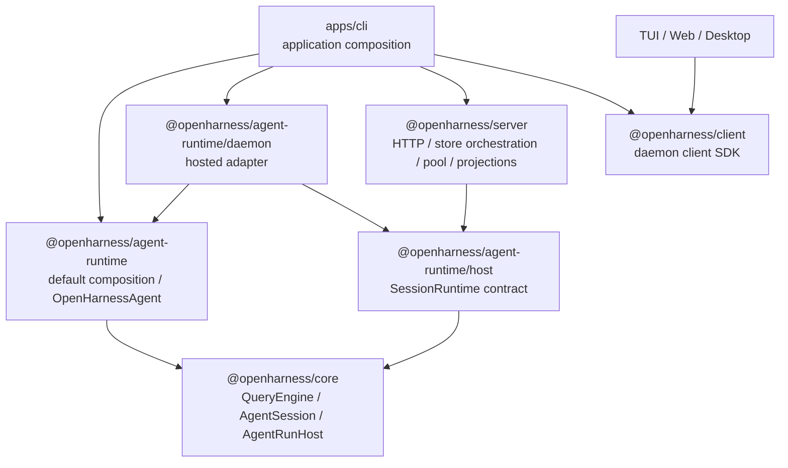

# Agent Runtime Framework Architecture

> 当前状态：Phase 19 已落地。本文描述当前代码事实，是 Agent Runtime 组装、programmatic API 与 daemon 托管边界的权威入口。
>
> 关联文档：[`daemon-application-architecture.md`](./daemon-application-architecture.md)、[`daemon-runtime-flow-map.md`](./daemon-runtime-flow-map.md)、[`runtime-host-port-design.md`](./runtime-host-port-design.md)。

## 0. 核心模型

OpenHarness 当前分为三层：

```text
agent-runtime framework
  -> daemon hosting layer (server/client)
  -> application surfaces (TUI / Web / Desktop / CLI / scripts)
```

这里的箭头表达能力叠加，不代表 agent-runtime 依赖 daemon。真实 package 依赖方向见第 4 节。

```text
QueryEngine       = 对话与工具循环
AgentSession      = 单 session facade 与 run host 注入点
OpenHarnessAgent  = 带默认组装的 programmatic Agent Runtime
AgentSessionRuntime = daemon SessionRuntime adapter
daemon            = HTTP、多客户端、持久化与并发托管形态
```

daemon 不再是 agent 的出生地。它获取一个 `SessionRuntimeFactory`，按 session 托管已经定义良好的 Agent Runtime。

## 1. 两种运行形态

### 1.1 单进程 programmatic

入口：`packages/agent-runtime/src/agent.ts`

```ts
import { createOpenHarnessAgent } from "@openharness/agent-runtime";

const agent = await createOpenHarnessAgent({
  cwd,
  settings,
  requestPermission: async (request) => {
    return ui.askPermission(request);
  },
});

const result = await agent.runMessage("hi");
await agent.close();
```

流式调用：

```ts
for await (const event of agent.submitMessage("hi")) {
  render(event);
}
```

调用链：

```text
createOpenHarnessAgent()
  -> createOpenHarnessRuntime()
     -> API client
     -> default tools
     -> PermissionChecker
     -> HookExecutor
     -> system prompt
     -> QueryEngine
     -> sandbox runtime
  -> configureRuntime extension
  -> McpClientManager
  -> AgentSession

agent.submitMessage()
  -> AgentSession.submitMessage()
  -> QueryEngine.submitMessage()
  -> provider stream / tools / permission / follow-up
```

`OpenHarnessAgent` 直接提供：

| API | 作用 |
|---|---|
| `submitMessage()` | 流式运行一轮或多轮 tool loop |
| `runMessage()` | 收集文本、事件和最终 history |
| `loadHistory()` / `getHistory()` | 恢复与读取会话历史 |
| `compact()` | 压缩 QueryEngine history |
| `getUsage()` | 获取当前 runtime 累计 token usage |
| `getMcpConnections()` | 检查 session 级 MCP 连接 |
| `close()` | 释放 MCP、sandbox 等 runtime 资源 |

### 1.2 daemon 托管

入口：`packages/agent-runtime/src/daemon.ts`

```ts
const runtimeFactory = createOpenHarnessAgentRuntimeFactory({
  settings,
  getSettings,
  prepareSession: async ({ session, settings }) => ({
    skillRegistry: await loadApplicationSkills(session.cwd, settings),
    configureRuntime: registerApplicationExtensions,
  }),
});

const server = new OpenHarnessHttpServer({ runtimeFactory });
```

实际 CLI 组装入口：`apps/cli/src/commands/daemon.ts`。

```text
CLI daemon command
  -> createOpenHarnessAgentRuntimeFactory()
  -> prepareSession() loads CLI skills/plugins
  -> OpenHarnessHttpServer({ runtimeFactory })

daemon receives prompt
  -> SessionRunEngine
  -> SessionRuntimePool.acquire()
  -> factory.createRuntime()
  -> createOpenHarnessAgent()
  -> AgentSessionRuntime.runPrompt(input, host)
  -> OpenHarnessAgent.submitMessage(..., { host })
```

`prepareSession` 是应用扩展边界。CLI 可以贡献 skills、plugin tools、plugin hooks 和 plugin MCP 配置，但不再构造 `QueryEngine`。

## 2. Package 边界

### `@openharness/agent-runtime`

文件：

```text
packages/agent-runtime/src/default-runtime.ts
packages/agent-runtime/src/agent.ts
packages/agent-runtime/src/host-runtime.ts
packages/agent-runtime/src/daemon.ts
```

职责：

| 模块 | 归属 |
|---|---|
| `default-runtime.ts` | provider、tools、permission、hooks、prompt、QueryEngine、sandbox 的默认组装 |
| `agent.ts` | `OpenHarnessAgent` programmatic facade、MCP 与资源生命周期 |
| `host-runtime.ts` | daemon 可消费的 `SessionRuntime` / `SessionRuntimeFactory` contract |
| `daemon.ts` | transcript codec、`AgentSessionRuntime`、默认 hosted factory、compact/usage/remember/inspect |

明确不属于该 package：

| 能力 | 所有者 |
|---|---|
| HTTP routes / Hono / SSE | `@openharness/server` |
| `SessionStore` durable state | `@openharness/services` + server application services |
| run lane / runtime pool | `@openharness/server` |
| durable permission/transcript projection | `@openharness/server` |
| CLI flags、daemon registry、进程启动 | `apps/cli` |
| TUI/Web/Desktop rendering | 对应 surface |

### `@openharness/server`

server 只通过 `@openharness/agent-runtime/host` 认识 runtime contract。它不知道 provider、MCP、skills 或 `QueryEngine` 的创建方式。

### `apps/cli`

CLI 当前只承担：

- settings 与命令参数入口。
- daemon 生命周期和 registry。
- skills/plugins 的应用扩展发现。
- 把 runtime factory、application services 注入 server。
- channels 等独立应用形态的启动。

旧文件已退出：

```text
apps/cli/src/runtime.ts
apps/cli/src/session-runtime.ts
```

## 3. Host 与状态归属

一轮 daemon run 的双向交互仍通过 `AgentRunHost`，但 host 的创建和 durable projection 属于 daemon：

```text
SessionRunExecutor
  -> DaemonRunProjection
  -> AgentRunHost
     -> requestPermission()
     -> emitEvent()
     -> emitStreamEvent()
     -> optional childAgentHost
  -> AgentSessionRuntime.runPrompt(..., host)
  -> OpenHarnessAgent.submitMessage(..., { host })
```

状态归属：

| 状态 | 所有者 |
|---|---|
| core message history | warm `OpenHarnessAgent` / `QueryEngine` |
| session/run/input/message/part | daemon `SessionStore` |
| permission pending/decision | daemon projection + store |
| runtime instance | daemon `SessionRuntimePool` |
| MCP connections | one `OpenHarnessAgent` instance |
| child session/task durable state | daemon child host + store |

framework 暴露事件与决策接口，daemon 负责把它们变成可 attach/replay 的持久状态；句柄不会写入 store。

## 4. 真实依赖方向



server 依赖 contract，不依赖 `OpenHarnessAgent` 的具体 factory；因此测试或其他应用仍可注入别的 `SessionRuntimeFactory`。

## 5. Permission 与 child agent 定位

programmatic 模式下，permission 可以在创建 agent 时提供回调：

```ts
createOpenHarnessAgent({
  settings,
  requestPermission: async (request) => approveOrDeny(request),
  childAgentHost,
});
```

也可以在单次 `submitMessage()` 时传入完整 `host`。没有 permission handler 时默认拒绝，不会隐式放行。

child agent 是 run host 的可选 capability。programmatic agent 可以在创建时注入 session 级 `childAgentHost`，也可以在单次调用时覆盖完整 host；不提供时仍可正常运行。daemon 在需要 child session/task projection 时按 run 注入。

## 6. Phase 19 完成状态

| Phase | 状态 | 代码结果 |
|---|---|---|
| 19A package boundary | 完成 | 新增 `packages/agent-runtime` |
| 19B hosted runtime | 完成 | `AgentSessionRuntime`、transcript codec 迁出 CLI |
| 19C default factory | 完成 | `createOpenHarnessAgentRuntimeFactory()` 与 `prepareSession` 扩展点 |
| 19D standalone API | 完成 | `createOpenHarnessAgent()`、`submitMessage()`、`runMessage()` |
| 19E docs/examples | 完成 | 本文与 daemon/TUI 运行文档指向真实路径 |

## 7. 查代码路径

查“agent 怎么创建”：

```text
packages/agent-runtime/src/default-runtime.ts
packages/agent-runtime/src/agent.ts
```

查“一轮对话怎么跑”：

```text
packages/core/src/agent-session.ts
packages/core/src/engine/query-engine.ts
```

查“daemon 怎么把 prompt 交给 agent”：

```text
apps/cli/src/commands/daemon.ts
packages/agent-runtime/src/daemon.ts
packages/server/src/http/session-run-engine.ts
packages/server/src/http/session-run-executor.ts
```

查“事件、permission、transcript 如何持久化”：

```text
packages/server/src/http/session-run-projection.ts
packages/server/src/http/transcript-projection.ts
```

最终心智模型：

```text
QueryEngine is the loop.
AgentSession is the session facade.
OpenHarnessAgent is the opinionated framework API.
AgentSessionRuntime is the daemon adapter.
Daemon is a hosting mode.
TUI/Web/Desktop/CLI are application surfaces.
```
