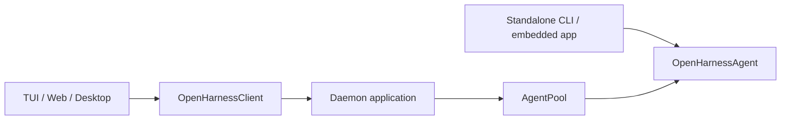

# OpenHarness Agent SDK

> 状态：programmatic agent 的权威使用文档。内部执行结构见 [Agent Runtime Framework Architecture](./agent-runtime-framework-architecture.md)，生命周期终态与失败语义见 [Agent Lifecycle Contract](./agent-lifecycle-contract.md)，daemon 边界见 [Agent Framework Capability Boundary](./agent-framework-capability-boundary.md)。

## 定位

`@openharness/agent-runtime` 是 OpenHarness 自己的 opinionated Agent SDK。它提供完整默认组装，但不试图成为通用 agent framework。

```text
createOpenHarnessAgent(options)
  -> OpenHarnessAgent
     -> submitMessage / runMessage
     -> subscribe
     -> history / model / compact / remember / usage / inspect
     -> children
     -> close
```

`QueryEngine`、`RuntimeBuilder`、provider/tool/hook/MCP/sandbox 的组装是内部实现，不是应用入口。

## 最小运行

```ts
import { createOpenHarnessAgent } from "@openharness/agent-runtime";

const agent = await createOpenHarnessAgent({ cwd: process.cwd() });

const unsubscribe = agent.subscribe((event) => {
  if (event.type === "output.text.delta") process.stdout.write(event.data.delta);
});

const run = agent.submitMessage("What files are in this directory?");
const result = await run.result;

unsubscribe();
await agent.close();
```

`createOpenHarnessAgent()` 自动加载 settings、provider、credentials、默认 tools、prompt、skills、plugins、MCP、memory 与 sandbox。调用方只覆盖需要改变的部分。

## 创建参数

常用参数全部位于顶层，不存在 runtime factory 或 `overrides` 包装层：

```ts
const agent = await createOpenHarnessAgent({
  cwd,
  model: "gpt-5.4",
  provider: "codex",
  maxTurns: 20,
  allowedTools: ["Read", "Glob", "Grep"],
  requestPermission: async (request, context) => {
    return { status: "denied", reason: `Not allowed: ${request.toolName}` };
  },
  onEvent: async (event) => {
    await durableEventSink.apply(event);
  },
});
```

| 参数 | 语义 |
|---|---|
| `settings` | 可选显式 settings；缺省时使用标准 settings loader |
| `cwd` / `sessionId` | 工作目录与 live session identity |
| `model` / `provider` / `apiKey` / `baseUrl` | provider 选择覆盖 |
| `client` | programmatic embedding、自定义 provider 或测试用消息客户端 |
| `systemPrompt` / `maxTurns` / `effort` / `fastMode` | 执行行为覆盖 |
| `allowedTools` / `roleAllowedTools` / `disallowedTools` | 工具范围，见下一节 |
| `requestPermission` | framework 必须等待结果的权限 effect；缺省为拒绝 |
| `onEvent` | 有序、可靠、可等待的 host sink；失败会终止当前 operation |
| `extensions` / `mcpServers` | OpenHarness extension 与 MCP 增量配置 |
| `childEnvironment` | child agent cwd/worktree 环境策略 |

## 工具限制

工具限制分三层理解：

| 字段 | 大白话含义 |
|---|---|
| `allowedTools` | 宿主给这个 Agent 家族的最大能力。子 Agent 也不能超过它。这个名字保留给 SDK 调用方使用。 |
| `hostToolCeiling` | `allowedTools` 的明确名字，含义相同：宿主能力上限。内部传给子 Agent 时会用这个名字，避免误会成角色工具集。 |
| `roleAllowedTools` | 当前 Agent 角色自己想看的工具。例如 Coordinator Leader 只需要 `Agent` / `Workflow` / `Job*`，但这不代表 Worker 也只能用这些。 |
| `disallowedTools` | 永远优先禁止。父 Agent 和子 Agent 的禁止列表会合并。 |

后台生命周期旧名已经硬切，不提供兼容别名。`allowedTools`、`roleAllowedTools`、`disallowedTools` 和 auto-approve 配置若仍包含已删除的 `TaskGet/List/Output/Stop/Wait/Update`、`SendMessage` 或 `TerminalRead/List/Send/Signal/Close`，runtime 会在启动时直接报错并给出对应 `Job*`；其他尚未注册的名字仍被保留，供插件动态注册工具使用。

最终能看到的工具是：

```text
可用工具 = 宿主能力上限 ∩ 当前角色工具集 - 禁止工具
```

`["*"]` 表示“这一层不额外收窄”，不是“绕过宿主上限”。例如：

```ts
await createOpenHarnessAgent({
  allowedTools: ["Read", "Agent", "JobWait"],
});
```

这个 Agent 可以派出 Worker，但 Worker 仍然只能在 `Read` / `Agent` / `JobWait` 这个上限内活动，不能因为内置 worker 写了 `tools: ["*"]` 就拿到 `Bash` / `Edit` / `Write`。

## Event 与 Effect

SDK 有两种事件消费语义，不能混用：

```text
onEvent(event)       reliable host sink
                     ordered + awaited
                     rejection fails the operation

agent.subscribe(fn) observation
                     ordered invocation + non-blocking
                     listener failure is isolated
```

daemon 使用 `onEvent` 保证 run started、transcript 与 terminal state 已可靠投影后，framework handle 才结算。日志、终端渲染和 SDK 使用者使用 `subscribe()`；observer 按事件顺序被调用，但 framework 不等待其异步工作完成，异常或慢 observer 都不能改变、阻塞 agent 执行。

权限不是 event listener 返回值，而是显式 effect：

```text
permission.requested event
  -> requestPermission(request, context)
  -> permission.resolved event
  -> approved: execute tool
  -> denied/expired: denied tool result
```

## Run Handle

`submitMessage()` 同步预占 agent 并返回 live handle：

```ts
const run = agent.submitMessage("Implement the change");

await run.started;
await run.steer({ content: "Also update the tests" });
await run.interrupt("Caller cancelled");
const result = await run.result;
```

同一 agent 同时只允许一个 root run。需要直接等待结果时使用：

```ts
const result = await agent.runMessage("hi");
```

## Child Agent

child agent 的 live lifecycle 由 framework 管理。child 继承 root 的 provider/client、权限策略、event sink 与 observation stream，并可覆盖 model、tools、permission mode 和 max turns。

```ts
const child = agent.children.get(childId);
await child?.send({ content: "Continue" });
await child?.interrupt("No longer needed");
```

durable child session/task/run 不进入 SDK；它们由 daemon 根据 `child.*` 与 child run events 建立。

默认工具在纯 SDK 形态下同样闭环，不依赖 daemon 先建立 task projection：

```text
Agent -> context.agent.children.spawnChildAgent() -> jobId
JobWait(jobId) -> AgentJobHost.wait()
JobCancel(jobId) -> AgentJobHost.cancel()
Workflow -> spawn framework child -> await/stop the same child backend
```

`TaskCreate` 只创建由 `TaskManager` 执行的后台 shell Job；child Agent 由 `Agent` 创建，并通过 framework child handle 运行。daemon 可以把 `child.*` 事件投影为 durable task，供 UI、恢复和审计使用，但该投影不再是 framework child 完成一轮执行的前置条件。

## 两种应用形态



### Direct

应用直接创建、持有并关闭 agent。history 是 live state；应用可用 `getHistory()` / `loadHistory()` 实现自己的文件保存或恢复。

### Daemon

daemon application 每个 durable session 缓存一个 agent：

1. 从 `SessionStore` 读取 durable transcript。
2. `createDaemonAgentLoader()` 合并 settings/session metadata 并调用 `createOpenHarnessAgent()`。
3. loader 通过 `loadHistory()` 恢复 live history并绑定 callbacks。
4. 通过 `onEvent` 写 durable session/run/task/transcript。
5. 通过 `requestPermission` 连接 durable permission broker。
6. `AgentPool` 只负责实例去重、缓存、代际关闭与 active-work 查询。
7. archive、configuration change 或 shutdown 时 `close()`。

daemon 不实例化 QueryEngine，不接收 runtime factory，也不复制 child controls。

## 源码索引

| 要找的逻辑 | 文件 |
|---|---|
| SDK facade 与 run handle | `packages/agent-runtime/src/agent.ts` |
| 默认 composition root | `packages/agent-runtime/src/default-runtime.ts` |
| ordered sink 与 observers | `packages/agent-runtime/src/event-source.ts` |
| child lifecycle | `packages/agent-runtime/src/child-agent.ts` |
| Agent producer | `packages/tools/src/agent/agent-tools.ts` |
| Job lifecycle routing | `packages/tools/src/job`、`packages/server/src/jobs` |
| Workflow child spawn/wait | `packages/tools/src/agent/workflow-runner.ts` |
| child worktree | `packages/agent-runtime/src/child-environment.ts` |
| daemon application composition | `packages/server/src/daemon-application.ts` |
| durable session -> live Agent | `packages/server/src/daemon-agent.ts` |
| daemon agent cache | `packages/server/src/http/agent-pool.ts` |
| durable event projection | `packages/server/src/http/daemon-agent-event-projector.ts` |
| standalone SDK contract test | `packages/agent-runtime/src/sdk.test.ts` |

## 非目标

- 不提供通用 workflow graph runtime。
- 不把 durable store 或 HTTP transport 抽象进 framework。
- 不暴露 QueryEngine/RuntimeBuilder 作为第二套应用入口。
- 不提供 session replacement runtime；切换 durable session 是应用行为。
- 不为旧 runtime factory、host callback 或 projection adapter 保留兼容层。
