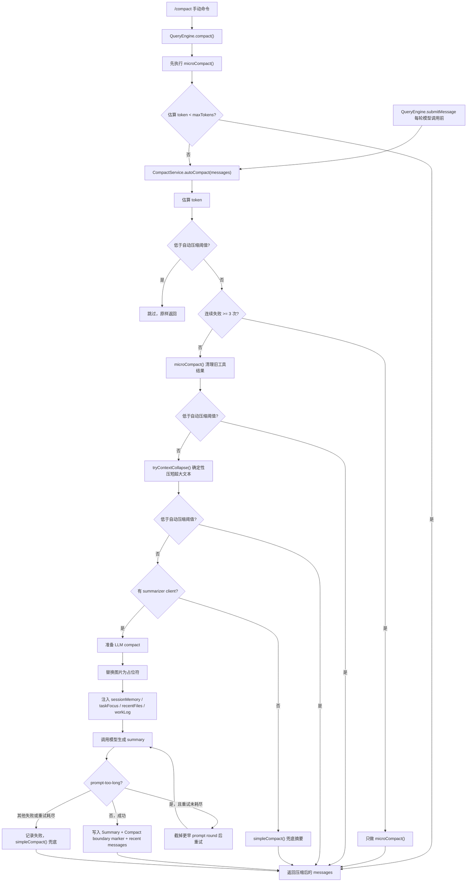

# CompactService 设计说明

> 状态：当前 Runtime 上下文压缩说明；主实现以 `packages/core/src/engine/compact-service.ts` 为准。

`CompactService` 是 OpenHarness 的上下文压缩服务。唯一实现位于
`packages/core/src/engine/compact-service.ts`，由 `QueryEngine` 在每轮模型调用前自动触发，也可通过
`/compact` 手动触发。

---

## 解决什么问题

长会话会同时遇到三类问题：

1. 工具结果太长，旧输出继续占上下文。
2. 对话历史接近模型上下文窗口，需要把旧消息折叠成摘要。
3. 压缩后模型容易丢失“当前任务、下一步、最近文件”等连续性信息。

`CompactService` 的目标是用分层策略降低 token 占用，同时保留继续工作的关键信息。

---

## 入口与触发

### 自动触发

`QueryEngine.submitMessage()` 每轮调用模型前都会执行：

```ts
this.messages = await this.compactService.autoCompact(this.messages);
```

触发阈值按保守 token 估算计算：

```text
threshold = maxTokens - MAX_OUTPUT_TOKENS_FOR_SUMMARY - AUTOCOMPACT_BUFFER_TOKENS
          = maxTokens - 20_000 - 13_000
```

默认 `maxTokens` 为 `100_000`，`keepRecent` 为 `10`。当估算 token 低于阈值时直接跳过。

### 手动触发

`/compact` 调用 `QueryEngine.compact()`：

1. 先执行 `microCompact()` 清理旧工具结果。
2. 如果清理后已经低于 `maxTokens`，直接返回。
3. 否则进入 `autoCompact()` 的完整压缩流程。

---

## 压缩流水线

完整 `autoCompact()` 流程如下：



```text
messages
  │
  ├─ 1. token 估算，未达阈值则跳过
  │
  ├─ 2. 连续失败 >= 3 次：只做 microCompact
  │
  ├─ 3. microCompact：清理旧的 compactable tool_result
  │
  ├─ 4. context collapse：确定性压短超大文本块
  │
  ├─ 5. LLM compact：摘要 older messages，保留 recent messages
  │
  └─ 6. 失败兜底：simpleCompact
```

### 1. microCompact

`microCompact()` 不调用模型，只把较旧的可压缩工具结果替换为：

```text
[Old tool result content cleared]
```

可清理的工具包括 `Bash`、`Read`、`Write`、`Edit`、`Glob`、`Grep`、`WebFetch`、`WebSearch`，以及所有
`mcp__` 前缀工具。最近 `keepRecent` 个可压缩结果会保留。

### 2. context collapse

当旧消息中存在超大文本块时，`tryContextCollapse()` 会用确定性方式保留头尾：

```text
<head 900 chars>
...[collapsed N chars]...
<tail 500 chars>
```

它不改变最近消息，并且只有在估算 token 确实下降时才返回折叠后的消息。

### 3. LLM compact

如果仍超过阈值且存在 summarizer client，服务会调用同一个模型客户端生成摘要。

压缩时消息会被分成两段：

| 段 | 处理方式 |
|----|----------|
| system messages | 原样保留 |
| older non-system messages | 送入摘要 prompt |
| recent non-system messages | 原样保留，默认最近 10 条 |

摘要 prompt 要求模型输出：

- `<analysis>`：用于模型推理的压缩分析
- `<summary>`：真正保留到历史里的继续工作摘要

写回历史时，`formatSummary()` 会移除 `<analysis>`，把 `<summary>` 内容整理为 `Summary:` 段。

---

## 连续性附件

为避免“压缩后忘记当前任务”，`CompactService` 支持 `CompactAttachmentsProvider`。调用方可注入结构化上下文：

```ts
interface CompactAttachments {
  sessionMemory?: string;
  taskFocus?: string;
  recentFiles?: string[];
  plan?: string;
  workLog?: string;
}
```

`taskFocus`、`sessionMemory` 和 `plan` 由宿主通过附件 provider 显式提供；当前 daemon 没有伪造一份 TaskManager 状态。未接 provider 时这些字段为空。

服务自身还会自动派生：

- `recentFiles`：从 `Read` / `Write` / `Edit` / `MultiEdit` 工具调用里提取最近 20 个文件路径。
- `workLog`：按工具名统计调用次数，例如 `Read×4, Bash×2`。

这些内容会被拼进摘要 prompt 的 `<context>` 段，要求 summarizer 一并纳入最终摘要。

---

## 工具配对保护

压缩边界不能把 `tool_use` 和对应的 `tool_result` 分到两边，否则后续 API 调用可能因为消息序列非法而失败。

`splitPreservingToolPairs()` 会在切分 older/recent 时向前移动边界，确保同一组工具调用与结果落在同一侧。

---

## 图片处理

token 估算会把 image block 按固定成本计算，默认每张图片估算为 `3_072` tokens。

LLM 摘要请求不会发送原始图片 payload，而是替换为：

```text
[Image omitted from compaction summarization.]
```

这样可以避免摘要请求携带大图片或敏感图片内容。

---

## prompt-too-long 重试

如果 summarizer 返回上下文过长错误，`isPromptTooLongError()` 会识别常见错误文案，例如：

- `prompt too long`
- `context_length_exceeded`
- `maximum context`
- `exceeds the available context size`

随后 `truncateHeadForPtlRetry()` 按 prompt round 丢弃最旧约 20% 对话并重试，最多 `3` 次。若截断后第一条不是用户消息，会插入：

```text
[earlier conversation truncated for compaction retry]
```

边界 marker 也会记录本次 full compact 是否使用了 head-truncation retry。

---

## hooks、进度与 checkpoint

完整 LLM 压缩会触发 hook：

| hook | 时机 | 说明 |
|------|------|------|
| `pre_compact` | 摘要前 | 可阻止本次压缩 |
| `post_compact` | 摘要后 | 记录压缩前后消息数/token 等 |

进度事件包括：

- `context_collapse_start`
- `context_collapse_end`
- `compact_start`
- `compact_retry`
- `compact_end`
- `compact_failed`

`getCheckpoints()` 可读取最近压缩流程记录的 checkpoint 元数据。

---

## 失败策略

`CompactService` 的失败处理遵循“压缩失败不阻断对话”：

1. LLM compact 失败会递增 `consecutiveFailures`。
2. 连续失败达到 `3` 次后，后续只做 `microCompact()`。
3. 没有 client 或 LLM compact 失败时，兜底使用 `simpleCompact()`。

`simpleCompact()` 会保留 system messages 和 recent messages，中间插入占位摘要与 compact boundary marker。

---

## 测试覆盖

主要测试在：

- `packages/core/src/engine/index.test.ts`
- `packages/core/src/engine/compact-service-advanced.test.ts`
- `packages/core/src/engine/integration.test.ts`

覆盖点包括：

- microCompact 清理策略
- prompt-too-long 识别与截头重试
- tool_use / tool_result 配对保护
- 图片 token 估算与摘要占位
- context collapse
- compact boundary marker
- pre/post compact hooks
- progress callback 与 checkpoints
- `QueryEngine.compact()` 手动触发路径

---

## 相关文档

- [memory-system.md](./memory-system.md) — 记忆系统总览，说明 `session_memory` 如何在 compact 边界注回上下文
- [session-storage-design.md](./session-storage-design.md) — 会话快照存储，与 compact 的“摘要历史”不同
- [slash-commands.md](./slash-commands.md) — `/compact` 命令入口
