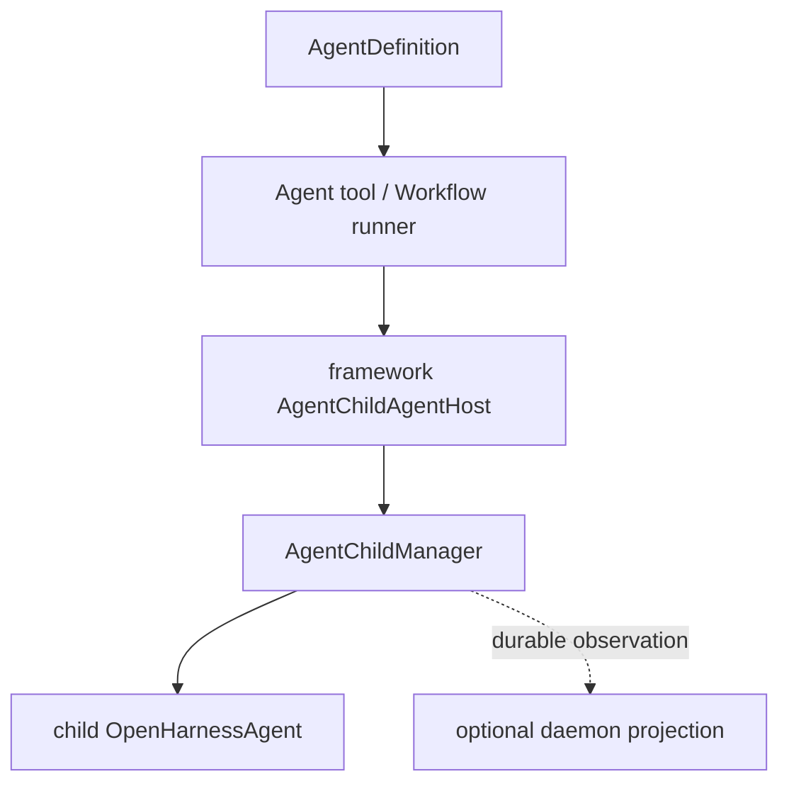

# Coordinator Agents Design

> 当前实现。child 执行边界见 [agent-child-session-flow.md](./agent-child-session-flow.md)。

## Agent definitions

定义来源按以下顺序合并，同名后者覆盖前者：

```text
builtin -> user -> plugin
```

agent markdown frontmatter 支持：

```yaml
name: worker
description: Implements scoped changes
model: gpt-5
tools:
  - Read
  - Write
disallowedTools:
  - Bash
maxTurns: 5
effort: high
permissionMode: plan
```

正文作为 child `systemPrompt`。

## Runtime flow



字段通过 spawn input 进入 framework：

| definition | child runtime override |
|---|---|
| `model` | model |
| markdown body | system prompt |
| `tools` | allowed tools |
| `disallowedTools` | disallowed tools |
| `maxTurns` | QueryEngine max turns |
| `effort` | provider reasoning effort |
| `permissionMode` | child permission policy |

daemon hosting 时，同一份字段同时写入 child session metadata，供 durable 查询和日后独立恢复；daemon 不负责创建 child QueryEngine。

## Code

```text
packages/coordinator/src/agent-loader.ts
packages/tools/src/agent/index.ts
packages/tools/src/agent/workflow/runner.ts
packages/agent-runtime/src/child-agent.ts
packages/server/src/application/agent/daemon-agent-event-projector.ts
```

Coordinator 模式只暴露调度工具；实际文件和 shell 操作由 child agent 执行。
