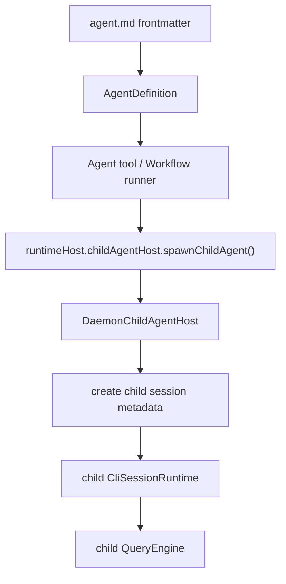

# Coordinator Agents Design

> 状态：当前事实版。agent 定义加载已落地；agent 级字段会通过 runtime-host child invocation 写入 child session metadata。

## 范围

本设计覆盖：

| 范围 | 状态 |
|---|---|
| 用户 agent 加载 | 已实现：`~/.openharness-ts/agents/*.md` |
| plugin agent 加载 | 已实现：plugin `agents` 路径 |
| builtin/user/plugin 合并 | 已实现：同名后者覆盖，优先级 builtin < user < plugin |
| coordinator prompt 恢复 | 已实现 |
| agent 字段运行时生效 | 已实现：经 Agent/Workflow -> runtimeHost -> child session metadata |
| agent hooks/mcpServers 运行时生效 | 后续 |

## AgentDefinition 字段

agent markdown frontmatter 支持的核心字段：

```yaml
name: worker
description: Implements scoped changes
model: gpt-5
tools:
  - Read
  - Write
disallowedTools:
  - Bash
maxTurns: 5
effort: high
permissionMode: plan
skills:
  - some-skill
```

正文作为 `systemPrompt`。

## 加载与合并

```text
builtin agents
  -> user agents
  -> plugin agents
  -> AgentDefinition registry
```

关键文件：

| 文件 | 责任 |
|---|---|
| `packages/coordinator/src/agents.ts` | agent definition 解析、合并、查询 |
| `packages/tools/src/agent/index.ts` | Agent tool 读取 agent definition |
| `packages/tools/src/agent/workflow-runner.ts` | Workflow task 读取 agent definition |

## 运行时生效链路



当前主路径：

```text
packages/tools/src/agent/index.ts
  agentDef
    -> spawnChildAgent({
         model,
         systemPrompt,
         allowedTools,
         disallowedTools,
         maxTurns,
         effort,
         permissionMode
       })

packages/server/src/http/daemon-child-agent-host.ts
  spawnChildAgent()
    -> childSessionHost.createChildSession({
         metadata: {
           systemPrompt,
           allowedTools,
           disallowedTools,
           maxTurns,
           effort,
           permissionMode
         }
       })
```

## 字段映射

| AgentDefinition 字段 | child session metadata | 应用点 |
|---|---|---|
| `model` | session model | child runtime provider model |
| markdown body | `systemPrompt` | child runtime system prompt |
| `tools` | `allowedTools` | child runtime tool allow list |
| `disallowedTools` | `disallowedTools` | child runtime tool deny list |
| `maxTurns` | `maxTurns` | child QueryEngine turn limit |
| `effort` | `effort` | provider reasoning effort |
| `permissionMode` | `permissionMode` | child permission policy |

`permissionMode` 优先级：

```text
Agent tool input.permissionMode
  -> AgentDefinition.permissionMode
  -> default
```

## Coordinator 工具隔离

coordinator 模式只暴露调度相关工具：

```text
Agent
SendMessage
TaskStop
Workflow
```

这样 coordinator 负责拆分/调度，不直接操作文件或 shell；真正执行由 child agent 完成。

## 仍留待后续

- `hooks` 运行时注入。
- `mcpServers` 运行时注入。
- `memory` / `isolation` 更细语义。
- agent 字段与 host/framework 分层的更稳定 schema。
