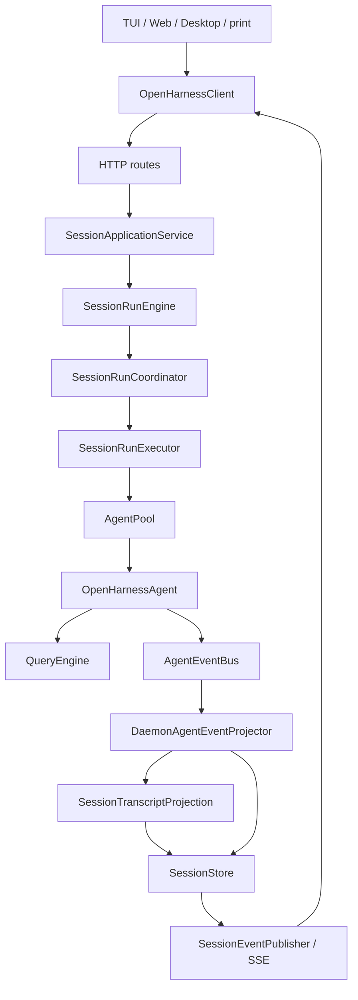
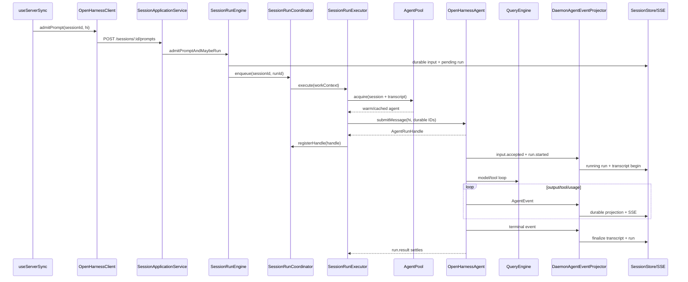
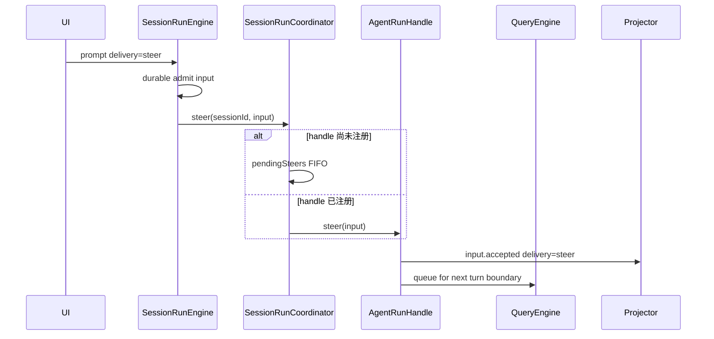
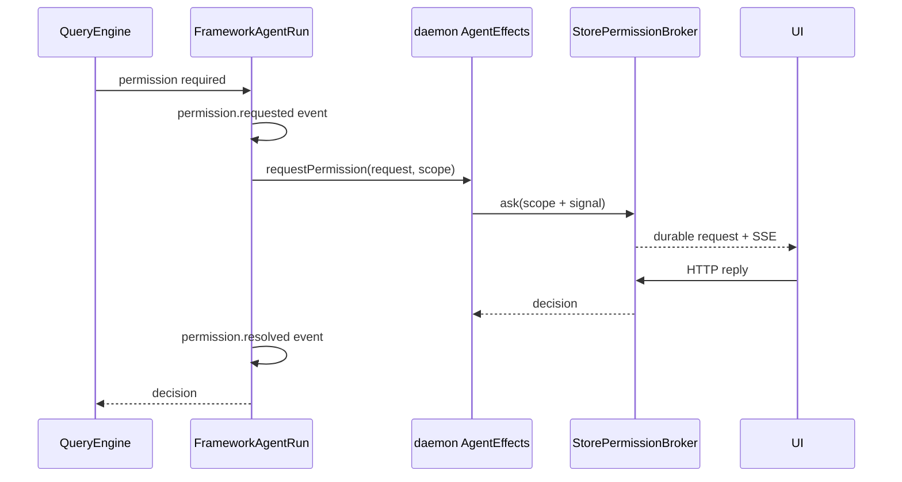

# Daemon Application Architecture

> 状态：当前实现的权威运行索引。查询 prompt、steer、interrupt、permission、child、compact/remember/usage 等流程时，从本文进入。

## 总体模型

```text
agent framework = execution + live state + events/effects/handles
daemon          = HTTP + durable state + multi-client policy + event projection
TUI/Web/Desktop = interaction surfaces
```

daemon 直接依赖 `@openharness/agent-runtime`，不经过 runtime adapter。framework 可以脱离 daemon 独立运行；daemon 是它的一种有 durable state 和多 UI 协调能力的应用形态。

## 核心请求链



准确表述是：

```text
Surface -> Client -> routes -> Application service
  -> SessionRunEngine (admission)
  -> SessionRunCoordinator (per-session lane)
  -> SessionRunExecutor (one admitted root run)
  -> AgentPool -> OpenHarnessAgent -> QueryEngine

OpenHarnessAgent.events
  -> DaemonAgentEventProjector.apply(event)
  -> transcript/session/run/task/event durable state
  -> SSE
```

`DaemonAgentEventProjector` 是单向 reducer，不是 framework 执行所需的 host 插座。

## 请求入口与四个服务

routes 在 `packages/server/src/http.ts` 的 `mountRoutes()` 组装。

| 服务 | 文件 | 负责 |
|---|---|---|
| `SessionApplicationService` | `http/session-application-service.ts` | create/update/archive、prompt、resume、interrupt、child route |
| `SessionQueryService` | `http/session-query-service.ts` | session/state/message/part 查询 |
| `SessionMaintenanceService` | `http/session-maintenance-service.ts` | compact、rewind、export、remember、MCP、usage |
| `DaemonControlService` | `http/daemon-control-service.ts` | runtime snapshot、run barrier、pool close/inspect |

它们是 HTTP 后面的应用用例门面，不是四个独立网络服务。

| HTTP 能力 | route 文件 | 主要入口 |
|---|---|---|
| session CRUD/query | `http/routes/session.ts` | Application / Query |
| prompt/steer/interrupt/resume | `http/routes/run-execution.ts` | Application |
| compact/rewind/export/remember/MCP/usage | `http/routes/session-utility.ts` | Maintenance |
| permission list/reply | `http/routes/permission.ts` | `StorePermissionBroker` |
| task list/input/stop | `http/routes/task.ts` | `SessionTaskService` |
| health/settings/provider | `http/routes/system.ts` | Control/default services |
| replay/live SSE | `http/routes/events.ts` | `HttpEventHub` |

## TUI 发送 hi



对应代码顺序：

```text
apps/frontend/src/hooks/useServerSync.ts
packages/client/src/client.ts
packages/server/src/http/routes/run-execution.ts
packages/server/src/http/session-application-service.ts
packages/server/src/http/session-run-engine.ts
packages/server/src/run-coordinator.ts
packages/server/src/http/session-run-executor.ts
packages/server/src/http/agent-pool.ts
packages/agent-runtime/src/agent.ts
packages/core/src/engine/query-engine.ts
packages/server/src/http/daemon-agent-event-projector.ts
```

## AgentPool 与实例归属

`AgentPool` 缓存一个带代际所有权的 entry：

```text
sessionId -> { promise: Promise<OpenHarnessAgent>, subscription }
```

流程：

1. 读取 durable session/messages/parts。
2. 创建 agent，daemon effects 已在 `OpenHarnessAgentOptions` 中注入。
3. `loadHistory(transcriptToAgentMessages(...))`。
4. 在任何 submit 前订阅 `agent.events`。
5. 后续 root run 复用实例。
6. archive、runtime config change、failure 或 shutdown 时 close 并 unsubscribe。

close 只清理自己捕获的 entry/subscription。旧 agent 正在异步关闭时，同一 session 可以创建新 entry；旧代际的 finally 不会误删或 unsubscribe 新代际。

live child 由 root agent 的 `AgentChildManager` 持有，不进入 AgentPool。`LiveChildAgentDirectory` 让 pool 拒绝为该 durable child session 创建第二个 agent。

## Event projection

唯一入口：

```ts
agent.events.subscribe((event) => projector.apply(event));
```

| AgentEvent | daemon 行为 |
|---|---|
| `input.accepted` | create/validate durable input；steer 时追加 user transcript |
| `run.started` | create/validate run、置 running、begin transcript |
| `output.text.delta` | append text part delta + live SSE |
| `output.turn.completed` | 完成当前 text part，保留 provider model-turn 边界 |
| `tool.started/completed` | create/update tool part + observability |
| `usage.updated` | project usage event |
| `domain.event` | 写 durable domain event |
| `permission.requested/resolved` | 写 framework observation event |
| `child.created` | child session + task + live directory |
| `child.suspended/resumed` | durable lifecycle observation |
| `child.closed` | finish task、unregister live route |
| run terminal | complete text、finalize durable run/task |

projector 按 root event source 单调 `sequence` 保存已成功应用的水位；重复或更旧事件直接跳过，失败事件不推进水位。input/run/child identity 使用 create-or-validate，重复 ID 不同 payload 会失败。当前 framework event source 不跨进程 replay，daemon restart 仍走 durable recovery，不恢复 live event stream。

## Steer



正常 steer 不创建第二个 run。没有 active lane 时，`delivery=steer` 按普通 prompt 创建新 run。已 admit 但 handle 尚未注册的 steer 保存在 lane，注册后按序 flush。

最终 turn boundary 由 framework 原子关闭 steering。若 lane 已接收输入、但 `run.steer()` 明确抛出 `AgentRunNotAcceptingInputError`，coordinator 不丢弃 durable input，而是在同一 lane 创建带 `recoveredFromSteer` metadata 的 replacement run。其他 steer 错误仍失败当前执行，不被误判为正常收尾。

## Interrupt

```text
HTTP interrupt
  -> SessionApplicationService.interruptSession
  -> SessionRunEngine.interruptSession
  -> SessionRunCoordinator.interrupt
     -> abort work signal
     -> active run.interrupt()
     -> reject queued runs
  -> LiveChildAgentDirectory.interrupt descendants
```

framework 发 `run.interrupted` 后 projector 完成 durable terminal 状态。若 event delivery 或 agent 创建在 terminal event 前失败，`SessionRunExecutor` 只对仍非 terminal 的 run 执行 infrastructure fallback，并把该 run 遗留的 `running` transcript parts 收束为 `failed` 或 `interrupted`。

## 工具运行与授权



effect 注入位置是 `packages/server/src/http.ts`；durable wait/reply 在 `permission-broker.ts` 与 `permission-controller.ts`。daemon 不创建 run host，也不向 QueryEngine 传 callback。

## Child session 与 task

```text
Agent tool -> framework AgentChildManager
  -> child.created event
  -> DaemonAgentEventProjector
     -> durable child session
     -> SessionTaskBridge task (id = childId)
     -> LiveChildAgentDirectory(sessionId -> rootAgent + childId)
  -> recursive child OpenHarnessAgent
  -> ordinary input/run/output/tool terminal events
```

HTTP child prompt、Task input 和 TaskStop 最终都通过 `rootAgent.children` 调 live handle。daemon 只保存路由索引，不复制 controls。完整流程见 [Agent Child Session Flow](./agent-child-session-flow.md)。

`rootAgent.children` 是 framework root tree 共享的 descendant directory，不只包含 direct child。`child.created` durable 建模若在 task/live-route 阶段失败，projector 会失败 task、注销已注册 route，并 archive 本次新建的 child session；framework 随后回滚 handle 与 environment lease。

## Maintenance

| 用例 | 主要路径 |
|---|---|
| compact | Maintenance -> `agent.compact()` -> replace durable transcript |
| remember | Maintenance -> `agent.remember()` |
| usage | Maintenance -> `agent.getUsage()` |
| inspect/MCP | Maintenance/Control -> `agent.inspect()` |
| rewind | close agent -> mutate durable transcript -> later rehydrate |
| archive | begin archive -> interrupt/wait -> close pool/live child -> durable archive |

这些 API 是 framework 能力的 daemon 应用化；daemon 负责 durable 更新和并发保护。

## 启动与关闭

- `startOpenHarnessDaemon()`：默认完整应用，CLI daemon command 使用。
- `startOpenHarnessServer()`：低层 embedding API，可注入服务或测试 agent。
- 默认组合：`default-daemon.ts`、`default-application-services.ts`、`default-command-catalog.ts`。
- CLI `commands/daemon.ts` 只处理 host/port/token、registry 与进程信号。

shutdown 等待 active runs barrier，关闭 agents/children、event delivery、HTTP hub 和 store。

## 不变量

- root durable input/run 在 submit 前创建。
- 每个 pool-owned session 最多一个 warm root agent，每个 agent 最多一个 active root run。
- required event projection 先于 `run.result` settlement。
- `run.started` projection 先于 `run.started` receipt settlement。
- framework 只通过 event/effect/handle 与 daemon 接触。
- daemon 不持有 QueryEngine，也不生成 framework child controls。
- SSE 来自 durable store/event publisher，不直接把 framework event 透传给 UI。
