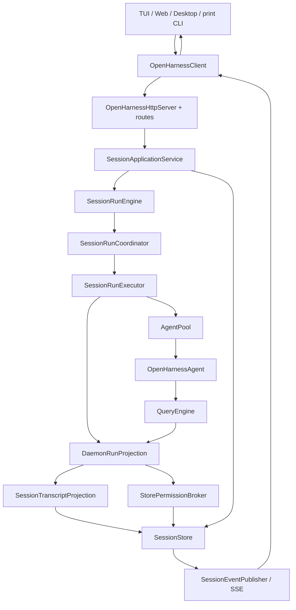
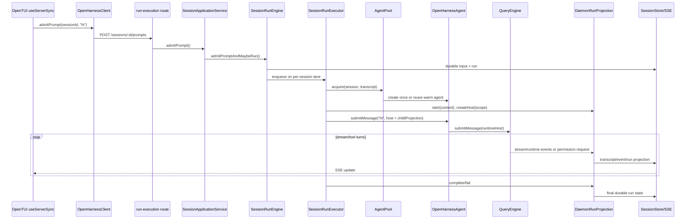
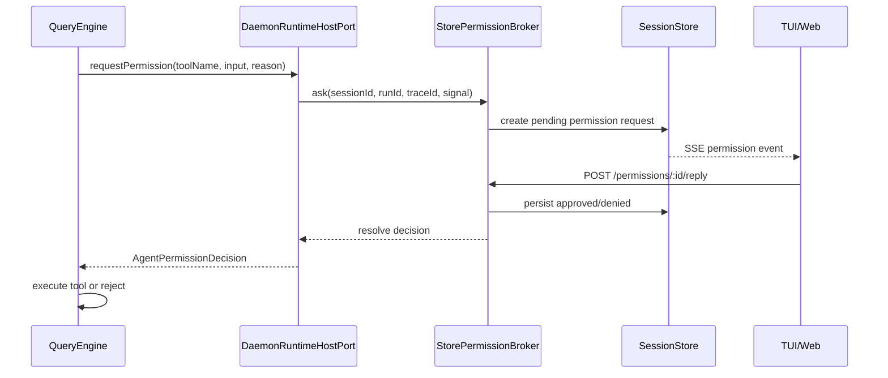
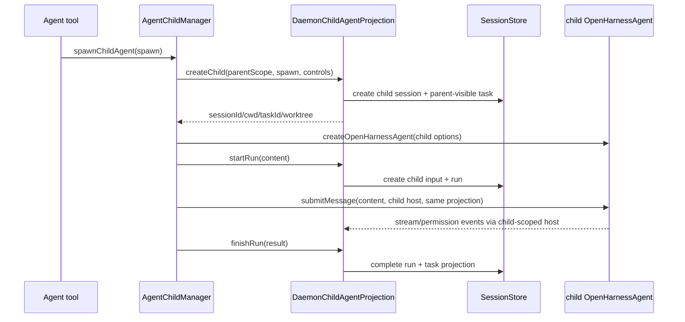

# Daemon Application Architecture

> 状态：权威代码索引。要查 daemon 中某条运行流程，先打开本文，再按表中的文件定位。
>
> 目标重构：已接受的 events/effects/live handles 方案见 [Agent Run Events / Effects Architecture](./agent-run-events-effects-architecture.md)。迁移完成前，本文描述的 `DaemonRunProjection`、`DaemonRuntimeHostPort` 和 child projection 仍是当前代码。

## 总体模型

daemon 是基于 agent framework 构建的应用层：

```text
agent framework = execution + live state + live handles
daemon          = HTTP + durable state + multi-client coordination + projections
TUI/Web/Desktop = interaction surfaces
```

启动 API 分两级：

- `startOpenHarnessDaemon()`：有默认配置的完整 daemon 应用，CLI 使用它。
- `startOpenHarnessServer()`：低层 embedding API，可注入自定义服务或测试 agent。

默认组合位于：

```text
packages/server/src/default-daemon.ts
packages/server/src/default-application-services.ts
packages/server/src/default-command-catalog.ts
```

CLI 的 `apps/cli/src/commands/daemon.ts` 只负责 host/port/token、进程信号和 daemon registry。

## 总运行图



## 请求入口

routes 统一在 `OpenHarnessHttpServer.mountRoutes()` 组装。

| HTTP/能力 | route | 应用模块 |
|---|---|---|
| session create/update/archive/query | `http/routes/session.ts` | Application + Query |
| prompt/interrupt/resume | `http/routes/run-execution.ts` | Application |
| compact/rewind/export/remember/MCP/usage | `http/routes/session-utility.ts` | Maintenance |
| permission list/reply | `http/routes/permission.ts` | `StorePermissionBroker` |
| task list/input/stop | `http/routes/task.ts` | `SessionTaskService` |
| settings/provider/health | `http/routes/system.ts` | default services + Control |
| auth/memory/git/other resources | corresponding route files | default application services |
| replay/live stream | `http/routes/events.ts` | `HttpEventHub` |

## 四个核心服务

用户请求主要进入以下四个 service，判断是正确的：

| 服务 | 文件 | 负责 |
|---|---|---|
| `SessionApplicationService` | `http/session-application-service.ts` | create/update/archive、admit、resume、interrupt、child session |
| `SessionQueryService` | `http/session-query-service.ts` | session/state/message/part 的只读查询 |
| `SessionMaintenanceService` | `http/session-maintenance-service.ts` | compact、rewind、export、remember、MCP、usage |
| `DaemonControlService` | `http/daemon-control-service.ts` | runtime snapshot、run barrier、agent pool close/inspect |

它们不是四个网络服务，而是 HTTP route 后面的四类应用用例门面。

## TUI 发送 `hi`



代码入口：

```text
apps/frontend/src/hooks/useServerSync.ts
packages/client/src/client.ts
packages/server/src/http/routes/run-execution.ts
packages/server/src/http/session-application-service.ts
packages/server/src/http/session-run-engine.ts
packages/server/src/http/session-run-executor.ts
```

## AgentPool：每个 pool-owned session 一个实例

`AgentPool` 的真实缓存是：

```ts
Map<string, Promise<OpenHarnessAgent>>
```

key 是 durable `sessionId`。Promise 用于合并并发 warm/acquire；创建失败会移除缓存。首次创建时，pool 将 durable transcript 解码成 framework messages 并调用 `agent.loadHistory()`。

以下情况会关闭/驱逐实例：

- session archive
- rewind 改写 transcript
- runtime-affecting metadata 修改
- remember 后按 cwd 关闭
- daemon shutdown 或 settings/plugin reload barrier

child agent 不放入 `AgentPool`。它由 parent agent 的 `AgentChildManager` 持有，`LiveChildAgentRegistry` 负责 `sessionId -> controls` 的执行所有权仲裁：GET 不 warm 第二个 agent，HTTP prompt 直接回到 framework。child 关闭或 daemon 重启、live owner 消失后，该 durable session 才能进入 pool 并从 transcript 恢复。

## 工具运行与授权



关键文件：

| 问题 | 文件/方法 |
|---|---|
| framework 在哪暂停工具 | `packages/core/src/engine/query-engine.ts` permission/tool path |
| daemon host 如何转发 | `http/daemon-runtime-host.ts` |
| request 如何持久化和等待 | `permission-broker.ts` + `permission-controller.ts` |
| HTTP reply 在哪 | `http/routes/permission.ts` |
| permission SSE 在哪发布 | `SessionEventPublisher` / `HttpEventHub` |
| child 权限如何上浮 | `StorePermissionBroker.sessionLineage()` |

session-scope approval 会沿 parent lineage 复用。child permission durable record 归到最上层 parent session，并在 payload 中保留 child session/run 标识。

## Child agent 闭环



所有权：

| 对象 | 所有者 |
|---|---|
| child agent instance / invocation / abort controller | framework `AgentChildManager` |
| child durable session/input/run/task | daemon projection/store |
| child session -> controls 路由 | daemon `LiveChildAgentRegistry`，仅引用 |
| isolated worktree | daemon `child-agent-worktree.ts` |

recursive child 复用同一个 projection 对象，但 projection 不捕获根 session 的 TaskBridge。每次 `createChild(parentScope, ...)` 都按直接父 session 创建 bridge，并把直接父 run scope 存入 child handle state，因此 grandchild 的 task scope 与 `parentRunId` 不会串回根 session。

关键文件：

```text
packages/agent-runtime/src/child-agent.ts
packages/server/src/http/daemon-child-agent-projection.ts
packages/server/src/http/child-agent-projection-factory.ts
packages/server/src/http/live-child-agent-registry.ts
packages/server/src/http/session-task-bridge.ts
```

## Maintenance 闭环

```text
HTTP route
  -> SessionMaintenanceService
  -> run barrier
  -> AgentPool.warm/get
  -> agent.compact/remember/getUsage/inspect
  -> persist only daemon projection or return DTO
```

live child 不进入 `AgentPool`，daemon 不会为它创建第二个实例来执行 compact/remember/usage/MCP inspect。此时 maintenance API 返回 `409`；child 关闭或 daemon 重启并由 pool 恢复后，这些 API 才重新可用。

特殊点：

- compact 改写 agent history 后用 `agentMessagesToTranscript()` 替换 durable transcript。
- rewind 先改 durable transcript，再关闭 agent，下一次 warm 会重新 hydrate。
- remember 使用 framework API，结束后关闭同 cwd agent，确保 memory retrieval 重新加载。

## 状态与故障恢复

| 状态 | 位置 | daemon restart 后 |
|---|---|---|
| agent history/usage/live resources | `OpenHarnessAgent` | 由 transcript 重新创建，usage live 累计不恢复 |
| session/input/run/transcript/events | `SessionStore` | 保留 |
| active run lane | `SessionRunCoordinator` | 不恢复，旧 active run 标为 interrupted |
| pending permission waiter | `PermissionController` | 不恢复，durable 状态用于审计 |
| child live controls | framework + registry | 不恢复 |
| child session/task/run projection | `SessionStore` | 保留，active 状态启动时中断 |

## 快速查代码

| 想查什么 | 从这里开始 |
|---|---|
| daemon 默认如何组装 | `packages/server/src/default-daemon.ts` |
| CLI 为什么只是启动器 | `apps/cli/src/commands/daemon.ts` |
| 一条 prompt 如何准入 | `http/session-run-engine.ts` |
| 一轮 agent 如何执行 | `http/session-run-executor.ts` |
| 每 session agent 如何缓存 | `http/agent-pool.ts` |
| stream 如何变成 transcript | `http/session-run-projection.ts` -> `http/transcript-projection.ts` |
| 工具授权 | `permission-broker.ts` -> `permission-controller.ts` |
| child 生命周期 | framework `child-agent.ts` |
| child durable 投影 | `http/daemon-child-agent-projection.ts` |
| task input/stop 如何回到 child | `http/session-task-bridge.ts` |
| SSE replay/live broadcast | `http/routes/events.ts` + `http/session-event-publisher.ts` |
| compact/remember/usage | `http/session-maintenance-service.ts` |

## 不再使用的调用链

以下调用链属于旧文档，不是当前代码：

```text
CLI runtimeFactory -> SessionRuntimePool -> AgentSessionRuntime
DaemonChildAgentHost -> child AgentSessionRuntime
AgentRunHost.childAgentHost supplied by daemon
```

当前链路是：

```text
CLI -> startOpenHarnessDaemon
daemon AgentPool -> OpenHarnessAgent.submitMessage
framework AgentChildManager -> optional daemon durable projection
```
