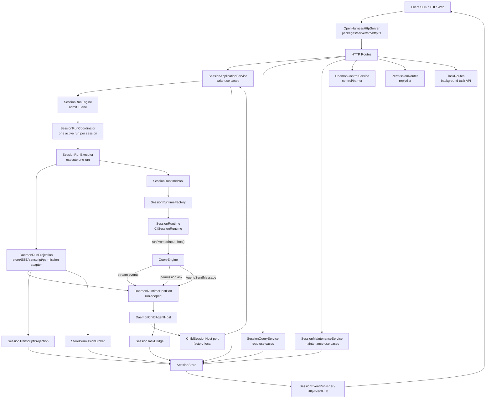
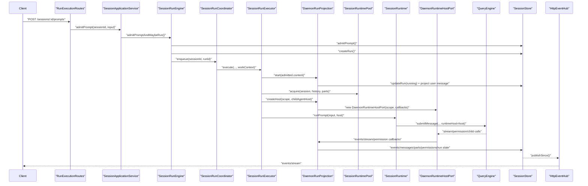
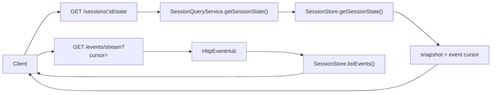
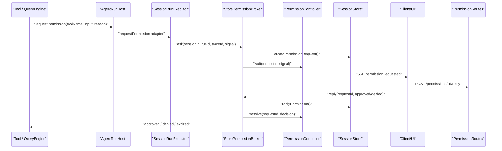
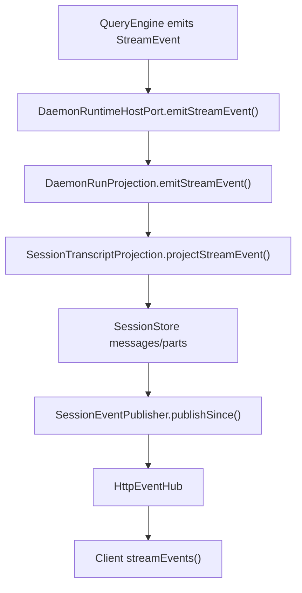
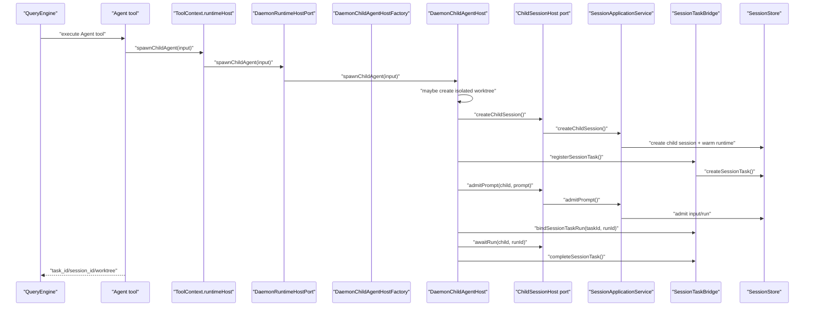
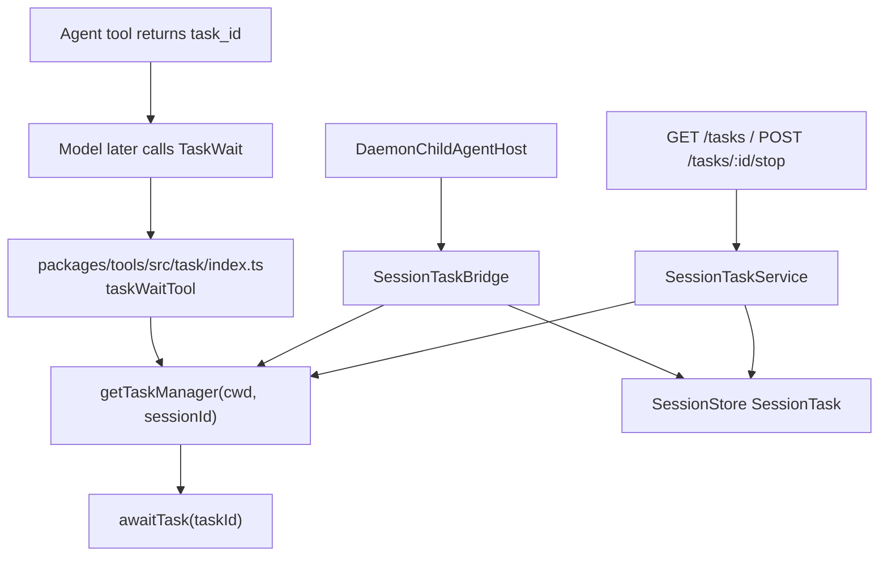
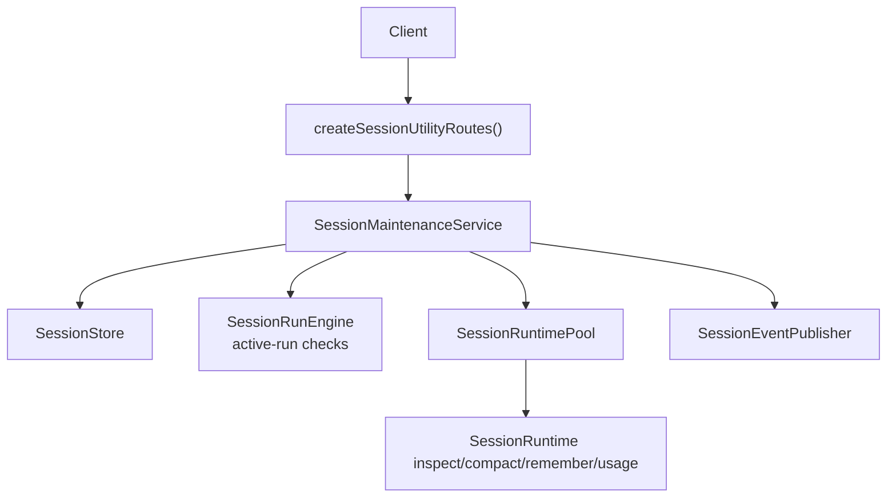
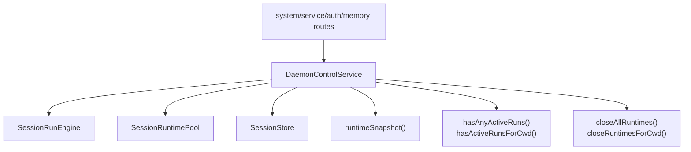

# Daemon Application Architecture

> 当前状态：对应当前代码。本文是 daemon 应用层的权威索引文档，用来从“我要查某条运行流程”快速定位到真实代码。
>
> 关联文档：[`agent-runtime-framework-architecture.md`](./agent-runtime-framework-architecture.md)、[`agent-framework-layer-architecture.md`](./agent-framework-layer-architecture.md)、[`daemon-runtime-flow-map.md`](./daemon-runtime-flow-map.md)、[`daemon-runtime-code-guide.md`](./daemon-runtime-code-guide.md)、[`runtime-host-port-design.md`](./runtime-host-port-design.md)、[`agent-child-session-flow.md`](./agent-child-session-flow.md)。

## 0. 先建立一个最重要的认识

daemon 现在已经不是一个薄 HTTP wrapper。它承担的是 Agent Application 层职责：

```text
daemon = HTTP/SSE transport
       + session application services
       + durable store projection
       + runtime pool
       + run lane
       + permission broker
       + task projection
       + runtime host adapters
```

这也是它比旧世界绕的根因：旧世界可以在同一进程里直接操作 `QueryEngine`、工具、任务和权限；daemon 世界里，大部分用户动作先进入 HTTP route，再进入应用服务，然后通过 run-scoped `AgentRunHost` 回到 runtime / QueryEngine。

当前最关键的边界是：

```text
client owns interaction
daemon owns durable application state
runtime owns execution
QueryEngine owns agent loop
AgentRunHost is the run-scoped capability port between runtime and daemon
```

不要把 `AgentRunHost` 理解成又一个业务大对象。它是 daemon 给单次 run 暴露的宿主能力边界：权限、runtime event、stream event 经由它回到 daemon；child agent lifecycle 作为可选 `childAgentHost` 能力挂在这条边界上。

---

## 1. 总图



读图时只记三层：

| 层 | 负责什么 | 代表文件 |
|---|---|---|
| HTTP/Client transport | URL、Bearer、CORS、SSE、request trace | `packages/client/src/client.ts`、`packages/server/src/http.ts` |
| Application services | session/query/maintenance/control 用例编排 | `packages/server/src/http/*-service.ts` |
| Runtime adapters | 把 QueryEngine 的能力请求映射回 daemon | `daemon-runtime-host.ts`、`daemon-child-agent-host.ts`、`permission-broker.ts` |

---

## 2. 客户端请求入口

客户端统一从 `OpenHarnessClient` 进入：

| 客户端方法 | HTTP | daemon route | 服务/模块 |
|---|---|---|---|
| `health()` | `GET /health` | `createSystemRoutes()` | `DaemonControlService.runtimeSnapshot()` |
| `listSessions()` | `GET /sessions` | `createSessionRoutes()` | `SessionQueryService.listSessions()` |
| `createSession()` | `POST /sessions` | `createSessionRoutes()` | `SessionApplicationService.createSession()` |
| `getSession()` | `GET /sessions/:id` | `createSessionRoutes()` | `SessionApplicationService.getSession(..., warm: true)` |
| `getSessionState()` | `GET /sessions/:id/state` | `createSessionRoutes()` | `SessionQueryService.getSessionState()` |
| `listMessages()` | `GET /sessions/:id/messages` | `createSessionRoutes()` | `SessionQueryService.listMessages()` |
| `listMessageParts()` | `GET /sessions/:id/parts` | `createSessionRoutes()` | `SessionQueryService.listMessageParts()` |
| `admitPrompt()` | `POST /sessions/:id/prompts` | `createRunExecutionRoutes()` | `SessionApplicationService.admitPrompt()` |
| `resumeInterruptedRun()` | `POST /sessions/:id/runs/:runId/resume` | `createRunExecutionRoutes()` | `SessionApplicationService.resumeRun()` |
| `interruptSession()` | `POST /sessions/:id/interrupt` | `createRunExecutionRoutes()` | `SessionApplicationService.interruptSession()` |
| `archiveSession()` | `DELETE /sessions/:id` | `createSessionRoutes()` | `SessionApplicationService.archiveSessionTree()` |
| `compactSession()` | `POST /sessions/:id/compact` | `createSessionUtilityRoutes()` | `SessionMaintenanceService.compact()` |
| `rewindSession()` | `POST /sessions/:id/rewind` | `createSessionUtilityRoutes()` | `SessionMaintenanceService.rewind()` |
| `rememberSession()` | `POST /sessions/:id/remember` | `createSessionUtilityRoutes()` | `SessionMaintenanceService.remember()` |
| `getSessionMcp()` | `GET /sessions/:id/mcp` | `createSessionUtilityRoutes()` | `SessionMaintenanceService.listMcpServers()` |
| `getSessionUsage()` | `GET /sessions/:id/usage` | `createSessionUtilityRoutes()` | `SessionMaintenanceService.getUsage()` |
| `listPermissions()` | `GET /permissions` | `createPermissionRoutes()` | `StorePermissionBroker.listRequests()` |
| `replyPermission()` | `POST /permissions/:id/reply` | `createPermissionRoutes()` | `StorePermissionBroker.reply()` |
| `listTasks()` | `GET /tasks` | `createTaskRoutes()` | `SessionTaskService.list()` |
| `createTask()` | `POST /tasks` | `createTaskRoutes()` | `SessionTaskService.create()` |
| `stopTask()` | `POST /tasks/:id/stop` | `createTaskRoutes()` | `SessionTaskService.stop()` |
| `streamEvents()` | `GET /events/stream` | `HttpEventHub.createRoutes()` | SSE event projection |

route 组装都在 `OpenHarnessHttpServer.mountRoutes()`：

```text
packages/server/src/http.ts
  -> createSystemRoutes()
  -> createMemoryRoutes()
  -> createAuthRoutes()
  -> createServiceRoutes()
  -> createGitRoutes()
  -> createTaskRoutes()
  -> createPermissionRoutes()
  -> createSessionUtilityRoutes()
  -> createSessionRoutes()
  -> createRunExecutionRoutes()
  -> eventHub.createRoutes()
```

---

## 3. 四类核心服务

用户说的 `Application / Query / Maintenance / Control` 是对的，但要注意它们不是四个独立 HTTP 服务，而是 daemon 内部的四类用例门面。HTTP routes 会按具体 URL 组合它们。

| 服务 | 文件 | 归属 | 不负责 |
|---|---|---|---|
| `SessionApplicationService` | `packages/server/src/http/session-application-service.ts` | 写路径：create/update/archive/admit/resume/interrupt/child session | 不直接执行模型 |
| `SessionQueryService` | `packages/server/src/http/session-query-service.ts` | 只读查询：session list/state/messages/parts | 不 warm runtime，不改 store |
| `SessionMaintenanceService` | `packages/server/src/http/session-maintenance-service.ts` | compact/rewind/remember/export/usage/MCP | 不处理普通 prompt admission |
| `DaemonControlService` | `packages/server/src/http/daemon-control-service.ts` | runtime snapshot、active-run barrier、close runtime、inspect hooks | 不承载 session 业务写入 |

辅助但同样重要的模块：

| 模块 | 文件 | 作用 |
|---|---|---|
| `StorePermissionBroker` | `packages/server/src/permission-broker.ts` | permission ask/reply、持久化请求、等待 UI 裁决、session 级复用 |
| `SessionTaskService` | `packages/server/src/http/session-task-service.ts` | `/tasks` HTTP API 与 durable task projection 查询/停止 |
| `SessionTaskBridgeManager` | `packages/server/src/http/session-task-bridge.ts` | 进程内 `TaskManager` 与 store 中 `SessionTask` 的投影桥 |
| `SessionRunEngine` | `packages/server/src/http/session-run-engine.ts` | prompt admission、session lane、run promise、interrupt/await |
| `SessionRunExecutor` | `packages/server/src/http/session-run-executor.ts` | 单次 run 执行、创建 projection/host、调用 runtime、处理 runtime close |
| `DaemonRunProjection` | `packages/server/src/http/session-run-projection.ts` | run-scoped daemon projection：stream 分发、runtime event、permission ask、run 终态 |
| `SessionRuntimePool` | `packages/server/src/http/session-runtime-pool.ts` | 每个 session 的 runtime warm/acquire/close/cache |

---

## 4. 普通 Prompt 运行流程

查“用户输入怎么跑起来”，从这里开始：



关键代码路径：

```text
packages/client/src/client.ts
  OpenHarnessClient.admitPrompt()

packages/server/src/http/routes/run-execution.ts
  createRunExecutionRoutes().post("/:sessionId/prompts")

packages/server/src/http/session-application-service.ts
  SessionApplicationService.admitPrompt()

packages/server/src/http/session-run-engine.ts
  SessionRunEngine.admitPromptAndMaybeRun()

packages/server/src/run-coordinator.ts
  SessionRunCoordinator.enqueue()

packages/server/src/http/session-run-executor.ts
  SessionRunExecutor.execute()

packages/server/src/http/session-runtime-pool.ts
  SessionRuntimePool.acquire()

packages/server/src/runtime.ts
  SessionRuntime.runPrompt(input, host)
```

闭环规则：

- `SessionRunEngine` 只负责准入、排队、interrupt/await，不执行模型。
- `SessionRunExecutor` 才执行单个 run。
- `SessionRunCoordinator` 保证同一个 session lane 同时只有一个 active run。
- `SessionRuntimePool` 负责 runtime 生命周期；它不再持有 child-agent bridge。
- `DaemonRuntimeHostPort` 是这次 run 给 QueryEngine/tools 的能力入口。

---

## 5. Query / Attach / Replay 流程

查“客户端刷新/attach 后如何拿当前状态”，从这里开始：



关键代码路径：

```text
packages/client/src/client.ts
  getSessionState()
  streamEvents()
  listEvents()

packages/server/src/http/routes/session.ts
  GET /sessions/:sessionId/state
  GET /sessions/:sessionId/messages
  GET /sessions/:sessionId/parts

packages/server/src/http/session-query-service.ts
  getSessionState()
  listMessages()
  listMessageParts()

packages/server/src/http/routes/events.ts
  HttpEventHub.createRoutes()
```

闭环规则：

- Query service 是只读门面，不 warm runtime，不更新 store。
- attach 应优先拿 `getSessionState()` 的一致快照，再用 `/events/stream` 追 cursor 后增量。
- messages/parts 是 durable projection；runtime 内存态不作为 attach 的真相源。

---

## 6. 工具权限运行授权流程

查“工具运行授权在哪里走”，从这里开始：



关键代码路径：

```text
packages/server/src/http/session-run-executor.ts
  new DaemonRuntimeHostPort({ requestPermission })

packages/server/src/http/daemon-runtime-host.ts
  DaemonRuntimeHostPort.requestPermission()

packages/server/src/permission-broker.ts
  StorePermissionBroker.ask()
  StorePermissionBroker.reply()

packages/server/src/permission-controller.ts
  PermissionController.wait()
  PermissionController.resolve()

packages/server/src/http/routes/permission.ts
  GET /permissions
  POST /permissions/:requestId/reply

packages/client/src/client.ts
  listPermissions()
  replyPermission()
```

状态归属：

| 状态 | 归属 |
|---|---|
| live waiter / resolve handle | `PermissionController` |
| durable permission request/decision | `SessionStore` |
| session 级审批复用 | `StorePermissionBroker.findSessionApproval()` |
| parent/child permission 上溯 | `StorePermissionBroker.resolvePermissionSessionId()` |
| UI 传输 | `/permissions` + `/events/stream` |

闭环规则：

- QueryEngine/tool 只看到 `AgentRunHost.requestPermission()`。
- `PermissionController` 的 live handle 不能跨 daemon restart。
- daemon restart 后未完成 live stack 不恢复；durable projection 会保留/终态化。
- `decision: "session"` 会让同 session lineage 内相同工具后续自动批准。

---

## 7. Stream Event / Message Part 落库流程

查“模型流式输出和工具结果怎么变成 UI 消息”，从这里开始：



关键代码路径：

```text
packages/server/src/http/session-run-executor.ts
  creates DaemonRunProjection and runtime host

packages/server/src/http/session-run-projection.ts
  emitStreamEvent / emitEvent / requestPermission projection adapter

packages/server/src/http/transcript-projection.ts
  SessionTranscriptProjection.beginRun()
  SessionTranscriptProjection.projectStreamEvent()
  SessionTranscriptProjection.completeOpenTextPart()

packages/server/src/http/session-event-publisher.ts
  checkpoint()
  publishSince()

packages/server/src/http/routes/events.ts
  SSE stream
```

闭环规则：

- QueryEngine 发的是 runtime stream event，不直接写 store。
- `SessionTranscriptProjection` 负责把 stream event 转成 durable message/part。
- `text_delta` 在有 active text part 时可以直接广播 live event；其他事件先落库再 publish。
- UI 读到的是 durable projection + live delta，不是 runtime 内部 transcript。

---

## 8. Child Agent 生命周期流程

查“Agent 工具为什么会创建 session/task/run”，从这里开始：



关键代码路径：

```text
packages/tools/src/agent/index.ts
  agentTool.execute()
  sendMessageTool.execute()

packages/server/src/http/session-run-executor.ts
  childAgentHostFactory.create({ scope, session })

packages/server/src/http/child-agent-host-factory.ts
  DaemonChildAgentHostFactory.create()
  createChildSessionHost()

packages/server/src/http/daemon-child-agent-host.ts
  spawnChildAgent()
  sendChildInput()
  interruptChildAgent()
  awaitChildAgent()

packages/server/src/http/child-agent-worktree.ts
  isolate worktree helper

packages/server/src/http/session-task-bridge.ts
  registerSessionTask()
  bindSessionTaskRun()
  completeSessionTask()
  writeToSessionTask()

packages/server/src/http/session-application-service.ts
  createChildSession()
  admitPrompt()
  awaitRun()
  archiveSessionTree()
```

状态归属：

| 状态 | 归属 |
|---|---|
| live invocation id -> child session/run/task | `DaemonChildAgentHost.invocations` |
| child session/run durable truth | `SessionStore` via `SessionApplicationService` |
| parent-visible task projection | `SessionTaskBridgeManager` + `SessionStore` |
| isolated worktree lifecycle | `DaemonChildAgentHost` + `child-agent-worktree.ts` |
| Agent tool task_id -> invocation id map | `packages/tools/src/agent/index.ts` run-local module map |

闭环规则：

- Agent tool 不知道 daemon 的 `ChildSessionHost` / `SessionTaskBridge`。
- `ChildSessionHost` 是 factory-local port，由 `DaemonChildAgentHostFactory` 从 `SessionApplicationService` 生成。
- `TaskWait` 等的是用户可见 task projection，不是 live child invocation handle。
- `SendMessage` 优先通过 Agent tool 保存的 invocation id 回到 `runtimeHost.childAgentHost.sendChildInput()`；找不到时才 fallback 到普通 `TaskManager.writeToTask()`。
- child run 完成后，`DaemonChildAgentHost` 会 complete task 并 close child runtime。

---

## 9. Task Projection / TaskWait 流程

查“TaskWait 到底等什么”，从这里开始：



关键代码路径：

```text
packages/tools/src/task/index.ts
  taskWaitTool.execute()

packages/server/src/http/session-task-bridge.ts
  SessionTaskBridgeManager.createBridge()

packages/server/src/http/session-task-service.ts
  SessionTaskService

packages/server/src/http/routes/task.ts
  createTaskRoutes()

packages/client/src/client.ts
  listTasks()
  getTask()
  stopTask()
  createTask()
```

闭环规则：

- `TaskWait` 等 `TaskManager.awaitTask(taskId)`，并返回每个 task 的 final status/output。
- 对 Agent child session 来说，`task_id` 是 parent-visible projection。
- live invocation handle 保持在 runtime host/daemon child adapter 内部。
- timeout 时 `TaskWait` 会 best-effort `stopTask()`，避免 child 长时间游离。

---

## 10. Maintenance 流程

查“compact/rewind/remember/MCP/usage 在哪走”，从这里开始：



入口表：

| HTTP | 方法 | 关键约束 |
|---|---|---|
| `GET /sessions/:id/mcp` | `listMcpServers()` | warm runtime，然后 `runtime.inspect()` |
| `GET /sessions/:id/usage` | `getUsage()` | warm runtime，然后 `runtime.getUsage()` |
| `POST /sessions/:id/export` | `exportSession()` | 只读 store transcript |
| `POST /sessions/:id/compact` | `compact()` | 需要 runtime；session 不能有 active/queued run |
| `POST /sessions/:id/rewind` | `rewind()` | session 不能有 active/queued run；替换 transcript 后 close runtime |
| `POST /sessions/:id/remember` | `remember()` | cwd 下不能有 active run；完成后 close cwd runtimes |

关键代码路径：

```text
packages/server/src/http/routes/session-utility.ts
  createSessionUtilityRoutes()

packages/server/src/http/session-maintenance-service.ts
  SessionMaintenanceService

packages/server/src/rewind.ts
packages/server/src/export-session.ts
packages/server/src/usage.ts
```

---

## 11. Control / Barrier 流程

查“为什么改设置/插件/认证前要检查 active run”，从这里开始：



关键代码路径：

```text
packages/server/src/http/daemon-control-service.ts
  runtimeSnapshot()
  hasAnyActiveRuns()
  hasActiveRunsForCwd()
  closeAllRuntimes()
  closeRuntimesForCwd()
  inspectRuntimeHooks()

packages/server/src/http/routes/system.ts
  GET /health
  GET /debug/runtime
  PATCH /settings

packages/server/src/http/routes/service.ts
  /plugins
  /profile/init
  /hooks

packages/server/src/http/routes/auth.ts
packages/server/src/http/routes/memory.ts
```

闭环规则：

- Control service 是控制面，不是业务写路径。
- 它主要用于 runtime snapshot、active-run barrier 和 runtime close。
- settings/plugin/profile/auth/memory 这类配置变化通常要先确认没有 active run，或者关闭相关 runtime。

---

## 12. 状态归属表

这张表用来判断“这个状态到底应该由谁拥有”：

| 状态/句柄 | 当前归属 | 持久化 | 查找入口 |
|---|---|---|---|
| session / input / run / message / part / event | `SessionStore` | 是 | `packages/services/src/session-runtime/store.ts` |
| runtime instance | `SessionRuntimePool` | 否 | `packages/server/src/http/session-runtime-pool.ts` |
| one-session run lane | `SessionRunCoordinator` | 否 | `packages/server/src/run-coordinator.ts` |
| run promise / awaitRun | `SessionRunEngine` | 否，终态写 run record | `session-run-engine.ts` |
| stream transcript state | `DaemonRunProjection` + `SessionTranscriptProjection` | 部分，最终写 messages/parts | `session-run-projection.ts`、`transcript-projection.ts` |
| permission live waiter | `PermissionController` | 否 | `permission-controller.ts` |
| permission request/decision | `SessionStore` via `StorePermissionBroker` | 是 | `permission-broker.ts` |
| child invocation map | `DaemonChildAgentHost` | 否 | `daemon-child-agent-host.ts` |
| child session/run | `SessionStore` via `SessionApplicationService` | 是 | `session-application-service.ts` |
| parent-visible task | `SessionTaskBridgeManager` + `SessionStore` | 是 | `session-task-bridge.ts` |
| process-local task manager task | `TaskManager` | 否/进程内 | `@openharness/services` tasks |
| SSE clients | `HttpEventHub` | 否 | `routes/events.ts` |
| request trace id | `RequestTraceRegistry` + run metadata | registry 否，run metadata 是 | `request-trace-registry.ts`、`http.ts` |

判断原则：

- 用户 attach/replay 需要看到的状态，必须落到 `SessionStore`。
- 模型执行时的 live promise、abort signal、resolve handle 属于进程内 runtime/control 对象。
- daemon restart 后不能恢复 live stack，只能根据 durable projection 进入清晰终态或等待用户显式恢复。

---

## 13. 常见问题反查表

| 我想查 | 从哪里开始 |
|---|---|
| 用户输入如何创建 run | `routes/run-execution.ts` -> `SessionApplicationService.admitPrompt()` -> `SessionRunEngine.admitPromptAndMaybeRun()` |
| 为什么同 session 一次只跑一个 run | `SessionRunCoordinator.enqueue()` |
| prompt 为什么会变成 message/part | `DaemonRunProjection` + `SessionTranscriptProjection` |
| 工具授权如何弹给 UI | `DaemonRuntimeHostPort.requestPermission()` -> `StorePermissionBroker.ask()` |
| UI 批准权限后谁唤醒工具 | `routes/permission.ts` -> `StorePermissionBroker.reply()` -> `PermissionController.resolve()` |
| child agent 为什么会创建子 session | `DaemonChildAgentHost.spawnChildAgent()` -> `ChildSessionHost.createChildSession()` |
| child agent 为什么也有 task_id | `SessionTaskBridgeManager.registerSessionTask()` |
| `TaskWait` 等的是 child run 还是 task | `packages/tools/src/task/index.ts`，等 user-visible task projection |
| `SendMessage` 怎么找到 child | `packages/tools/src/agent/index.ts` 的 invocation map，然后 `runtimeHost.childAgentHost.sendChildInput()` |
| compact 为什么有时 409 | `SessionMaintenanceService.compact()` 检查 `runEngine.hasWork(sessionId)` |
| 改 settings/plugin 为什么有时 409 | `DaemonControlService.hasAnyActiveRuns()` / `hasActiveRunsForCwd()` |
| UI 刷新后从哪里恢复状态 | `GET /sessions/:id/state` + `/events/stream?cursor=` |

---

## 14. 当前边界收口状态

这一轮 runtime-host port 改造后的当前形状：

```text
SessionRuntimeFactory
  only creates SessionRuntime from durable session/history/parts

SessionRunExecutor
  owns one-run orchestration

DaemonRunProjection
  owns host callback projection into store/SSE/transcript/permission

DaemonRuntimeHostPort
  exposes run host capabilities to QueryEngine/tools and delegates projection callbacks

DaemonChildAgentHostFactory
  creates run-scoped child-agent host
  generates server-local ChildSessionHost port from SessionApplicationService

SessionApplicationService / SessionRunEngine
  no longer depend on ChildSessionHost
```

已经删除或收口的旧入口：

| 旧形态 | 当前形态 |
|---|---|
| `SessionRuntimeHooks` | `AgentRunHost` |
| `QueryEngine.permissionPrompt` | `SubmitMessageOptions.runtimeHost.requestPermission()` |
| `QueryEngine.runtimeEventSink` | `ToolContext.runtimeHost.emitEvent()` |
| `registerChildSessionBackend()` | `ToolRuntimeHost.spawnChildAgent()` |
| runtimeFactory 注入 child bridge | `SessionRunExecutor` run-scoped projection/host assembly |
| `DaemonChildSessionHost` standalone adapter | factory-local `ChildSessionHost` port |

剩余复杂度主要来自真实需求本身：

- HTTP transport 与 agent runtime 隔离。
- durable projection 与 live handle 分层。
- child agent 需要同时有 child session、child run、parent task projection。
- permission 需要同时支持 UI 审批、session 级复用、child session 上溯。

这些复杂度现在集中在少数 adapter/service 内，而不是散落在 QueryEngine、runtimeFactory 和工具实现之间。
