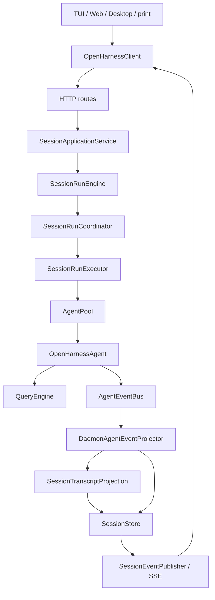
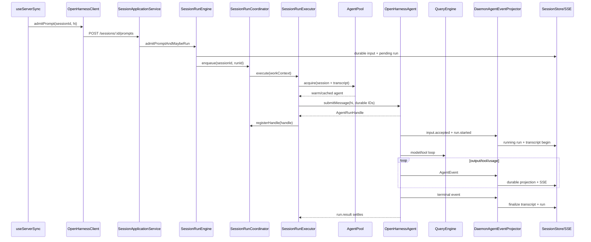
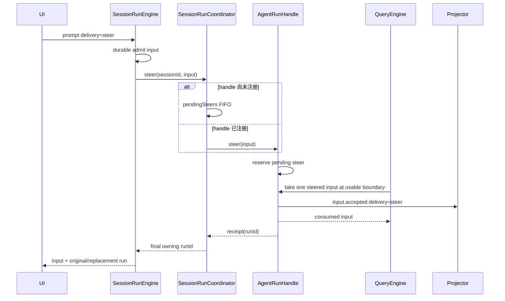
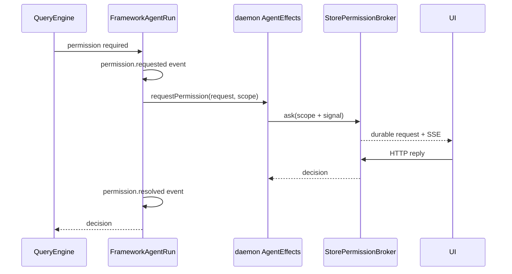

# Daemon Application Architecture

> 状态：当前实现的权威运行索引。查询 prompt、steer、interrupt、permission、child、compact/remember/usage 等流程时，从本文进入。

## 总体模型

```text
agent framework = execution + live state + events/effects/handles
daemon          = HTTP + durable state + multi-client policy + event projection
TUI/Web/Desktop = interaction surfaces
```

daemon 直接依赖 `@openharness/agent-runtime`，不经过 runtime adapter。framework 可以脱离 daemon 独立运行；daemon 是它的一种有 durable state 和多 UI 协调能力的应用形态。

## 核心请求链



准确表述是：

```text
Surface -> Client -> routes -> Application service
  -> SessionRunEngine (admission)
  -> SessionRunCoordinator (per-session lane)
  -> SessionRunExecutor (one admitted root run)
  -> AgentPool -> OpenHarnessAgent -> QueryEngine

OpenHarnessAgent.events
  -> DaemonAgentEventProjector.apply(event)
  -> transcript/session/run/task/event durable state
  -> SSE
```

`DaemonAgentEventProjector` 是单向 reducer，不是 framework 执行所需的 host 插座。

## 请求入口与四个服务

routes 在 `packages/server/src/http.ts` 的 `mountRoutes()` 组装。

| 服务 | 文件 | 负责 |
|---|---|---|
| `SessionApplicationService` | `http/session-application-service.ts` | create/update/archive、prompt、resume、interrupt、child route |
| `SessionQueryService` | `http/session-query-service.ts` | session/state/message/part 查询 |
| `SessionMaintenanceService` | `http/session-maintenance-service.ts` | compact、rewind、export、remember、MCP、usage |
| `DaemonControlService` | `http/daemon-control-service.ts` | runtime snapshot、run barrier、pool close/inspect |

它们是 HTTP 后面的应用用例门面，不是四个独立网络服务。

| HTTP 能力 | route 文件 | 主要入口 |
|---|---|---|
| session CRUD/query | `http/routes/session.ts` | Application / Query |
| prompt/steer/interrupt/resume | `http/routes/run-execution.ts` | Application |
| compact/rewind/export/remember/MCP/usage | `http/routes/session-utility.ts` | Maintenance |
| permission list/reply | `http/routes/permission.ts` | `StorePermissionBroker` |
| task create/get/list/stop | `http/routes/task.ts` | `SessionTaskService` |
| health/settings/provider | `http/routes/system.ts` | Control/default services |
| replay/live SSE | `http/routes/events.ts` | `HttpEventHub` |

## TUI 发送 hi



对应代码顺序：

```text
apps/frontend/src/hooks/useServerSync.ts
packages/client/src/client.ts
packages/server/src/http/routes/run-execution.ts
packages/server/src/http/session-application-service.ts
packages/server/src/http/session-run-engine.ts
packages/server/src/run-coordinator.ts
packages/server/src/http/session-run-executor.ts
packages/server/src/http/agent-pool.ts
packages/agent-runtime/src/agent.ts
packages/core/src/engine/query-engine.ts
packages/server/src/http/daemon-agent-event-projector.ts
```

## AgentPool 与实例归属

`AgentPool` 缓存一个带代际所有权的 entry：

```text
sessionId -> { promise: Promise<OpenHarnessAgent>, subscription }
```

流程：

1. 读取 durable session/messages/parts。
2. 创建 agent，daemon effects 已在 `OpenHarnessAgentOptions` 中注入。
3. `loadHistory(transcriptToAgentMessages(...))`。
4. 在任何 submit 前订阅 `agent.events`。
5. 后续 root run 复用实例。
6. archive、runtime config change、failure 或 shutdown 时 close 并 unsubscribe。

close 只清理自己捕获的 entry/subscription。entry 一旦进入 `closing`，同一 session 的 acquire 会等待旧实例完整释放，再重新读取 durable session/history 创建 replacement；旧代际的 finally 不会误删或 unsubscribe 新代际。

live child 由 root agent 的 `AgentChildManager` 持有，不进入 AgentPool。`LiveChildAgentDirectory` 让 pool 拒绝为该 durable child session 创建第二个 agent。

## Daemon operation gate

`DaemonOperationGate` 是 daemon 应用层的统一准入边界，scope 为 `sessionId + cwd`。普通 runtime 使用持有 shared lease；配置、维护与 archive 持有 exclusive barrier：

| barrier | 阻止的准入 | 典型调用 |
|---|---|---|
| session | 同一 session | runtime PATCH、compact、rewind、archive |
| cwd | 同一 cwd 的所有 session | remember、memory/plugin reload |
| global | 所有 session | settings/auth/profile/plugin mutation、shutdown |

线性化顺序固定为：先安装 barrier，原子检查 lane 与 `AgentPool` live state，再执行 mutation/close，最后释放 barrier。prompt、resume、required runtime inspect 和 best-effort warm 都必须经过 shared admission；warm 拿不到 lease 时只跳过预热，Maintenance/Control 的必需 runtime 创建失败则直接向调用方传播。

framework 实例内部还有更小一层状态机：`idle -> running | maintaining -> idle`，close 从任意非 closed 状态进入 `closing -> closed`。因此 daemon barrier 解决跨请求/跨实例策略，agent state 解决单实例历史、模型、run 与 maintenance 的互斥，两层不互相替代。

## Event projection

唯一入口：

```ts
agent.events.subscribe((event) => projector.apply(event));
```

| AgentEvent | daemon 行为 |
|---|---|
| `input.accepted` | create/validate durable input；steer 时追加 user transcript |
| `run.started` | create/validate run、置 running、begin transcript |
| `output.text.delta` | 立即更新内存 text part 并发 live SSE；dirty part 按 checkpoint 批量持久化，delta event 本身不进入 replay log |
| `output.turn.completed` | 完成当前 text part，保留 provider model-turn 边界 |
| `tool.started/completed` | create/update tool part + observability |
| `usage.updated` | project usage event |
| `domain.event` | 写 durable domain event |
| `permission.requested/resolved` | 写 framework observation event |
| `child.created` | child session + task + live directory |
| `child.suspended/resumed` | durable lifecycle observation |
| `child.closed` | finish task、unregister live route；durable 失败时保留 pending projection 供有序重试 |
| run terminal | complete text、finalize durable run/task |

projector 按 root event source 单调 `sequence` 保存已成功应用的水位；重复或更旧事件直接跳过，失败事件不推进水位。所有 child required event 共用一个 pending settlement 状态机：`child.closed` 重试原 projection，其他 child event 执行 durable terminal compensation；settlement 再失败时，下一有序事件必须先完成 pending settlement，水位不能越过 poison event。root projection failure 传播给 framework，并由 `SessionRunExecutor` 对仍非 terminal 的 durable run 做 infrastructure fallback。

input/run/stream/terminal 的多步 durable 归约使用 `SessionStore.transaction()`，SQLite 与内存 read model 同时提交或同时回滚，transcript projection state 也在失败时恢复。input/run/child identity 使用 create-or-validate：input 会比较去除 traceId 后的完整 metadata，既有 child session 必须匹配 parent/cwd/childId，terminal run 不允许被 `run.started` 重开。当前 framework event source 不跨进程 replay，daemon restart 仍走 durable recovery，不恢复 live event stream。

### Text delta durability

delta 有两条彼此独立的输出：`liveEvent` 立即发给当前 SSE 客户端；durable text 按 part 累积 dirty checkpoint。默认每 `150ms` 或 `8KB` flush，同批 dirty part 在一个 SQLite transaction 中更新 part/message/session。part complete、tool boundary、run terminal 和 `SessionStore.close()` 会通过普通 unit-of-work 或显式 close 强制落盘。

异常进程退出最多丢失最后一个 checkpoint 窗口；正常 terminal/shutdown/close 不丢失。transient delta 不进入 `SessionStore.events`，client reducer 也不把它保留在 durable `eventsBySeq` 索引。durable event 与 live delta 共用全局 SSE 序号，store 每次预留 1024 个序号并持久化高水位；重启可以留下空洞，但绝不复用客户端已经见过的 cursor。

`SessionStore` 的普通写使用 row-level mutation/unit-of-work：只 upsert dirty row、只 append 新 durable event，`replaceTranscript` 只删除目标 session 的旧 message/part。成本不再随全库历史线性增长。

## Steer



正常 steer 不创建第二个 run。没有 active lane 时，`delivery=steer` 按普通 prompt 创建新 run。已 admit 但 handle 尚未注册的 steer 保存在 lane，注册后按序 flush。framework 每个可继续的 turn boundary 只消费一个 steer，因此并发输入按 FIFO 分布到后续模型回合，receipt 独立结算。HTTP application 会等待 delivery receipt，因此响应中的 `run` 一定是该输入最终归属的原 active run 或 replacement run，而不是过早返回旧 run。

最终 turn boundary 与 max-turn boundary 由 framework 关闭 steering；未到可继续的模型回合前，`input.accepted` 和 receipt 都不会产生。若 lane 已接收输入、但 `run.steer()` 明确抛出 `AgentRunNotAcceptingInputError`，coordinator 不丢弃 durable input，而是在同一 lane 创建带 `recoveredFromSteer` metadata 的 replacement run，并用新 run ID 结算 HTTP delivery。其他 steer 错误以及 replacement 创建错误都会明确拒绝请求并终止当前 lane 控制链，不会留下悬挂 promise。

steer 的 durable 归属既可以由新 run 的 `run.inputId` 表达，也可以由原 active run transcript 中的 user message（`message.inputId + message.runId`）表达。live child receipt 校验也使用这两种关系，不能要求 active steer 等于 run 的首个 input。相同 input ID 重试时，application 会找到最终 owning run，不会再次 delivery。相同 ID 在首次 delivery 仍 pending 时，共享同一个进程内 admission promise；payload、session 或 delivery 不一致则按 idempotency conflict 拒绝。

interrupt 或 delivery failure 会拒绝所有尚未结算的 steer。若输入还没有任何 owning run，engine 会为它建立 terminal `interrupted`/`failed` run，保证 durable input 不会永久悬空；如果 projector 已把它绑定到原 run，则由该 run 的 terminal projection 收束。

## Interrupt

```text
HTTP interrupt
  -> SessionApplicationService.interruptSession
  -> SessionRunEngine.interruptSession
  -> SessionRunCoordinator.interrupt
     -> abort work signal
     -> active run.interrupt()
     -> reject queued runs
  -> LiveChildAgentDirectory.interrupt descendants
```

framework 发 `run.interrupted` 后 projector 完成 durable terminal 状态。若 event delivery 或 agent 创建在 terminal event 前失败，`SessionRunExecutor` 只对仍非 terminal 的 run 执行 infrastructure fallback，并把该 run 遗留的 `running` transcript parts 收束为 `failed` 或 `interrupted`。

## 工具运行与授权



effect 注入位置是 `packages/server/src/http.ts`；durable wait/reply 在 `permission-broker.ts` 与 `permission-controller.ts`。daemon 不创建 run host，也不向 QueryEngine 传 callback。

## Child session 与 task

```text
Agent tool -> framework AgentChildManager
  -> child.created event
  -> DaemonAgentEventProjector
     -> durable child session
     -> SessionTaskBridge task (id = childId)
     -> LiveChildAgentDirectory(sessionId -> rootAgent + childId)
  -> recursive child OpenHarnessAgent
  -> ordinary input/run/output/tool terminal events
```

HTTP child prompt、SendMessage 的 session-task callback 和 TaskStop 最终都通过 `rootAgent.children` 调 live handle。daemon 只保存路由索引，不复制 controls。完整流程见 [Agent Child Session Flow](./agent-child-session-flow.md)。

`rootAgent.children` 是 framework root tree 共享的 descendant directory，不只包含 direct child。`child.created` durable 建模若在 task/live-route 阶段失败，projector 会失败 task、注销已注册 route，并 archive 本次新建的 child session；framework 随后回滚 handle 与 environment lease。parent 一旦进入 `closing/archived`，projector 拒绝新的 `child.created`。

child 普通 input/run/output/tool 投影失败时，projector 会把已存在的 durable run、未完成 transcript part 与 parent task 收束为 failed，再把 required event failure 传播回 framework。live child HTTP 路径只接受 framework `started/steer` receipt 对应的 durable input/run；缺失或身份不一致返回 500，不再由 application 临时补造 input/run。`SessionTaskBridge` 先创建 durable task 再登记 live TaskManager；live 登记失败会标记 durable task failed，live completion 失败也不阻止 durable terminal 状态落盘。

durable child task 的 terminal 状态不会被延迟到达的 live `pending/running` snapshot 回退。只有显式的新一轮 child run 才会把 task 重新置为 `running`；重开时同时清除上一轮的 `finishedAt/output/error` 与 live output file，避免两轮结果混合。

## Maintenance

| 用例 | 主要路径 |
|---|---|
| compact | Maintenance -> `agent.compact()` -> replace durable transcript |
| remember | Maintenance -> `agent.remember()` |
| usage | Maintenance -> `agent.getUsage()` |
| inspect/MCP | Maintenance/Control -> `agent.inspect()` |
| rewind | close agent -> mutate durable transcript -> later rehydrate |
| archive | parent 先进入 closing -> 固定 descendant snapshot -> interrupt/wait -> close pool/live child -> durable archive |

这些 API 是 framework 能力的 daemon 应用化；daemon 负责 durable 更新和并发保护。compact/rewind 使用 session barrier，remember 使用 cwd barrier；barrier 覆盖 agent operation、durable mutation 与必要的 runtime close，不使用“先检查 active run、稍后再执行”的 check-then-act。

## 启动与关闭

- `startOpenHarnessDaemon()`：默认完整应用，CLI daemon command 使用。
- `startOpenHarnessServer()`：低层 embedding API，可注入服务或测试 agent。
- 默认组合：`default-daemon.ts`、`default-application-services.ts`、`default-command-catalog.ts`。
- CLI `commands/daemon.ts` 只处理 host/port/token、registry 与进程信号。

constructor 在开放 HTTP 前执行 durable recovery：

1. pending/running run -> `interrupted`，并把该 run 的 `running` transcript parts 同步置为 `interrupted`。
2. pending/running task -> `interrupted`。
3. pending permission -> `expired`，因为旧进程的 resolver 已不存在。
4. 对已无 active run 的 `closing` session 完成 archive。

shutdown 先把 `DaemonOperationGate` 置为 closing 并等待现有 shared/barrier lease；随后 `SessionRunEngine.stopAndDrain()` 停止新 admission、同时中断 active/queued lanes 并等待 run promise 收敛；最后关闭 agents/children、HTTP listener/SSE 和 store。queued run 不会在已有 agent 关闭后被重新启动。

## 不变量

- root durable input/run 在 submit 前创建。
- 每个 durable input 最终可通过 primary run input 或 transcript message 解析到 owning run；失败/中断的 steer 也必须 terminalize。
- durable run 一旦 completed/failed/interrupted 就不可重新进入 running；child task 可绑定新的 run 并显式 reopen。
- 每个 pool-owned session 最多一个 root agent generation；closing entry 在旧实例完整释放前阻止 replacement，每个 agent 最多一个 active root run。
- `SessionStore.transaction()` 同时保护 SQLite 与内存 read model；存储失败后不得暴露未提交实体。
- text delta 立即 live publish，并按 `150ms/8KB` checkpoint durable part；异常退出只允许丢失一个有界尾窗，正常 terminal/close 必须完整。
- SSE 序号跨 daemon restart 单调不复用；transient delta 不进入 durable replay log 或 client durable event index。
- required event projection 先于 `run.result` settlement。
- `run.started` projection 先于 `run.started` receipt settlement。
- framework 只通过 event/effect/handle 与 daemon 接触。
- daemon 不持有 QueryEngine，也不生成 framework child controls。
- SSE 来自 durable store/event publisher，不直接把 framework event 透传给 UI。
