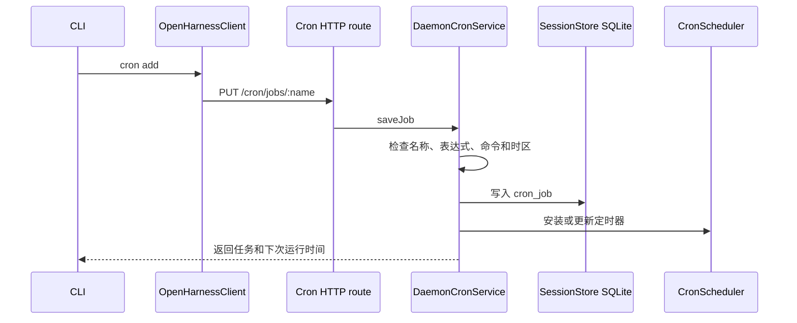
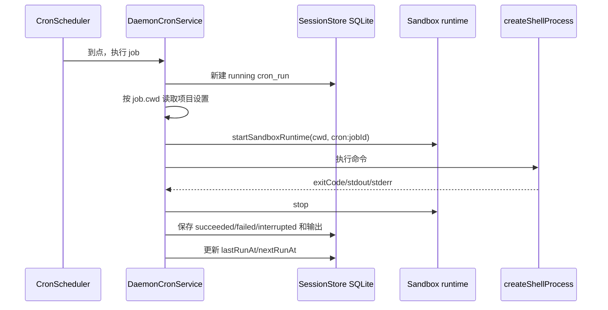

# Daemon Cron 运行流程

> 本文以当前代码为准。Cron 就是“到了指定时间运行一条命令”。它由主 daemon 管理，不再有单独的 Cron 后台进程。

## 一句话结论

任务定义、开关和每次运行结果都保存在 daemon 的 SQLite。主 daemon 启动时恢复定时器，关闭时停止定时器和正在执行的命令。daemon 没有运行，Cron 就不会运行。

## 模块分工

| 模块 | 文件 | 做什么 |
|---|---|---|
| CLI | `apps/cli/src/commands/cron.ts` | 把用户命令发给主 daemon，不直接读写任务文件 |
| HTTP 客户端 | `packages/client/src/client.ts` | 调用 `/cron/*` 接口 |
| HTTP 路由 | `packages/server/src/http/routes/cron.ts` | 检查请求参数并调用 Cron 服务 |
| Cron 服务 | `packages/server/src/daemon-cron-service.ts` | 管任务、定时器、执行、停止和运行记录 |
| 时间调度 | `packages/services/src/cron/index.ts` | 计算下次运行时间，到点后调用 daemon 传入的执行函数 |
| 数据库 | `packages/services/src/session-runtime/store.ts` | 读写 `cron_job` 和 `cron_run` |
| Sandbox | `packages/sandbox/src/lifecycle.ts` | 按任务的 `cwd` 准备执行环境 |

## 添加任务



没有旧数据迁移。以前的 `cron_jobs.json`、`cron_history.jsonl`、日志目录和 `cron.pid` 不再读取。

## 到点执行



同一个任务还没结束时不会再次并发执行。手动运行同样走这条链路，因此不会绕过 Sandbox 或运行记录。

远期任务不会把一年时间一次性交给系统定时器，而是分段等待，到点后才执行。下次时间按任务时区计算，支持闰日；日期和星期同时指定时，符合其中一个就会运行，这是常见 Cron 的规则。

删除任务只删除任务定义，不删除已经发生的运行记录，所以之后仍可用原任务名查询历史。

## Agent 工具怎么接入

Agent Framework 不依赖 daemon 数据库。它只定义一个可选的 `AgentCronEffects` 回调组：保存、删除、列表、开关和立即运行。

daemon 创建 Agent 时把 `DaemonCronService` 注入这些回调。只有宿主提供了 Cron，工具列表里才会出现 `CronCreate`、`CronList`、`CronToggle`、`CronDelete` 和 `RemoteTrigger`。纯 SDK 应用没有注入 Cron 时，不会看到这些工具。

```text
Agent Cron tool
  -> AgentCronEffects callback
  -> DaemonCronService
  -> SQLite + CronScheduler + Sandbox
```

这样 CLI、Web 和 Agent 工具看到的是同一份任务，不会再出现一边创建、另一边查不到。

## daemon 启停

- daemon 启动：读取 SQLite 中全部任务，为启用的任务安装定时器；上次未结束的记录改为 `interrupted`。
- daemon 正常关闭：先停止定时器，再取消正在执行的命令，等待清理完成后关闭数据库。
- daemon 崩溃：SQLite 中的 `running` 记录会在下次启动时改为 `interrupted`。
- 机器重启：用户级 `settings.json` 的 `daemon.autoStart` 开启后，操作系统会在当前用户登录时启动主 daemon，并在它崩溃后恢复。`ohs daemon install` 可以开启并立即应用该设置。Cron 没有自己的第二个守护进程。完整流程见 [Daemon 系统常驻流程](./daemon-system-service.md)。

## 常用命令

```bash
ohs cron add nightly "0 2 * * *" "pnpm test" --cwd D:/code/project
ohs cron list
ohs cron run nightly
ohs cron history nightly -n 10
ohs cron logs nightly -n 10
ohs cron toggle nightly off
ohs cron remove nightly
```
