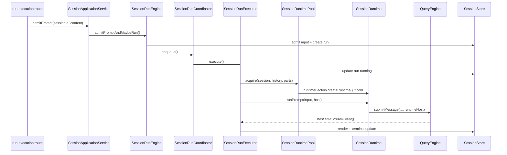

# Daemon Runtime 代码权威导览

> 目的：对照真实代码快速找到运行流程和归属边界。本文优先服务“我现在要查某个行为”的阅读场景。
>
> 总图见 [`daemon-runtime-flow-map.md`](./daemon-runtime-flow-map.md)。host 边界设计和 Phase 5B 状态见 [`runtime-host-port-design.md`](./runtime-host-port-design.md)。

## 0. 先记住当前分层

```text
routes
  -> Application / Query / Maintenance / Control / Task / Permission services
  -> SessionRunEngine when a run is needed
  -> SessionRunExecutor for one admitted run
  -> SessionRuntimePool
  -> SessionRuntimeFactory
  -> CliSessionRuntime
  -> QueryEngine
  -> ToolContext.runtimeHost for permission/event/child-agent capabilities
```

daemon 复杂的根因不是 route 多，而是 runtime 执行权从客户端进程挪到了长期存活的 server 进程，所以同一件事要同时处理：

- HTTP transport
- durable store
- session lane
- runtime lifecycle
- permission live handle + durable projection
- child session/task projection
- SSE replay

## 1. 请求入口：四个主服务加两个专项服务

| 服务 | 文件 | 负责 |
|---|---|---|
| `SessionApplicationService` | `packages/server/src/http/session-application-service.ts` | session 创建/更新/归档、prompt/resume/interrupt、child session |
| `SessionQueryService` | `packages/server/src/http/session-query-service.ts` | session list/state/messages/parts 只读查询 |
| `SessionMaintenanceService` | `packages/server/src/http/session-maintenance-service.ts` | MCP/usage/export/compact/rewind/remember |
| `DaemonControlService` | `packages/server/src/http/daemon-control-service.ts` | health/debug/busy guard/runtime invalidation |
| `SessionTaskService` | `packages/server/src/http/session-task-service.ts` | HTTP task 与 session task projection 查询/停止 |
| `StorePermissionBroker` | `packages/server/src/permission-broker.ts` | permission request projection 和 reply |

route 文件只做三件事：解析参数、映射 HTTP status、调用 service。入口集中在：

| HTTP 范围 | route 文件 |
|---|---|
| sessions/query | `packages/server/src/http/routes/session.ts` |
| prompt/resume/interrupt | `packages/server/src/http/routes/run-execution.ts` |
| maintenance | `packages/server/src/http/routes/session-utility.ts` |
| system/settings/service | `packages/server/src/http/routes/system.ts`, `service.ts` |
| tasks | `packages/server/src/http/routes/task.ts` |
| permissions | `packages/server/src/http/routes/permission.ts` |
| events | `packages/server/src/http/routes/events.ts` |

## 2. Prompt 运行链



关键文件：

| 步骤 | 文件 |
|---|---|
| admission/idempotency/steer | `packages/server/src/http/session-run-engine.ts` |
| lane 串行 | `packages/server/src/run-coordinator.ts` |
| 单次 run 执行 | `packages/server/src/http/session-run-executor.ts` |
| runtime 缓存 | `packages/server/src/http/session-runtime-pool.ts` |
| runtime contract | `packages/server/src/runtime.ts` |
| CLI runtime adapter | `apps/cli/src/session-runtime.ts`, `apps/cli/src/runtime.ts` |
| QueryEngine | `packages/core/src/engine/query-engine.ts` |

## 3. RuntimeHostPort 注入点

`SessionRunExecutor` 是 host 的唯一创建点：

```text
SessionRunExecutor.execute()
  -> childAgentHostFactory.create({ scope, session })
  -> new DaemonRuntimeHostPort({ scope, childAgentHost, emitEvent, emitStreamEvent, requestPermission })
  -> runtime.runPrompt(input, host)
```

当前 `SessionRuntimeFactory.createRuntime()` 只接收：

```text
session + history + parts
```

它不再接收 `childSessionHost` 或 `sessionTaskBridge`。这条旧透传已删除，避免 runtimeFactory 变成应用层句柄搬运工。

## 4. 工具运行授权

查询路径：

```text
QueryEngine tool call
  -> permission checker
  -> runtimeHost.requestPermission()
  -> DaemonRuntimeHostPort.requestPermission()
  -> StorePermissionBroker.ask()
  -> PermissionController live handle
  -> SessionStore durable request
  -> SSE to client
  -> POST /permissions/:id/reply
  -> resolve live handle
  -> QueryEngine continues or denies tool result
```

关键文件：

| 问题 | 文件 |
|---|---|
| tool 何时需要授权 | `packages/core/src/engine/query-engine.ts` |
| tool context 如何携带 host | `packages/core/src/types/tools.ts` |
| host permission adapter | `packages/server/src/http/daemon-runtime-host.ts` |
| live handle | `packages/server/src/permission-controller.ts` |
| durable projection / reply | `packages/server/src/permission-broker.ts` |
| HTTP routes | `packages/server/src/http/routes/permission.ts` |

状态归属：

| 状态 | 归属 |
|---|---|
| pending live promise | `PermissionController` |
| durable request/decision | `SessionStore` |
| UI 展示 | `SessionEventPublisher` + `HttpEventHub` |

## 5. Agent / child session

当前主路径：

```text
Agent tool
  -> context.runtimeHost.spawnChildAgent()
  -> DaemonRuntimeHostPort.spawnChildAgent()
  -> DaemonChildAgentHostFactory.create()
  -> DaemonChildAgentHost.spawnChildAgent()
  -> DaemonChildSessionHost.createChildSession()
  -> SessionApplicationService.createChildSession()
  -> SessionTaskBridge.registerSessionTask()
  -> childSessionHost.admitPrompt()
  -> child run enters normal SessionRunEngine lane
  -> childSessionHost.awaitRun()
  -> SessionTaskBridge.completeSessionTask()
```

重要结论：

- Agent tool 不再使用 `ChildSessionBackend`。
- CLI bootstrap 不再注册 `registerChildSessionBackend()`。
- Workflow 默认 worker spawn 也走 `runtimeHost.spawnChildAgent()`。
- `ChildSessionHost` 和 `SessionTaskBridge` 仍存在，但由 `DaemonChildAgentHostFactory` 组装后收进 `DaemonChildAgentHost`，不再穿过 runtimeFactory、QueryEngine 或 `SessionRunExecutor`。

关键文件：

| 问题 | 文件 |
|---|---|
| Agent schema/execute | `packages/tools/src/agent/index.ts` |
| SendMessage follow-up | `packages/tools/src/agent/index.ts` |
| Workflow worker spawn | `packages/tools/src/agent/workflow-runner.ts` |
| Tool context host 类型 | `packages/core/src/types/tools.ts`, `packages/core/src/types/runtime.ts` |
| child-agent host factory | `packages/server/src/http/child-agent-host-factory.ts` |
| daemon child adapter | `packages/server/src/http/daemon-child-agent-host.ts` |
| child session host | `packages/server/src/http/daemon-child-session-host.ts` |
| task projection bridge | `packages/server/src/http/session-task-bridge.ts` |
| child session create/admit/await | `packages/server/src/http/session-application-service.ts` |

## 6. isolated worktree

`Agent` 或 workflow task 传 `isolate: true` 时：

```text
DaemonChildAgentHost.spawnChildAgent()
  -> resolve git repo root
  -> compute daemon config worktree base dir
  -> git worktree add -B worktree-<slug> <path> HEAD
  -> child session cwd = worktree path
  -> parent task cwd = worktree path
  -> invocation returns worktree { path, branch }
```

cleanup：

- spawn 失败：force remove newly-created worktree。
- interrupt child agent：如果 worktree 没有 changes，则 remove；有 changes 则保留。

关键文件：

| 问题 | 文件 |
|---|---|
| worktree 创建/清理 | `packages/server/src/http/daemon-child-agent-host.ts` |
| isolate 参数来源 | `packages/tools/src/agent/index.ts`, `packages/tools/src/agent/workflow-runner.ts` |

## 7. SSE / snapshot

```text
service/use case mutates SessionStore
  -> SessionEventPublisher.checkpoint()
  -> publishSince()
  -> HttpEventHub
  -> client snapshot/SSE reducer
```

关键文件：

| 问题 | 文件 |
|---|---|
| event cursor | `packages/server/src/http/session-event-publisher.ts` |
| SSE hub | `packages/server/src/http/event-hub.ts` |
| client sync | `packages/client/src/client.ts`, `packages/client/src/sync.ts`, `packages/client/src/reducer.ts` |
| frontend hook | `apps/frontend/src/hooks/useServerSync.ts` |

## 8. Archive / interrupt

session archive：

```text
DELETE /sessions/:id
  -> SessionApplicationService.archiveSessionTree()
  -> children first
  -> mark closing
  -> interrupt active run
  -> wait until settled
  -> close runtime
  -> mark archived
```

child-agent stop：

```text
DaemonChildAgentHost.interruptChildAgent()
  -> childSessionHost.interrupt()
  -> childSessionHost.closeRuntime()
  -> childSessionHost.archive()
  -> sessionTaskBridge.completeSessionTask(stopped)
  -> clean worktree when safe
```

## 9. 快速问答

| 问题 | 答案 |
|---|---|
| 现在客户端请求主要进入哪些服务？ | `Application / Query / Maintenance / Control` 是主四类；另有 `Task` 和 `Permission` 专项服务。 |
| runtimeFactory 还注入 child host 吗？ | 不注入。factory 只拿 session/history/parts。 |
| permission 是 daemon 业务还是 framework 能力？ | live request 是 runtime-host 能力；daemon 负责 durable projection 和 HTTP/SSE transport。 |
| Agent tool 还走旧 `ChildSessionBackend` 吗？ | 不走。主路径是 `ToolRuntimeHost.spawnChildAgent()`。 |
| child session 的 durable truth 在哪？ | `SessionStore`，通过 `SessionApplicationService` 写入。 |
| parent 看到的 child task 在哪？ | `SessionTaskBridge` 写 `SessionTaskRecord`，`SessionTaskService` 查询。 |
| QueryEngine 为什么不直接 import daemon？ | 因为它只依赖 core/tool context 中的 `runtimeHost` 抽象。 |
