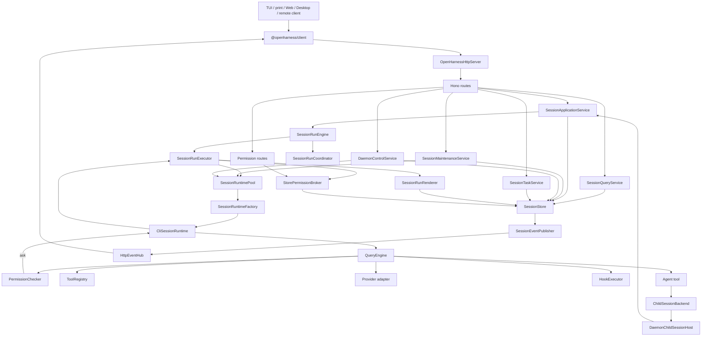
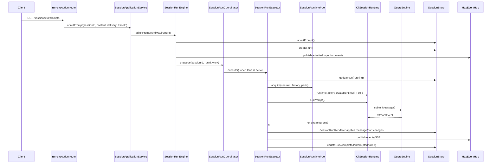
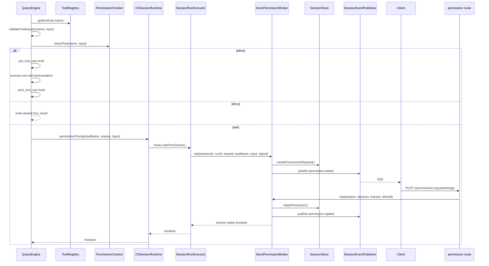
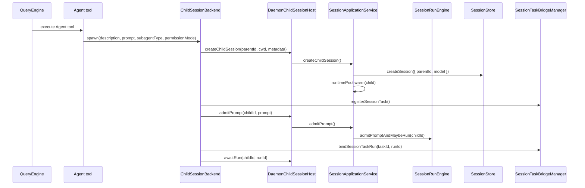

# Daemon Runtime 代码权威导览

> 目标：这是一份对照真实代码阅读 daemon 运行链路的入口文档。你遇到一个问题时，应该能先在这里找到对应流程，再跳到具体文件。
>
> 定位：本文描述当前主线代码，不是路线图。若本文和代码冲突，以代码为准，并优先修本文。
>
> 互补阅读：想先看图和闭环，读 [`daemon-runtime-flow-map.md`](./daemon-runtime-flow-map.md)；想看设计取舍，读 [`daemon-session-runtime-design.md`](./daemon-session-runtime-design.md)。
>
> 后续 framework/host 边界演进可行性见 [`agent-host-boundary-feasibility.md`](./agent-host-boundary-feasibility.md)。

## 0. 先建立一个最重要的认识

daemon 不是把旧的进程内调用简单包一层 HTTP。

它把 runtime 所有权从客户端挪到了长期存活的 server 进程里。因此一次用户操作会被拆成几段：

```text
client action
  -> HTTP route
  -> daemon service
  -> durable store / runtime pool / run lane
  -> SessionRuntime
  -> QueryEngine
  -> tool / provider / hooks
  -> durable events
  -> SSE back to clients
```

旧世界里很多操作是“直接调用对象”。daemon 世界里同一件事必须多处理：

| 事情 | 为什么存在 |
|---|---|
| HTTP DTO / status code | 客户端和 runtime 不共享调用栈 |
| trace id | 一次 HTTP 请求要串到 run、permission、日志和事件 |
| durable run/input/task/permission | 客户端断线或 daemon 重启后仍要可审计 |
| snapshot + SSE | UI 不能直接观察 daemon 内存对象 |
| runtime pool | runtime 生命周期长于单次 HTTP 请求 |
| run lane | 同 session 串行，不同 session 并发 |
| explicit interrupt/recovery | 进程中断不能伪装成 provider 续传 |

所以读代码时不要把 route 当业务核心。当前主线的核心形态是：

```text
routes are HTTP adapters
services are daemon use cases
run engine owns admission and lane semantics
run executor owns one run execution
runtime pool owns SessionRuntime lifecycle
SessionStore owns durable truth
SessionEventPublisher owns store-event to SSE publication
```

## 1. 一张总图看懂当前代码



这张图里有三条最常读的线：

1. 查询线：`route -> SessionQueryService -> SessionStore -> JSON`
2. 执行线：`route -> SessionApplicationService -> SessionRunEngine -> SessionRunExecutor -> SessionRuntime -> QueryEngine`
3. 事件线：`SessionStore -> SessionEventPublisher -> HttpEventHub -> SSE client`

## 2. 从客户端请求到服务的分流表

入口在 [`packages/server/src/http.ts`](../packages/server/src/http.ts) 的 `mountRoutes()`。

| HTTP 入口 | route 文件 | 进入的主要对象 | 说明 |
|---|---|---|---|
| `GET /health` | `http/routes/system.ts` | `DaemonControlService.runtimeSnapshot()` | daemon 存活和概要状态 |
| `GET /debug/runtime` | `http/routes/system.ts` | `DaemonControlService.runtimeSnapshot()` | 更细的 runtime/debug 状态 |
| `GET /commands` | `http/routes/system.ts` | `CommandCatalogProvider` | slash command catalog |
| `GET /settings`, `PATCH /settings` | `http/routes/system.ts` | settings service + `DaemonControlService` guard | 全局设置，可能关闭 runtime |
| `/memory/*` | `http/routes/memory.ts` | memory service + `DaemonControlService` guard | cwd 级 memory，active run 时拒绝危险变更 |
| `/auth/*` | `http/routes/auth.ts` | auth service + `DaemonControlService` guard | 认证变更，active run 时拒绝 |
| `/providers`, `/context`, `/dream`, `/profiles`, `/output-style`, `/plugins`, `/agents`, `/hooks` | `http/routes/service.ts` | service APIs + `DaemonControlService` | daemon 级控制/检查 |
| `/git/*` | `http/routes/git.ts` | `gitService` | git 操作，不走 session runtime |
| `/tasks/*` | `http/routes/task.ts` | `SessionTaskService` | HTTP shell task 和 session task projection |
| `/permissions/*` | `http/routes/permission.ts` | `StorePermissionBroker` | 权限请求查询和回复 |
| `GET /sessions` | `http/routes/session.ts` | `SessionQueryService.listSessions()` | session 列表，只读 |
| `POST /sessions` | `http/routes/session.ts` | `SessionApplicationService.createSession()` | 创建 session 并异步 warm runtime |
| `GET /sessions/:id` | `http/routes/session.ts` | `SessionApplicationService.getSession({ warm: true })` | 读 session，同时 warm runtime |
| `PATCH /sessions/:id` | `http/routes/session.ts` | `SessionApplicationService.updateSession()` | 更新 session；runtime metadata 变更会 guard |
| `DELETE /sessions/:id` | `http/routes/session.ts` | `SessionApplicationService.archiveSessionTree()` | 递归归档 child session |
| `GET /sessions/:id/state` | `http/routes/session.ts` | `SessionQueryService.getSessionState()` | snapshot 主入口 |
| `GET /sessions/:id/messages` | `http/routes/session.ts` | `SessionQueryService.listMessages()` | message 查询 |
| `GET /sessions/:id/parts` | `http/routes/session.ts` | `SessionQueryService.listMessageParts()` | message part 查询 |
| `POST /sessions/:id/commands` | `http/routes/session.ts` | command expand + `SessionApplicationService.admitPrompt()` | template/skill slash command 展开后进普通 prompt |
| `POST /sessions/:id/prompts` | `http/routes/run-execution.ts` | `SessionApplicationService.admitPrompt()` | 用户 prompt 主入口 |
| `POST /sessions/:id/runs/:runId/resume` | `http/routes/run-execution.ts` | `SessionApplicationService.resumeRun()` | 中断 run 的显式 prompt replay |
| `POST /sessions/:id/interrupt` | `http/routes/run-execution.ts` | `SessionApplicationService.interruptSession()` | 中断 active/queued run |
| session utility routes | `http/routes/session-utility.ts` | `SessionMaintenanceService` | mcp/usage/export/compact/rewind/remember |
| `GET /events`, `GET /events/stream` | `http/routes/events.ts` | `HttpEventHub` | event replay 和 SSE |

读 route 时只看三件事：

1. 参数怎么解析。
2. 错误怎么映射成 HTTP status。
3. 调哪个 service 方法。

只要开始出现“状态归属”“runtime 生命周期”“执行顺序”，应该往 service / engine / executor 看。

## 3. 五个服务边界

### 3.1 `SessionQueryService`

文件：[`packages/server/src/http/session-query-service.ts`](../packages/server/src/http/session-query-service.ts)

它是 session 的只读 facade。

| 方法 | 真实动作 |
|---|---|
| `listSessions()` | 调 `store.listSessions()`，默认过滤 child session，并用 `resolveSessionListTitle()` 补列表标题 |
| `getSession()` | 直接读 session |
| `getSessionState()` | 返回 snapshot 需要的聚合状态 |
| `listMessages()` | 读 canonical messages |
| `listMessageParts()` | 读 durable message parts |

它不做：

- warm runtime
- 创建 run
- 写事件
- HTTP 参数解析

如果你在查“客户端 state/snapshot 为什么长这样”，先看这里和 `SessionStore`。

### 3.2 `SessionApplicationService`

文件：[`packages/server/src/http/session-application-service.ts`](../packages/server/src/http/session-application-service.ts)

它是 daemon 业务写路径，HTTP routes 和 child session host 都复用它。

| 方法 | 真实动作 |
|---|---|
| `createSession()` | `store.createSession()`，发布事件，异步 `runtimePool.warm()` |
| `getSession({ warm })` | 读 session，必要时 warm runtime |
| `updateSession()` | merge metadata；runtime 相关 metadata 变更时要求 session 无 active/queued run；变更后关闭 runtime |
| `admitPrompt()` | 转给 `SessionRunEngine.admitPromptAndMaybeRun()` |
| `resumeRun()` | 校验 interrupted source run/input、幂等 recovery，再重新 admit 原始 prompt |
| `interruptSession()` | 转给 `SessionRunEngine.interruptSession()` |
| `awaitRun()` | 等 run 终态并汇总输出，供 child session backend 用 |
| `closeRuntime()` | 关闭某个 session runtime |
| `createChildSession()` | 校验 parent，创建 child session，继承 parent model，warm child runtime |
| `archiveSessionTree()` | 先递归 archive children，再 closing、interrupt、wait、close runtime、archive |

如果你在查“这个操作会不会写 store / 会不会关闭 runtime / 会不会发 SSE”，大概率从这里开始。

### 3.3 `SessionMaintenanceService`

文件：[`packages/server/src/http/session-maintenance-service.ts`](../packages/server/src/http/session-maintenance-service.ts)

它处理 session 维护类动作，不负责 prompt admission。

| 方法 | 真实动作 |
|---|---|
| `listMcpServers()` | warm runtime，读 `runtime.inspect().mcpServers` |
| `getUsage()` | warm runtime，读 runtime usage；无 runtime usage 时用 message count 兜底 |
| `exportSession()` | 从 store 取 session/messages/parts，写 export 文件 |
| `compact()` | 要求无 active run；调用 `runtime.compact()`；用 `store.replaceTranscript()` 替换 transcript |
| `rewind()` | 要求无 active run；计算要保留的 transcript；替换 store transcript；关闭 runtime |
| `remember()` | 要求同 cwd 无 active run；调用 `runtime.remember()`；关闭同 cwd runtimes |

如果你在查 `/compact`、`/rewind`、`/remember` 为什么拒绝执行，看这里的 guard。

### 3.4 `DaemonControlService`

文件：[`packages/server/src/http/daemon-control-service.ts`](../packages/server/src/http/daemon-control-service.ts)

它是 daemon 控制面，不拥有业务内容。

| 方法 | 用途 |
|---|---|
| `runtimeSnapshot()` | 汇总 sessions/runs/tasks/permissions、SSE client count、warm runtime count、active/queued run count |
| `hasAnyActiveRuns()` | 全局 mutation guard |
| `hasActiveRunsForCwd()` | cwd mutation guard |
| `closeAllRuntimes()` | 全局设置/auth/plugin 变更后关闭 runtime |
| `closeRuntimesForCwd()` | cwd 级 memory/plugin 变更后关闭 runtime |
| `sessionExists()` | hooks inspect 前校验 session |
| `inspectRuntimeHooks()` | warm runtime 后读 hooks inspect |

如果你在查“为什么改设置要等 run idle”，看 control service 和调用它的 route。

### 3.5 `SessionTaskService`

文件：[`packages/server/src/http/session-task-service.ts`](../packages/server/src/http/session-task-service.ts)

它是 HTTP task API 的 use case facade。

| 方法 | 真实动作 |
|---|---|
| `list()` | 无 sessionId 时读 `TaskManager`；有 sessionId 时先 project manager task，再读 durable `SessionTaskRecord` |
| `create()` | 创建 shell task；有 sessionId 时创建 durable task projection 并 track/sync |
| `get()` | 有 sessionId 时以 durable projection 为准，manager output 可用则补 output |
| `stop()` | 停 manager task；有 persisted task 时 sync 回 store |

child Agent 的 task 投影还会经过 [`session-task-bridge.ts`](../packages/server/src/http/session-task-bridge.ts)。`SessionTaskService` 主要面向 HTTP `/tasks`。

## 4. Prompt 从 HTTP 到模型执行

最常查的问题：“用户输入是怎么跑起来的？”



关键文件：

| 阶段 | 文件 |
|---|---|
| HTTP 参数解析 | `packages/server/src/http/routes/run-execution.ts` |
| prompt admission / steer / queue | `packages/server/src/http/session-run-engine.ts` |
| lane 串行并发 | `packages/server/src/run-coordinator.ts` |
| 单次 run 执行 | `packages/server/src/http/session-run-executor.ts` |
| runtime 创建/缓存/关闭 | `packages/server/src/http/session-runtime-pool.ts` |
| runtime factory | `apps/cli/src/session-runtime.ts` |
| QueryEngine bootstrap | `apps/cli/src/runtime.ts` |
| 模型和工具循环 | `packages/core/src/engine/query-engine.ts` |
| stream 转 durable message parts | `packages/server/src/http/run-renderer.ts` |

### 4.1 admission 规则

`SessionRunEngine.admitPromptAndMaybeRun()` 负责：

1. 生成或复用 trace id。
2. 如果传了稳定 input id，检查幂等性。
3. `store.admitPrompt()` 写入 input。
4. `delivery: "steer"` 且同 session 有 active run 时，不创建新 run，只 `mergeWake()`。
5. 否则 `store.createRun()`。
6. 通过 `SessionRunCoordinator.enqueue()` 进入 session lane。
7. 记录 run promise，供 `awaitRun()` / archive 等待。

这里不执行模型。模型执行在 `SessionRunExecutor`。

### 4.2 execution 规则

`SessionRunExecutor.execute()` 负责：

1. 加载 session、history、parts、input。
2. 将 run 改为 `running`。
3. 创建 `SessionRunRenderer` state。
4. 通过 `runtimePool.acquire()` 拿 runtime。
5. 调 `runtime.runPrompt()`。
6. 把 runtime event 和 stream event 写入 store 并发布。
7. 工具开始/结束写 observability log。
8. 注入 `askPermission()` 到 runtime hooks。
9. 正常结束时改为 `completed`；abort 时改为 `interrupted`；异常时改为 `failed`。
10. 异常会关闭该 session runtime，避免污染下次 run。

## 5. RuntimeFactory 到 QueryEngine

最常查的问题：“`runtimeFactory` 到底注入了什么？”

```text
SessionRuntimePool.acquire(session, history, parts)
  -> runtimeFactory.createRuntime({
       session,
       history,
       parts,
       childSessionHost,
       sessionTaskBridge,
     })
  -> createCliSessionRuntimeFactory()
  -> load skills/plugins
  -> bootstrap()
  -> QueryEngine(apiClient, toolRegistry, permissionChecker, hookExecutor, options)
  -> registerChildSessionBackend()
  -> attachSandboxRuntime()
  -> CliSessionRuntime
```

关键代码在：

- [`packages/server/src/http/session-runtime-pool.ts`](../packages/server/src/http/session-runtime-pool.ts)
- [`apps/cli/src/session-runtime.ts`](../apps/cli/src/session-runtime.ts)
- [`apps/cli/src/runtime.ts`](../apps/cli/src/runtime.ts)

`SessionRuntimePool` 的职责很窄：

| 方法 | 说明 |
|---|---|
| `warm(sessionId)` | 如果 runtimeFactory 存在且 session 未归档，异步预热 runtime |
| `get(sessionId)` | 返回已缓存 runtime |
| `acquire(session, history, parts)` | 复用或创建 runtime |
| `close(sessionId)` | 删除缓存并调用 runtime.close() |
| `closeForCwd(cwd)` | 关闭同 cwd sessions 的 runtime |
| `closeAll()` | 关闭所有 warm runtime |

`createCliSessionRuntimeFactory()` 会把持久 session metadata 映射成 runtime overrides：

| session metadata | runtime override |
|---|---|
| `permissionMode` | `bootstrap().cliOverrides.permissionMode` |
| `systemPrompt` | custom system prompt |
| `maxTurns` | QueryEngine max turns |
| `allowedTools` | 工具 allow filter |
| `disallowedTools` | 工具 deny filter |
| `effort` | system prompt effort |

## 6. 工具运行授权

这是最容易绕的闭环之一。当前真实链路如下：



查代码时按这个顺序：

| 问题 | 文件 / 方法 |
|---|---|
| 工具是否存在、参数 schema 在哪校验 | `packages/core/src/engine/query-engine.ts`, `executeToolCalls()` |
| allow / deny / ask 怎么判断 | `packages/permissions/src/index.ts`, `PermissionChecker.checkTool()` |
| daemon 怎么把 ask 变成持久请求 | `packages/server/src/http/session-run-executor.ts`, `askPermission` callback |
| 权限请求如何落库、复用、等待、过期 | `packages/server/src/permission-broker.ts`, `StorePermissionBroker.ask()` |
| 客户端从哪里查 pending permissions | `packages/server/src/http/routes/permission.ts`, `GET /permissions` |
| 客户端回复后如何唤醒 run | `StorePermissionBroker.reply()` resolves waiter |
| child session 权限为什么显示到 parent | `StorePermissionBroker.resolvePermissionSessionId()` 和 `sessionLineage()` |
| session 级 approval 如何复用 | `StorePermissionBroker.findSessionApproval()` |

### 6.1 QueryEngine 内的顺序

`QueryEngine.executeToolCalls()` 的硬顺序是：

```text
tool lookup
  -> input schema validation
  -> PermissionChecker.checkTool()
  -> if deny: tool_result isError
  -> if ask: permissionPrompt()
  -> pre_tool_use hook
  -> execute tool with timeout + abort signal
  -> post_tool_use hook
  -> return tool_result
```

注意两个边界：

- schema 校验失败时，不会进入 permission。
- `pre_tool_use` hook block 时，不会执行工具。

### 6.2 PermissionChecker 和 PermissionBroker 的分工

| 对象 | 职责 |
|---|---|
| `PermissionChecker` | 本地策略判断：mode、allowed/denied tools、pathRules、deniedCommands、autoApproveTools |
| `StorePermissionBroker` | daemon 持久询问：创建 request、发 SSE、等待客户端回复、复用 session approval、处理 abort expire |

也就是说，`PermissionChecker` 决定是否要问；`PermissionBroker` 负责真的问人并等待答案。

### 6.3 child session 权限为什么走 parent

`StorePermissionBroker.ask()` 先调用：

```text
permissionSessionId = resolvePermissionSessionId(input.sessionId)
```

`resolvePermissionSessionId()` 会沿着 `session.parentId` 找到 lineage 最末端，也就是最上层 parent session。于是：

- child tool ask 会落在 parent session 上。
- request payload 会带 `childSessionId` / `childRunId`。
- parent session 的 `decision: "session"` approval 可以被 child 后续 ask 复用。

## 7. Agent 到 child session

最常查的问题：“Agent 工具为什么能创建并等待子会话？”



关键文件：

| 逻辑 | 文件 |
|---|---|
| Agent 工具定义和输入校验 | `packages/tools/src/agent/index.ts` |
| child backend 协议 | `packages/swarm/src/child-session.ts` |
| daemon host adapter | `packages/server/src/http/daemon-child-session-host.ts` |
| child session use case | `packages/server/src/http/session-application-service.ts` |
| task projection bridge | `packages/server/src/http/session-task-bridge.ts` |
| runtime 注册 child backend | `apps/cli/src/runtime.ts`, `registerChildSessionBackend()` |

重要边界：

- `DaemonChildSessionHost` 不直接写 store，它转给 `SessionApplicationService`。
- child run 仍走同一套 `SessionRunEngine -> SessionRunExecutor -> SessionRuntimePool`。
- parent 可见 task 状态由 `SessionTaskBridgeManager` 投影到 durable `SessionTaskRecord`。
- daemon 重启后 child message/run 仍可审计，但进程内 callback 不会复活。

## 8. Task projection 和 `TaskWait`

daemon 里有两类 task：

| 来源 | 主路径 |
|---|---|
| HTTP `/tasks` shell task | `SessionTaskService -> TaskManager -> optional SessionTaskRecord` |
| Agent child task | `ChildSessionBackend -> SessionTaskBridgeManager -> SessionTaskRecord` |

`SessionTaskRecord` 是客户端和 parent session 看到的 durable projection。`TaskManager` 只保存当前进程内执行能力、callback、stdin 和输出读取。

查问题时这样分：

| 问题 | 文件 |
|---|---|
| `/tasks` create/list/get/stop | `packages/server/src/http/routes/task.ts` |
| HTTP task use case | `packages/server/src/http/session-task-service.ts` |
| child task 如何注册到 parent | `packages/server/src/http/session-task-bridge.ts` |
| TaskManager 实现 | `packages/services/src/tasks/index.ts` |
| Agent/TaskWait 工具 | `packages/tools/src/agent/index.ts`, `packages/tools/src/agent/workflow.ts` |

## 9. 事件、SSE 和 trace

最常查的问题：“客户端为什么能恢复同一个状态？”

```text
write to SessionStore
  -> store appends session_event with seq
  -> SessionEventPublisher.publishSince(previousSeq)
  -> HttpEventHub broadcasts events after previousSeq
  -> @openharness/client reducer applies events
```

关键文件：

| 逻辑 | 文件 |
|---|---|
| request trace middleware | `packages/server/src/http.ts`, `mountRoutes()` |
| trace id registry | `packages/server/src/http/request-trace-registry.ts` |
| event checkpoint/publish | `packages/server/src/http/session-event-publisher.ts` |
| SSE routes and clients | `packages/server/src/http/routes/events.ts` |
| client fetch/SSE SDK | `packages/client/src/client.ts`, `packages/client/src/sync.ts` |
| reducer | `packages/client/src/reducer.ts` |

### 9.1 trace id 的两种位置

| 位置 | 用途 |
|---|---|
| request trace | middleware assign，route 通过 `RequestTraceRegistry.get(request)` 读 |
| run trace | admission 写入 input/run metadata；`SessionRunExecutor.traceIdForRun()` 保证 run 有 trace |

权限 reply route 也会取当前 request trace，但 broker log 优先使用 permission request payload 中已有的 trace。

### 9.2 什么时候用 `publish()`，什么时候用 `publishSince()`

| 方法 | 用途 |
|---|---|
| `checkpoint()` | 写 store 前记住当前 latest event seq |
| `publishSince(previousSeq)` | 写完 store 后，把新增 durable events 发给 SSE |
| `publish(event)` | text delta 等已经由 renderer 给出 live event 时直接发 |

大多数业务写路径应该是：

```text
before = events.checkpoint()
store.write()
events.publishSince(before)
```

## 10. Session 维护和 runtime invalidation

runtime 会缓存很多东西：API client、tool registry、hooks、MCP manager、QueryEngine、sandbox runtime。凡是会影响这些内容的变更，都要关闭相关 runtime，让下次 run 重新创建。

| 变更 | guard / invalidation |
|---|---|
| `PATCH /sessions/:id` 改 `permissionMode/systemPrompt/maxTurns/allowedTools/disallowedTools/effort` | session 有 active/queued run 时 409；成功后 `runtimePool.close(sessionId)` |
| `/compact` | session 有 active/queued run 时 409；replace transcript |
| `/rewind` | session 有 active/queued run 时 409；replace transcript 后 close runtime |
| `/remember` | 同 cwd 有 active run 时 409；完成后 close same-cwd runtimes |
| global settings/auth/plugin 变更 | 通常由 route 调 `DaemonControlService.hasAnyActiveRuns()` guard，再 close runtimes |
| cwd 级 memory 变更 | route 调 `hasActiveRunsForCwd(cwd)` guard，再 close same-cwd runtimes |

如果你在查“为什么这个设置不马上生效”，先看：

- [`packages/server/src/http/support.ts`](../packages/server/src/http/support.ts) 的 `runtimeSessionMetadataChanged()`
- [`packages/server/src/http/session-application-service.ts`](../packages/server/src/http/session-application-service.ts) 的 `updateSession()`
- 具体 route 里对 `DaemonControlService` 的调用

## 11. Daemon 启动和恢复

daemon 启动入口不是 HTTP route，而是 CLI serve 命令。

```text
apps/cli/src/commands/daemon.ts
  -> createCliSessionRuntimeFactory()
  -> startOpenHarnessServer()
  -> new OpenHarnessHttpServer()
  -> store.interruptActiveRuns()
  -> store.interruptActiveSessionTasks()
  -> store.finalizeClosingSessions()
  -> recoverInterruptedWorkflows()
  -> mountRoutes()
```

关键文件：

| 逻辑 | 文件 |
|---|---|
| serve/start/status/stop 命令 | `apps/cli/src/commands/daemon.ts` |
| 本机 daemon 发现和 stale 检测 | `apps/cli/src/ensure-daemon.ts`, `apps/cli/src/daemon-lifecycle.ts` |
| server composition root | `packages/server/src/http.ts` |
| workflow recovery | `packages/server/src/http/workflow-recovery.ts` |
| durable store | `packages/services/src/session-runtime` |

恢复原则：

1. daemon 不会伪造 provider stream 续传。
2. 遗留 pending/running run 会变成 `interrupted`。
3. 遗留 pending/running session task 会变成 `interrupted`。
4. `closing` session 会继续完成归档。
5. 只有带 daemon session 所有权事件的 running workflow snapshot 会被收口。

## 12. Slash command 的 daemon 路径

slash command 不等于“server 上的通用命令执行器”。

当前 server 侧只有两类：

| 入口 | 说明 |
|---|---|
| `GET /commands` | 返回 cwd 作用域 catalog 元数据 |
| `POST /sessions/:id/commands` | 对 template/skill 做 expand，展开成 prompt 后进入 `SessionApplicationService.admitPrompt()` |

客户端本地 UI 命令，例如 `/new`、`/sessions`、`/theme`、`/permissions`，不应进入 server command registry。

关键文件：

- [`packages/server/src/http/routes/session.ts`](../packages/server/src/http/routes/session.ts)
- [`packages/server/src/commands.ts`](../packages/server/src/commands.ts)
- [`packages/client/src/session-commands.ts`](../packages/client/src/session-commands.ts)
- [`docs/slash-commands-flow.md`](./slash-commands-flow.md)

## 13. 常见问题定位表

| 你想查 | 先看 |
|---|---|
| 客户端请求进入哪个服务 | `packages/server/src/http.ts` 的 `mountRoutes()` |
| 某个 endpoint 参数怎么解析 | `packages/server/src/http/routes/*.ts` |
| session list/state/messages/parts 怎么组装 | `packages/server/src/http/session-query-service.ts` |
| 创建 session 为什么会 warm runtime | `SessionApplicationService.createSession()` |
| 修改 session 为什么 409 | `SessionApplicationService.updateSession()` + `runtimeSessionMetadataChanged()` |
| prompt 为什么没有立刻执行 | `SessionRunEngine.admitPromptAndMaybeRun()`，看 runtimeFactory 是否 configured、是否 queued |
| 同 session 串行在哪里保证 | `packages/server/src/run-coordinator.ts` |
| `delivery: "steer"` 怎么合并 | `SessionRunEngine.admitPromptAndMaybeRun()` + `SessionRunCoordinator.mergeWake()` |
| run stream 怎么变成 message part | `packages/server/src/http/run-renderer.ts` |
| tool 授权顺序 | `packages/core/src/engine/query-engine.ts`, `executeToolCalls()` |
| 权限请求如何持久化和等待 | `packages/server/src/permission-broker.ts` |
| 权限 reply endpoint | `packages/server/src/http/routes/permission.ts` |
| child session 怎么创建 | `packages/server/src/http/daemon-child-session-host.ts` + `SessionApplicationService.createChildSession()` |
| Agent task 怎么回到 parent task list | `packages/server/src/http/session-task-bridge.ts` |
| `/tasks` 为什么有 sessionId 和 cwd 两种 scope | `packages/server/src/http/session-task-service.ts` |
| runtime 什么时候创建 | `packages/server/src/http/session-runtime-pool.ts` |
| runtimeFactory 具体做什么 | `apps/cli/src/session-runtime.ts` |
| QueryEngine 如何初始化工具/权限/hooks | `apps/cli/src/runtime.ts` |
| MCP server 列表从哪来 | `SessionMaintenanceService.listMcpServers()` + runtime `inspect()` |
| compact/rewind 为什么要 close runtime | `SessionMaintenanceService.compact()` / `rewind()` |
| daemon debug snapshot | `packages/server/src/http/daemon-control-service.ts` |
| SSE 事件在哪里发 | `packages/server/src/http/session-event-publisher.ts` + `routes/events.ts` |
| daemon 重启如何收口 | `packages/server/src/http.ts` constructor + `workflow-recovery.ts` |
| print/TUI 如何 attach daemon | `apps/cli/src/ensure-daemon.ts`, `apps/cli/src/print-session.ts`, `apps/cli/src/commands/main.ts` 的 `runTuiMode()` |

## 14. 测试入口

当前 daemon HTTP 层有两类测试：

| 测试 | 覆盖 |
|---|---|
| `packages/server/src/http/routes.test.ts` | route 的参数解析、错误映射和 service 调用 |
| `packages/server/src/http/*service*.test.ts` | service 自身 use case |
| `packages/server/src/http/session-run-engine.test.ts` | admission、queue、steer、interrupt |
| `packages/server/src/http/session-run-executor.test.ts` | 单次 run 执行、stream、permission、终态 |
| `packages/server/src/http/session-runtime-pool.test.ts` | runtime 创建去重、warm、close |
| `packages/server/src/permission-broker.test.ts` | permission broker 持久化、复用、child routing |
| `packages/server/src/http.test.ts` | server 集成路径 |

常用 targeted 命令：

```powershell
cd packages/server
..\..\node_modules\.bin\vitest.CMD run src/http/routes.test.ts src/http/session-run-engine.test.ts src/http/session-run-executor.test.ts src/http/session-runtime-pool.test.ts
```

提交前类型检查由 repo hook 跑：

```powershell
pnpm check-types
```

## 15. 维护这份文档的规则

改 daemon 代码时，按这个顺序检查文档是否要更新：

1. 新增 route：更新第 2 节分流表和第 13 节定位表。
2. 新增 service 或移动 use case：更新第 3 节边界。
3. 改 prompt/run/permission/child task 链路：更新第 4、6、7、8 节。
4. 改 runtimeFactory/bootstrap：更新第 5 节。
5. 改恢复或事件同步：更新第 9、11 节。

这份文档应该保持“代码入口优先”。少写愿景，多写现在打开哪个文件能看到什么。
