# Daemon Runtime Flow Map

> 目标：降低 daemon / runtimeFactory / SessionRuntime / ChildSessionHost / child session / client sync 的认知负担。本文不是替代设计文档，而是一张运行时认知地图：先看总链路，再看每个模块自己的闭环。

## 一句话模型

OpenHarness 当前主线是：

```text
CLI/TUI/print/client 只负责 attach、提交输入、展示事件
daemon 持有 SessionStore、RunCoordinator、PermissionBroker、ChildSessionHost
SessionRunEngine 把一次 prompt 变成持久 run
runtimeFactory 懒创建 session 专属 SessionRuntime
SessionRuntime 包住 QueryEngine + tools + hooks + MCP + child-session backend
QueryEngine 流式事件再被 runRenderer 落回 SessionStore + SSE
```

最容易混淆的边界：

| 名称 | 它是什么 | 它不是什么 |
|---|---|---|
| `SessionRunEngine` | daemon 内的 run 编排器：admit prompt、排队、懒创建 runtime、落事件、处理中断 | 不是模型执行器 |
| `SessionRuntimeFactory` | 把一个持久 session 变成可运行 `SessionRuntime` 的工厂 | 不直接持久化 run 状态 |
| `SessionRuntime` | 一个 session 的执行适配器，当前实现是 `CliSessionRuntime`，内部包 `QueryEngine` | 不是 HTTP server，也不是 task/child session 的事实源 |
| `ChildSessionHost` | daemon 暴露给 Agent 工具的子会话控制面：create/admit/await/interrupt/archive | 不是 child runtime 本身 |
| `ChildSessionBackend` | Agent 工具侧的 backend，实现 spawn/send/terminate，并通过 `ChildSessionHost` 操作 daemon | 不直接写 daemon store，除非经 `SessionTaskBridge` |

## 端到端总流程

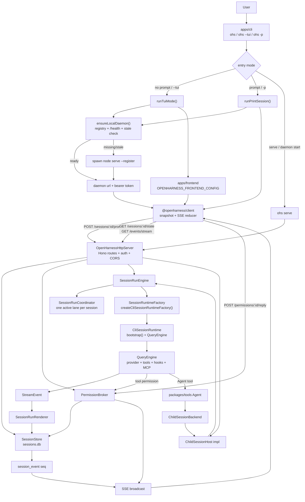

### 主链路分层

```text
client layer
  apps/cli, apps/frontend, packages/client

server control layer
  OpenHarnessHttpServer, routes, SessionRunEngine, SessionRunCoordinator, PermissionBroker

durable state layer
  SessionStore: session/input/message/part/run/task/permission/event

execution layer
  SessionRuntimeFactory -> CliSessionRuntime -> bootstrap() -> QueryEngine -> tools/provider/hooks/MCP

child-agent layer
  Agent tool -> ChildSessionBackend -> ChildSessionHost -> child SessionRunEngine path
```

## 闭环 1：Daemon 启动 / attach

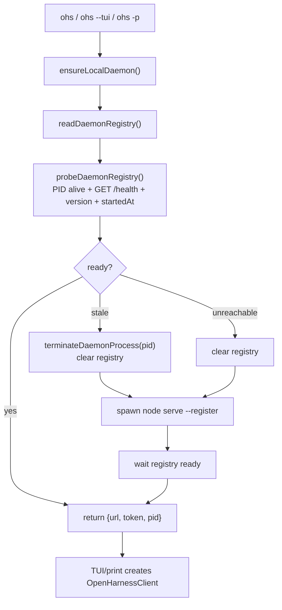

闭环要点：

| 项 | 说明 |
|---|---|
| 输入 | CLI entry、当前 CLI 文件 mtime、版本号 |
| 状态归属 | daemon registry 只用于本机发现；真实 session 状态不在 registry |
| 输出 | `{ url, token }` 给 TUI/print/client |
| 关键文件 | `apps/cli/src/ensure-daemon.ts`, `apps/cli/src/daemon-lifecycle.ts`, `apps/cli/src/commands/daemon.ts` |

## 闭环 2：HTTP server / daemon 核心对象

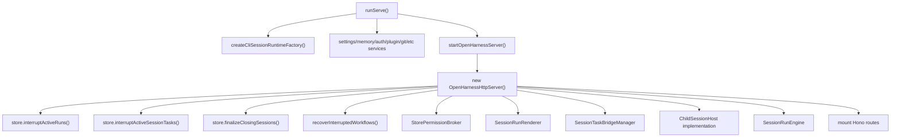

闭环要点：

| 项 | 说明 |
|---|---|
| 输入 | `runServe()` 组装的 `runtimeFactory`、服务型 API、token、storePath |
| 状态归属 | `OpenHarnessHttpServer.store` 是 daemon 权威 store |
| 启动恢复 | 遗留 running/pending run/task 会被标记 interrupted；closing session 会完成归档；daemon-owned workflow 会收口 |
| 输出 | Hono app + listener + SSE event hub |
| 关键文件 | `apps/cli/src/commands/daemon.ts`, `packages/server/src/http.ts` |

## 闭环 3：Client sync

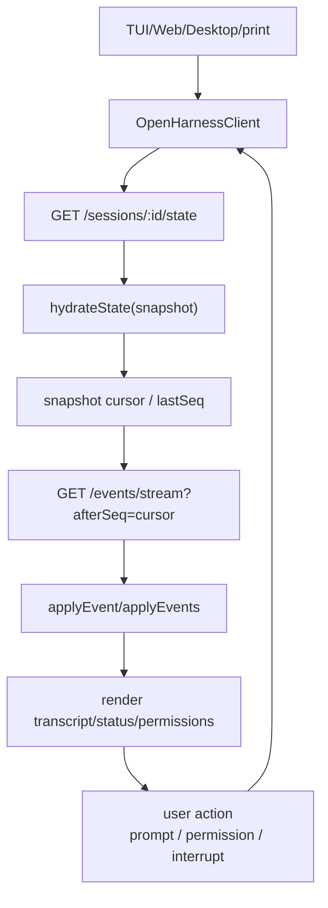

闭环要点：

| 项 | 说明 |
|---|---|
| 输入 | daemon URL/token、active session id |
| 状态归属 | client state 是投影；权威状态仍在 `SessionStore` |
| 输出 | UI transcript、status、permission modal |
| 抗断线 | snapshot + global `seq` replay；重复事件由 reducer 去重 |
| 关键文件 | `packages/client/src/client.ts`, `packages/client/src/sync.ts`, `packages/client/src/reducer.ts`, `apps/frontend/src/hooks/useServerSync.ts` |

## 闭环 4：Prompt admit -> run -> event

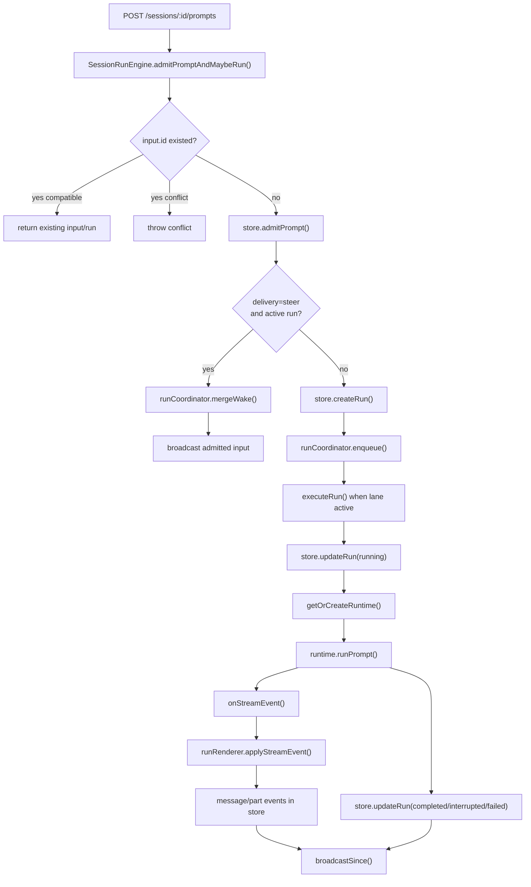

闭环要点：

| 项 | 说明 |
|---|---|
| 输入 | `sessionId`, prompt content, optional stable `input.id`, delivery |
| 状态归属 | `session_input`, `session_run`, `session_message`, `session_message_part`, `session_event` |
| 串行规则 | 同一 session 一条 lane；不同 session 可并发 |
| steer 语义 | active run 存在时不建新 run，只增加 wake，让 runtime 在 turn boundary 拉 follow-up |
| 输出 | durable message parts + run terminal state + SSE |
| 关键文件 | `packages/server/src/http/session-run-engine.ts`, `packages/server/src/run-coordinator.ts`, `packages/server/src/http/run-renderer.ts` |

## 闭环 5：runtimeFactory -> SessionRuntime

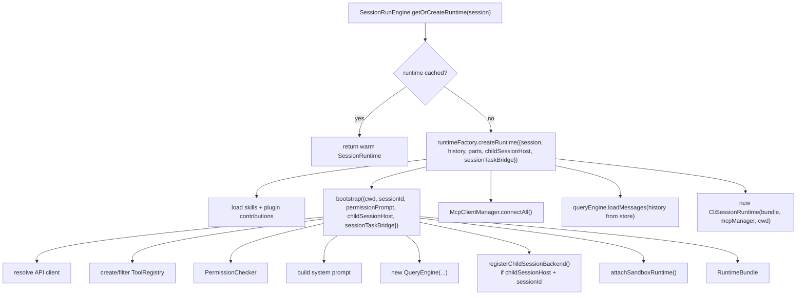

闭环要点：

| 项 | 说明 |
|---|---|
| 输入 | 持久 session、历史 messages/parts、daemon 提供的 `ChildSessionHost` 和 `SessionTaskBridge` |
| 状态归属 | warm runtime 在 `SessionRunEngine.runtimes: Map<sessionId, Promise<SessionRuntime>>` |
| 资源 | API client、ToolRegistry、hooks、MCP manager、sandbox runtime、QueryEngine |
| 输出 | 可执行 `runPrompt()` 的 `CliSessionRuntime` |
| 关键文件 | `apps/cli/src/session-runtime.ts`, `apps/cli/src/runtime.ts`, `packages/server/src/runtime.ts` |

### `CliSessionRuntime.runPrompt()` 内部闭环

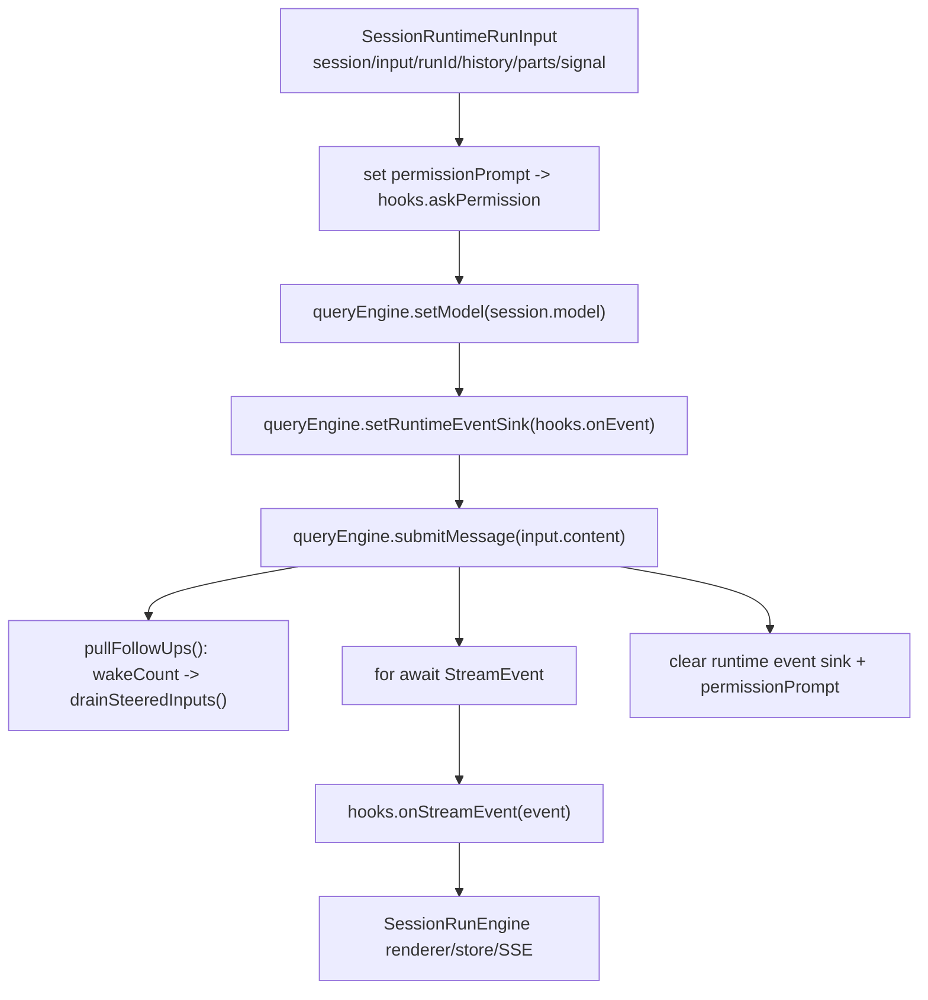

## 闭环 6：PermissionBroker

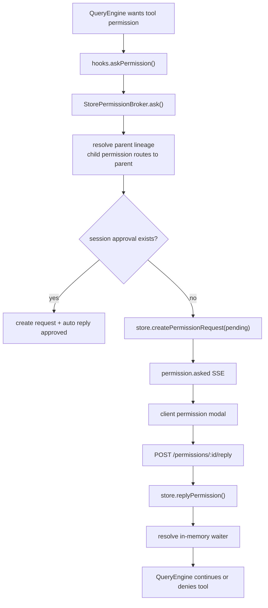

闭环要点：

| 项 | 说明 |
|---|---|
| 输入 | toolName、reason、tool input、run abort signal |
| 状态归属 | `permission_request` 表 + in-memory waiter |
| child 语义 | child session 的权限请求会沿 `parentId` 归到 parent session，payload 里保留 `childSessionId/childRunId` |
| 输出 | boolean approval 回到 QueryEngine |
| 关键文件 | `packages/server/src/permission-broker.ts`, `packages/server/src/http/routes/permission.ts` |

## 闭环 7：Agent -> ChildSessionHost -> child run

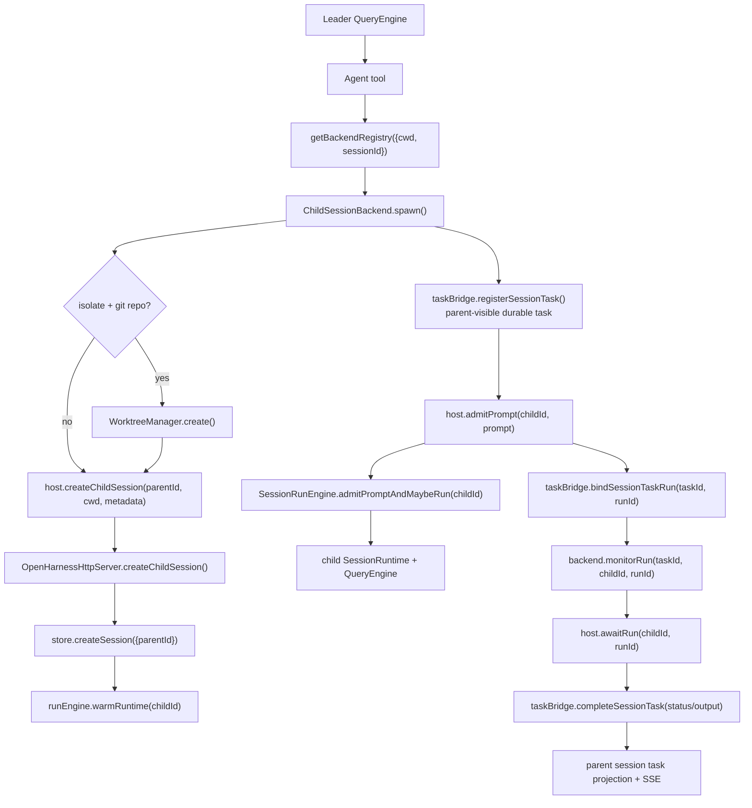

闭环要点：

| 项 | 说明 |
|---|---|
| 输入 | Agent tool 的 `description/prompt/subagentType/model/isolate/permissionMode` |
| 状态归属 | child session/messages/runs 在 `SessionStore`；parent 可见 task 是 `SessionTaskRecord` 投影 |
| runtime 边界 | child run 仍走同一个 `SessionRunEngine`，只是 sessionId 换成 child |
| stop | `host.interrupt()` -> `closeRuntime()` -> `archive()` -> task stopped/interrupted |
| 输出 | Agent tool 返回 `task_id` 和 `session_id`；TaskWait/任务面板从 durable task 读状态 |
| 关键文件 | `packages/tools/src/agent/index.ts`, `packages/swarm/src/child-session.ts`, `packages/server/src/http.ts`, `packages/server/src/http/session-task-bridge.ts` |

### `ChildSessionHost` 的具体实现位置

`ChildSessionHost` 是接口，真正实现在 `OpenHarnessHttpServer` 构造函数里：

```text
createChildSession -> store.createSession({ parentId }) + runEngine.warmRuntime(child)
admitPrompt        -> runEngine.admitPromptAndMaybeRun(child)
awaitRun           -> runEngine.awaitRun(child, run)
interrupt          -> runEngine.interruptSession(child)
closeRuntime       -> runEngine.closeRuntime(child)
archive            -> archiveSessionTree(child)
```

这也是为什么它看起来“像 host”：它是 daemon 给 runtime 内工具用的一组受控 server 能力，而不是另一个进程。

## 闭环 8：Task projection / TaskWait

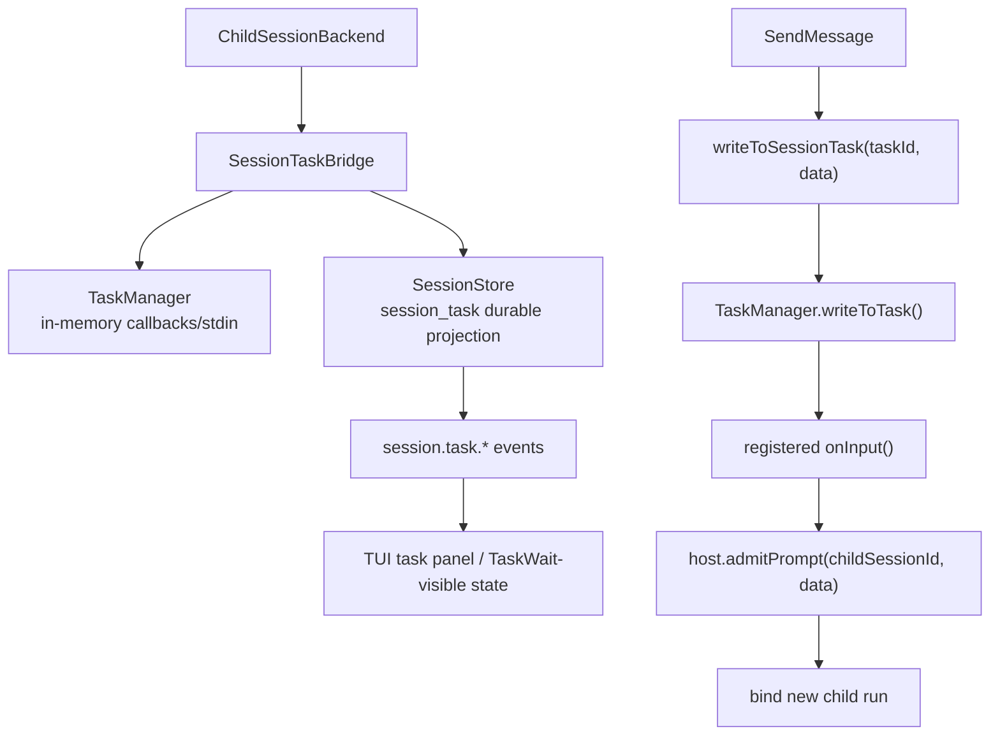

闭环要点：

| 项 | 说明 |
|---|---|
| 输入 | child backend 注册 task、follow-up input、stop |
| 状态归属 | durable task projection 在 store；TaskManager 只保留当前进程 callback/stdin |
| 输出 | parent session 可见 task status/output |
| 重启边界 | daemon 重启后 callback 不复活，未终态 task 会 interrupted；child messages/run 仍可审计 |
| 关键文件 | `packages/server/src/http/session-task-bridge.ts`, `packages/services/src/tasks/index.ts` |

## 闭环 9：Interrupt / archive / restart

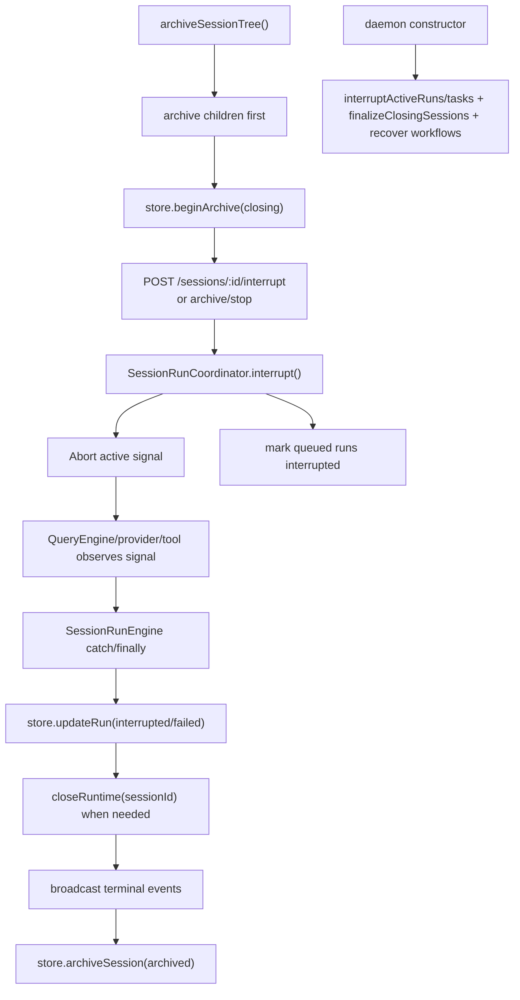

闭环要点：

| 项 | 说明 |
|---|---|
| 输入 | interrupt API、archive API、daemon restart |
| 状态归属 | active lane 在 memory；terminal run/task/session state 在 store |
| 输出 | session 不再永久 busy；客户端通过 SSE/re-snapshot 看到 terminal 状态 |
| 关键文件 | `packages/server/src/http/session-run-engine.ts`, `packages/server/src/run-coordinator.ts`, `packages/server/src/http.ts`, `packages/server/src/http/workflow-recovery.ts` |

## Workflow 和 bridge 放在图上的位置

这两块可以先按“挂点”理解，不必和 session runtime 混成一团：

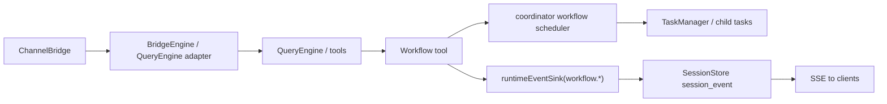

| 模块 | 认知位置 |
|---|---|
| Workflow | 是一个工具/调度器子系统，通过 `runtimeEventSink` 把 `workflow.*` 事件写回 session event stream |
| Channel bridge | 是外部消息通道到 engine 的入口适配，不是 daemon session 主入口；长期可以接入同一套 Session API 语义 |

## 推荐阅读顺序

1. `apps/cli/src/commands/main.ts`：入口如何选择 TUI/print。
2. `apps/cli/src/ensure-daemon.ts`：attach/启动 daemon。
3. `apps/cli/src/commands/daemon.ts`：`ohs serve` 如何注入 `runtimeFactory`。
4. `packages/server/src/http.ts`：daemon 核心对象如何组装。
5. `packages/server/src/http/session-run-engine.ts`：prompt 到 run 的主闭环。
6. `apps/cli/src/session-runtime.ts`：`runtimeFactory` 和 `CliSessionRuntime`。
7. `apps/cli/src/runtime.ts`：`bootstrap()` 里 QueryEngine/tools/child backend 如何注册。
8. `packages/tools/src/agent/index.ts` + `packages/swarm/src/child-session.ts`：Agent 到 child session。

## 快速定位表

| 问题 | 看这里 |
|---|---|
| daemon 怎么起来的 | `apps/cli/src/ensure-daemon.ts`, `apps/cli/src/commands/daemon.ts` |
| `/prompts` 怎么变成 run | `packages/server/src/http/session-run-engine.ts` |
| 同 session 串行在哪里保证 | `packages/server/src/run-coordinator.ts` |
| `runtimeFactory` 注入点 | `apps/cli/src/commands/daemon.ts` |
| `SessionRuntime` 接口 | `packages/server/src/runtime.ts` |
| 当前 runtime 实现 | `apps/cli/src/session-runtime.ts` |
| QueryEngine/tools 怎么构造 | `apps/cli/src/runtime.ts` |
| Agent 为什么能创建 child session | `bootstrap()` 注册 `ChildSessionBackend`，`Agent` 从 scoped registry 取 executor |
| `ChildSessionHost` 实现在哪里 | `packages/server/src/http.ts` 构造函数里的 `this.childSessionHost` |
| child task 状态怎么回 parent | `packages/server/src/http/session-task-bridge.ts` |
| 权限怎么跨 child/parent | `packages/server/src/permission-broker.ts` |
| UI 怎么同步状态 | `packages/client/src/sync.ts`, `packages/client/src/reducer.ts`, `apps/frontend/src/hooks/useServerSync.ts` |

