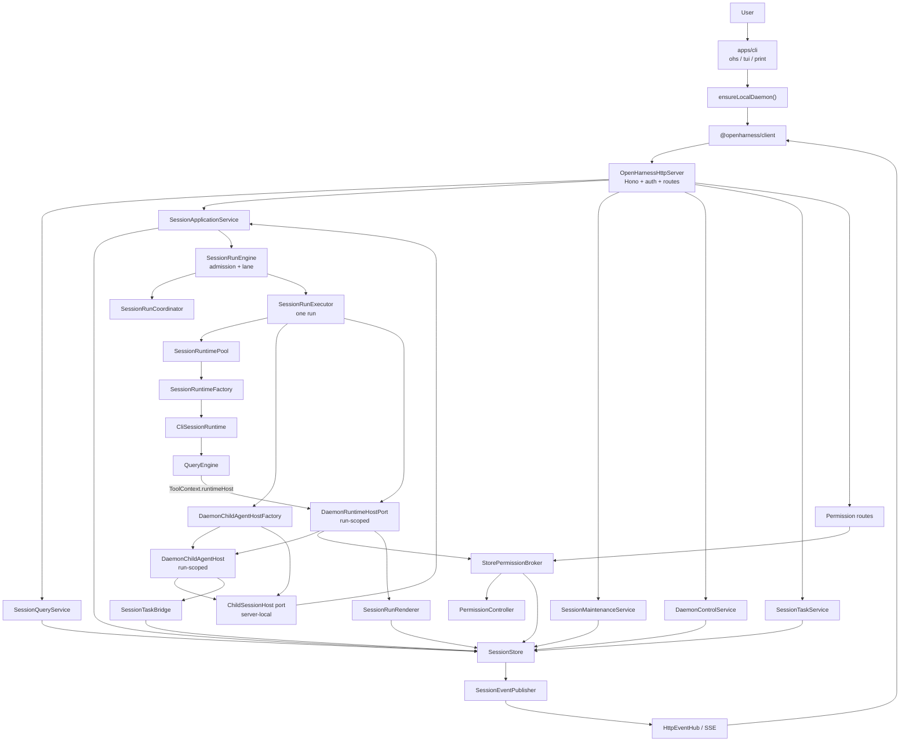
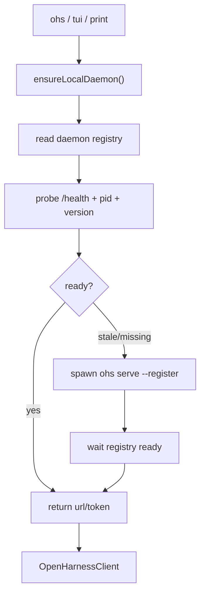
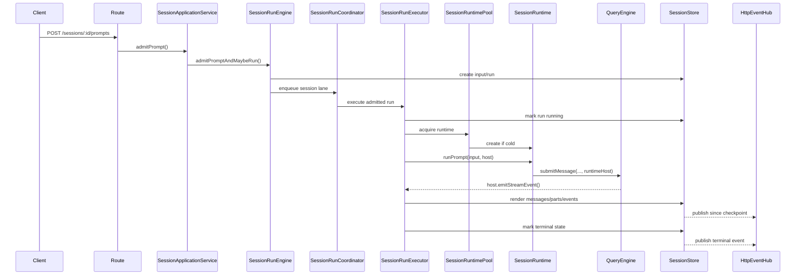
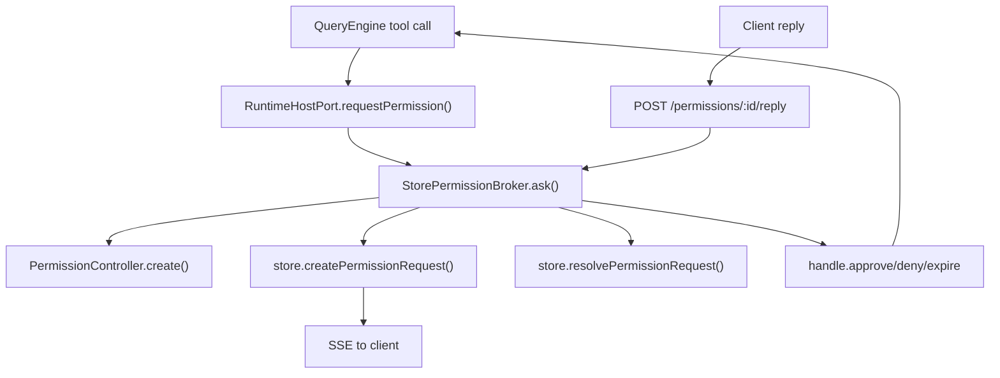
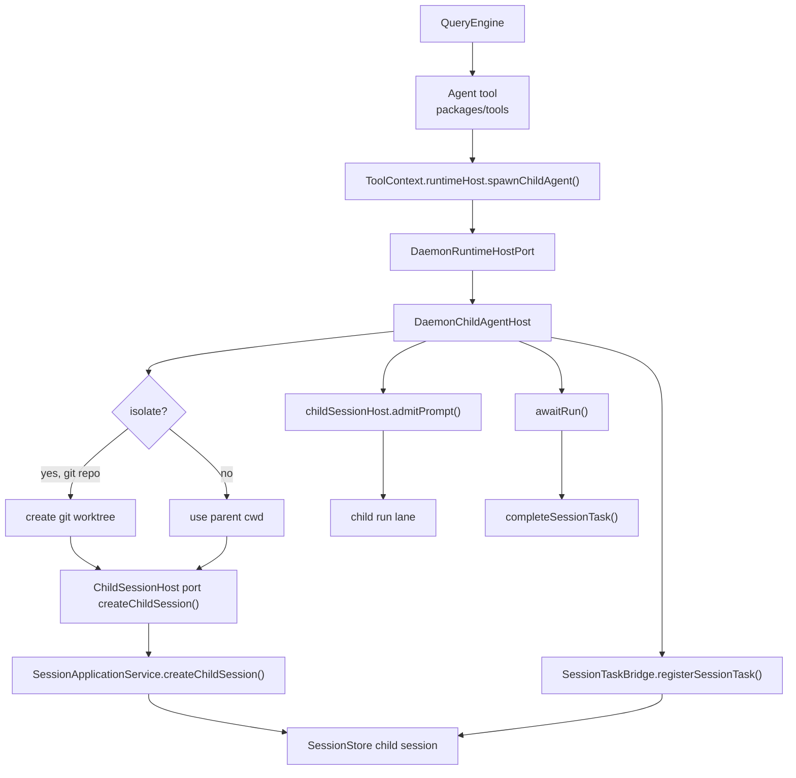

# Daemon Runtime Flow Map

> 目的：用运行时地图降低 daemon / runtimeFactory / SessionRuntime / QueryEngine / child-agent 的认知负担。
>
> 本文描述当前代码。需要从客户端请求反查应用层流程时，先看 [`daemon-application-architecture.md`](./daemon-application-architecture.md)；需要按问题定位文件时，配合 [`daemon-runtime-code-guide.md`](./daemon-runtime-code-guide.md) 阅读。

## 一句话模型

```text
Client 只负责 attach、提交输入、展示 snapshot/SSE。
Daemon 持有 SessionStore、Application/Query/Maintenance/Control services、run lane、runtime pool、permission projection、child session projection。
SessionRunExecutor 执行单次 run，并创建 run-scoped RuntimeHostPort。
SessionRuntime/CliSessionRuntime 包住 QueryEngine。
QueryEngine 和 tools 通过 runtimeHost 请求 permission、发 runtime event、创建 child agent。
```

## 总图



## 边界速查

| 名称 | 它是什么 | 它不是什么 |
|---|---|---|
| `OpenHarnessHttpServer` | composition root：恢复、装配服务、挂 routes | 不承载具体业务规则 |
| `SessionQueryService` | session/state/messages/parts 只读 facade | 不 warm runtime，不创建 run |
| `SessionApplicationService` | session/run/child session 的写用例入口 | 不执行模型 |
| `SessionMaintenanceService` | MCP/usage/export/compact/rewind/remember | 不负责 prompt admission |
| `DaemonControlService` | health/debug/busy guard/runtime invalidation | 不改 transcript 内容 |
| `SessionRunEngine` | prompt admission、idempotency、steer、lane orchestration | 不持有 runtime |
| `SessionRunExecutor` | 执行一个 admitted run，创建 run-scoped host | 不决定队列顺序 |
| `SessionRuntimePool` | runtime 创建去重、缓存、warm、close | 不知道 child host/task bridge |
| `SessionRuntimeFactory` | session/history/parts -> `SessionRuntime` | 不再接收 child bridge |
| `CliSessionRuntime` | daemon 下的 runtime adapter，调用 QueryEngine | 不持久化 run state |
| `QueryEngine` | provider/tool/hook/MCP loop | 不知道 daemon store |
| `DaemonRuntimeHostPort` | run-scoped host capability port | 不拥有 durable truth |
| `DaemonChildAgentHost` | child invocation adapter：session/run/task/worktree | 不是 Agent tool 本身 |
| `StorePermissionBroker` | permission durable projection + HTTP reply bridge | 不直接执行 tool |
| `PermissionController` | live permission handle 管理 | 不代表 restart 后仍可恢复 stack |

## 闭环 1：daemon 启动 / attach



关键文件：

| 文件 | 责任 |
|---|---|
| `apps/cli/src/ensure-daemon.ts` | 查找/启动本地 daemon |
| `apps/cli/src/daemon-lifecycle.ts` | registry、probe、stale cleanup |
| `apps/cli/src/commands/daemon.ts` | `serve` 入口 |

## 闭环 2：HTTP 请求分流

```text
HTTP request
  -> middleware(trace/auth/cors)
  -> route(parse/validate/status mapping)
  -> Query / Application / Maintenance / Control / Task / Permission service
```

主要入口：

| HTTP 范围 | 主要服务 | 说明 |
|---|---|---|
| `GET /sessions`, `GET /sessions/:id/state/messages/parts` | `SessionQueryService` | 只读 snapshot/query |
| `POST /sessions`, `PATCH /sessions/:id`, `DELETE /sessions/:id` | `SessionApplicationService` | session 生命周期 |
| `POST /sessions/:id/prompts`, `resume`, `interrupt` | `SessionApplicationService` + `SessionRunEngine` | run admission/control |
| session utility routes | `SessionMaintenanceService` | compact/rewind/export/remember/usage |
| `/settings`, `/auth`, `/plugins`, `/debug/runtime`, `/health` | `DaemonControlService` + 对应 service | 控制面和 guard |
| `/tasks/*` | `SessionTaskService` | shell task 和 session task projection |
| `/permissions/*` | `StorePermissionBroker` | permission 查询和 reply |
| `/events`, `/events/stream` | `HttpEventHub` | replay/SSE |

## 闭环 3：prompt -> run -> SSE



状态归属：

| 状态 | 归属 |
|---|---|
| input/run/message/part/event | `SessionStore` |
| 同 session 串行 | `SessionRunCoordinator` |
| runtime 生命周期 | `SessionRuntimePool` |
| 单次 run rendering | `SessionRunExecutor` + `SessionRunRenderer` |

## 闭环 4：permission



定位：

| 问题 | 文件 |
|---|---|
| tool 何时 ask | `packages/core/src/engine/query-engine.ts` |
| daemon 如何投影 permission | `packages/server/src/permission-broker.ts` |
| live handle 如何 resolve | `packages/server/src/permission-controller.ts` |
| HTTP reply 如何进入 | `packages/server/src/http/routes/permission.ts` |

## 闭环 5：Agent / child session



定位：

| 问题 | 文件 |
|---|---|
| Agent 为什么能创建 child session | `packages/tools/src/agent/index.ts` 调 `context.runtimeHost.spawnChildAgent()` |
| child session 由谁创建 | `DaemonChildAgentHostFactory` 生成 `ChildSessionHost` port -> `SessionApplicationService` |
| parent task projection 在哪 | `packages/server/src/http/session-task-bridge.ts` |
| isolated worktree 在哪 | `packages/server/src/http/child-agent-worktree.ts`，cleanup 在 `DaemonChildAgentHost` |
| TaskWait 等的是什么 | `task_id` 对应的 parent-visible task projection，不是 live invocation handle |
| SendMessage 怎么送 follow-up | `packages/tools/src/agent/index.ts` -> task/agent id 查 live invocation -> `runtimeHost.sendChildInput()` |
| Workflow worker 怎么 spawn | `packages/tools/src/agent/workflow-runner.ts` |

## 闭环 6：archive / interrupt

```text
DELETE /sessions/:id
  -> SessionApplicationService.archiveSessionTree()
  -> recursively archive children first
  -> mark closing
  -> interrupt active run
  -> wait/settle
  -> close runtime
  -> mark archived
```

child-agent stop：

```text
DaemonChildAgentHost.interruptChildAgent()
  -> childSessionHost.interrupt()
  -> childSessionHost.closeRuntime()
  -> childSessionHost.archive()
  -> sessionTaskBridge.completeSessionTask(stopped)
  -> remove clean isolated worktree
```

## 快速定位表

| 我想查 | 先看 |
|---|---|
| 客户端请求进入哪一层 | `packages/server/src/http/routes/*` 和 `OpenHarnessHttpServer.mountRoutes()` |
| session list/state 为什么这样 | `SessionQueryService` + `SessionStore` |
| prompt 为什么排队/steer | `SessionRunEngine` + `SessionRunCoordinator` |
| runtime 什么时候创建/关闭 | `SessionRuntimePool` |
| 一次 run 怎么落 message parts | `SessionRunExecutor` + `SessionRunRenderer` |
| 工具权限怎么授权 | `QueryEngine` -> `RuntimeHostPort.requestPermission()` -> `StorePermissionBroker` |
| Agent 怎么建 child session | `Agent tool` -> `ToolRuntimeHost.spawnChildAgent()` -> `DaemonChildAgentHost` |
| child task 怎么显示在 parent | `SessionTaskBridge` + `SessionTaskService` |
| TaskWait 为什么能等 Agent 返回的 task_id | `TaskWait` -> scoped `TaskManager.awaitTask(task_id)`；daemon child session 由 `SessionTaskBridge` 注册同 id task projection |
| SSE 为什么没收到 | `SessionEventPublisher` + `HttpEventHub` |
