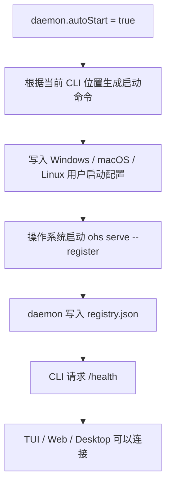

# Daemon 系统常驻流程

> 本文描述当前代码。这里的“系统服务”是让操作系统负责启动和重启主 daemon，不是再创建一个计划任务进程。

## 一句话结论

`~/.openharness-ts/settings.json` 中的 `daemon.autoStart` 决定主 daemon 是否交给操作系统常驻。开启后，OpenHarness 会在当前用户登录时启动主 daemon；daemon 意外退出时，Windows 计划任务、macOS LaunchAgent 或 Linux systemd user service 会重新启动它。

TUI、Web、Desktop、Scheduled Tasks 和 Agent 仍然连接同一个主 daemon。

## 配置

```json
{
  "daemon": {
    "autoStart": true
  }
}
```

- `true`：登录后自动启动，异常退出后自动恢复。
- `false`：不注册系统启动项。TUI、print 或 Desktop 需要本地 daemon 时仍会按需启动，但操作系统不会在登录或崩溃后恢复它；无人打开应用时，已安排任务也不会执行。
- 默认值是 `false`。
- 这是机器级设置，只读取用户目录的 `settings.json`；项目目录里的 `.openharness/settings.json` 不能覆盖它。

也可以使用命令修改：

```bash
ohs config set daemon.autoStart true
ohs config set daemon.autoStart false
```

`ohs config set` 会立即同步系统启动项。直接编辑 JSON 或在 TUI 中使用 `/config` 后，会在下一次由 CLI 启动或连接本地 daemon 时同步；已经安装的 Windows watchdog 也会先读取这个开关，关闭时不会重新拉起 daemon。

## 常用命令

```bash
ohs daemon install
ohs daemon status
ohs daemon stop
ohs daemon start
ohs daemon uninstall
```

- `install`：把 `daemon.autoStart` 写成 `true`，安装用户级启动配置，并立即启动 daemon。
- `status`：同时显示系统启动配置和实际 daemon 进程的状态。
- `stop`：安装过系统服务时，通过操作系统停止；没有安装时，停止临时后台进程。
- `start`：安装过系统服务时，通过操作系统启动；没有安装时，沿用临时后台启动。
- `uninstall`：把 `daemon.autoStart` 写成 `false`，停止 daemon 并删除系统启动配置，不删除会话、已安排任务或其它用户数据。

## 三个平台分别做什么

| 系统    | 使用的系统能力       | 配置位置                                                |
| ------- | -------------------- | ------------------------------------------------------- |
| Windows | 当前用户的计划任务   | 任务名 `OpenHarness Daemon`；登录时和每分钟检查一次     |
| macOS   | LaunchAgent          | `~/Library/LaunchAgents/dev.openharness.daemon.plist`   |
| Linux   | systemd user service | `~/.config/systemd/user/dev.openharness.daemon.service` |

这些配置都在用户范围内运行，不要求 daemon 以管理员或 root 身份执行。机器重启后，需要当前用户登录，daemon 才会启动。这和桌面版开发工具的常见做法一致，也避免在无人登录时带着用户凭证运行 Agent。

## 启动流程



macOS 和 Linux 会把普通输出追加到 `~/.openharness-ts/data/logs/daemon.log`。Windows 的每次计划任务只做一次健康检查：daemon 正常就立即退出，不正常才启动 daemon。Windows 通过系统自带的无窗口脚本宿主运行检查，因此每分钟执行时不会弹出终端窗口。服务端自己的结构化日志仍使用原来的日志目录。

## TUI 自动连接时怎么处理

```text
ensureLocalDaemon
  -> 读取用户级 daemon.autoStart
  -> 开启：安装或启用系统启动项
  -> 关闭：删除已有系统启动项
  -> registry + /health 正常：直接连接
  -> 不正常且开启：让操作系统启动 daemon
  -> 不正常且关闭：按需启动后台 daemon
```

如果当前 CLI 比正在运行的 daemon 更新，已安装系统服务会先刷新自己的启动命令，再启动新 daemon。这样不会出现“系统服务一份、TUI 又偷偷启动一份”的情况。

## 崩溃和正常停止

- daemon 崩溃：macOS 和 Linux 会在几秒内重启；Windows 会在下一次每分钟健康检查时启动。
- `ohs daemon stop`：通过系统管理器停止，不会立即被当作崩溃拉起。
- `ohs daemon start`：重新交给系统管理器启动。
- `ohs daemon uninstall`：停止并删除启动配置。
- daemon 重启后：SessionStore 会把上次未结束的 run、task、permission 和 Scheduled Task 运行记录收口为已中断，再恢复可继续的持久化状态。

## 代码索引

| 逻辑                             | 文件                                              |
| -------------------------------- | ------------------------------------------------- |
| 三个平台的安装、启动、停止和状态 | `apps/cli/src/daemon-system-service.ts`           |
| `daemon` 命令                    | `apps/cli/src/commands/daemon.ts`                 |
| TUI/print 自动连接               | `apps/cli/src/ensure-daemon.ts`                   |
| daemon 前台运行和 registry 写入  | `apps/cli/src/commands/daemon.ts` 的 `runServe()` |
| registry 文件                    | `packages/server/src/paths.ts`                    |

## 边界

- 这套能力解决本机主 daemon 的登录后启动和崩溃重启。
- 它不负责远程服务器部署；远程部署应使用目标机器自己的进程管理和密钥管理。
- 它不把 Agent Framework 变成后台服务。Framework 仍可被程序直接创建和关闭。
- 它不迁移、复制或删除旧用户数据。
