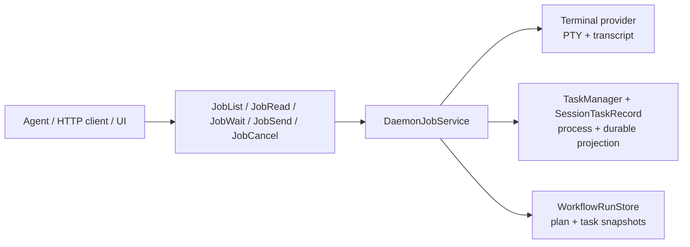
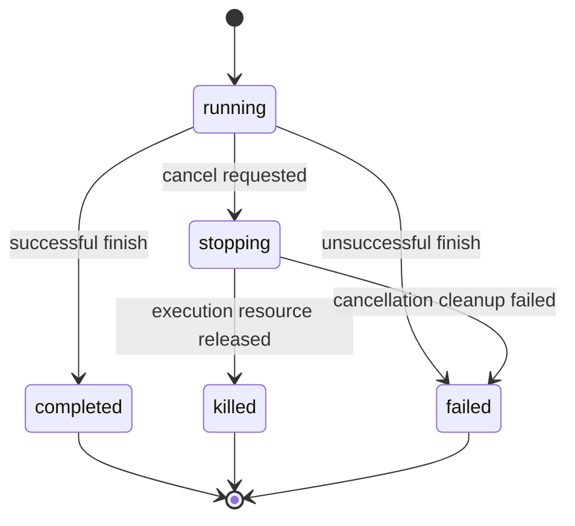

# Jobs 统一后台任务协议

> 状态（2026-08-17）：当前实现的权威契约。Terminal 自身设计见 [Desktop Terminal PTY Design](./desktop-terminal-pty-design.md)，daemon 总入口见 [Daemon Application Architecture](./daemon-application-architecture.md)，首次大改复盘见 [Jobs Protocol Review 2026-08-17](./jobs-protocol-review-2026-08-17.md)，Task/Workflow 工具收口方案见 [Jobs Task/Workflow Convergence](./jobs-task-workflow-convergence.md)。

## 一句话解释

Jobs 是所有长期工作的统一遥控器。

`pnpm dev`、后台 shell、child Agent、dream 和 Workflow 的运行方式各不相同，但调用方不应该为每一种工作分别学习一套“列出、读结果、等待、继续输入、取消”接口。Jobs 把这些后续操作统一起来。

Jobs 不执行工作，也不保存第二份权威状态。Terminal provider、`TaskManager + SessionTaskRecord`、`WorkflowRunStore` 仍然分别拥有真实进程、任务和流程状态。

## 先看一个场景

Agent 要启动开发服务器，再等它输出 ready：

```text
TerminalOpen({ name: "dev server" })
  -> 创建 PTY，返回 terminal id

JobWait({ jobIds: [jobId], after: { [jobId]: 0 }, timeoutSeconds: 20 })
  -> 等待退出或超时，并返回这段时间的新输出

JobRead({ jobId, after: cursor })
  -> 只取上次游标之后的新输出

JobSend({ jobId, data: "r\r" })
  -> 给仍在运行的交互终端输入内容

JobCancel({ jobId, reason: "verification finished" })
  -> 请求结束进程
```

如果换成 child Agent 或 Workflow，创建入口不同，但创建后的观察与控制仍走 `Job*`。

## 目标

- 给所有长期工作提供同一组控制动作：`list/read/wait/send/cancel`。
- 返回同一种 `JobSnapshot`，让 Agent、HTTP client 和 UI 用相同方式展示状态。
- 所有操作绑定 owner session，不能仅凭猜到 ID 操作其他 session 的工作。
- 保留各执行器的所有权，不复制进程句柄、输出文件或 Workflow 快照。
- 让新后台执行器可以通过投影接入，而不必修改所有调用方。

## 非目标

- Jobs 不替代 `TerminalOpen`、`TaskCreate` 或 Workflow run 等创建接口。
- Jobs 不把一次性 `Bash` 强行变成长驻 Terminal。
- Jobs 不提供新的数据库，也不负责恢复底层进程。
- Jobs 不保证所有工作都能接收输入；是否可操作以 `capabilities` 为准。
- Jobs 不把 daemon 级 Bearer token 变成多租户授权系统。`ownerSession` 是 session 隔离边界，HTTP 仍由 daemon 鉴权保护。

## 术语

| 术语 | 实际含义 |
|---|---|
| producer | 真正创建并运行工作的模块，例如 Terminal provider 或 TaskManager |
| job | 一项已经创建、可能持续一段时间的工作 |
| control plane | 不亲自执行工作，只负责统一查状态和转发控制动作的这一层 |
| snapshot | 某一时刻的只读状态照片，不是可修改的运行对象 |
| cursor | 调用方上次看到输出的位置，用来避免反复返回同一段内容 |
| owner session | 创建或拥有这项工作的 durable session，也是寻址授权条件 |

## 架构与所有权



| Job kind | 执行与原始状态所有者 | Jobs 做什么 |
|---|---|---|
| `terminal` | `LocalTerminalProvider` | 转换状态、读 sequence 输出、转发输入和终止 |
| `shell` | `TaskManager`，持久状态投影到 `SessionTaskRecord` | 读输出、等待、取消 |
| `agent` | `TaskManager` 或 child session bridge | 读输出、等待、继续输入、取消 |
| `dream` | `TaskManager` | 读输出、等待、取消 |
| `workflow` | `WorkflowRunStore` 和 Workflow scheduler | 读结构化进度、等待、取消 |

核心约束：Jobs 可以聚合和路由，但不能成为第二个执行器或第二份持久状态。

## 创建与控制分离

创建仍由最了解资源参数的 producer 完成：

| 要创建的工作 | 创建入口 | 创建后控制 |
|---|---|---|
| 持久交互终端 | `TerminalOpen` | `Job*` |
| 后台 shell | `TaskCreate` 或对应 task API | `Job*` |
| child Agent | `Agent` | `Job*` |
| Workflow | Workflow run | `Job*` |

这样做的原因很具体：创建 Terminal 需要 shell、cwd、行列数和 runtime；创建 Workflow 需要任务图和并发规则。这些参数无法被一个通用 `JobCreate` 清楚表达。

## JobSnapshot

`JobSnapshot` 是调用方看到的统一状态：

```ts
interface JobSnapshot {
  id: string;
  kind: "terminal" | "shell" | "agent" | "dream" | "workflow";
  label: string;
  ownerSession: string;
  status: "running" | "stopping" | "completed" | "killed" | "failed";
  capabilities: { read: boolean; wait: boolean; send: boolean; cancel: boolean };
  cwd: string;
  startedAt: number;
  updatedAt: number;
  finishedAt?: number;
  detail?: string;
  metadata?: Record<string, unknown>;
}
```

字段约束：

- `id` 在当前 producer 命名习惯下应当全局可区分；调用方不能只依赖 ID 保密。
- `ownerSession` 必须来自权威记录，不能接受调用方覆盖。
- `capabilities` 表示当前快照允许的动作。`send: false` 时服务端也必须拒绝输入，不能只让 UI 隐藏按钮。
- `updatedAt` 表示 producer 状态最后更新时间，不保证等于每个输出字符的写入时间。
- `metadata` 只放展示或诊断信息，不能让调用方绕过正式字段推断权限。

## 状态机



状态含义：

| 状态 | 大白话含义 |
|---|---|
| `running` | 工作仍可能继续产生输出或接受操作 |
| `stopping` | 已收到取消请求，但进程或资源还没有完全释放 |
| `completed` | 正常完成 |
| `killed` | 因取消或中断结束 |
| `failed` | 执行或清理失败 |

`stopping` 和 `killed` 不能合并。前者表示“正在关”，后者表示“已经关完”；只有资源实际释放后才能报告 `killed`。

当前适配规则：

- Terminal：exit code 0 -> `completed`，非 0 -> `failed`，取消后真实退出 -> `killed`。
- Task：pending/running -> `running`，stopped/interrupted -> `killed`，其余终态同名。
- Workflow：running -> `running`，带 `termination: cancelled` 的 failed 快照 -> `killed`。

## 五个操作

### 当前模型工具清单

模型侧的统一控制面就是下面五个工具。daemon 使用持久化 `DaemonJobService`；standalone SDK 在调用方没有注入外部 host 时自动创建 `LocalAgentJobHost`，因此两种运行方式都会注册这五个工具。

| 工具 | 输入重点 | 返回重点 | 支持范围 |
|---|---|---|---|
| `JobList` | 可选 `kinds/statuses/时间/includeFinished/limit` | owner session 的 `JobSnapshot[]` | Terminal、shell、Agent、dream、Workflow |
| `JobRead` | `jobId`、可选 `after/maxChars` | `text/cursor/truncated/snapshot/details?` | 所有 Job |
| `JobWait` | `jobIds[]`、`timeoutSeconds`、可选逐 Job cursor | 每个 Job 的独立 wait 结果或错误 | 所有 Job |
| `JobSend` | `jobId/data` | 已发送确认 | running Terminal；未取消且会话可恢复的 Agent |
| `JobCancel` | `jobId`、可选 `reason` | 取消后的最新快照 | 当前快照声明 `cancel: true` 的 Job |

推荐调用路径：

```text
创建长期工作：
  TerminalOpen / TaskCreate / Agent / Workflow

创建后统一控制：
  JobList / JobRead / JobWait / JobSend / JobCancel
```

具体选择：

```text
想看有哪些后台工作       -> JobList
想立即看状态和已有输出   -> JobRead
想等一会儿看是否完成     -> JobWait
想继续给终端或 Agent 输入 -> JobSend
想明确停止工作           -> JobCancel
```

完整例子：

```text
TaskCreate({ command: "pnpm test", description: "tests" })
  -> jobId

JobWait({ jobIds: [jobId], timeoutSeconds: 30 })
  -> results[0].timedOut=false：已经完成
  -> results[0].timedOut=true：仍在运行，只结束这次等待，不停止测试

JobRead({ jobId, after: cursor })
  -> 读取最新输出和状态

JobCancel({ jobId, reason: "no longer needed" })
  -> 只有明确调用取消才停止任务
```

重要边界：

- `JobWait` timeout 和调用方中断都只结束本次等待，不隐式调用 `JobCancel`。
- `JobSend` 会在服务端重新检查当前类型与状态，不能靠旧快照绕过能力边界。
- `JobWait` 会并发等待多个 ID；某个 ID 不存在时只在对应 result 返回 `error`，不会遮住其他 Job 的结果。
- Cron 是“将来何时启动命令”的计划，不是已经运行的 Job，不进入这五个工具的聚合范围。
- `Bash` 是等待命令返回的一次性调用；需要后台运行或长期交互时使用 `TaskCreate` 或 `TerminalOpen`。

### JobList

列出当前 owner session 的工作。可用过滤包括 `kinds`、`statuses`、started/updated 起止时间、`includeFinished` 和 `limit`。调用前 daemon 会刷新 TaskManager 到 durable task 的投影。

返回的是新快照数组，不是 live handle。排序按 `startedAt` 从新到旧。

```ts
interface JobListRequest {
  sessionId: string;
  kinds?: JobKind[];
  statuses?: JobStatus[];
  startedAfter?: number;
  startedBefore?: number;
  updatedAfter?: number;
  updatedBefore?: number;
  includeFinished?: boolean;
  limit?: number;
}
```

### JobRead

立即返回当前状态和可用输出，不等待新内容。

```ts
JobReadRequest = { sessionId, jobId, after?, maxChars? }
JobReadResult = { text, cursor, truncated, snapshot, details? }
```

- `after` 是上一次返回的 `cursor`。
- `maxChars` 限制本次响应，不改变 producer 保留的原始输出。
- `truncated: true` 表示调用方没有拿到完整历史，可能因为保留窗口或本次响应上限。
- `details` 是 producer 自己的结构化状态。当前 Workflow 会在这里返回 plan、pending/running/blocked、results 和 budget；普通调用方仍可只处理通用 snapshot。

### JobWait

等待工作进入终态或到达 timeout，不会因为 timeout 自动取消工作。

```ts
AgentJobHost.wait({ sessionId, jobId, timeoutMs, after?, maxChars? })

JobWait({
  jobIds: string[],
  timeoutSeconds?: number,
  after?: Record<string, number>,
  maxChars?: number,
})
```

底层 host 一次等待一个 Job；模型工具在上层并发调用，并为每个 `jobId` 返回独立的 `JobWaitResult` 或 `{ jobId, error }`。

- 已经结束时立即返回，`timedOut: false`。
- timeout 到达时返回当前快照，`timedOut: true`。
- 调用方中断请求时，wait 本身中断，后台工作继续运行。
- Terminal 使用退出事件并在订阅后再次检查状态，避免刚好错过退出。
- Task 和 Workflow 当前每 50ms 刷新持久快照，未来可换成事件源而不改变协议。

### JobSend

向可交互工作发送输入。Terminal 必须仍在运行；Agent 可以正在运行，也可以已经 completed/failed 但保留了可恢复会话。`JobSend` 给已结束的可恢复 Agent 输入时，会重新打开同一个会话继续工作。已 stopped/interrupted，也就是已经取消的 Agent 不可恢复。

服务端必须再次检查类型和状态，不能只信任先前快照，因为快照返回后工作可能已经结束。

### JobCancel

请求 producer 停止工作。取消原因会传给支持原因记录的 producer。

- Terminal 先进入 `stopping`，退出回调再写 `killed`。
- Task 通过既有 task service 停止，完成后同步 durable record。
- Workflow 先通知同进程 active scheduler 停止派发和写回，再停止当前 worker，最后保存带 `termination: cancelled` 的终态快照。

取消终态工作允许按 producer 的幂等语义返回现状；调用方仍应先检查 `capabilities.cancel`。

## Cursor 语义

统一字段不代表所有 producer 的输出存储完全相同：

| Producer | cursor 实际表示什么 | `after` 后返回什么 |
|---|---|---|
| Terminal | transcript chunk sequence | 真正新增的 chunk |
| Task | durable task `updatedAt` | 有更新时返回当前输出尾部，无更新返回空文本 |
| Workflow | workflow snapshot `updatedAt` | 有更新时返回当前结构化快照，无更新返回空文本 |
| standalone child/Task | 当前结果文本长度 | 返回该字符位置之后的文本 |

因此调用方必须把 `text + cursor + truncated + snapshot` 一起处理，不能假设所有 text 都是可直接拼接的增量日志。Terminal text 可以按 cursor 追加；Task 和 Workflow text 是“更新后的当前视图”。

## Owner 隔离

Agent 侧使用 `createAgentHost(session)` 绑定 owner：即使工具参数伪造另一个 `sessionId`，host 也会在进入 producer 前拒绝。

daemon 解析 job 时还会再次检查：

- Terminal 必须是 `source: agent` 且 `terminal.sessionId === sessionId`。
- Task 必须满足 `task.sessionId === sessionId`。
- Workflow 必须满足 `workflow.ownerSession === sessionId`。
- 旧的无 owner Workflow 不会暴露给任意 session。

HTTP `/jobs` 由 daemon Bearer token 保护。HTTP 里的 `sessionId` 用于选择 owner 范围，不代表独立用户身份。

## 接入一个新 Producer

新后台执行器接入前必须回答：

1. 谁拥有真实执行资源，退出时谁负责释放？
2. owner session 从哪里写入，daemon 重启后还能否读取？
3. 原始状态怎样无歧义映射到五个 Job 状态？
4. `read` 返回增量日志还是当前视图，cursor 怎样推进？
5. 哪些状态允许 `send` 和 `cancel`，服务端怎样重新校验？
6. `wait` 怎样避免先检查、后订阅之间丢失完成事件？
7. 取消后怎样阻止迟到回调重新写成 running/completed？
8. 终态保留多久，何时清理？

实现上应新增 adapter/projection 分支，不应把 producer 的私有句柄放进 `@openharness/jobs`。

## 当前代码入口

| 位置 | 责任 |
|---|---|
| `packages/jobs/src/index.ts` | 可移植类型和 `AgentJobHost` 契约 |
| `packages/server/src/jobs/daemon-job-service.ts` | owner 校验、聚合、状态转换、控制路由 |
| `packages/tools/src/job/job-tools.ts` | 模型可调用的五个 `Job*` 工具 |
| `packages/tools/src/job/local-job-host.ts` | standalone SDK 的 child、TaskManager、Workflow 本地聚合 |
| `packages/server/src/http/routes/job.ts` | `/jobs` HTTP API |
| `packages/client/src/transport/http-client.ts` | TypeScript HTTP client |
| `packages/terminal-node/src/local-terminal-provider.ts` | Terminal 输出、等待和真实退出生命周期 |
| `packages/server/src/http/session/session-task-bridge.ts` | TaskManager 到 durable task 的持续投影 |
| `packages/coordinator/src/workflow/store.ts` | Workflow 快照、active run 取消和迟到写回保护 |

## 已知边界

- Task/Workflow wait 仍是轮询，不是事件订阅。
- Task/Workflow cursor 是快照版本，不是严格日志 offset。
- Terminal 会在 daemon 生命周期内保留终态 session；durable task/workflow 也没有统一 retention policy。
- Jobs 还没有 completion reported/claim 语义，不能自动保证“完成通知只消费一次”。
- Jobs 还没有 owner 级并发配额。
- 协议依赖 producer ID 实际不冲突，但目前没有统一的 namespaced ID 编码和运行时冲突检测。

这些边界不应通过新增第二套状态数据库解决。需要增强时，优先补事件、保留策略、ID 约束和 admission policy。
