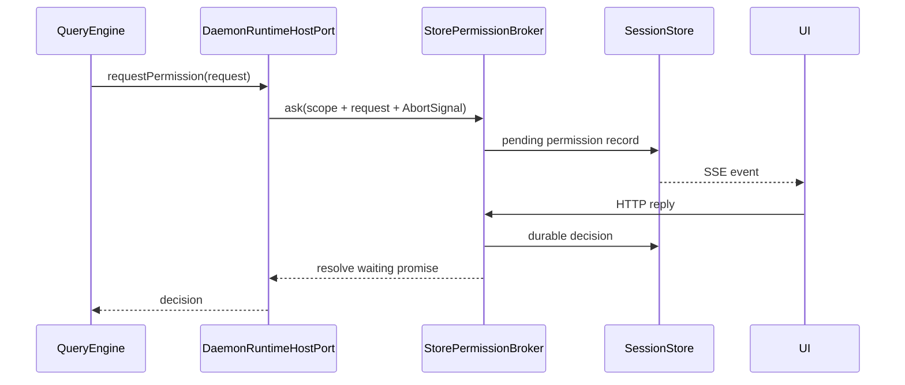

# Permission Flow

> 当前实现的快速索引。完整 daemon 上下文见 [daemon-application-architecture.md](./daemon-application-architecture.md#工具运行与授权)。

## Standalone

```text
QueryEngine tool call
  -> permission checker
  -> AgentRunHost.requestPermission()
  -> createOpenHarnessAgent({ requestPermission }) callback
  -> approved / denied / expired
  -> execute or reject tool
```

未提供 callback 时默认拒绝，不隐式放行。

## Daemon



## 代码位置

| 行为 | 文件 |
|---|---|
| tool loop 与 permission check | `packages/core/src/engine/query-engine.ts` |
| framework host contract | `packages/core/src/types/runtime.ts` |
| daemon run host | `packages/server/src/http/daemon-runtime-host.ts` |
| durable broker | `packages/server/src/permission-broker.ts` |
| live resolver | `packages/server/src/permission-controller.ts` |
| list/reply routes | `packages/server/src/http/routes/permission.ts` |

## Cancellation

run 的 `AbortSignal` 传给 broker/controller。interrupt 或 archive 时，pending request 变为 expired，等待 promise 被 resolve，工具不会继续执行。

child request 会沿 session parent lineage 上浮到顶层 session；payload 保留 `childSessionId` 和 `childRunId`，因此 UI 只需监听父 session 也能处理授权。
