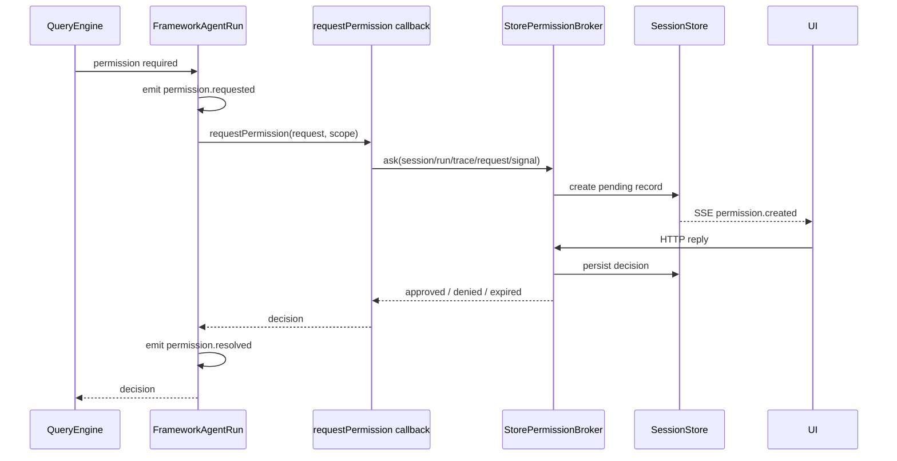

# Permission Flow

> 状态：当前实现快速索引。daemon 全链路见 [Daemon Application Architecture](./daemon-application-architecture.md#工具运行与授权)。

## 核心语义

permission decision 通过 SDK callback 返回，不是带 resolver 的 event：

```text
request/decision : createDefaultNodeAgent({ effects: { requestPermission } })
observability    : permission.requested / permission.resolved AgentEvent
durable UI flow  : daemon StorePermissionBroker
```

framework 等待 decision；event 只描述事实，保持可序列化。

## Standalone

```ts
const agent = await createDefaultNodeAgent({
  capabilityOverrides: {
    terminal: { value: terminal, jobs: terminalJobs },
    backgroundShell: { value: backgroundShell, jobs: shellJobs },
  },
  effects: { requestPermission },
});
```

`requestPermission` 是可选 effect；未提供时默认拒绝，不隐式放行。上例的 Terminal 与后台 Shell override 是 Host 借用对象，必须可用于 root session tree 的全部 child session，且由 Host 而不是 `agent.close()` 释放。

## Daemon



## 代码位置

| 行为 | 文件 |
|---|---|
| permission checker 与 tool gate | `packages/core/src/engine/query-engine.ts` |
| request/decision/event contracts | `packages/core/src/types/runtime.ts` |
| framework event/callback 调用 | `packages/agent-runtime/src/agent.ts` |
| daemon callback 注入 | `packages/server/src/daemon/daemon-agent.ts` |
| durable broker | `packages/server/src/permissions/permission-broker.ts` |
| live resolver/expiration | `packages/server/src/permissions/permission-controller.ts` |
| list/reply routes | `packages/server/src/http/routes/permission.ts` |
| event durable observation | `packages/server/src/application/agent/daemon-agent-event-projector.ts` |

## Cancellation 与 lineage

- run `AbortSignal` 传给 broker/controller。
- interrupt/archive 时 pending request 变为 `expired`，broker 保留该 decision，不再降格成 `denied`；等待中的 callback 返回且不继续执行工具。
- child scope 使用 child session/run；broker 沿 parent lineage 把 prompt 暴露给顶层 session。
- durable payload 保留 child session/run identity，UI 无需持有 framework handle。

## Daemon 重启

permission resolver 只存在于创建它的 daemon 进程。新 daemon 启动时，`SessionStore.expirePendingPermissionRequests()` 会把旧进程遗留的全部 `pending` request 改为 `expired`，写入明确的 restart reason 和 `permission.replied` durable event。已 approved/denied/expired 的记录不可再次改写。

## 不变量

- event payload 中没有 resolve/reject/function。
- daemon 不向 QueryEngine 注入 host。
- callback 未配置或失效时绝不默认批准。
- daemon callback 必须原样传递 `approved | denied | expired`，不得用 boolean 压平状态。
- `permission.resolved` 在 callback settle 后发布，供日志与 projection 使用。
