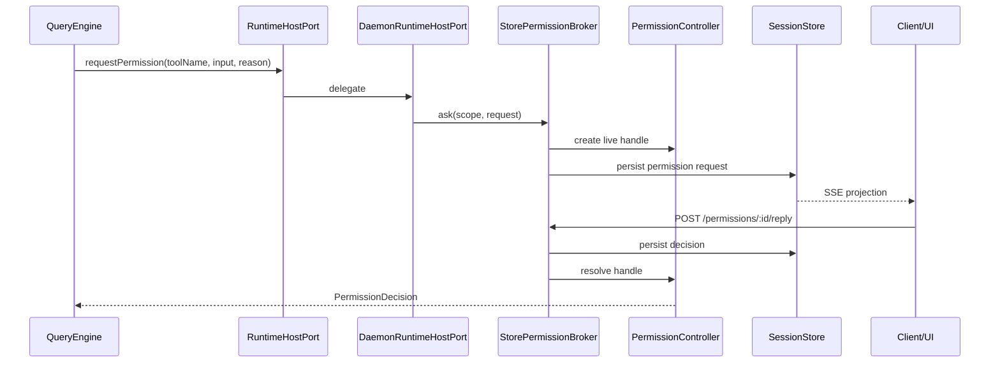
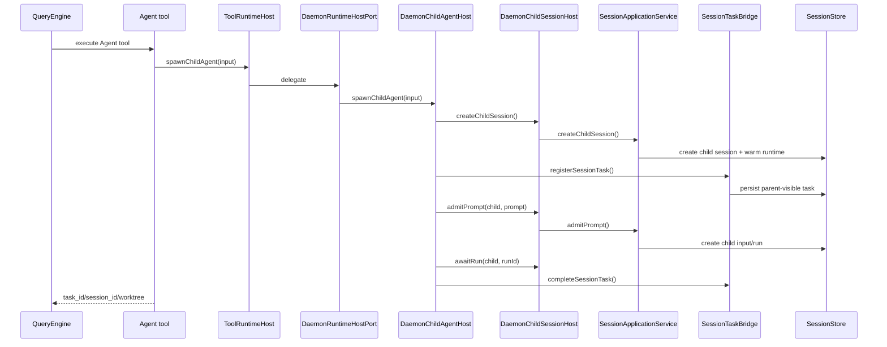
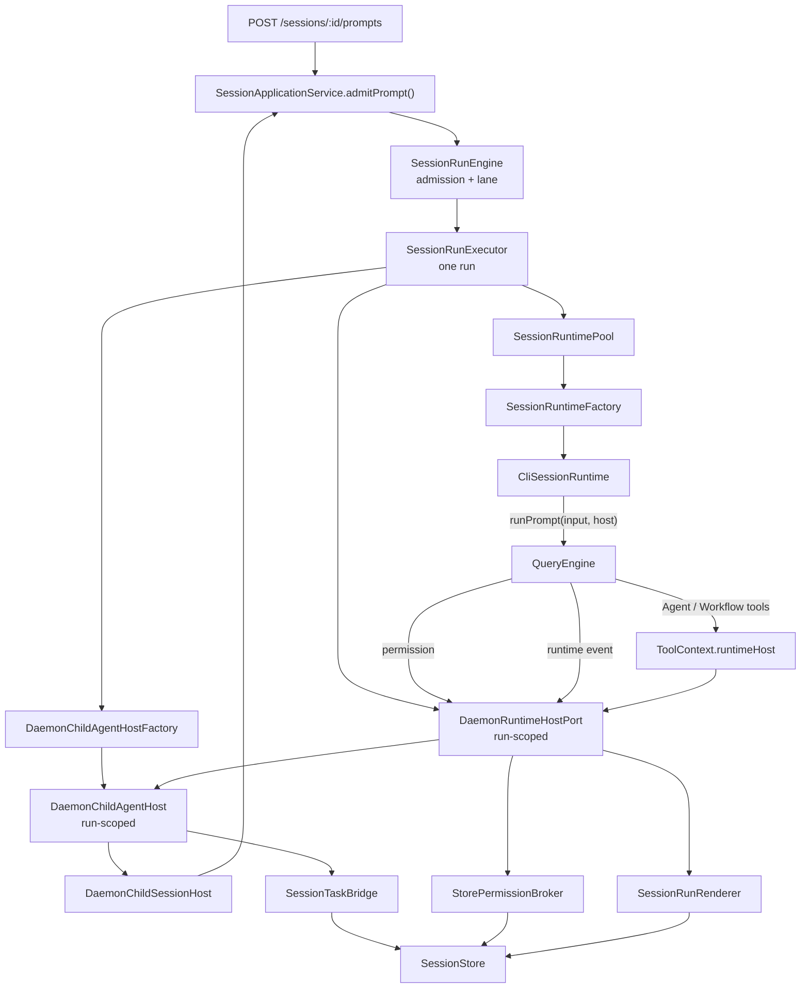

# Runtime Host Port 设计与 Phase 7 落地状态

> 日期：2026-08-07
>
> 状态：Phase 0-7 已落地。本文是当前代码的任务文档，不是未来提案。
>
> 目标：把 daemon 和 QueryEngine 之间零散的 callback、bridge、handle 收束到一个 run-scoped `RuntimeHostPort` 边界，降低状态归属分裂和句柄双向穿梭。

## 0. 核心判断

`RuntimeHostPort` 不是新的业务大对象。它是一条边界：

```text
runtime/framework asks for host capabilities
host decides transport, projection, and durable state
```

当前主链路已经变成：

```text
SessionRunExecutor
  -> creates childAgentHost via DaemonChildAgentHostFactory
  -> creates DaemonRuntimeHostPort
  -> runtime.runPrompt(input, host)
  -> CliSessionRuntime
  -> QueryEngine.submitMessage(..., { runtimeHost: host })
  -> tools use ToolContext.runtimeHost
```

一句话：

```text
daemon owns durable product state
runtime owns execution
RuntimeHostPort is the narrow host-capability port
```

## 1. 当前接口

关键类型位置：

| 类型 | 文件 | 说明 |
|---|---|---|
| `RuntimeHostPort` | `packages/server/src/runtime-host.ts` | daemon run-scoped host port |
| `QueryRuntimeHost` | `packages/core/src/types/runtime.ts` | core/tool 可见的 host contract |
| `ToolRuntimeHost` | `packages/core/src/types/tools.ts` | tool context 中的 host contract |
| `SessionRuntime` | `packages/server/src/runtime.ts` | runtime 必须接收 `runPrompt(input, host)` |

当前形状：

```ts
export interface RuntimeHostPort extends RuntimeChildAgentHost {
  readonly scope: RuntimeHostScope;

  emitEvent(event: RuntimeHostEvent): void | Promise<void>;
  emitStreamEvent(event: StreamEvent): void | Promise<void>;
  requestPermission(input: PermissionRequestInput): Promise<PermissionDecision>;
}

export interface RuntimeChildAgentHost {
  spawnChildAgent(input: ChildAgentSpawnInput): Promise<ChildAgentInvocation>;
  sendChildInput(invocationId: string, input: ChildAgentInput): Promise<void>;
  interruptChildAgent(invocationId: string, reason?: string): Promise<void>;
  awaitChildAgent(invocationId: string): Promise<ChildAgentResult>;
}

export interface SessionRuntime {
  runPrompt(input: SessionRuntimeRunInput, host: RuntimeHostPort): Promise<SessionRuntimeRunResult>;
}
```

`SessionRuntimeFactory.createRuntime()` 只负责把持久 session 构造成 runtime：

```ts
createRuntime(context: {
  session: SessionRecord;
  history: SessionMessageRecord[];
  parts: SessionMessagePartRecord[];
}): Promise<SessionRuntime>;
```

它不再接收 `childSessionHost` 或 `sessionTaskBridge`。child-agent 能力只在单次 run 的 host port 中注入。

## 2. 边界收束结果

| 旧入口 | 当前入口 | 状态 |
|---|---|---|
| `SessionRuntimeHooks.onEvent` | `RuntimeHostPort.emitEvent()` | 已直接切换，无 alias |
| `SessionRuntimeHooks.onStreamEvent` | `RuntimeHostPort.emitStreamEvent()` | 已直接切换，无 alias |
| `SessionRuntimeHooks.askPermission` | `RuntimeHostPort.requestPermission()` | 已直接切换，无 alias |
| `QueryEngine.permissionPrompt` | `SubmitMessageOptions.runtimeHost.requestPermission()` | 已删除 |
| `QueryEngine.runtimeEventSink` | `ToolContext.runtimeHost.emitEvent()` | 已删除 |
| `registerChildSessionBackend()` | `ToolRuntimeHost.spawnChildAgent()` | Phase 5B 已切换 |
| `ChildSessionBackend` in Agent tool | `DaemonChildAgentHost` behind runtime host | Phase 5B 已切换 |
| runtimeFactory child bridge context | run-scoped host injection | 已删除 |

## 3. Permission 闭环



规则：

- live waiter 属于 `PermissionController`。
- durable truth 属于 `SessionStore`。
- HTTP/SSE 只是 projection 和 transport。
- daemon 重启后不会恢复 live stack，pending permission 会被终态化。

关键文件：

| 文件 | 责任 |
|---|---|
| `packages/server/src/permission-controller.ts` | live request handle、resolve、abort expire |
| `packages/server/src/permission-broker.ts` | durable projection、session approval cache、HTTP reply bridge |
| `packages/server/src/http/daemon-runtime-host.ts` | `RuntimeHostPort.requestPermission()` daemon adapter |
| `packages/core/src/engine/query-engine.ts` | tool permission 调用 host |

## 4. Child Agent 闭环



规则：

- Agent tool 不再知道 daemon `ChildSessionHost` 和 `SessionTaskBridge`。
- `DaemonChildAgentHost` 是唯一组合 child session、child run、parent task projection、interrupt/await 的 adapter。
- `SessionRuntimePool` 不再持有 child-agent bridge；它只缓存 runtime。
- `isolate: true` 的 worktree 创建在 `DaemonChildAgentHost` 内部处理，属于 daemon child lifecycle。
- `SendMessage` 对由 Agent tool 创建的 task，会通过 invocation id 回到 `runtimeHost.sendChildInput()`。

关键文件：

| 文件 | 责任 |
|---|---|
| `packages/tools/src/agent/index.ts` | Agent/SendMessage 通过 `context.runtimeHost` 访问 child port |
| `packages/tools/src/agent/workflow-runner.ts` | Workflow 默认 worker spawn 走 runtime host child port |
| `packages/tools/src/agent/workflow.ts` | 把 `context.runtimeHost` 传入 workflow runner |
| `packages/server/src/http/child-agent-host-factory.ts` | run-scoped child-agent host factory，收口 child session host + task bridge 组装 |
| `packages/server/src/http/daemon-child-agent-host.ts` | daemon child invocation adapter |
| `packages/server/src/http/session-run-executor.ts` | 每次 run 创建 `DaemonRuntimeHostPort`，并通过 factory 获取 child-agent host |
| `packages/server/src/http/session-task-bridge.ts` | parent-visible durable task projection |

## 5. 当前运行图



## 6. Phase 5B 完成清单

- `packages/core/src/types/runtime.ts` 新增 query/runtime child-agent host 类型。
- `packages/core/src/types/tools.ts` 导出 `ToolRuntimeHost`。
- `packages/tools/src/agent/index.ts` 的 Agent/SendMessage 改为 runtime-host port。
- `packages/tools/src/agent/workflow-runner.ts` 的默认 worker spawn 改为 runtime-host port。
- `packages/tools/src/agent/workflow.ts` 把 `context.runtimeHost` 传入 runner。
- `apps/cli/src/runtime.ts` 删除 `registerChildSessionBackend()` bootstrap 注册路径。
- `apps/cli/src/session-runtime.ts` 不再向 bootstrap 传 child host/task bridge。
- `packages/server/src/http/session-runtime-pool.ts` 删除 child host/task bridge context。
- `packages/server/src/runtime.ts` 的 runtime factory context 删除 child host/task bridge。
- `packages/server/src/http/daemon-child-agent-host.ts` 支持 `sessionId`、`systemPrompt`、`worktree`、`notice` 和 worktree cleanup。
- 相关测试已覆盖 Agent、Workflow、DaemonChildAgentHost、DaemonRuntimeHostPort、runtime pool、run executor/engine。

## 7. Phase 6-8 收口状态

- Phase 6：删除 `@openharness/swarm` 旧 `ChildSessionBackend` / backend registry surface，相关文档转为历史归档。
- Phase 7：`SessionRunExecutor` 不再直接持有 `ChildSessionHost` 和 `SessionTaskBridgeManager`；二者由 `DaemonChildAgentHostFactory` 在 server-local 层组装成 run-scoped child-agent host。
- Phase 8：`DaemonChildAgentHost` 内部 worktree helper 已抽成 `packages/server/src/http/child-agent-worktree.ts`，并补独立测试。
- `@openharness/server` public barrel 不再导出 `ChildSessionHost` / `SessionTaskBridge`；这些类型只服务 server 内部 adapter。

## 8. 后续非兼容改造建议

1. 统一 `TaskWait` 对 runtime-host child invocation 的语义说明：用户看到的是 task projection，真实执行句柄是 invocation。
2. 继续评估 framework 层是否应该提供更通用的 `ChildAgentInvocationHandle`，daemon 只实现 host adapter。
3. `DaemonChildSessionHost` 可以继续内收为 factory 私有依赖，减少被误读为 framework API 的机会。
