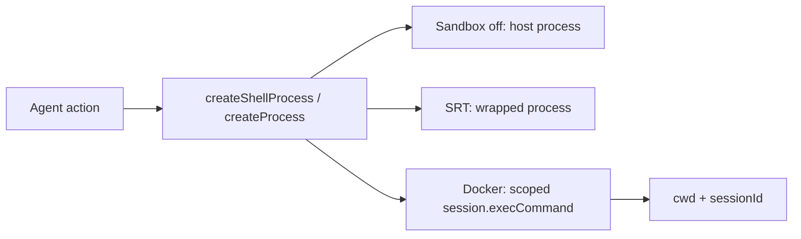
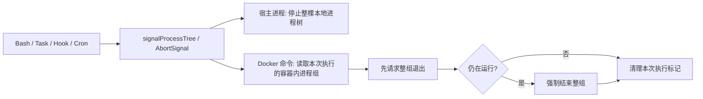

# Sandbox Runtime 调用链

> 本文是 Sandbox 运行边界的权威说明。代码入口以 `packages/sandbox/src/shell.ts` 为准。

## 统一进程入口

Agent Framework 能力触发的外部工作负载只通过两个 API 启动：

```ts
createShellProcess(command, { cwd, sessionId, settings, signal })
createProcess(argv, { cwd, sessionId, settings, signal })
```

- `createShellProcess` 接收一整条命令文本，供 Bash、command hook、Cron 使用；在宿主机器上可以选 Bash 或系统默认命令行，在 Docker 中固定使用 `/bin/sh`。
- `createProcess` 接收已经拆好的程序名和参数，不再让 shell 二次解释，供 Task argv 和 LSP/ripgrep 使用。
- 两者用同一套规则决定命令在哪里运行：Sandbox 关闭时在宿主机器运行；SRT 开启时交给 SRT；Docker 开启时进入当前 `cwd + sessionId` 对应的容器。
- `failIfUnavailable=true` 时没有匹配后端必须抛错，不允许偷偷回宿主执行。



当前入口矩阵：

| 调用方 | 入口 | 执行边界 |
|---|---|---|
| Bash | `createShellProcess` | Sandbox workload |
| TaskManager shell / argv / autodream | `createShellProcess` / `createProcess` | Sandbox workload |
| command hook | `createShellProcess` | Sandbox workload |
| Cron scheduled run / RemoteTrigger | `CronScheduler.trigger` -> `createShellProcess` | Sandbox workload |
| LSP 的 ripgrep 查询 | `createProcess` | Sandbox workload |
| Read / Write / Edit | Node filesystem + `sandboxPathError` | host-guarded file IO |
| Glob / Grep 的 host ripgrep 加速 | direct host utility + `sandboxPathError` | host-guarded，明确例外 |
| 主 daemon/TUI/frontend 自启动 | host process | application infrastructure |
| git worktree / merge / runtime repo setup | host process | host workspace infrastructure |
| MCP stdio transport | MCP SDK 内部启动 | 第三方 transport 边界，尚未接入 Sandbox |

这里的“统一”针对 **Agent 工作负载**，不把 daemon 自启动、Docker CLI、git worktree 管理误当成模型命令。宿主例外必须出现在上表，不能在业务模块里静默新增 `child_process`。

## 停止命令时发生什么

不能只杀宿主机器上的 `docker exec`。如果只杀这一层，容器内的命令和它启动的后台进程可能继续运行。

现在每次 Docker 命令都有自己的容器内进程组：



- `process-control.ts` 提供统一的整棵进程停止入口。
- `docker-backend.ts` 给每次容器命令分配执行编号，并记录容器内进程组。
- `AbortSignal`、Bash 超时、TaskStop 和 runtime 关闭都走这套停止规则。
- Docker 镜像必须提供 `setsid`、`sleep` 和 `/bin/kill`。缺少时启动直接失败，不会降级成可能清理不干净的执行。
- 可复用容器关闭 runtime 时仍保留容器，但会先清掉该 runtime 启动且仍在运行的命令。

## 当前未闭环

1. Docker 整棵进程停止已经实现并有真实 E2E 用例，但本机 Docker daemon 未启动，本轮这些用例被跳过；还需要在可用的 Docker 环境或 CI 中实际跑通。
2. Cron 已由主 daemon 托管，并使用 `cwd + cron:<jobId>` 启动自己的 Sandbox 范围。主 daemon 没运行时，Cron 也不运行。
3. 主 daemon 已支持通过 `ohs daemon install` 交给 Windows 计划任务、macOS LaunchAgent 或 Linux systemd user service 管理；当前用户登录后自动启动，崩溃后由系统重启。
4. MCP SDK 的 stdio transport 自己创建进程，还不能交给 Sandbox 启动。
5. Glob/Grep 仍在宿主机器搜索，只做路径边界检查；后续要改成可选择宿主或容器的文件操作接口。

Sandbox 有两条后端：

- **`srt`**：用 Anthropic Sandbox Runtime（`@anthropic-ai/sandbox-runtime`）把**每条** shell 命令包一层。
- **`docker`**：启动一个长驻容器，后续 shell 用 `docker exec` 在容器内跑。

默认关闭。开启且未指定 backend 时，默认是 **`srt`**。

设计细节见 [`sandbox-runtime-design.md`](./sandbox-runtime-design.md)。

## 核心模型：启动选后端 + 执行时包装

分两阶段：

1. **启动**：按配置/环境选后端并准备（srt 只检查可用性；docker 起容器）。
2. **执行**：Bash 走对应后端；文件工具仍在宿主进程，但过路径校验。

```text
┌─ 启动（一次）─────────────────────────────────────────┐
│ loadSettings → bootstrap → startSandboxRuntime         │
│   srt:  检查环境，记下 status=active                   │
│   docker: 检查环境 + 起容器 + setActiveSandboxSession  │
└────────────────────────────────────────────────────────┘
                          │
                          ▼
┌─ 每轮工具调用 ─────────────────────────────────────────┐
│ Bash  → createShellProcess                             │
│           srt    → wrapCommandForSrt → spawn srt -c …  │
│           docker → docker exec … /bin/sh -c …          │
│           off    → 宿主 shell                          │
│ 文件工具 → sandboxPathError → 宿主读写 + 路径校验      │
└────────────────────────────────────────────────────────┘
```

## 涉及的模块

| 组件 | 文件 | 职责 |
|------|------|------|
| 配置归一化 | `packages/sandbox/src/config.ts` | `normalizeSandboxConfig`：默认值、`runtime`→`backend` 别名 |
| 可用性 | `packages/sandbox/src/availability.ts` | 平台 / `srt` / `bwrap` / `sandbox-exec` / Docker CLI·daemon |
| 生命周期 | `packages/sandbox/src/lifecycle.ts` | `startSandboxRuntime`：按 backend 分支启动或 inert |
| SRT 包装 | `packages/sandbox/src/srt-adapter.ts` | 写临时 settings，拼 `srt --settings … -c …` |
| Docker 后端 | `packages/sandbox/src/docker-backend.ts` | 启动容器、在容器里执行命令，并在停止时清理容器内整棵进程树 |
| 进程停止 | `packages/sandbox/src/process-control.ts` | 给宿主、SRT、Docker 提供同一个“停止命令及其子进程”入口 |
| Session | `packages/sandbox/src/session.ts` | 按 `cwd + sessionId` 保存当前可用的 Sandbox session |
| 命令入口 | `packages/sandbox/src/shell.ts` | `createShellProcess` / `createProcess`；读取设置并选择宿主、SRT 或 Docker |
| 路径校验 | `packages/sandbox/src/path-validator.ts` | 文件工具路径是否在 sandbox root / allow 列表 |
| Runtime 挂载 | `packages/agent-runtime/src/default-runtime.ts` | `attachSandboxRuntime`：默认 runtime 组装后启动，docker 时注册 cleanup |
| Bash | `packages/tools/src/shell/bash.ts` | timeout / 输出截断；spawn 走 `createShellProcess` |
| 文件守卫 | `packages/tools/src/file/sandbox-guard.ts` | Read/Write/Edit/Glob/Grep 调 `validateSandboxPath` |
| Settings | `packages/core/src/config/settings.ts` | env 覆盖 `OPENHARNESS_SANDBOX_*` |

## A. 启动阶段

```text
surface / daemon AgentPool
  └─ createOpenHarnessAgent({ settings, cwd, sessionId })
       # packages/agent-runtime/src/agent.ts
       └─ internal default composition
            # packages/agent-runtime/src/default-runtime.ts
            └─ 组装 QueryEngine / ToolRegistry / …
            └─ RuntimeBuilder.build(settings)
            └─ attachSandboxRuntime(bundle, cwd)
                 └─ startSandboxRuntime({ settings, cwd, sessionId })
                      # packages/sandbox/src/lifecycle.ts
```

推荐用子命令切换 sandbox：

```bash
ohs sandbox on                         # 项目配置：Docker + bridge 网络 + 复用容器（默认）
ohs sandbox on --net none              # 离线 sandbox
ohs sandbox on --no-reuse              # 每次会话创建临时容器
ohs sandbox on --global                # 写全局用户配置
ohs sandbox on --backend srt           # 使用 Anthropic Sandbox Runtime
ohs sandbox on --net proxy --proxy http://host.docker.internal:7890
ohs sandbox off
ohs sandbox clean                      # 删除当前项目的复用容器
ohs sandbox rebuild                    # 配置变化后删除复用容器，下一次启动重建
ohs sandbox status                     # 展示配置来源、容器、镜像、Dockerfile、config hash
ohs sandbox doctor                     # status + backend 可用性检查
```

子命令写入 `settings.json`，已经运行中的 CLI/TUI 需要重启后才会挂载新的 sandbox runtime。

常用环境变量（高级覆盖）：

```bash
OPENHARNESS_SANDBOX_ENABLED=true
OPENHARNESS_SANDBOX_BACKEND=docker          # 或 srt
OPENHARNESS_SANDBOX_FAIL_IF_UNAVAILABLE=true
OPENHARNESS_SANDBOX_NETWORK_MODE=bridge     # none | bridge | host | proxy
OPENHARNESS_SANDBOX_DOCKER_IMAGE=node:22-bookworm
OPENHARNESS_SANDBOX_DOCKER_DNS=1.1.1.1,8.8.8.8
OPENHARNESS_SANDBOX_HTTP_PROXY=http://host.docker.internal:7890
OPENHARNESS_SANDBOX_HTTPS_PROXY=http://host.docker.internal:7890
OPENHARNESS_SANDBOX_NO_PROXY=localhost,127.0.0.1
```

`startSandboxRuntime` 分支：

```text
normalizeSandboxConfig(settings.sandbox)
  │
  ├─ enabled=false
  │    → inertRuntime(state=off)                   # 不包装、不启容器
  │
  ├─ backend === "srt"（默认）
  │    └─ getSrtAvailability()
  │         检测：平台？srt CLI？Linux/WSL 要 bwrap？macOS 要 sandbox-exec？
  │         可用 → inertRuntime(state=active)      # 不启长驻进程
  │         不可用 + failIfUnavailable → 抛错
  │         不可用 + 可降级 → inertRuntime(unavailable)
  │
       └─ backend === "docker"
            └─ getDockerAvailability()
                检测：平台 / docker CLI / daemon；host@macOS 等限制
            └─ docker image inspect；镜像缺失且 autoBuildImage=true 时用内置 Dockerfile build
            └─ new DockerSandboxSession().start()
                reuseContainer=true  → 复用/启动项目容器，缺失时 docker run -d … image tail -f /dev/null
                reuseContainer=false → docker run -d --rm … image tail -f /dev/null
       └─ setActiveSandboxSession(session)
       └─ CLI 仅在 docker active 时注册 cleanup
          reuseContainer=true  → 进程 exit 时保留容器
          reuseContainer=false → 进程 exit 时 stop 临时容器
```

要点：

- `srt` 启动时**只检查可用性**，真正包装发生在每次 shell。
- `docker` 启动时**准备长驻容器**，后续 shell 用 `docker exec`；默认按项目复用，`--no-reuse` 才使用会话临时容器。
- 未指定 `backend` 时默认 `"srt"`；旧字段 `runtime: "docker"|"srt"` 会映射到 `backend`。
- `failIfUnavailable=true` 时启动失败即中断；否则记 `unavailable`，继续无沙箱跑。

## B. 执行阶段

### B1. Shell（Bash）

```text
模型调 Bash
  └─ QueryEngine.executeTools()
       └─ bashTool.execute()                       # packages/tools/src/shell/bash.ts
            └─ createShellProcess(command, { cwd }) # packages/sandbox/src/shell.ts
                 │
                 ├─ sandbox.enabled=false
                 │    → spawnHost(resolveShellArgv)   # 宿主 shell；探测结果进程内缓存
                 │
                 ├─ backend === "docker"
                 │    └─ argv = resolveContainerShellArgv  # 固定 ["/bin/sh","-c",cmd]
                 │         getActiveSandboxSession()
                 │         active → session.execCommand(argv)  # docker exec …
                 │         否则 → fail closed 抛错，或降级宿主 resolveShellArgv
                 │
                 └─ backend === "srt"
                      └─ getSrtAvailability()
                           不可用 → 降级或抛错
                           可用 → wrapCommandForSrt(resolveShellArgv)
                                    写临时 settings.json（filesystem / network）
                                    argv = [srt, --settings, path, -c, shellJoin(原argv)]
                                  → spawnHost(wrapped.argv)
                                  → close/error 时 cleanup 临时目录
```

### B2. 文件工具（宿主执行 + 路径边界）

MVP 不做文件工具容器化：`Read` / `Write` / `Edit` / `Glob` / `Grep` 仍在宿主进程读写，sandbox 开启时必须过路径校验。

```text
Bash              → docker exec 或 srt 包装
Read/Write/Edit   → 宿主进程 + path guard
Glob/Grep         → 宿主进程 + path guard
```

```text
文件工具
  └─ sandboxPathError(path, cwd, operation)        # sandbox-guard.ts
       └─ settings.sandbox.enabled !== true → 放行
       └─ validateSandboxPath(...)
            deny 优先于 allow；拒绝 .. / 越界 symlink；
            默认只允许 sandboxRoot（cwd）及 allow / extraAllowedRoots
```

### B3. 文件工具容器化演进

Python 原版 OpenHarness 和 Hermes-agent 的做法不同：

| 项目 | 文件工具执行模型 | 可借鉴点 |
|------|------------------|----------|
| Python OpenHarness | `Read` / `Write` / `Edit` 仍由宿主 `Path` 读写；Docker active 时加 path guard。`Glob` / `Grep` 在可用 `rg` 时通过 Docker session `exec_command()` 进容器。 | 适合作为稳定 MVP：先隔离 Bash，再把搜索类工具迁到容器。 |
| Hermes-agent | 文件工具统一走 `ShellFileOperations`，文件操作被表达为 shell 命令，再交给当前 `Environment.execute()`；environment 可以是 local / docker / ssh / modal / daytona。 | 适合作为最终架构：文件工具不直接依赖宿主 fs，而是依赖执行环境。 |

OpenHarness-ts 推荐走中间路线：先补统一文件操作抽象，再分批迁移。

```text
Read / Write / Edit / Glob / Grep
  └─ FileOperations
       ├─ HostFileOperations
       │    └─ 宿主 fs / fast-glob / ripgrep
       └─ SandboxFileOperations
            ├─ Docker: active session.execCommand(...)
            └─ SRT: wrapCommandForSrt(...) 后 spawn
```

迁移原则：

- **宿主先判权**：permission 和 `validateSandboxPath` 仍在宿主执行；通过后再把路径翻译到容器路径。
- **实际 IO 可进容器**：Docker active 且 file tool mode 支持时，真实 read/write/search 在容器内发生。
- **diff/approval 不变**：`Write` / `Edit` 的审批和 diff 仍由宿主编排；宿主从容器读取旧内容，生成 diff，批准后再写回容器。
- **先搜索，后读写**：`Glob` / `Grep` 最容易先迁到 Docker `rg`；`Read` 次之；`Write` / `Edit` 最后迁移。
- **路径翻译集中处理**：Windows Docker Desktop 下宿主 workspace 映射到 `/workspace`，不能让各工具分散拼路径。

推荐阶段：

1. 引入 `FileOperations` 接口，当前所有文件工具先接到 `HostFileOperations`，行为不变。
2. 给 Docker runtime 增加 `runFileCommand()` 或复用 `execCommand()`，让 `Glob` / `Grep` 在容器内跑 `rg`。
3. 增加 `hostPathToContainerPath()` / `containerPathToHostPath()`，覆盖 Windows `/workspace` 映射和 POSIX 同路径映射。
4. 迁移 `Read`：宿主 path guard 后，容器内读取文本、做二进制检测和分页，返回结构化结果。
5. 迁移 `Write` / `Edit`：容器读旧内容，宿主 diff/approval，容器原子写入并回读验证。
6. 若 shell 拼接复杂度上升，再引入容器内 helper，例如 `/opt/openharness/file-helper.mjs`，用 JSON stdin/stdout 承载 read/write/glob/grep。

初期建议配置为显式开关：

```json
{
  "sandbox": {
    "fileTools": {
      "mode": "host-guarded"
    }
  }
}
```

可选值：

| 值 | 行为 |
|----|------|
| `host-guarded` | 当前 MVP：宿主执行 + path guard。 |
| `container-search` | `Glob` / `Grep` 进容器，`Read` / `Write` / `Edit` 仍宿主执行。 |
| `container` | 文件工具真实 IO 进容器；permission/path guard 仍宿主判定。 |

默认值先保持 `host-guarded`，等 Docker E2E 覆盖读写、diff、Windows 路径映射后，再考虑让 Docker sandbox 默认 `container-search` 或 `container`。

## C. Docker 后端细节

### C0. 容器生命周期

默认 `ohs sandbox on` 是“项目级复用容器”：

```text
ohs sandbox on
  → 写入当前 workspace 的 .openharness/settings.json
  → sandbox.backend=docker
  → sandbox.network.mode=bridge
  → sandbox.docker.reuseContainer=true

CLI/TUI 启动
  → 检查 Docker CLI / daemon
  → docker image inspect <image>
  → 镜像缺失且 autoBuildImage=true 时，从 packages/sandbox/Dockerfile 自动 build
  → 根据 workspace 路径生成稳定容器名：openharness-sandbox-<project>-<hash>
  → 容器 label 记录当前 Docker sandbox 配置 hash
  → 容器已存在：必要时 docker start
  → 容器已存在但 label hash 不匹配：拒绝复用，提示 ohs sandbox rebuild
  → 容器不存在：docker run -d --name <project-container> ...
  → Bash 每次通过 docker exec 进入该容器执行

CLI/TUI 退出
  → 复用容器保留，供下次同项目启动继续使用

ohs sandbox clean
  → docker rm -f <project-container>

ohs sandbox rebuild
  → docker rm -f <project-container>
  → 下一次 CLI/TUI 启动按当前配置重新 docker run
```

`ohs sandbox on --no-reuse` 切换为“会话临时容器”：

```text
CLI/TUI 启动
  → docker run -d --rm --name <session-container> ...

CLI/TUI 退出
  → docker stop <session-container>
  → Docker 因 --rm 自动删除容器
```

长驻空闲容器大致为：

```text
docker run -d [--rm] \
  --name openharness-sandbox-... \
  --network <none|bridge|host> \
  --dns <server> \                 # 可选，来自 OPENHARNESS_SANDBOX_DOCKER_DNS
  -v <host-workspace>:<container-workspace> \
  -w <container-workspace> \
  <image> tail -f /dev/null
```

路径映射：

| 平台 | 容器内工作目录 |
|------|----------------|
| Linux / WSL / macOS | 与宿主绝对路径相同（`cwd:cwd`） |
| Windows Docker Desktop | 宿主工作区挂到 **`/workspace`** |

每条 shell：

```text
docker exec -w <container-workspace> <container> /bin/sh -c "<command>"
```

网络注意：

- `bridge` 只表示允许 Docker 网络，**不保证** DNS 或外网一定通。
- Windows Docker Desktop 上 DNS 失败时可用 `OPENHARNESS_SANDBOX_DOCKER_DNS`。
- 访问本机代理常用 `host.docker.internal`（配合 `OPENHARNESS_SANDBOX_HTTP(S)_PROXY`）。
- `proxy` 网络模式当前是 bridge + proxy env；需要配置 `OPENHARNESS_SANDBOX_HTTP_PROXY` 或 `OPENHARNESS_SANDBOX_HTTPS_PROXY`。
- macOS 上 `host` 网络直接拒绝。

## D. SRT 后端细节

SRT **不**起长驻会话。每条 shell：

```text
srt --settings <temp-settings.json> -c "<quoted shell command>"
```

临时 settings 由 OpenHarness sandbox 的 filesystem / network 配置映射而来；进程结束后删掉临时目录。

## E. 何时用 Docker vs SRT

| 条件 | 结果 |
|------|------|
| `sandbox.enabled=false`（默认） | 全部宿主执行，无包装 |
| `enabled=true`，未指定 backend | **srt** |
| `backend="srt"` 或 `runtime="srt"` | srt CLI 包每条 shell |
| `backend="docker"` 或 `runtime="docker"` | 启容器 + docker exec |
| srt/docker 不可用且 `failIfUnavailable=false` | 降级宿主执行 |
| 不可用且 `failIfUnavailable=true` | 启动或执行时报错 |
| native Windows 上 srt | MVP 不支持；设计上走 WSL |
| Windows + Docker Desktop | 可用 docker；容器 cwd 为 `/workspace` |

## F. 状态展示

`/status` 会报告 sandbox 状态，例如：

```text
Sandbox:       active (docker)
Network:       bridge
Container:     openharness-sandbox-...
Container cwd: /workspace
DNS:           1.1.1.1, 8.8.8.8
Proxy:         configured
```

代理只显示是否已配置，**不打印**具体 proxy URL。

`ohs sandbox status` 会额外读取持久化配置和 Docker 元数据：

```text
Config scope: project+global+env
Global config: ...
Project config: ...
Env overrides: ...
Container: openharness-sandbox-...
Container exists: yes
Container running: yes
Image exists: yes (openharness-sandbox:latest)
Dockerfile: ...
Config hash: ...
Container config hash: ...
Container config matches: yes
```

`ohs sandbox doctor` 在 status 基础上再输出 backend availability，例如 Docker CLI / daemon 是否可用、平台、
降级原因等。

## G. Docker E2E

`packages/sandbox/e2e/docker.e2e.test.ts` 覆盖真实 Docker 路径：

- 启动 Docker runtime，并在挂载工作区内执行 shell。
- `network=none` 时阻断外网。
- `proxy` 模式缺少 proxy env 时 fail closed。
- 项目级 `reuseContainer=true` 时，连续两次 runtime 启动复用同一个容器。
- 复用容器的 config hash 过期时 fail fast，并提示 `ohs sandbox rebuild`。
- `reuseContainer=false` 时，会话临时容器 stop 后被 Docker `--rm` 删除。
- `OPENHARNESS_E2E_DOCKER_NETWORK=1` 时额外测试 bridge 网络访问 `https://example.com`。

测试默认使用本地 `node:22-bookworm`；Docker daemon 或镜像不可用时跳过。可用
`OPENHARNESS_E2E_DOCKER_IMAGE` 指定其他本地镜像。
