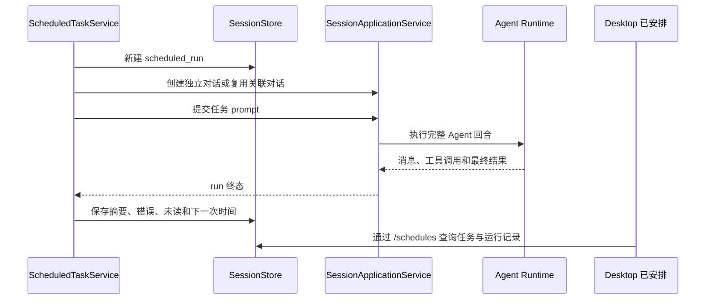

# Scheduled Tasks 运行流程

> 本文描述当前实现。“已安排任务”是在指定时间让 Agent 执行一段指令，不是到点运行一条 shell 命令。

## 用户入口

- 创建：在任意 daemon Agent 对话中说明任务内容、执行时间、时区、项目和返回位置。Agent 调用 `ScheduleCreate`。
- 管理：Desktop 左侧【已安排】页面列出任务，可暂停、继续、立即运行、删除并查看最近运行。
- API：跨端客户端通过 `/schedules/*` 读写同一份 daemon 状态。

旧的 `ohs cron`、`/cron/*` 和 `Cron*` Agent 工具已经移除，不再维护第二套“运行 shell 命令”的计划任务语义。旧数据库迁移文件保留，只用于让已有数据库继续正常升级，不会恢复旧入口或执行旧任务。

## 关键组件

| 组件        | 文件                                                                  | 实际作用                                               |
| ----------- | --------------------------------------------------------------------- | ------------------------------------------------------ |
| Agent 工具  | `packages/tools/src/schedule/scheduled-task-tools.ts`                 | 把对话中的创建、修改、删除、查看和立即运行请求交给宿主 |
| daemon 服务 | `packages/server/src/daemon/scheduled-task-service.ts`                | 保存任务、恢复定时器、防止重叠运行并记录结果           |
| 重复规则    | `packages/services/src/schedules/recurrence.ts`                       | 校验一次性时间或 RRULE，按任务时区计算下一次运行       |
| 数据库存储  | `packages/services/src/session-runtime/store.ts`                      | 读写 `scheduled_task` 和 `scheduled_run`               |
| HTTP API    | `packages/server/src/http/routes/schedules.ts`                        | 给 Desktop 和其他客户端提供统一接口                    |
| Desktop     | `apps/desktop/src/renderer/src/components/desktop/scheduled-page.tsx` | 【已安排】管理界面                                     |

## 到点运行

任务重叠时默认跳过本次运行，也可以配置为排队；错过时间默认跳过，也可以在恢复后补跑一次。一次性任务完成后自动结束。daemon 关闭时停止定时器，并把正在执行但未完成的记录收口为已中断。

## 当前边界

- 已支持本地项目执行，以及结果进入独立对话或返回关联对话。
- `executionMode=worktree` 仅用于独立对话。每次运行创建独立 Git worktree；无改动时自动清理，有改动时保留分支和目录供审查。项目不是 Git 仓库或 worktree 创建失败时会标记为“需要处理”，不会悄悄退化为本地执行。
- `permissionProfile` 会映射到 Agent 的只读、工作区可写或完全访问模式；任务可进一步限制工具。`network=false` 会禁用 Agent 的 WebFetch/WebSearch。
- 关联对话任务继承原对话的模型和权限，避免一次后台运行永久改写用户会话；自定义模型、effort、权限或 worktree 必须使用独立对话。
- 计划任务依赖主 daemon 存活；daemon 未运行时不会在另一个隐藏进程里执行。
