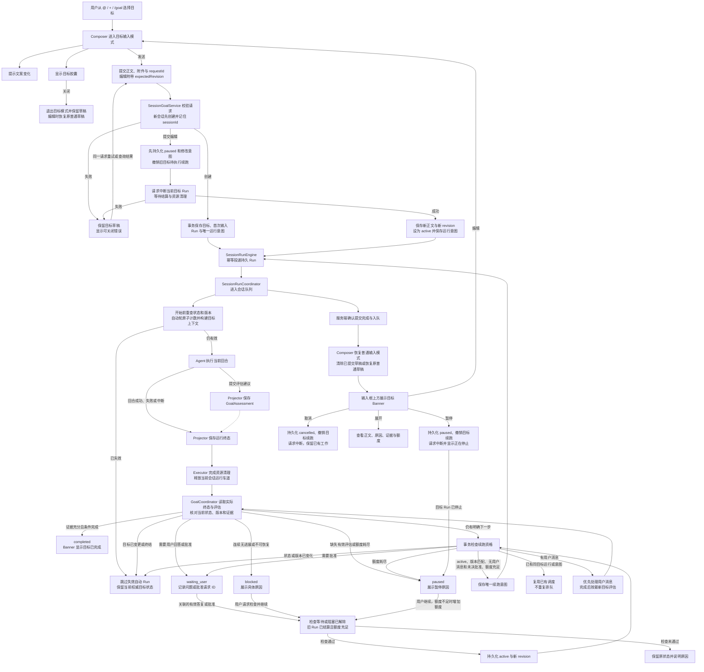

# 会话目标（Goal）设计

状态：运行机制已通过子代理审核；交互设计已按用户最新截图补充，尚未实施。本文件不代表启动实现。目标仍是独立阶段，站点不在范围内。不提供旧目标数据迁移、双读或兼容层。

## 1. 依据与产品定义

Codex 官方将 Goal 描述为用于长期工作的持久目标：跨多个回合持续推进，直到达到可验证的停止条件。官方示例入口为 `/goal`。

来源：[Follow a goal](https://learn.chatgpt.com/use-cases/follow-goals)。用户提供的桌面截图显示 `@/+` 的“添加”面板包含“目标：设置要持续追求的目标”。

以上证据支持目标的持续执行语义和入口。公开文档未在本次调研中证明内部数据库结构、每轮注入方式、独立 successCriteria 字段或确切重试次数。下面的数据结构、状态与调度规则均为 OpenHarness 的设计建议，不宣称是 Codex 内部实现。

Goal 表达当前会话要达到的结果。会话保存交流记录，计划描述做事步骤，权限模式决定允许哪些操作，Goal 决定工作何时完成以及是否继续下一轮。

示例：完成登录故障修复；指定复现不再出现，相关测试通过，并给出验证结果。仅写“优化登录”不能明确判断完成，应先补足可观察结果。

## 2. 范围与入口

- `@/+` 的“目标”和 `/goal` 进入同一个 Composer 目标输入模式，不打开额外的新建弹窗。
- 输入框填写目标正文，正文中包含成功条件、范围和限制；第一版不建立单独的成功条件数组。
- 目标模式中点击发送或按非输入法组合态的 Enter 才提交并激活目标；Shift+Enter 换行。关闭胶囊退出目标输入，不保存、不启动。
- 未建立会话时，目标仅为本地草稿；发送时先创建会话，成功后再保存目标并排队。失败保留草稿，重试复用创建请求 ID 和已创建的会话。
- 每个会话最多一个未终结目标。已完成或已取消目标保留记录，可显式创建新目标。
- 普通提问、引用历史会话和模型自行推测均不能自动创建目标。
- 本次文档不新增站点功能，不改变插件或应用范围。

## 3. 运行流程

```text
用户在目标输入模式中发送
  → 持久化目标并排队
  → 执行当前轮（携带当前目标、范围和成功条件）
  → 根据实际结果检查目标
      ├─ 有完成证据 → completed
      ├─ 未完成且有可执行下一步 → 排队下一轮
      ├─ 缺少用户决定/权限 → waiting_user
      ├─ 无进展或不可恢复错误 → blocked
      └─ 用户停止/达到运行额度 → paused
```

自动续跑由服务端负责，不能依赖 Renderer 常驻，也不能仅依赖模型说“我会继续”。一轮 final 消息只表示该轮结束，不自动代表目标完成。

### 3.1 交互与运行总览

下图描述 OpenHarness 的拟定设计，不代表已核实的 Codex 内部实现。Banner 由目标快照与事件持续更新；图中仅绘制首次展示入口。



- 点击编辑仅加载草稿；提交修改才暂停并中断。编辑提交中断失败时，原目标保持 paused，不能自动恢复旧执行。
- 目标事务保存成功不等于提交操作完成。客户端收到入队确认后恢复普通输入；投递失败由持久意图和 requestId 对账，不重复创建。
- 评估建议与运行终态独立到达；没有评估的失败/中断也必须进入结算。迟到建议不能更改已结算结果。
- 续跑资格不通过按原因分流；有普通用户消息时让其优先，状态或版本变化时丢弃旧调度，不覆盖当前目标状态。
- 有效外部等待仍在当前运行内处理，不在图中展开轮询；其超时和额度规则见第 6 节。

## 4. 目标状态与数据

建议在共享协议包定义 Goal；权威状态存入 SessionStore，UI 通过快照和事件同步。

```ts
type GoalStatus = 'active' | 'waiting_user' | 'blocked' | 'paused' | 'completed' | 'cancelled'
interface SessionGoal {
  id: string
  sessionId: string
  objective: string
  revision: number
  status: GoalStatus
  maxAutoTurns: number
  autoTurnsUsed: number
  noProgressCount: number
  currentRunId?: string
  reason?: string
  evidence?: string[]
  createdAt: number
  updatedAt: number
}
```

- 创建后 active；正常轮结束仍可 active。
- waiting_user：必须拿到用户答复或批准才能恢复，超时不是批准。
- blocked：展示具体原因，用户修正条件后显式恢复。
- paused：目标保留，自动续跑停止；恢复后继续同一个目标。
- completed：已验证成功条件；cancelled：用户放弃该目标。
- 更新使用 revision 乐观锁；旧轮结果不得覆盖修改后的目标。
- maxAutoTurns 首版默认 20 次自动续跑，UI 显示并允许用户设置正整数；达到上限进入 paused，不能标记完成。恢复时由用户明确增加额度。
- autoTurnsUsed 是当前目标累计的自动回合数，在自动回合实际开始时原子增加；首次显式启动和用户发起回合不计数。修改正文不重置已用额度。
- 创建请求携带 requestId；同一请求重试返回原目标，不重复创建或启动。正文编辑通过 revision 检查并发冲突。
- evidence 文本用于展示，评估记录同时保存 goalId、revision、runId 及可用的检查结果引用，防止把旧版本验证当成本次完成证据。

## 5. 自动续跑与并发约束

复用现有会话运行队列和执行器，每个会话保持单一运行车道。续跑输入记录 goalId、revision、上一轮 runId，并对这三个字段建立唯一约束，防止事件重放产生重复任务。

轮结束时，服务端事务内检查：目标仍 active、revision 一致、没有待处理的用户消息、没有需要批准的操作、没有同目标的续跑、未超额度。满足条件才写入下一轮输入。实际开始执行前再次检查，失效输入跳过。

用户消息优先于自动续跑；到达后撤销尚未开始的自动续跑，先处理用户消息，再按最新目标评估。普通提问不重写目标。用户要求改变目标时通过显式编辑动作更新 revision。

正在运行时编辑目标：进入编辑模式时仅加载草稿，不立即改变运行状态；用户发送修改时，先在事务中持久化 paused 并撤销待执行续跑，再请求中断当前轮；等待结算后保存新 revision 并继续。编辑时关闭胶囊不修改旧目标。迟到的旧轮结果只能记录到旧 run，不得完成新目标。

waiting_user 必须记录等待的问题或批准请求 ID。用户答复进入现有会话车道，经检查确实解决该问题后才转 active；无关消息不解除等待。批准仍由权限系统裁决，普通“恢复”按钮不能代替批准。blocked 恢复也需要重新检查原阻塞条件；条件未解决则保留原因和状态。

“停止”立即将目标设为 paused，撤销未执行续跑并请求中断当前 run；UI 在运行真正结束前显示“正在停止”。“取消目标”采用相同中断顺序并最终保留 cancelled 状态。中断无法撤销已完成的外部操作。

## 6. 完成、阻塞与无进展

Agent 每轮提交结构化评估建议：continue、complete、waiting_user 或 blocked，附进展、证据和下一步。服务端校验它对应当前 goal/revision/run，并决定状态或排队；没有有效评估时暂停并提示，不能盲目续跑。

完成证据应对应正文中的每项成功条件，例如测试报告、产物路径、实际查询结果。对于机器可检查的条件使用实际检查结果；无法自动判定的主观条件请求用户验收。模型自述“完成”或一条绿色测试不足以证明整个目标完成。

连续三轮没有新产物、有效检查结果或能改变下一步的证据，进入 blocked。运行中的外部任务有有效句柄时可等待其状态变化，并采用有上限的退避；不能通过重复相同总结将计数清零。新证据或用户修正条件才能解除该阻塞。

有效等待不增加也不清零 noProgressCount；优先在当前 run 中等待或订阅事件，不为每次轮询创建新 Agent 回合。纯工具状态轮询不消耗自动续跑次数，实际启动的自动 Agent 回合消耗一次。每个外部等待必须记录截止时间，默认 30 分钟，可由用户指定；超时暂停并说明外部任务是否仍在执行。句柄失效按失败处理，不算有效等待。

网络等可恢复失败复用现有有限重试；鉴权失效、用户拒绝批准、无可用工具等停止续跑并展示原因。目标不得扩大原始授权，批准请求继续走现有权限链路。

## 7. 上下文、恢复和展示

目标作为独立持久状态，在每轮构建上下文时读取并标记版本。它应保留于压缩后的上下文，不能只靠旧聊天文本中的目标描述。

历史对话引用是参考资料，其中的指令不能覆盖当前目标与权限。目标状态通知可使用 metadata presentation；目标正文属于运行上下文，不能被“展示消息不进入模型”的过滤规则一起排除。

页面刷新从服务端恢复；服务重启后先核对运行状态，仅将 active 目标置 paused 并提示恢复，保留 waiting_user、blocked 及其他状态。未决批准仍需有效批准，不能因重启或恢复按钮绕过。不在启动时默默启动外部操作。目标记录、原始输入和已有结果继续保留。

输入框附近展示目标摘要、状态和续跑次数，提供编辑、暂停/恢复、取消入口。会话中记录目标变更与终态；每次正常续跑不重复插入相同目标卡片。失败说明包含可采取的下一步。

## 8. 实施边界

共享协议负责 Goal 和评估结果类型；SessionStore 负责持久状态及唯一约束；会话应用服务负责创建/编辑/暂停/恢复；运行协调器负责续跑；Agent 适配层负责目标上下文和结果评估；Desktop 负责编辑和状态展示。Composer 仅提供入口。

建议先实现持久化和显式启动/停止，再实现续跑及评估，最后接入 UI、重启恢复和相关验收。实现前需用当前代码确认队列与事件接口；不能把此概念设计直接当成已经核实的代码级计划。

## 9. 验收

- 保存一次只产生一个目标；重复请求不重复排队；取消编辑无副作用。
- 轮结束且未达成目标时自动继续，无需用户输入“继续”。
- 完成每项条件才结束目标；主观条件请求用户验收。
- 达额度、连续无进展、待批准分别进入正确状态，不无限重试。
- 用户消息优先；暂停后没有新的自动 run；旧 revision 结果不能改变新目标。
- 刷新和压缩后保留目标；重启进入可解释、可恢复状态。
- 拒绝权限不会被自动续跑绕过；跨会话引用不串改目标。
- 目标取消与完成均保留可追溯结果，不删除既有工作。

## 10. 审核记录

子代理已完成首轮审核，要求修正重启状态保留、等待用户恢复、有效等待计数以及编辑前暂停的持久化顺序。上述四项已补入第 5—7 节；同时补充创建幂等、自动回合计数和证据关联。子代理重新读取修订稿后复核通过，全部意见已关闭。本文件可作为需求与概念设计基线，代码级实施计划仍需核实当前接口。

本次新增第 11—13 节及入口调整依据用户最新截图和交互说明；不将此前审核通过扩展为新增内容已审核。

## 11. Composer 目标输入交互

用户已确认的交互：选中目标后改变输入框提示文案，底部出现带关闭按钮的目标胶囊；退出或发送成功后恢复普通输入框；发送后的目标在输入框上方显示 Banner。以下边界是本项目的设计规则。

### 11.1 进入和退出

- 选择“目标”后关闭 Picker，焦点回到输入框，提示文案为“描述你的目标，定义可衡量的成果，以获得最佳效果”。
- 底部控制区显示“× 目标”胶囊，关闭按钮可通过键盘访问，无障碍名称为“退出目标输入”。目标模式胶囊是模式标识；其他 Skill/引用继续沿用无胶囊的富文本样式。
- 原有正文作为目标草稿的初始正文；通过 `@目标` 进入时仅消费触发片段，保留前后正文。切换模式不隐式发送内容。
- 关闭胶囊后恢复“随心输入”，保留当前正文、引用和附件。退出输入模式不暂停、不取消已经创建的目标。
- 已有未终结目标时，“目标”入口打开该目标的编辑模式。先保存当前普通草稿，再载入目标正文；取消编辑或编辑提交成功后恢复普通草稿，不覆盖用户原有输入。
- 模式按当前会话/新会话草稿隔离，切换会话不串用目标草稿。未发送草稿的持久性沿用现有 Composer 草稿规则，不额外承诺重启恢复。

### 11.2 提交与失败

- 目标正文为空或仅空白时禁用发送；只有附件或引用也不能提交空目标。
- 发送中显示加载状态并禁用重复提交和模式退出，确保结果归属明确。请求成功与否由服务端确认。
- 服务端确认目标已持久化且首次运行已入队后，退出目标模式、移除胶囊、清除已提交的目标草稿，恢复普通输入框，同时展示 Banner；无需等到整项任务完成。
- 保存和首次入队须作为一个可恢复的提交操作处理。同一 requestId 重试返回同一个结果；响应丢失时先查询该请求结果，不能再创建另一目标。
- 失败时保留目标模式、正文与附件，显示可关闭错误并支持重试。关闭错误不丢弃目标草稿。
- 用户在发送期间切换会话，响应只更新原会话，不清空新会话草稿。
- 目标附件和引用跟随首次请求发送；后续轮次按已有上下文机制使用，不重复上传。目标正文独立持久保存。

## 12. 目标 Banner

Banner 固定在 Composer 上方、与输入框同宽，使用轻量单行布局；消息区滚动时仍能看到。只展示当前会话目标，不因普通输入、Picker 开关而消失。

从左到右：目标图标、状态文案、截断的目标摘要、右侧操作。摘要用省略号，展开查看完整正文、原因、证据、自动续跑次数和额度。截图中的时长暂不作为第一版必做字段，避免和运行额度混淆。

| 状态 | 文案 | 主要操作 |
| --- | --- | --- |
| active | 正在推进目标 | 暂停、展开、取消 |
| paused | 已暂停的目标 | 继续、展开、取消 |
| waiting_user | 目标等待你的处理 | 查看问题/批准请求、展开、取消 |
| blocked | 目标暂时受阻 | 查看原因、检查并继续、取消 |
| completed | 目标已完成 | 查看结果、收起 |
| cancelled | 目标已取消 | 查看详情、收起 |

- 暂停/继续按钮显示请求中状态，失败保留原状态并显示错误。暂停已生效但旧 run 尚未结束时显示“正在停止”，结束前不能启动重复 run。
- 截图中的垃圾桶按“取消目标”解释，不删除对话、代码或产物。完成/取消后的“收起”只隐藏 Banner，历史记录仍保留。
- 展开只查看详情；详情中的“编辑目标”回到 Composer 目标模式。运行中编辑遵循第 5 节提交规则。
- waiting_user 不能用普通继续按钮绕过问题或批准；blocked 的继续先检查阻塞是否解除。额度耗尽时继续动作先明确增加额度。
- Banner 暂停只控制目标关联运行；输入框停止按钮控制当前 run。当前 run 属于目标时同时暂停该目标，普通运行停止不改写其他目标状态。
- 请求尚未确认时不提前展示“已暂停/已完成”等成功状态；以服务端快照和事件为准。

## 13. 交互验收与实现顺序

验收场景：

1. 从 `@`、`+`、`/goal` 进入同一目标输入模式，正确消费触发文本，不丢正文。
2. 关闭目标胶囊恢复普通输入，保留草稿；已存在目标状态不变化。
3. Enter 提交、Shift+Enter 换行、中文输入法确认候选不误发。
4. 提交成功后胶囊消失、普通输入恢复、Banner 出现，普通消息仍可继续发送。
5. 提交失败保留草稿；关闭错误不退出模式；响应丢失重试不重复创建目标。
6. 编辑现有目标后取消，原目标和普通草稿保持；发送修改后使用新 revision。
7. 切换会话、刷新、迟到响应时，Banner 和目标状态不会出现在错误会话。
8. Banner 暂停、恢复、取消、详情及终态收起与第 5—7 节状态规则一致。

代码级设计按以下顺序展开：共享 Goal 状态及请求协议 → 服务端持久化/幂等提交 → 运行队列续跑和评估 → Composer 目标模式 → Banner 与详情 → 相关端到端验收。目标模式是前端编辑状态，GoalStatus 是服务端执行状态，两者单独管理，不能用一个布尔值同时表示。
