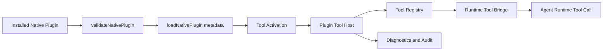

# Native Tool 隔离运行时实施计划

日期：2026-08-25
状态：已实施（Node Tool v1）

> 执行说明：项目偏好里提到复杂需求优先使用 superpower，但当前会话没有可用的 superpower 执行技能；本计划先作为实现蓝图，后续按 Task 顺序直接落地。

## 实施结果

2026-08-26 已完成 Node Tool v1：

- `@openharness/plugins` 只解析并返回 Tool 入口、运行时和有效权限，不 import Tool 模块；
- `@openharness/agent-runtime` 为每个插件版本启动一个 Node 子进程，在子进程内执行 `registerTools()` 和 `invoke()`；
- Tool Host 支持健康检查、注册、调用、取消、超时、关闭、崩溃清理和结构化错误；
- Agent 创建时激活插件 Tool，Agent 关闭时注销 Tool 并回收子进程；
- 子进程只继承运行所需的少量系统环境变量，不继承 daemon 的 API Key 等环境变量；
- Server/Client/CLI 可以显示已声明和可激活的 Tool 入口数，并聚合同一 daemon 进程里所有 Agent Runtime 的 Host 数量、状态、已注册 Tool 数和最近错误；没有活跃 Runtime 时明确显示 `reload-required`，不把安装状态冒充成已激活；
- Wasm Tool 继续返回 `native_tool_runtime_unsupported`，没有被静默当成 Node Tool 执行。

当前隔离边界是“进程与环境变量隔离”，不是操作系统级沙箱。Node Tool 仍可能直接使用 Node 自带的文件、网络和进程 API；manifest 权限目前约束 OpenHarness 后续提供给 Tool 的宿主能力，不能替代容器、受限系统用户或系统调用过滤。这个限制必须在引入更强的插件权限承诺前解决。

**目标：** 为 OpenHarness Native Plugin v1 增加真正可运行的 `tools` 组件，但工具代码不能进入 daemon 主进程，也不能直接复用此前 `tools_dir` 的动态 `import` 模型。Native Tool 必须运行在单独的隔离执行层，具备明确的权限、超时、资源和生命周期边界，并能被 Runtime、Server、CLI 和后续 Desktop 统一观测。

**当前状态：** `@openharness/plugins` 已经可以识别 `components.tools`，但在加载阶段只返回 `unsupported`。这保证了 schema 和安装格式已经稳定，但执行路径仍然缺失。现阶段第三方原生插件和转换后的 Claude 插件都不能真正提供 OpenHarness Tool。

**设计输入：**

- `docs/superpowers/specs/2026-08-25-native-plugin-and-converters-design.md`
- `docs/superpowers/plans/2026-08-25-native-plugin-and-claude-converter.md`

## 为什么现在做它

当前插件平台已经完成了三件关键事：

1. Native Plugin v1 已经成为 Runtime 唯一加载格式。
2. Claude Code 插件已经可以转换成 Native Plugin 并安装。
3. Server、CLI、Client 都已经围绕 installed store 工作。

还没打通的是“插件真正提供可执行能力”的最后一段。如果继续先做 Marketplace、Codex Converter 或 Desktop UI，用户仍然只能安装和查看插件，不能安全地运行第三方 Tool。这个缺口会让后续所有插件能力都停在半成品状态。

## 本计划实现什么

1. 为 Native Tool 定义可激活的运行时契约。
2. 提供独立的 Tool 执行宿主，不让 daemon 主进程直接加载第三方模块。
3. 让 Runtime 可以发现、注册、调用和关闭 Tool。
4. 把权限、超时、诊断和审计信息串到 Server/CLI 的统一状态里。
5. 为手写 Native Plugin 和 Converter 产物补齐验收测试。

## 本计划不实现什么

- 不实现 Marketplace、Git、npm、archive 下载源。
- 不实现 Desktop 插件管理界面。
- 不开放第三方插件自定义 Converter。
- 不在本轮同时做 LSP、Workflows、Channels、Providers、UI contributions。
- 不追求容器级沙箱或完整虚拟化；先做进程/worker 隔离的可上线版本。
- 不把 Claude 或其他外部插件中的任意脚本自动升级为 Native Tool。

## 关键决策

### 1. Tool 运行时单独成层

Native Tool 不是 `packages/plugins` 的加载细节，而是一条独立运行链：

```text
Installed Native Plugin
  -> Tool manifest validation
  -> Runtime tool registry
  -> Isolated tool host
  -> Tool call bridge
  -> Result / error / audit event
```

`packages/plugins` 只负责校验、路径边界和组件元数据。真正的代码执行放到运行时宿主层，由 `agent-runtime` 通过显式桥接调用。

### 2. v1 只支持受限的 Node Tool

虽然 manifest 里已经允许 `runtime: "node" | "wasm"`，但首轮只实现 Node Tool 激活。`wasm` 继续保留为 schema 可识别、运行时 `unsupported`。这样可以避免一开始同时做两套隔离模型、打散实现节奏。

### 3. 默认每个插件一个 Tool Host

首版不为每个 tool 单独起一个长期进程，而是以“插件版本”为隔离粒度：

- 一个插件版本对应一个 Tool Host；
- Host 内可以注册多个 tool；
- Host 生命周期跟随 plugin activation；
- 某个 tool 调用失败不会直接杀掉 daemon；
- Host 崩溃时，整个插件的 tool 状态进入 `error`，需要显式 reload。

这个粒度比“所有插件共用一个宿主”更安全，也比“每次调用临时启动一次”更容易控制冷启动成本。

### 4. Tool 权限显式声明，运行时做二次收敛

Tool 需要两层权限：

1. 插件级权限：写在 `.openharness-plugin/plugin.json` 的 `permissions`。
2. Tool 级权限：写在 `components.tools` 的对象声明里。

真正激活时取二者交集，不允许 tool 运行时扩大权限。如果插件只声明 `workspace:read`，某个 tool 即使写了 `workspace:write` 也只能得到拒绝或 blocked。

### 5. Tool API 先走稳定 RPC，不直接共享宿主对象

不把 Runtime 内部对象直接传给第三方工具，而是定义清晰的 RPC 消息：

- `registerTools`
- `callTool`
- `shutdown`
- `healthcheck`

Tool 拿到的是序列化后的输入和受控上下文，而不是 daemon 内部类实例。这样后面要换成 child process、worker thread 甚至容器时，不需要重写插件 API。

## 目标架构



## Manifest 与组件收敛

当前 `components.tools` 已支持两种声明：

```json
"tools": ["./tools/index.js"]
```

或：

```json
"tools": [
  {
    "entry": "./tools/index.js",
    "runtime": "node",
    "permissions": ["workspace:read"]
  }
]
```

本轮计划把这条能力收敛为“只有对象形式可激活”。字符串形式继续允许解析，但只作为兼容的简写，加载时规范化为：

```ts
{
  entry: "./tools/index.js",
  runtime: "node",
  permissions: []
}
```

后续如果字符串形式带来歧义，可以在 v2 schema 中移除；v1 先不破坏已存在 fixture。

## Tool 入口契约

Native Tool 入口文件导出固定的注册函数，例如：

```ts
export async function registerTools(ctx: NativeToolRegistrationContext): Promise<NativeToolDefinition[]>
```

其中：

- `ctx` 提供只读的插件信息、受控权限快照、日志接口和宿主能力；
- 返回值是当前入口实际注册出的 tool 列表；
- 不允许入口导出任意副作用式全局安装逻辑；
- 没有 `registerTools` 时视为插件实现错误，而不是静默忽略。

每个 `NativeToolDefinition` 至少包括：

- `name`
- `description`
- `inputSchema`
- `invoke`

`invoke` 仍然运行在隔离宿主内，不直接回调到 daemon 主线程里的任意对象。

## 执行宿主

### v1 方案

首版采用 Node child process 作为 Tool Host：

- daemon 负责启动和监控 host；
- host 只加载单个插件版本；
- 使用结构化 JSON-RPC 或等价消息协议通信；
- stdout/stderr 不作为业务结果，只作为日志/诊断源；
- 每次 tool call 都带 request id、deadline、cancellation token。

选择 child process 而不是直接 worker thread，原因是边界更清晰：

- 崩溃隔离更直接；
- 后续加资源限制更容易；
- 不和 daemon 共享 JS 堆；
- 更符合“第三方代码不进主进程”的硬要求。

### v1 不做的隔离能力

- 不做强文件系统虚拟化；
- 不做完整网络出口代理；
- 不做 CPU/内存硬配额；
- 不做多租户级 secrets vault。

这些能力先在权限模型和诊断里留下接口，后续按更强的 sandbox runtime 再补。

## 权限模型

Tool Host 启动时拿到的是已经收敛过的权限快照：

```ts
interface EffectiveToolPermissions {
  filesystem: string[];
  network: string[];
  process: string[];
  secrets: string[];
}
```

执行规则：

1. 插件 manifest 未声明的权限，tool 不得申请成功。
2. Tool 对宿主能力的每次调用都要经过权限检查，而不是只在启动时检查一次。
3. Converter 产物如果带有 `adapted` 或新增权限，仍然沿用现有 plan/approval 流程。
4. 权限拒绝要返回结构化错误和 audit event，不能只写日志。

## 生命周期

### 激活

1. Runtime 读取 installed store。
2. `validateNativePlugin()` 校验 manifest 和组件路径。
3. `loadNativePlugin()` 解析 tool metadata。
4. Tool activator 为含有 tool 的插件启动 host。
5. host 调用插件入口的 `registerTools()`。
6. 成功后把工具注册到 Runtime tool registry。

### 调用

1. Agent Runtime 通过统一 tool registry 发起调用。
2. bridge 把输入、上下文和 deadline 发给 host。
3. host 执行对应 tool 的 `invoke()`。
4. bridge 返回结构化结果、错误或超时。

### 关闭

1. disable、reload、版本切换或 session shutdown 时触发 close。
2. bridge 停止接受新调用。
3. host 收到 `shutdown` 并在超时后强制退出。
4. registry 清理该插件注册的全部 tool。

## 诊断和可观测性

新增的状态不只要“能跑”，还要“出了问题能看出来”。至少需要这几类诊断：

- `tool_host_spawn_failed`
- `tool_register_failed`
- `tool_call_timeout`
- `tool_call_cancelled`
- `tool_permission_denied`
- `tool_host_crashed`
- `tool_protocol_error`

Server/CLI 暴露的插件状态建议补充：

- tool host 状态：`inactive | starting | active | degraded | error`
- 已注册 tool 数量
- 最近错误摘要
- 最近启动时间

## 包边界

```text
@openharness/plugins
  - manifest schema
  - tool component normalization
  - validation and diagnostics

@openharness/agent-runtime
  - tool activation
  - host lifecycle
  - runtime registry bridge

@openharness/server
  - plugin/tool runtime status query
  - reload and lifecycle operations

apps/cli
  - details / diagnostics / validation surface
```

如果实现过程中出现明显的通用子层，可以新建一个小包，例如 `@openharness/plugin-tool-runtime`。但第一轮不强制拆包，避免先做“包设计工程”再做功能。

## 测试策略

### 单元测试

- manifest 中字符串 tool 和对象 tool 的规范化；
- tool 级权限与插件级权限的交集计算；
- host 协议消息的序列化、超时、取消和错误映射；
- host 崩溃后的 registry 清理。

### 集成测试

- 手写 Native Tool 插件安装、启用、调用、停用全链路；
- 一个插件多个 tool 的注册与调用；
- 一个 tool 报错后其他 tool 仍可调用；
- reload 后旧 host 被回收，新 host 接管。

### 安全回归

- 插件入口没有 `registerTools()` 时返回结构化错误；
- host 启动成功但注册阶段抛错时进入 degraded；
- 插件请求未声明权限时调用被拒绝；
- disable 或 uninstall 后不能残留可调用 tool；
- 转换后的 Claude 插件如果不具备原生 tool 语义，仍然不会被自动升级为 Native Tool。

## 验收标准

1. `components.tools` 不再固定返回 `unsupported`；满足条件时能激活。
2. daemon 主进程不直接 `import` 第三方 tool 模块。
3. 某个插件 tool 崩溃不会把整个 Runtime 一起带崩。
4. enable、disable、reload、uninstall、版本切换后，tool registry 与 host 生命周期一致。
5. 权限不足、超时、协议错误都有结构化诊断。
6. 手写 Native Tool 插件有 fixture 和验收测试。
7. 现有 Claude Converter 行为不被错误扩大，不会把普通脚本默默变成 Native Tool。

## 实施任务

### Task 1：定义可激活的 Native Tool 契约

- 明确 `components.tools` 的规范化结果和运行时支持矩阵。
- 在 `packages/plugins` 增加 tool metadata loader，而不加载代码。
- 为 `runtime: "wasm"` 增加明确 `unsupported` 诊断。

### Task 2：实现 Tool Host 协议和宿主进程

- 新增 host 入口、RPC 协议、healthcheck 和 shutdown。
- 实现每插件一个 host 的生命周期管理。
- 把启动失败、崩溃和注册失败映射成结构化诊断。

### Task 3：把 Tool 激活接入 Runtime

- 在 `agent-runtime` 增加 tool activator 和 registry bridge。
- 让插件 enable、disable、reload、session close 都能正确影响 host。
- 删除当前对 `components.tools` 的固定 `unsupported` 返回。

### Task 4：补全权限和调用边界

- 统一插件级/工具级权限收敛。
- 在 host bridge 上对宿主能力调用做权限检查。
- 明确超时、取消、并发调用和错误返回格式。

### Task 5：补 Server、CLI 和状态面

- `PluginInfo` 增加 tool host 运行状态。
- `plugin details`、`plugin list` 或等价接口显示 tool 诊断。
- reload/disable 失败时返回更具体的 tool runtime 原因。

### Task 6：验收测试和 fixture

- 增加 Native Tool fixtures。
- 增加从安装到调用的全链路测试。
- 增加 converted plugin 不误激活 tool 的回归测试。

## 推荐实施顺序

1. 先做 Task 1 和 Task 2，把执行边界钉死。
2. 再做 Task 3 和 Task 4，把 Runtime 调用链接起来。
3. 最后补 Task 5 和 Task 6，把可观测性和回归补齐。

这个顺序能尽量避免先把 CLI 或 UI 做出来，最后又因为运行时契约变化而返工。
