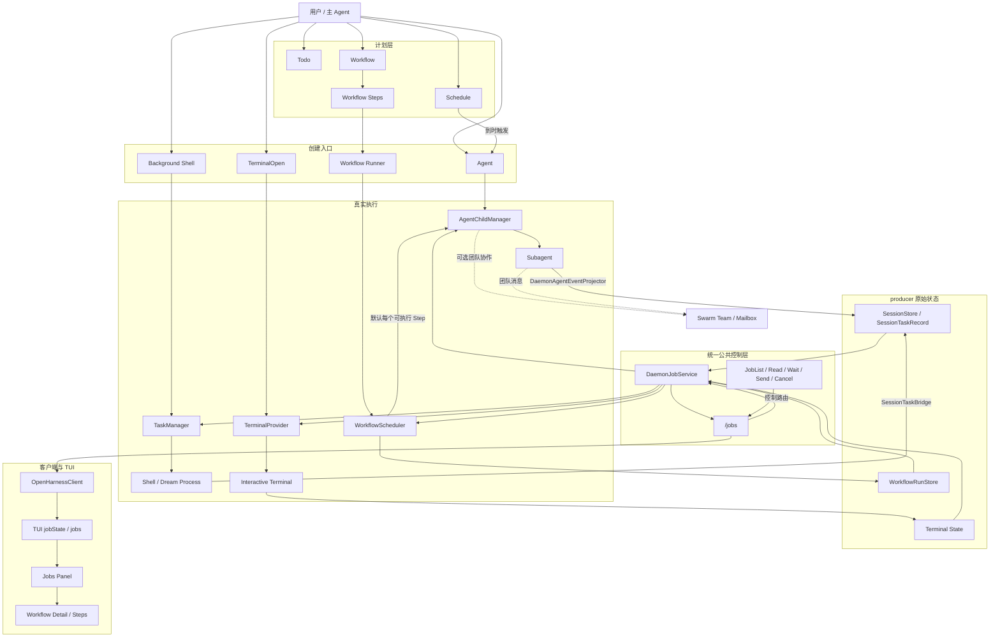

# Jobs 公共面收口设计

日期：2026-08-20
状态：已确认

## 1. 背景

OpenHarness 当前有多种名字包含 `task` 的结构，但它们表达的不是同一种东西：

- `TodoWrite` 表达 Agent 的工作清单；
- `ScheduledTask` 表达未来触发一次 Agent 运行的时间安排；
- `WorkflowTask` 表达 Workflow 计划图中的节点；
- `TaskManager.TaskInfo` 表达进程内 shell、dream 等 live execution；
- `SessionTaskRecord` 表达 daemon 对 shell、child Agent 等执行的持久化投影；
- TUI `session.tasks` 是进入会话时通过 `/tasks` 取得的一次性列表；
- `JobSnapshot` 已经是 Terminal、shell、Agent、dream、Workflow 的统一公共状态。

模型工具侧已经完成从普通 Task/Workflow 生命周期控制到 Jobs 的收口，但 HTTP client、TUI controller、slash command 和部分 UI 仍暴露 Task 概念。结果是同一项工作可能同时以 Workflow task、Subagent、SessionTaskRecord、`session.tasks` 和 Job 的形式出现，调用方难以判断哪一份才是公共真相。

本设计把公共概念收缩为 `Todo`、`Schedule`、`Workflow Step` 和 `Job`。内部的 `TaskManager`、`SessionTaskRecord`、`SessionTaskBridge` 继续保留，但不再直接泄漏给普通 UI 和公共控制接口。

## 2. 目标

1. TUI 和公共 client 只用 Jobs 展示及控制已经启动的长期工作。
2. Terminal、shell、child Agent、dream、Workflow 使用同一个 `JobSnapshot` 和同一组生命周期动作。
3. 创建入口保持 producer-specific，不增加万能 `JobCreate`。
4. Jobs 只聚合和路由，不成为新的执行器或第二份持久化数据库。
5. 明确 Subagent、Workflow、TaskManager、Swarm、SessionTaskRecord 与 Jobs 的边界。
6. 删除 TUI 中无人消费且会过期的 `session.tasks` 状态。
7. 支持 Workflow Job 与其 Step、child Agent Job 的父子展示，避免所有执行记录平铺。
8. 将后台数据加载错误与主 Agent run 错误隔离。
9. 第一阶段先统一查询与 UI；第二阶段再增加统一 Job SSE，避免一次同时改公共模型和事件协议。

## 3. 非目标

- 不把 `TaskManager` 重命名为 `JobManager`。
- 不把 `SessionTaskRecord` 直接改造成 `JobSnapshot`。
- 不让 Jobs 保存新的持久状态或复制 live handle。
- 不把 Todo、Schedule 或 Workflow Step 塞进顶层 Jobs 列表。
- 不在本轮重写 child Agent、Workflow scheduler、Terminal provider 或 TaskManager 的执行生命周期。
- 不长期保留 `/tasks`、`session.tasks` 或 `TaskSnapshot` 的公共兼容别名。
- 不在第一阶段引入 Job 事件数据库或持久化 `JobSnapshot`。
- 不把所有内部 `WorkflowTask`、`ScheduledTaskRecord` 类型立即机械重命名；公共文案和边界先统一，内部类型重命名另行评估。

## 4. 公共术语

| 公共术语 | 实际含义 | 是否进入 Jobs |
|---|---|---:|
| Todo | 当前 Agent 的工作清单，不保证已经启动执行 | 否 |
| Schedule | 未来某个时间或按重复规则触发 Agent 运行的安排 | 触发前否；触发出的运行可以产生 Job |
| Workflow Step | Workflow 计划图中的节点，包含依赖、重试和失败策略 | 不作为顶层 Job；实际 worker 可产生 child Job |
| Job | 已经创建、可能持续一段时间、可以观察或控制的后台工作 | 是 |

普通用户、TUI 和公共控制文档不再使用含糊的 “session task” 表达后台工作。需要展示已经启动的工作时统一称为 Job。

## 5. 内部术语与所有权

| 内部组件 | 拥有什么 | 不负责什么 |
|---|---|---|
| `AgentChildManager` | child Agent 实例、run、history、输入、中断、关闭和恢复 | 不保存 daemon 的持久 task 记录 |
| `TaskManager` | shell、dream 等进程内 live handle、输出、stdin、停止和 callback | 不聚合 Terminal 或 Workflow |
| `TerminalProvider` | PTY、交互输入、terminal output 和真实退出生命周期 | 不管理 Agent/Workflow |
| `WorkflowScheduler` / `WorkflowRunStore` | Workflow plan、Steps、依赖、重试、结果、timeline 和 reconciliation | 不成为通用后台执行器 |
| `SessionTaskRecord` | shell、dream、child Agent 等在 session 中的持久执行投影 | 不持有 live Agent 或进程句柄 |
| `DaemonJobService` | 把各 producer 转为 `JobSnapshot`，校验 owner，并路由 read/wait/send/cancel | 不执行工作，不保存第二份真相 |
| `Swarm` | team、mailbox、permission sync 和团队文件生命周期 | 不创建或运行 child Agent |

`SessionTaskRecord` 和 `clientState.buckets[sessionId].tasks` 可以继续作为 session replay 的内部状态，但不再成为 TUI controller 的公共领域模型。

## 6. 目标架构



## 7. 创建与控制分离

Jobs 不增加万能创建接口。创建仍由最了解参数的 producer 完成：

| 工作 | 创建入口 | 创建后的公共控制 |
|---|---|---|
| 后台 shell | `BackgroundShellCreate`；模型工具可暂时继续叫 `TaskCreate`，但描述必须明确只创建 shell | `Job*` |
| child Agent | `Agent` | `Job*` |
| 交互终端 | `TerminalOpen` | `Job*` |
| Workflow | `Workflow run/resume` | `Job*`；timeline/history/reconcile 仍属 Workflow 领域动作 |
| Schedule | `ScheduleCreate` | Schedule 自己的启用、暂停和历史；触发出的运行再进入 Jobs |

人工 TUI slash command 使用：

```text
/jobs                         列出当前 session Jobs
/jobs show <jobId>            读取 Job 状态和输出
/jobs cancel <jobId>          显式取消 Job
/background <command>         创建后台 shell，返回 jobId
```

移除：

```text
/tasks
/tasks list
/tasks show
/tasks stop
/tasks run
```

`/background` 调用 producer-specific 的后台 shell 创建 API，不引入 `JobCreate`。

## 8. 公共类型

### 8.1 JobSnapshot

沿用 `@openharness/jobs` 的通用字段，并补充可选的父子关系：

```ts
interface JobSnapshot {
  id: string;
  kind: "terminal" | "shell" | "agent" | "dream" | "workflow";
  label: string;
  ownerSession: string;
  status: "running" | "stopping" | "completed" | "killed" | "failed";
  capabilities: {
    read: boolean;
    wait: boolean;
    send: boolean;
    cancel: boolean;
  };
  cwd: string;
  startedAt: number;
  updatedAt: number;
  finishedAt?: number;
  detail?: string;
  parentJobId?: string;
  metadata?: Record<string, unknown>;
}
```

`parentJobId` 是公共层级字段，不要求 UI 从 description 或任意 metadata 猜父子关系。Workflow worker Job 还应在 metadata 中提供稳定的 `workflowRunId`、`workflowStepId` 和 `childSessionId`，用于 producer detail 和诊断。

### 8.2 TUI 状态

删除：

```ts
tasks: TaskSnapshot[];
```

新增：

```ts
type JobRemoteState =
  | { status: "idle"; jobs: JobSnapshot[] }
  | { status: "loading"; jobs: JobSnapshot[] }
  | { status: "ready"; jobs: JobSnapshot[]; refreshedAt: number }
  | { status: "error"; jobs: JobSnapshot[]; error: string; refreshedAt?: number };

interface TuiSessionController {
  jobState: JobRemoteState;
  jobs: JobSnapshot[];
}
```

`jobs` 是 `jobState.jobs` 的便捷只读视图。UI 必须根据 `jobState.status` 区分加载中、确实为空和查询失败。

### 8.3 生产数据真相

- `JobRemoteState` 只是客户端缓存，不是新的持久化真相；
- Terminal、SessionTaskRecord 和 WorkflowRunStore 继续拥有原始状态；
- 每次 `listJobs/readJob` 都由 `DaemonJobService` 读取 producer 当前状态；
- 第一阶段不把 `JobSnapshot` 写入 SessionStore。

## 9. Jobs UI

TUI 增加统一 Jobs Panel，默认显示当前 session 的顶层 Job：

```text
JOBS

● workflow  release-validation
● terminal  dev-server
✓ shell     bun test
● agent     standalone-reviewer
```

支持：

- `r`：刷新列表或当前详情；
- `Enter`：`JobRead` 并打开详情；
- `c`：仅在 `capabilities.cancel` 为真时执行 `JobCancel`；
- `s`：仅在 `capabilities.send` 为真时打开输入；
- kind/status 过滤；
- loading、empty、error 和最后刷新时间；
- 取消失败保留旧快照并显示非阻断错误。

Workflow Job 默认只显示为一条顶层记录。打开详情后展示 Workflow Steps 和关联 child Jobs：

```text
WORKFLOW release-validation

✓ research
  ✓ agent researcher
● implement
  ● agent implementer
○ verify
```

直接通过 `Agent` 创建且不属于 Workflow 的 child Agent 仍显示为顶层 Agent Job。属于 Workflow 的 worker Job 使用 `parentJobId=workflowRunId` 分组，默认不在顶层重复平铺。

原 `WorkflowRunsPanel` 的职责拆为：

- 普通 Workflow list/read/cancel 进入 Jobs Panel；
- Workflow Steps、budget、blocked 和 reconciliation 作为 Workflow Job detail；
- timeline/history/reconcile 保留明确的 Workflow 领域入口，不复制到通用 Jobs 协议。

## 10. 数据流与刷新

### 10.1 第一阶段：统一查询，不改事件协议

第一阶段使用现有 Jobs HTTP API：

```text
激活 session
  -> listJobs(sessionId, includeFinished=true, limit=100)
  -> jobState=ready

打开 Jobs Panel / 按 r
  -> listJobs

打开 Job detail
  -> readJob

创建后台工作成功
  -> 返回 jobId
  -> 刷新 listJobs 或把返回 snapshot 合并进客户端缓存

主 run 进入终态
  -> 触发一次 listJobs 刷新

JobCancel 成功
  -> 使用响应 snapshot 更新当前 Job
  -> 后台刷新列表确认 producer 最终状态
```

所有请求携带 `AbortSignal`，并保留 session/generation 校验，避免快速切换会话时旧响应覆盖新会话。

### 10.2 第二阶段：统一 Job SSE

在第一阶段稳定后增加规范化事件：

```text
session.job.created
session.job.updated
```

事件 payload 携带 `JobSnapshot`，只用于客户端实时缓存，不新增 Job 数据库。事件由 producer 原始状态变化通过 adapter 生成；重连时客户端仍先 `listJobs()` 取得权威快照，再消费 live Job 事件。

第二阶段的验收条件：

- shell、Agent、Terminal 和 Workflow 的状态变化都能更新 Jobs Panel；
- 重连不会重复或倒退状态；
- 迟到的 running 更新不能覆盖 terminal 状态；
- UI 不再依赖 run 结束后的兜底刷新来保持正确。

## 11. 错误处理

错误分为三类：

1. run error：当前 Agent run 本身失败，可以结束 busy/submittedRun；
2. fatal connection error：daemon 主连接不可用，可以改变全局 ready 状态；
3. auxiliary UI error：Jobs/MCP/详情刷新失败，只更新对应 remote state 和 toast，不得清除主 run。

Jobs 查询失败时：

- 如果已有 jobs，保留旧数据并标记 `status=error`；
- 如果没有旧数据，显示 unavailable，不显示成“0 Jobs”；
- 不调用会清空 `submittedRun` 的全局 `reportError`；
- cancel/send/read 的错误显示在当前 detail，且不乐观伪造终态。

协议边界必须验证：

- `ownerSession` 与请求 session 匹配；
- `parentJobId` 不得等于自身；
- Workflow child metadata 中的 run/step id 必须是非空字符串；
- 不为缺失 ID 的记录生成共享的 `unknown` ID；无效 producer 数据显示协议错误并跳过该项。

## 12. Swarm、Todo 和 Schedule

### 12.1 Swarm

Swarm 保持 team/mailbox/permission-sync 的协作设施定位。它不再提供 runtime child-agent backend，也不再维护独立 `swarmTeammates[]` UI 状态。

Agents UI 从 `jobs.filter(job.kind === "agent")` 得到执行状态。需要展示 team 时，额外读取 Swarm team 信息作为分组或标签，但 team 状态不能覆盖 Job 状态。

旧 `SwarmPanel`、`SwarmTeammateSnapshot` 和 `SwarmNotificationSnapshot` 在没有生产消费者后删除；如果将来需要 Team Panel，应以 team/mailbox 为独立数据源重新设计。

### 12.2 Todo

Todo 不进入 Jobs。旧 `TodoPanel` 当前没有生产数据源和消费者，应与孤立测试一起删除。`TodoWrite` 工具是否保留由 Agent 工具语义决定，不因删除 TUI TodoPanel 而自动删除。

如果未来恢复 Todo UI，必须先定义 daemon 持久化和事件协议，不能重新引入本地 `todoMarkdown: ""` 占位状态。

### 12.3 Schedule

公共 UI 文案从 “Scheduled Tasks” 收敛为 “Schedules”。Schedule 触发前不是 Job；每次实际运行通过 metadata 记录 `triggeredByScheduleId`，便于从运行历史跳转到 Job。

本轮不要求立即重命名内部 `ScheduledTaskRecord` 数据库和 service 类型，避免把独立的时间调度子系统拖入 Jobs 迁移。

## 13. API 与迁移

### 13.1 保留的公共 API

```text
GET  /jobs
GET  /jobs/:jobId
POST /jobs/:jobId/wait
POST /jobs/:jobId/input
POST /jobs/:jobId/cancel
```

OpenHarnessClient 保留：

```ts
listJobs()
readJob()
waitJob()
sendJob()
cancelJob()
```

### 13.2 后台 shell 创建 API

新增 producer-specific 创建入口：

```text
POST /background-shells
```

请求：

```ts
interface CreateBackgroundShellInput {
  sessionId: string;
  command: string;
  cwd?: string;
  description?: string;
}
```

响应返回标准 receipt：

```ts
interface CreateBackgroundShellResult {
  jobId: string;
  snapshot: JobSnapshot;
}
```

client 方法：

```ts
createBackgroundShell(input): Promise<CreateBackgroundShellResult>
```

内部仍可调用 `SessionTaskService` 和 `TaskManager.createShellTask()`。

### 13.3 移除的公共 API

完成所有消费者迁移后移除：

```text
GET  /tasks
GET  /tasks/:id
POST /tasks/:id/stop
POST /tasks
```

以及：

```ts
TaskSnapshot
ListTasksOptions
CreateTaskInput
OpenHarnessClient.listTasks()
OpenHarnessClient.getTask()
OpenHarnessClient.stopTask()
OpenHarnessClient.createTask()
TuiSessionController.tasks
```

内部的 `SessionTaskService` 可以收窄为 background-shell producer service，或由 Jobs adapter 和 background-shell route 调用；不再作为公共 Task CRUD 暴露。

### 13.4 其他命令迁移

- `/stats` 使用 `listJobs()` 统计后台工作；
- `/agents` 使用 `listJobs({ kinds: ["agent"] })`；
- `/doctor` 使用 `listJobs()` 和 `getSessionMcp()`；
- `/dream` 返回 jobId，后续提示使用 `/jobs`；
- Workflow 普通 list/read/cancel 使用 Jobs；timeline/history/reconcile 保留 Workflow 领域命令。

不保留旧 `/tasks` slash alias。删除的 HTTP/client 名称进入同一次 major-style 内部硬切；仓库内所有调用方必须在提交前完成迁移。

## 14. 实施分期

### 阶段 1：公共查询和 TUI 收口

1. 修复辅助错误与主 run 错误耦合。
2. 在 TUI controller 中用 `jobState/jobs` 替换 `tasks`。
3. 删除 MCP/Tasks 联合 hydration 中的 Task 查询，使用 `listJobs()`。
4. 新建 Jobs Panel，并接入 list/read/cancel；send/wait 可以在同阶段按 capability 接入。
5. 把普通 Workflow list/detail/cancel 接入 Jobs Panel，保留 Workflow 领域 detail。
6. 迁移 `/stats`、`/agents`、`/doctor`、`/dream`。
7. 新增 `/background` 和 background-shell 创建 API。
8. 删除 `/tasks` slash 和公共 Task CRUD client/API。
9. 删除孤立 TodoPanel、SwarmPanel 和对应 UI-only 类型/测试。
10. 更新 README、slash command 和架构文档。

### 阶段 2：层级关系和统一事件

1. 给 `JobSnapshot` 增加 `parentJobId`。
2. Workflow worker 创建链路传递 `workflowRunId/workflowStepId`。
3. Jobs Panel 默认折叠 Workflow child Jobs。
4. 增加 `session.job.created/updated` SSE adapter。
5. client reducer 建立按 session 的 Job 缓存；snapshot 后再接 live 事件。
6. 增加状态防倒退和重连测试。

### 阶段 3：术语和遗留清理

1. 公共 UI 将 Scheduled Tasks 改为 Schedules。
2. 公共 Workflow 文案将 task 改为 step。
3. 检查插件、配置、prompt、docs 中已经删除的 Task 公共名。
4. 观察内部 `SessionTaskRecord`/`TaskManager` 名称是否仍造成开发者误用，再决定是否进行纯内部机械重命名；这不是前两阶段的前置条件。

## 15. 测试策略

### 15.1 单元测试

- 每种 producer 到 `JobSnapshot` 的状态映射；
- `parentJobId` 和 Workflow metadata 验证；
- loading/ready/error 状态转换；
- auxiliary error 不改变 `localBusy/submittedRun`；
- Workflow 过滤不改变总任务数和可选状态全集；
- 非 selected Workflow run 不借用 selected run 的 detail 统计。

### 15.2 服务契约测试

- background shell 创建返回可立即被 JobRead/Wait/Cancel 使用的 jobId；
- owner mismatch 在触碰 producer 前失败；
- `/jobs` 聚合 Terminal、shell、Agent、dream、Workflow；
- 删除 `/tasks` 后仓库内无公共消费者；
- Workflow child Job 带稳定父子关系；
- cancel/send 在服务端重新检查当前 capability。

### 15.3 TUI 测试

使用 OpenTUI `testRender`、`waitFor` 和 `waitForFrame`，避免固定 sleep 和未收束的 React `act` 警告。

覆盖：

- Jobs loading、empty、error、ready 帧；
- 列表 kind/status；
- 打开详情；
- cancel 成功和失败；
- 快速切换 session 时旧响应不写入当前视图；
- Workflow 顶层分组和 Steps detail；
- direct Agent Job 保持顶层；
- renderer destroy 后没有迟到 state update。

### 15.4 全链路测试

至少覆盖两条真实链路：

```text
Background Shell -> TaskManager -> SessionTaskRecord -> Jobs API -> TUI
Agent -> AgentChildManager -> projector -> SessionTaskRecord -> Jobs API -> TUI
```

Workflow 链路覆盖：

```text
Workflow -> Step -> Subagent -> child Job -> parentJobId -> Jobs Panel detail
```

## 16. 验收标准

- TUI controller 不再包含 `tasks` 或 `TaskSnapshot`。
- TUI 不调用 `/tasks`，所有后台列表和控制走 Jobs。
- Jobs Panel 能展示 Terminal、shell、Agent、dream、Workflow。
- Workflow Job 默认不与其 child Agent Jobs 重复平铺。
- Jobs 查询失败不会清除主 Agent run 的 busy/submitted 状态。
- loading、empty 和 error 在 UI 中可区分。
- `/background` 创建 shell 后返回标准 jobId，并可立即用 Job API 控制。
- `/tasks` slash、Task CRUD HTTP 和公共 client Task CRUD 被移除，无兼容别名。
- Swarm 只承担团队协作，不再有独立 teammate 执行状态。
- TodoPanel/SwarmPanel 等生产不可达 UI 被删除或有明确的新生产数据源；本设计选择删除。
- Jobs 不新增数据库，producer 仍拥有真实状态。
- 阶段 1 完成时现有测试通过且新增 Jobs TUI/contract 测试通过；阶段 2 再以统一 SSE 替代刷新兜底。

## 17. 风险与缓解

### 风险：一次迁移面过大

缓解：按三阶段实施；阶段 1 先统一公共查询和 UI，阶段 2 再改事件协议，阶段 3 才做术语清理。

### 风险：Workflow 与 child Agent 重复显示

缓解：标准化 `parentJobId`，Workflow child Jobs 默认折叠到 Workflow detail。

### 风险：移除 `/tasks` 破坏隐藏消费者

缓解：全仓 `rg` 审计、TypeScript 编译和 client/server contract tests；不保留运行时 alias，但在启动配置诊断中对已删除名称给出明确迁移提示。

### 风险：第一阶段刷新不够实时

缓解：激活、打开、手动、创建成功、主 run 终态和控制动作后刷新；第二阶段再增加统一 Job SSE。

### 风险：Job cache 变成第二份真相

缓解：明确它只是可丢弃客户端缓存；重连和切换 session 总是先调用 `listJobs()`，不持久化 `JobSnapshot`。

### 风险：后台 shell 创建被误解为通用 JobCreate

缓解：使用 `/background` 和 `/background-shells` producer-specific 命名；创建后才进入统一 Job 控制。

## 18. 最终不变量

1. Subagent 是实际执行者，归 `AgentChildManager` 管理。
2. Workflow 是计划和调度器，Step 不是顶层 Job。
3. TaskManager 是内部 shell/dream producer，不是公共统一控制面。
4. Swarm 是可选团队协作设施，不是 child runtime backend。
5. SessionTaskRecord 是内部持久执行投影，不是 TUI 公共模型。
6. Jobs 是所有已启动长期工作的唯一公共观察和控制面。
7. Jobs 不执行工作，也不保存第二份持久化真相。
8. 创建保持 producer-specific，创建后统一返回 jobId。
9. TUI 只公开 `jobState/jobs`，不公开 `session.tasks`。
10. Todo、Schedule、Workflow Step 和 Job 的语义互不重叠。

## 19. 2026-08-21 最终审查澄清

本节是当前验收口径，覆盖本文前面与分期不一致的句子；原文保留，用于说明设计演进，没有把已经发生的实现历史改写成另一种结果。

### 19.1 Phase 1 与 Phase 2 的层级边界

- Phase 1 的 Workflow 收口要求是：顶层只有统一 Jobs 列表；选择 Workflow Job 后能从 `JobReadResult.details` 展示 Steps；不再存在独立 `WorkflowRunsPanel`。
- `parentJobId`、Workflow worker 的稳定 parent/metadata、以及在 Jobs Panel 中把 child Agent 折叠到 Workflow 下，仍属于 Phase 2。
- 因此，第 9、15.3、15.4、16 节中任何把 child folding 或 `parentJobId` 当作 Phase 1 完成条件的表述，均由本节更正；Phase 1 不应伪造缺失的父子关系。

### 19.2 Phase 1 最终错误与竞争语义

- `/jobs`、`/agents`、`/background` 等 Jobs 辅助命令失败，只报告辅助错误，不得清除正在提交或等待中的主 Agent run。
- `/stats` 与 `/doctor` 的 Jobs 查询失败必须显示 unavailable/error，不能把失败折叠成权威的 `0`。
- `r` 同时刷新 Jobs 列表和当前选中详情；cancel/send 使用 AbortSignal 与同会话所有权 generation，迟到响应不能夺回较新的选择。
- Job 快照合并是单调的：较旧快照不能覆盖较新快照，非终态不能把已终止快照改回 running/stopping。
- `POST /background-shells` 在 create 前保留 `SessionTaskError.status`；create 后 normalization/read 失败返回 500，并通过现有 Task stop 路径补偿，不能留下未报告的 live process。

### 19.3 Phase 1 最终测试范围

除原测试矩阵外，最终审查必须覆盖：忙碌 run 上的辅助 slash 失败、诊断 unavailable、`r` 的 panel/Hook 链路、cancel/send deferred race、单调合并、background-shell missing-session/normalization compensation、游标收缩，以及孤立 UI-only Workflow 类型审计。
