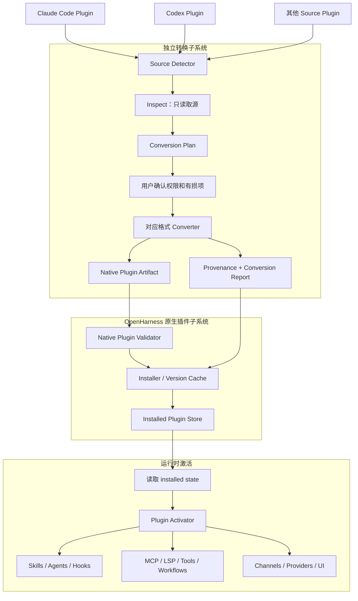

# OpenHarness 原生插件与外部转换器设计

日期：2026-08-25
状态：已确认，待实施

## 1. 决策

OpenHarness 建立独立、版本化的 Native Plugin（原生插件）规范。它是 Runtime 唯一加载和激活的插件格式，也承载 OpenHarness 自己的完整扩展能力。

Claude Code、Codex 等外部插件格式不进入 Runtime，也不由 `packages/plugins` 直接兼容。它们通过独立、可版本化的 Converter（转换器）在安装或导入阶段转换为 OpenHarness Native Plugin：

```text
Claude Code Plugin / Codex Plugin / 其他来源
  -> 对应格式 Converter
  -> Conversion Plan + Report
  -> OpenHarness Native Plugin
  -> Native Plugin Validator
  -> Installer / Version Cache
  -> Runtime Activation
```

本设计替换此前“Claude Code 是唯一公开插件规范、Runtime 创建时直接适配 Claude 插件”的方案。当前仓库中的临时 OpenHarness 插件格式同样不保留：

- 不兼容当前根级 `plugin.json` 和 snake_case 字段；
- 不提供旧格式探测、字段别名或自动迁移；
- 删除当前 `tools_dir` 直接在 daemon 主进程动态 import 的实现；
- 删除当前只创建空清单的最小安装器；
- 新原生规范从 `schemaVersion: 1` 开始；
- 外部转换器可以保留源插件脚本和资源，但必须生成完整、可校验的原生插件产物。

## 2. 背景

当前 `packages/plugins` 同时承担目录发现、Claude 风格文件解析、OpenHarness 专用字段解释和 Runtime 贡献组装。这个模型在只有一种外部格式时已经出现边界混乱：

- 目录布局参考 Claude Code，但 manifest、Hook 事件和 MCP 规则不是 Claude 的完整语义；
- `tools_dir` 是 OpenHarness 自有能力，却和 Claude 风格组件放在同一个 schema；
- 不同应用存在重复的插件注册路径和进程缓存；
- 坏插件会在部分路径中静默消失；
- 外部格式变化会直接推动 Runtime loader 变化；
- 如果继续兼容 Codex 或其他格式，Runtime 将逐渐充满来源格式判断。

OpenHarness 需要的不只是“能读取某个外部 manifest”，而是一套适合自身 Runtime、Desktop、权限、Job、Channel、Workflow 和 Provider 能力的稳定插件平台。同时，已有 Claude Code、Codex 生态仍有直接使用价值。独立转换器把这两个目标分开：OpenHarness 可以发展原生能力，外部生态通过可审计转换进入，不要求 Runtime 同时实现多套协议。

## 3. 目标

1. 定义 OpenHarness Native Plugin v1，作为 Runtime 唯一插件契约。
2. 原生插件可以贡献 Skills、Agents、Hooks、MCP、LSP、Tools、Workflows、Channels、Providers、UI 等 OpenHarness 能力。
3. 外部插件只能通过 Converter 进入，不在 Runtime 中按来源格式分支。
4. Converter 是独立功能和独立包，支持检测、检查、规划、转换和报告。
5. 转换前必须展示 exact、adapted、unsupported、blocked 四类结果。
6. 转换过程只读取和生成文件，不执行源插件代码，不启动服务，不安装依赖。
7. 转换产物保留来源、哈希、转换器版本和完整报告，可以重现和审计。
8. 源插件更新、Converter 更新或目标 schema 更新时，可以判断是否需要重新转换。
9. Runtime 激活、Server API、CLI 和 Desktop 只消费 Native Plugin 及其统一状态。
10. 新原生 Tool 具备明确 Runtime 和权限边界，不直接复用当前无隔离动态 import。
11. 当前 OpenHarness 临时格式硬切删除，不写兼容层。

## 4. 非目标

- 不让 Runtime 直接读取 Claude Code、Codex 或其他外部 manifest。
- 不在转换时修改源插件目录。
- 不把“转换成功”解释为所有行为与源 Harness 完全一致。
- 不对无法表达的语义做无提示猜测。
- 不在第一阶段同时完成 Marketplace、自动更新和所有外部格式。
- 不在 Converter 中执行 Hook、import JS、启动 MCP/LSP 或运行安装脚本。
- 不要求手写的 OpenHarness Native Plugin 保留任何 Claude/Codex 字段。
- 不要求 OpenHarness 内部 Tool、模型和 Hook 名称与某个外部产品一致。
- 不把 provenance、conversion report 或 installer state 塞入 Runtime 的业务 manifest。

## 5. 术语与所有权

| 术语 | 实际含义 | Owner |
|---|---|---|
| Source Plugin | Claude Code、Codex 或其他待导入插件目录/包 | 外部格式 Converter |
| Converter | 把一种 Source Plugin 转成 Native Plugin 的纯读取/生成组件 | `packages/plugin-converters` |
| Conversion Plan | 转换前的能力、映射、权限和损失说明 | Converter core |
| Conversion Report | 转换完成后的逐组件结果和诊断 | Converter core |
| Provenance | 来源位置、版本、内容哈希和转换器信息 | Installer / converted artifact |
| Native Plugin | 符合 OpenHarness schema、可被 Runtime 加载的插件包 | `packages/plugins` |
| Installed Plugin | 已复制到版本 cache 并进入安装状态的 Native Plugin | Plugin installer/store |
| Activated Plugin | 已把组件注册或连接到某个 Runtime 的插件版本 | `agent-runtime` composition root |

`packages/plugins` 不依赖具体外部 Converter；`packages/plugin-converters` 依赖 Native Plugin schema 来生成目标产物；Runtime 只依赖 `packages/plugins`。

## 6. 总体架构



依赖方向：

```text
plugin-converters/core
  -> native plugin schema

plugin-converters/claude-code
  -> plugin-converters/core
  -> native plugin schema

plugin-converters/codex
  -> plugin-converters/core
  -> native plugin schema

packages/plugins
  -> native plugin schema

agent-runtime
  -> packages/plugins
```

禁止：

```text
agent-runtime -> ClaudeCodePluginConverter
packages/plugins -> Claude/Codex parser
Native Plugin loader -> source format guessing
```

## 7. OpenHarness Native Plugin v1

### 7.1 目录布局

```text
my-plugin/
├─ .openharness-plugin/
│  └─ plugin.json
├─ skills/
├─ agents/
├─ hooks/
├─ mcp/
├─ lsp/
├─ tools/
├─ workflows/
├─ channels/
├─ providers/
├─ ui/
├─ bin/
├─ assets/
├─ README.md
└─ LICENSE
```

`.openharness-plugin/plugin.json` 是唯一原生 manifest。原生插件不使用根级 `plugin.json`，避免与其他生态或普通 npm 包混淆。

### 7.2 Manifest 示例

```json
{
  "$schema": "https://openharness.dev/schemas/plugin-v1.json",
  "schemaVersion": 1,
  "id": "example.quality-tools",
  "name": "quality-tools",
  "displayName": "Quality Tools",
  "version": "1.0.0",
  "description": "Code review and quality automation",
  "author": {
    "name": "Example Team"
  },
  "components": {
    "skills": ["./skills/"],
    "agents": ["./agents/"],
    "hooks": ["./hooks/hooks.json"],
    "mcpServers": ["./mcp/servers.json"],
    "lspServers": ["./lsp/servers.json"],
    "tools": ["./tools/index.js"],
    "workflows": ["./workflows/"],
    "channels": ["./channels/"],
    "providers": ["./providers/"],
    "ui": ["./ui/"]
  },
  "permissions": {
    "filesystem": ["workspace:read"],
    "network": [],
    "process": [],
    "secrets": []
  },
  "runtime": {
    "engine": "node",
    "isolation": "worker"
  }
}
```

### 7.3 核心类型

```ts
interface OpenHarnessPluginManifestV1 {
  $schema?: string;
  schemaVersion: 1;
  id: string;
  name: string;
  displayName?: string;
  version: string;
  description?: string;
  author?: {
    name: string;
    email?: string;
    url?: string;
  };
  homepage?: string;
  repository?: string;
  license?: string;
  keywords?: string[];
  components: OpenHarnessPluginComponents;
  permissions?: OpenHarnessPluginPermissions;
  runtime?: OpenHarnessPluginRuntime;
  compatibility?: OpenHarnessPluginCompatibility;
}

interface OpenHarnessPluginComponents {
  skills?: string[];
  agents?: string[];
  hooks?: string[];
  mcpServers?: string[];
  lspServers?: string[];
  tools?: Array<string | NativeToolComponent>;
  workflows?: string[];
  channels?: string[];
  providers?: string[];
  ui?: string[];
  outputStyles?: string[];
  themes?: string[];
  monitors?: string[];
  binaries?: string[];
}
```

`compatibility` 只用于声明运行转换产物所需的环境别名或输入适配，不把整份 Claude/Codex manifest 复制进原生 manifest。

### 7.4 路径规则

所有 component path 必须：

- 是以 `./` 开头的相对路径；
- 规范化后位于插件根目录内；
- 解析符号链接后仍位于插件根目录内；
- 在 Windows 上处理盘符、大小写和 UNC 路径；
- 由统一 `resolveNativePluginPath()` 解析。

Native Plugin Validator 禁止各 component loader 绕过统一路径检查。

### 7.5 Manifest 与运行状态分离

manifest 描述包本身，不保存：

- 是否启用；
- 安装 scope；
- cache path；
- source URL；
- 转换报告；
- 用户授权结果；
- 当前 Runtime 激活状态；
- MCP/LSP 连接状态。

这些状态分别属于 installation store、provenance、permission store 和 Runtime activation result。

## 8. Native Plugin 可扩展能力

| Component | 实际做什么 | 首版策略 |
|---|---|---|
| Skills | 给模型提供按需加载的流程和知识 | 必须支持 |
| Agents | 提供可选择或自动委派的专门 Agent | 必须支持 |
| Hooks | 在 Runtime 事件上执行声明动作 | 必须支持 |
| MCP Servers | 通过标准协议提供外部工具 | 必须支持 |
| LSP Servers | 提供诊断、定义、引用和代码导航 | 后续阶段 |
| Native Tools | 提供 OpenHarness 原生工具 | 新隔离模型后支持 |
| Workflows | 提供 DAG/步骤执行模板 | 后续阶段 |
| Channels | 提供外部消息入口和回复能力 | 后续阶段 |
| Providers | 增加模型 Provider 或认证适配 | 后续阶段 |
| UI | 增加 Desktop 页面、面板或渲染贡献 | 后续阶段 |
| Output Styles / Themes | 提供输出和界面样式 | 后续阶段 |
| Monitors / Binaries | 提供后台观察和命令入口 | 后续阶段 |

Validator 必须识别 manifest 声明的所有 v1 component。尚未实现的 component 返回 `unsupported`，不能当成未知字段丢弃。

## 9. 原生 Tool 安全模型

当前实现遍历 `tools_dir/*.js|ts` 后在 daemon 主进程直接 `import()`。模块顶层代码会在权限检查之前执行，因此该实现不进入 Native Plugin v1。

新 Tool component 显式声明入口、运行环境和权限：

```json
{
  "components": {
    "tools": [
      {
        "entry": "./tools/index.js",
        "runtime": "node-worker",
        "permissions": [
          "workspace.read"
        ]
      }
    ]
  }
}
```

首选运行边界：

```text
node-worker
isolated-process
sandbox-process
```

不得默认使用：

```text
daemon-main-process
```

外部 Converter 不把 Claude/Codex 的普通脚本自动升级为 Native Tool。外部插件提供工具时优先转换为 MCP；只有源格式本身存在语义明确、权限可映射的工具组件时，才允许生成受限 Native Tool，并必须在 plan 中标记 `adapted` 和权限请求。

## 10. Converter 子系统

Converter 是独立功能，不属于 Native Plugin loader。建议新包：

```text
packages/plugin-converters/
├─ src/
│  ├─ core/
│  │  ├─ converter.ts
│  │  ├─ registry.ts
│  │  ├─ detection.ts
│  │  ├─ inspection.ts
│  │  ├─ plan.ts
│  │  ├─ report.ts
│  │  └─ diagnostics.ts
│  ├─ claude-code/
│  │  ├─ detector.ts
│  │  ├─ parser.ts
│  │  ├─ mappings.ts
│  │  └─ converter.ts
│  ├─ codex/
│  │  ├─ detector.ts
│  │  ├─ parser.ts
│  │  ├─ mappings.ts
│  │  └─ converter.ts
│  └─ index.ts
└─ fixtures/
```

第一阶段只要求实现 core 和 Claude Code Converter。Codex Converter 在取得明确输入规范和 fixture 后按同一接口增加，不能把预想字段提前写进 core。

Converter v1 是随 OpenHarness 发布的受信任应用组件，不是普通 Native Plugin，也不能由待转换的第三方插件动态提供。Converter 需要读取未信任 source 并生成安装候选，如果允许普通插件注册 Converter，会形成“未信任插件负责解释另一个未信任插件”的递归信任边界。未来若开放第三方 Converter，必须使用独立签名、隔离进程和管理员级授权，不复用普通插件启停流程。

## 11. Converter SPI

SPI 是每种外部格式转换器必须实现的一组固定方法：

```ts
interface PluginConverter<TSourceManifest = unknown, TOptions = unknown> {
  readonly id: string;
  readonly sourceFormat: string;
  readonly version: string;
  readonly targetSchemaVersion: number;

  detect(input: PluginSourceInput): Promise<PluginDetectionResult>;

  inspect(
    input: PluginSourceInput,
  ): Promise<InspectedSourcePlugin<TSourceManifest>>;

  plan(
    source: InspectedSourcePlugin<TSourceManifest>,
    context: PluginConversionContext,
    options?: TOptions,
  ): Promise<PluginConversionPlan>;

  convert(
    plan: PluginConversionPlan,
    destination: string,
  ): Promise<PluginConversionResult>;
}
```

### 11.1 detect

根据只读证据识别格式：

```ts
interface PluginDetectionResult {
  matched: boolean;
  format?: string;
  confidence: number;
  evidence: string[];
  diagnostics: PluginConversionDiagnostic[];
}
```

自动检测结果有歧义时要求用户通过 `--from` 指定，不按最高分静默选择。

### 11.2 inspect

读取并解析 source manifest、默认组件、资源、路径引用和依赖，返回源格式对象。inspect 不生成目标文件，也不执行任何源代码。

### 11.3 plan

把每个源组件分成 exact、adapted、unsupported、blocked，列出目标路径、名称映射、环境兼容、权限请求和诊断。plan 是用户批准前的权威预览。

### 11.4 convert

严格按已批准 plan 生成完整 Native Plugin artifact。convert 后必须调用 Native Plugin Validator；产物未通过校验时不进入安装 cache。

## 12. 转换保真度和状态

```ts
type ConversionFidelity =
  | "exact"
  | "adapted"
  | "unsupported"
  | "blocked";
```

### exact

目标组件可以保持源语义，例如静态 Skill、普通 metadata、资源文件或兼容 MCP 配置。

### adapted

需要确定性映射，例如：

- `PostToolUse` 转为 OpenHarness `tool.after`；
- Claude `sonnet` 转为当前 Provider 的 `balanced` 模型角色；
- Claude `Read` 转为 OpenHarness workspace read Tool；
- 省略 transport 的 MCP 配置推断为 stdio；
- 源 namespace 转为 Native Plugin qualified name。

### unsupported

目标 Runtime 尚无等价能力。组件保留在 report 中，不进入可执行 manifest component，插件整体可作为 `converted-with-limitations` 安装。

### blocked

技术上可转换，但需要新增权限或外部动作，例如进程、网络、秘密、工作区外文件、依赖安装或原生二进制。未经批准不得继续物化对应组件。

转换结果：

```ts
type PluginConversionStatus =
  | "converted-exactly"
  | "converted-with-adaptations"
  | "converted-with-limitations"
  | "conversion-blocked"
  | "conversion-failed";
```

## 13. Conversion Plan

```ts
interface PluginConversionPlan {
  planVersion: 1;
  source: PluginSourceIdentity;
  target: OpenHarnessPluginIdentity;
  converter: {
    id: string;
    version: string;
    targetSchemaVersion: number;
  };
  components: PluginComponentConversion[];
  permissions: PluginPermissionRequest[];
  fileOperations: PluginConversionFileOperation[];
  diagnostics: PluginConversionDiagnostic[];
  sourceDigest: string;
}

interface PluginComponentConversion {
  sourceKind: string;
  sourcePath?: string;
  sourceName?: string;
  targetKind?: OpenHarnessPluginComponentKind;
  targetPath?: string;
  fidelity: ConversionFidelity;
  mappings: PluginSemanticMapping[];
  diagnostics: PluginConversionDiagnostic[];
}
```

plan 必须稳定排序和可序列化。相同 source digest、Converter 版本、target schema 和 options 应产生相同 plan，便于 dry-run、批准和测试。

## 14. 转换产物

转换结果不是一份孤立 manifest，而是完整 Native Plugin 包：

```text
converted-plugin/
├─ .openharness-plugin/
│  └─ plugin.json
├─ .openharness-conversion/
│  ├─ provenance.json
│  ├─ plan.json
│  └─ report.json
├─ payload/
│  ├─ skills/
│  ├─ agents/
│  ├─ scripts/
│  └─ assets/
└─ generated/
   ├─ hooks.json
   ├─ mcp.json
   └─ agents/
```

- `payload/` 保存从 source 复制的原始资源，尽量不改内容；
- `generated/` 保存事件、模型、Tool、MCP 等经过转换的原生定义；
- `plugin.json` 只引用最终参与 Native Plugin 的 component；
- `.openharness-conversion/` 是安装和审计元数据，不作为 Runtime prompt 或 component 加载；
- converter 不把 source 中的未知可执行文件自动加入 manifest。

手写 Native Plugin 不需要 `.openharness-conversion/`。

## 15. Provenance

```ts
interface PluginProvenanceV1 {
  provenanceVersion: 1;
  source: {
    format: string;
    location: string;
    version?: string;
    revision?: string;
    digest: string;
  };
  converter: {
    id: string;
    version: string;
    targetSchemaVersion: number;
    optionsDigest: string;
  };
  output: {
    pluginId: string;
    version: string;
    digest: string;
  };
  convertedAt: string;
}
```

来源路径可以包含本机敏感信息，公共导出和 UI 展示必须经过路径脱敏；本地 installation store 保留可重转换所需的真实位置。

`output.digest` 只覆盖会影响 Runtime 行为的 Native Plugin manifest、payload 和 generated 文件，不包含 `convertedAt`、本机绝对 source path 等非确定性审计字段。完整 artifact 可以另有 archive digest；相同输入和 options 的行为内容 digest 必须稳定。

## 16. Conversion Report 和诊断

```ts
interface PluginConversionDiagnostic {
  severity: "info" | "warning" | "error";
  phase: "detect" | "inspect" | "plan" | "convert" | "validate";
  code: string;
  message: string;
  sourceFormat?: string;
  component?: string;
  sourcePath?: string;
  targetPath?: string;
  details?: Record<string, unknown>;
}
```

报告至少展示：

```text
Source: security-tools
Format: claude-code
Converter: claude-code@1.0.0
Target: example.security-tools@1.4.0

Exact:
  Skills       4
  Commands     2
  MCP servers  1

Adapted:
  Agents       1
    model sonnet -> role balanced
  Hooks        2
    PostToolUse -> tool.after

Unsupported:
  Monitors     1

Blocked:
  none

Result: converted-with-limitations
```

坏组件、未知组件和有损映射不能只写 stderr，也不能让整个 source plugin 从列表中消失。

## 17. Claude Code Converter

第一阶段 Converter 读取 Claude Code 的标准 manifest、无 manifest 默认目录和根级 `SKILL.md`，但生成的是 Native Plugin。

### 17.1 Skills 和 Commands

- `skills/<name>/SKILL.md` 转成 Native Skill；
- `commands/*.md` 转成 Native Skill，并记录 `sourceKind: "claude-command"`；
- 保留引用资源和 scripts；
- `$ARGUMENTS`、位置参数和路径变量通过兼容环境或生成定义处理；
- 不能表达的 frontmatter 字段进入 report。

### 17.2 Agents

转换 prompt、description、model、effort、maxTurns、tools、disallowedTools、skills、memory、background 和 isolation。Claude 禁止插件 Agent 使用的 hooks、mcpServers、permissionMode 不进入目标 Agent，并产生明确诊断。

模型和 Tool 名称通过 Converter mapping table 适配，不在 Runtime 中按 Claude 名称分支。

### 17.3 Hooks

Claude 原始事件映射成 Native Hook 事件，同时在生成定义和 report 中保留 source event：

```json
{
  "source": {
    "format": "claude-code",
    "event": "PostToolUse"
  },
  "event": "tool.after"
}
```

转换必须核对触发时机、matcher 输入、Hook stdin/stdout、退出码、阻断和 timeout，而不是只改事件字符串。没有等价语义时标记 unsupported。

### 17.4 MCP 和 LSP

- Claude stdio MCP 的 `command` 存在时推断 transport；
- HTTP/SSE/WS 按源字段生成 Native MCP；
- 路径和 user config 变量通过生成配置或 environment alias 处理；
- LSP 在 Native LSP component 可用后按相同原则转换；
- Converter 不启动任何 Server。

### 17.5 其他组件

Output Styles、`bin/`、settings、monitors、themes、workflows 和 channels 在 Native component 存在时转换；尚未支持时必须进入 unsupported inventory。

## 18. 环境兼容和资源保留

Converter 应优先复制源资源并通过环境别名运行，不批量改写 `.sh`、`.py`、`.js` 脚本内容。

由 Claude Code 转换的插件可以在 Native manifest 中声明：

```json
{
  "compatibility": {
    "sourceFormat": "claude-code",
    "environmentAliases": {
      "CLAUDE_PLUGIN_ROOT": "${OPENHARNESS_PLUGIN_ROOT}/payload",
      "CLAUDE_PLUGIN_DATA": "${OPENHARNESS_PLUGIN_DATA}",
      "CLAUDE_PROJECT_DIR": "${OPENHARNESS_PROJECT_DIR}"
    }
  }
}
```

激活层只实现通用 environment alias，不需要知道 Claude 组件 schema。别名值必须来自 Validator 允许的变量，禁止插件借 alias 注入任意宿主环境值。

Native 路径变量：

```text
OPENHARNESS_PLUGIN_ROOT
OPENHARNESS_PLUGIN_DATA
OPENHARNESS_PROJECT_DIR
```

转换插件可以额外暴露源格式变量，但手写原生插件只依赖 Native 变量。

## 19. 转换安全边界

detect、inspect、plan 和 convert 允许：

- 读取源目录中的文件；
- 解析 JSON、Markdown 和其他声明文件；
- 计算哈希；
- 复制通过路径校验的资源；
- 生成原生 manifest、定义和报告；
- 静态识别权限、环境变量和依赖。

禁止：

- import 源插件 JS/TS；
- 执行 Hook、脚本或 `bin/`；
- 启动 MCP/LSP/Monitor；
- 运行 `npm install`、`pip install` 或其他包管理器；
- 执行源插件声明的安装命令；
- 访问插件声明的网络 URL；
- 跟随逃出源根目录的符号链接；
- 读取源根目录外的引用文件；
- 在用户批准前物化要求新权限的 blocked component。

依赖安装和 Runtime 激活是独立的后续授权阶段。

## 20. 安装、scope 和版本 cache

```text
~/.openharness-ts/plugins/
├─ cache/
│  └─ <plugin-id>/<version-or-digest>/
├─ data/
│  └─ <plugin-id>/
├─ sources/
├─ marketplaces/
└─ installed.json
```

- cache 保存通过 Validator 的 Native Plugin，包括转换产物；
- data 保存跨版本状态，不随普通升级删除；
- sources 保存来源和刷新信息，不作为 Runtime component；
- installed store 保存 scope、启停、当前版本和授权；
- Runtime 只读取 installed store 指向的 cache path；
- 更新生成新目录，旧 Runtime 保持旧版本，reload 后切换；
- 卸载包和删除 data 是两个明确动作。

目标 scope：

```text
user
project
local
managed
```

项目配置只能声明 plugin identity，外部 source 未安装时显示 missing，不能因为仓库中出现一个目录就自动转换、安装或执行。

## 21. 更新和重新转换

以下任一变化要求重新 plan：

- source 版本或内容 digest 改变；
- Converter 版本改变并声明会影响输出；
- Native Plugin schema 目标版本改变；
- 用户 conversion options 改变；
- OpenHarness 新增原先 unsupported 的目标 component；
- Tool/模型/Hook mapping table 的语义版本改变。

更新流程：

```text
刷新 source
  -> inspect
  -> 新 conversion plan
  -> 与旧 report 对比
  -> 用户批准新增权限或新有损项
  -> 转换到临时目录
  -> Native validate
  -> 写入新 cache 版本
  -> 原子更新 installed state
  -> 标记 Runtime reload-required
```

转换或校验失败时保留旧安装版本，不把半成品设为 current。

## 22. CLI 和用户流程

### 22.1 自动检测并安装

```text
ohs plugin install ./some-plugin
```

流程：detect → inspect → plan → 展示报告 → 用户确认 → convert → validate → install。

本地 Native Plugin 默认复制进版本 cache；开发时使用显式 link 模式，不把普通 install 隐式变成原地执行：

```text
ohs plugin link ./native-plugin
```

link 记录 canonical source path，按工作区或用户 scope 单独信任，并在 source 变化后标记 reload-required。

### 22.2 显式来源格式

```text
ohs plugin install --from claude-code ./some-plugin
```

### 22.3 只转换

```text
ohs plugin convert \
  --from claude-code \
  ./some-plugin \
  --output ./converted-plugin
```

### 22.4 预览

```text
ohs plugin convert \
  --from claude-code \
  ./some-plugin \
  --dry-run
```

### 22.5 校验 Native Plugin

```text
ohs plugin validate ./converted-plugin
```

`plugin validate` 只校验 Native Plugin。外部 source 的检查通过：

```text
ohs plugin source inspect --format claude-code ./some-plugin
```

### 22.6 查看报告

```text
ohs plugin conversion show <plugin-id>
ohs plugin details <plugin-id>
```

安装后启停和 reload 只操作 Native Plugin identity，不接受 source plugin 内部名字的模糊匹配。

## 23. Server、Client 和 Desktop 状态

公共 `PluginInfo`：

```ts
interface PluginInfo {
  identity: OpenHarnessPluginIdentity;
  origin: "native" | "converted";
  sourceFormat?: string;
  scope: PluginScope;
  enabled: boolean;
  installation: "installed" | "missing" | "invalid";
  activation: "inactive" | "active" | "partial" | "reload-required";
  inventory: Record<OpenHarnessPluginComponentKind, number>;
  permissions: PluginPermissionSummary;
  conversion?: {
    status: PluginConversionStatus;
    converterId: string;
    converterVersion: string;
  };
  diagnostics: PluginDiagnostic[];
}
```

Desktop 插件详情页至少展示：

- Native / Converted 来源；
- source format 和 Converter 版本；
- exact/adapted/unsupported/blocked 数量；
- component inventory；
- 权限；
- 安装版本和是否需要重新转换；
- 当前 Runtime 激活状态；
- conversion report 和 Runtime diagnostics。

Server、CLI 和 Desktop 使用同一结构化诊断，不能各自解析 stderr。

## 24. 代码组织和迁移

### 24.1 `packages/plugins`

重写为 Native Plugin 子系统：

```text
packages/plugins/src/
├─ manifest/
│  ├─ schema-v1.ts
│  └─ validate.ts
├─ discovery/
├─ components/
├─ activation/
├─ installation/
├─ permissions/
├─ diagnostics/
├─ types.ts
└─ index.ts
```

### 24.2 `packages/plugin-converters`

新增独立转换子系统，第一阶段包含 core 和 Claude Code Converter。

### 24.3 `packages/agent-runtime`

只接收已验证 Native Plugin。删除 Claude 风格解析和当前 `registerPluginTools()` 动态 import。

### 24.4 CLI 重复路径

删除 `apps/cli/src/plugin-contributions.ts` 的进程全局插件缓存和重复注册函数。CLI、Server、Desktop 都通过 application/runtime composition root 使用 Native Plugin service。

### 24.5 当前格式硬切

删除：

```text
enabled_by_default
skills_dir
tools_dir
hooks_file
mcp_file
根级旧 plugin.json
当前 PluginInstaller 空壳安装
当前 Claude 风格 loader 与 Runtime 的直接耦合
```

旧格式插件显示 `unsupported legacy OpenHarness plugin`，不尝试转换。它不是一个需要长期维护的 Source Converter。

## 25. 实施分期

### 阶段 1：Native Plugin v1 最小闭环

1. Native manifest schema、Validator 和统一路径边界。
2. Skills、Agents、Hooks、MCP components。
3. installation store、version cache 和 plugin data。
4. Runtime 只发现和激活 Native Plugin。
5. 结构化诊断、PluginInfo、enable/disable/reload。
6. 删除当前旧 schema、旧 installer、`tools_dir` 和重复 CLI 注册路径。
7. CLI 支持安装手写本地 Native Plugin。

### 阶段 2：Converter core + Claude Code Converter

1. Converter SPI、registry、detect、inspect、plan、convert。
2. provenance、plan、report 和 fidelity。
3. Claude Skills、Commands、Agents、Hooks、MCP 转换。
4. Claude 环境 alias、模型/Tool/事件 mapping。
5. dry-run、convert、source inspect、converted install。
6. 官方/固定 fixture 回归测试。

### 阶段 3：原生高级组件

1. LSP、Output Styles、`bin/` 和 plugin settings。
2. 隔离 Native Tools。
3. Workflows、Channels、Providers 和 UI contributions。
4. Claude Converter 对应组件跟进。
5. Desktop 插件和转换报告管理页。

### 阶段 4：分发与更多 Converter

1. Marketplace、Git/npm/archive source。
2. scopes、更新、prune、dependencies 和组织策略。
3. Codex Converter。
4. 其他外部格式 Converter。

## 26. 测试策略

### 26.1 Native Plugin fixtures

```text
packages/plugins/fixtures/native-v1/
├─ minimal-skill/
├─ agents-hooks-mcp/
├─ invalid-manifest/
├─ invalid-path-traversal/
├─ symlink-escape/
├─ unsupported-component/
├─ permission-blocked/
└─ mixed-plugin/
```

### 26.2 Claude Converter fixtures

```text
packages/plugin-converters/fixtures/claude-code/
├─ manifestless-components/
├─ root-skill/
├─ skills-and-commands/
├─ custom-paths/
├─ agents/
├─ hooks-events-and-matchers/
├─ mcp-stdio-inferred/
├─ mcp-http/
├─ variables/
├─ unsupported-components/
├─ blocked-component/
└─ mixed-plugin/
```

### 26.3 测试分层

- Native schema tests：字段、路径、权限和 component 引用；
- Converter detection tests：证据、置信度和歧义；
- inspection tests：只读发现，不执行代码；
- plan tests：稳定排序、fidelity、权限和 mapping；
- conversion tests：目标目录、provenance、report 和 digest；
- validation tests：转换产物必须通过 Native Validator；
- activation tests：Runtime Registry/Manager 可见能力和关闭生命周期；
- multi-cwd tests：插件、Agent、Hook、MCP 和 data 不串线；
- update tests：旧版本保留、新版本原子切换、失败回退；
- contract tests：Server/client/CLI/Desktop 使用同一 PluginInfo；
- security tests：转换时不执行代码、不联网、不越界读取。

CI 使用固定离线 fixture，不实时下载外部 Marketplace。

## 27. 验收标准

### 27.1 Native Plugin v1

1. Runtime 只加载 `.openharness-plugin/plugin.json`。
2. Skills、Agents、Hooks 和 MCP 通过统一 Native schema 注册。
3. 路径越界、符号链接逃逸和无效 component 被拒绝并显示诊断。
4. 安装包、持久 data 和 Runtime 激活状态分离。
5. enable/disable/reload 后不残留 Hook、连接或进程。
6. 当前根级旧 manifest 和 `tools_dir` 不再加载。
7. Native Tool 未完成隔离前不能从第三方插件激活。

### 27.2 Converter core

1. Converter 可以独立 detect、inspect、plan、convert。
2. dry-run 不写目标、不执行源代码、不启动外部服务。
3. plan 明确列出 exact、adapted、unsupported、blocked。
4. convert 只执行 plan 中批准的文件操作和生成动作。
5. 每个产物包含 provenance、plan 和 report。
6. 转换结果必须通过 Native Validator 才能安装。
7. 相同输入、版本和 options 产生确定性 plan 与等价输出 digest。

### 27.3 Claude Code Converter

1. 标准 Claude Skills、Commands、Agents、Hooks 和 MCP 可以转换为 Native Plugin。
2. Claude Hook 事件、模型、Tool 和 MCP transport 映射记录在 report 中。
3. Claude 脚本无需批量改写即可获得兼容环境变量。
4. 不支持组件不会消失，转换结果标记 limitations。
5. 要求新权限的组件在用户批准前保持 blocked。
6. 源插件更新或 Converter 版本变化可以触发重新转换判断。

## 28. 外部规范来源与版本变化

Claude Code Converter 的外部格式以官方文档和固定 fixture 为准：

- [Plugins reference](https://code.claude.com/docs/en/plugins-reference)
- [Create plugins](https://code.claude.com/docs/en/plugins)
- [Discover and install plugins](https://code.claude.com/docs/en/discover-plugins)
- [Plugin marketplaces](https://code.claude.com/docs/en/plugin-marketplaces)

每个 Converter 发布时记录已验证的源规范版本或文档日期。源格式新增字段时，Converter 必须把它分类为：

- 可原样保留；
- 可精确转换；
- 需要 adapted mapping；
- 当前 unsupported；
- 改变安全边界、必须 blocked 或单独设计。

不能由宽松 parser 自动执行新字段，也不能静默删除未知组件。

## 29. 最终边界

```text
OpenHarness Native Plugin
  是唯一 Runtime 插件格式
  可以表达 OpenHarness 完整扩展能力

External Plugin Converter
  是独立导入功能
  只负责外部格式检测、规划和物化转换
  不执行源插件

Runtime
  只验证和激活 Native Plugin
  不知道插件最初来自 Claude、Codex 还是手写

Provenance / Report
  保留来源和转换损失
  不污染 Runtime component 协议
```

这个边界允许 OpenHarness 发展自己的插件平台，同时持续吸收外部生态，而不把 Runtime 绑定到任何一个外部产品的目录、事件、模型或安装规则。
