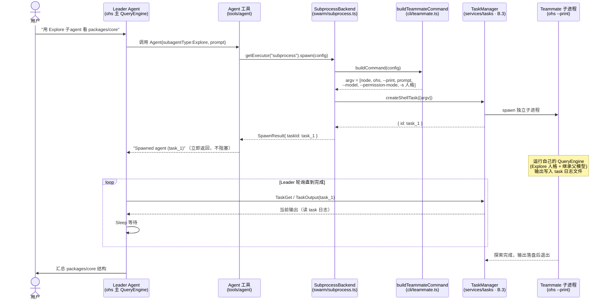

# Swarm 子进程派发运行流程（D.1）

`agent` 工具如何把一个子代理（teammate）作为独立 `ohs --print` 子进程拉起、
后台运行、由 leader 轮询取回结果。这是 D.1 实现的最小可用多 Agent 闭环。

## 涉及的模块

| 组件 | 文件 | 职责 |
|------|------|------|
| `agent` 工具 | `packages/tools/src/agent/index.ts` | LLM 调用入口，取后端并 spawn |
| `SubprocessBackend` | `packages/swarm/src/subprocess.ts` | 实现 `SwarmBackend`，经 `TaskRunner` 派发 |
| `buildTeammateCommand` | `apps/cli/src/teammate.ts` | 把配置翻译成 `ohs --print …` 的 argv |
| 后端注册 | `apps/cli/src/runtime.ts`（bootstrap） | 把 subprocess 后端注册进 swarm 单例 |
| `TaskManager` | `packages/services/src/tasks/index.ts`（B.3） | 真正 spawn 子进程、捕获输出到日志 |

## 时序图



## 关键点

- **解耦**：`swarm` 包不直接依赖 `services`；`SubprocessBackend` 通过结构化的
  `TaskRunner` 接口拿到 `createShellTask`/`stopTask`，真实 `TaskManager` 在
  `bootstrap()` 注入。
- **一次性 `--print`**：TS 没有 Python 的 `--task-worker` 长驻模式，teammate 用
  `--print` 跑一轮即退出。足够覆盖 Explore/Plan/verification 这类"一轮汇报"。
- **配置继承**：argv 带 `--model (config.model ?? settings.model)`、`--provider`/
  `--base-url`/`--permission-mode`、以及 `-s <agent 人格>`；**不把 api-key 放进
  argv**（进程列表可见），teammate 复用同一份 `~/.openharness/settings.json` +
  继承的 env 取 key。
- **异步轮询**：leader spawn 后立即拿到 `taskId` 返回，teammate 在后台跑，leader
  靠 `TaskGet`/`TaskOutput` 轮询日志取结果。

## 使用前提

teammate 继承父进程的 `--permission-mode`。默认 `default` 模式下，teammate 的工具
会被拒（`--print` 无交互确认），干不了实事。**要让 teammate 真正工作，父进程需用
`--permission-mode full_auto`**：

```bash
ohs --permission-mode full_auto "用一个 Explore 子 agent 看看 packages/core 的结构，再汇总"
```

## 留待后续（最小版未做）

- **完成通知**：当前 leader 用 `Sleep` 盲轮询；完整版应有 completion 通知 /
  `swarm_status` 事件，让 leader 知道 teammate 何时结束（coordinator 通知）。
- **多轮 `sendMessage`**：需长驻 worker 模式（当前 subprocess teammate 抛错）。
- **worktree 隔离 / 文件邮箱 / 权限同步（只读自动放行）**：swarm 完整版能力。
