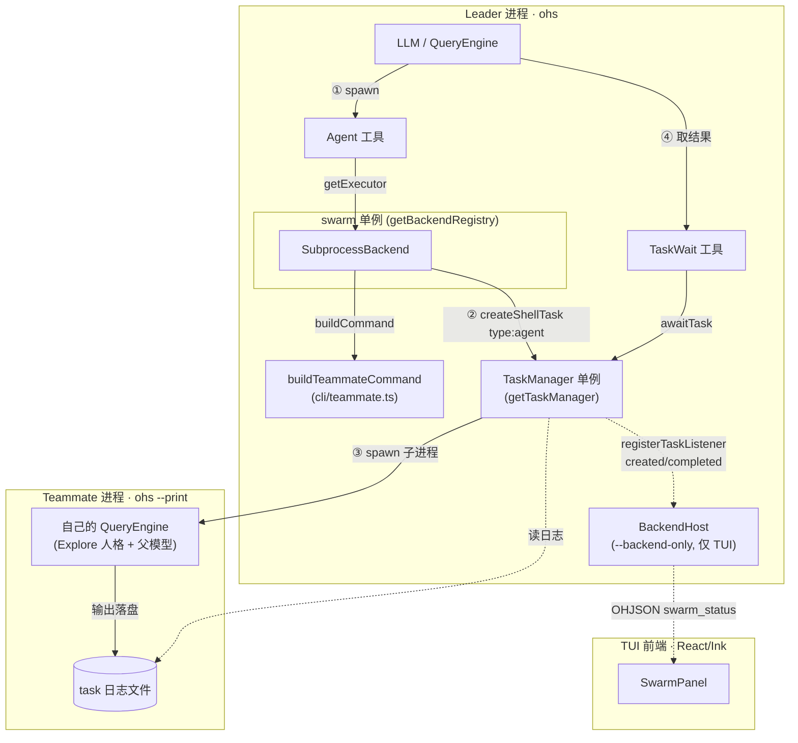
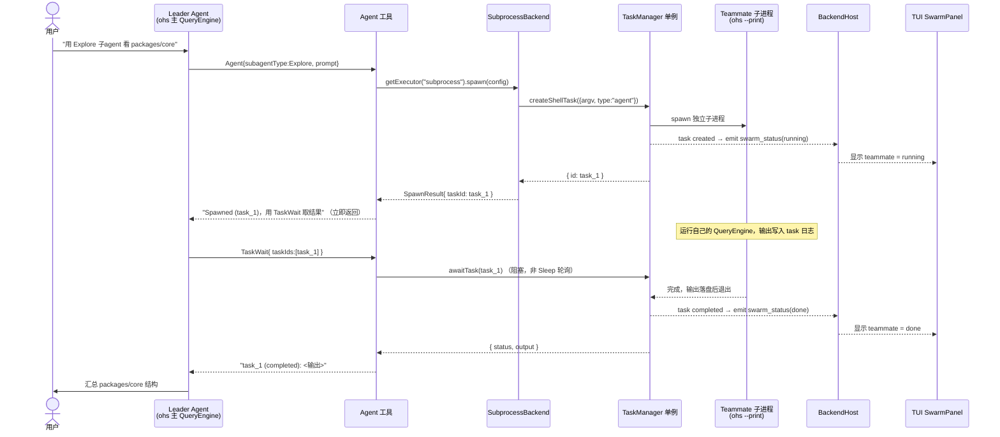

# Swarm 子进程派发运行流程（D.1 + D.2）

`agent` 工具如何把一个子代理（teammate）作为独立 `ohs --print` 子进程拉起、
后台运行，leader 用 `TaskWait` 阻塞取回结果，并在 TUI 的 SwarmPanel 显示状态。
这是 swarm 当前的最小可用多 Agent 闭环。

- **D.1**：subprocess 派发后端（spawn → 后台子进程 → 轮询取结果）。
- **D.2**：用 `TaskWait` 阻塞等待替代 Sleep 盲轮询；emit `swarm_status` 点亮 SwarmPanel。

## 涉及的模块

| 组件 | 文件 | 职责 |
|------|------|------|
| `agent` 工具 | `packages/tools/src/agent/index.ts` | LLM spawn 入口，取后端并派发，返回 task_id |
| `TaskWait` 工具 | `packages/tools/src/task/index.ts` | leader 阻塞等待 teammate 完成并取结果（D.2）|
| `SubprocessBackend` | `packages/swarm/src/subprocess.ts` | 实现 `SwarmBackend`，经 `TaskRunner` 派发 |
| `buildTeammateCommand` | `apps/cli/src/teammate.ts` | 配置 → `ohs --print …` 的 argv |
| 后端注册 | `apps/cli/src/runtime.ts`（bootstrap） | 注册 subprocess 后端 + 给 teammate 任务打 `type:"agent"` 标 |
| `TaskManager` | `packages/services/src/tasks/index.ts` | 真正 spawn 子进程、捕获输出；`awaitTask`/`registerTaskListener`（D.2）|
| swarm_status emit | `apps/cli/src/commands/main.ts` + `swarm-status.ts` | 订阅任务状态，emit `swarm_status`（D.2）|
| SwarmPanel | `apps/frontend/src/components/SwarmPanel.tsx` | TUI 显示 teammate 列表 + 状态 |

## 架构图（组件视角）



## 时序图（含 D.2 的 TaskWait + swarm_status）



> 对比 D.1：原来 leader 是 `Sleep + TaskGet/TaskOutput` 盲轮询取结果；D.2 后改为
> **一次 `TaskWait` 阻塞**（内部 `awaitTask` 等任务终态），并支持「spawn 多个 → 一次
> TaskWait 全等」。

## 关键点

- **解耦**：`swarm` 不直接依赖 `services`；`SubprocessBackend` 经结构化 `TaskRunner`
  接口拿 `createShellTask`，真实 `TaskManager` 在 `bootstrap()` 注入。
- **同一个单例**：派发（SubprocessBackend）、取结果（TaskWait）、emit 状态（BackendHost）
  都用 **全局 `getTaskManager()` 单例**，三者对得上。
- **一次性 `--print`**：teammate 跑一轮即退出；足够覆盖 Explore/Plan/verification。
- **配置继承**：argv 带 `--model (config.model ?? settings.model)`、provider/permission-mode、
  `-s <人格>`；**不把 api-key 放 argv**，teammate 复用 `settings.json` + 继承 env。
- **TaskWait（D.2）**：阻塞 `awaitTask`，per-item 错误隔离，超时返回提示而非挂死；
  Agent 工具描述与 coordinator prompt 都引导用它、别 Sleep 轮询。
- **swarm_status（D.2）**：teammate（`type:"agent"`）任务 created/completed 时 emit，
  点亮前端 SwarmPanel（状态枚举 running/idle/done/error）。

## 使用前提

teammate 继承父进程的 `--permission-mode`。默认 `default` 模式下，teammate 的工具会被拒
（`--print` 无交互确认）。**要让 teammate 真正工作，父进程需用 `--permission-mode full_auto`**：

```bash
ohs --permission-mode full_auto "用一个 Explore 子 agent 看看 packages/core 的结构，再汇总"
# TUI 下还能看到 SwarmPanel 里 teammate 的 running → done：
ohs --tui --permission-mode full_auto
```

## 留待后续

- **SwarmPanel duration 实时滚动**：当前只在 created/completed emit，运行中显示 ~0s；
  需补一个周期性 `updated` 事件。
- **多轮 `sendMessage`**：需长驻 worker 模式（当前 subprocess teammate 抛错）。
- **worktree 隔离 / 文件邮箱 / 权限同步（只读自动放行）**：swarm 完整版能力。
