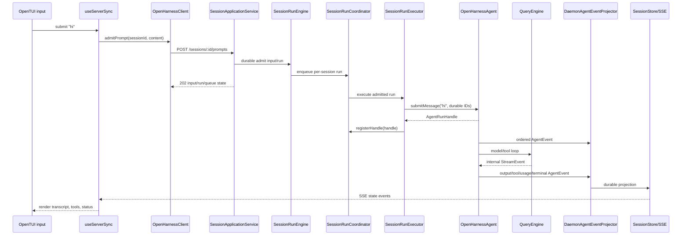

# TUI Flow

> 当前 OpenTUI/daemon 主线。完整 server 细节见 [Daemon Application Architecture](./daemon-application-architecture.md)。

## 启动

```text
ohs
  -> apps/cli/src/index.ts
  -> commands/main.ts runTuiMode()
  -> attach explicit daemon or ensure local daemon
  -> spawn apps/frontend/dist/index.js with Bun
  -> OPENHARNESS_FRONTEND_CONFIG carries daemon URL/token/options
  -> frontend useServerSync attaches through OpenHarnessClient
```

CLI 进程只是 launcher，不组装 QueryEngine，也不注入 daemon services。daemon 前台入口调用 server 的 `startOpenHarnessDaemon()`。

## 输入 `hi`



`StreamEvent` 只存在于 framework 内部。daemon 在创建 agent 时通过可靠、ordered、awaited 的 `onEvent` sink 消费 `AgentEvent`；TUI 接收的是 `SessionStore` 产生的 durable SSE，而不是 framework event 直通。`agent.subscribe()` 只用于不影响执行结果的普通观察，不承担 daemon projection。

## Permission

1. QueryEngine 触发 framework `requestPermission(request, scope)` effect。
2. daemon `StorePermissionBroker` 创建 pending request，SSE 推给 TUI。
3. 用户批准、拒绝或 run 被中断后，broker 返回 `approved`、`denied` 或 `expired`。
4. framework 继续工具执行或生成拒绝结果，并通过普通 AgentEvent/durable SSE 更新界面。

## 代码入口

| 关注点 | 文件 |
|---|---|
| CLI 模式选择与 frontend spawn | `apps/cli/src/commands/main.ts` |
| daemon 启动/registry | `apps/cli/src/commands/daemon.ts` |
| OpenTUI 根组件 | `apps/frontend/src/App.tsx` |
| daemon hydrate、prompt、permission、SSE | `apps/frontend/src/hooks/useServerSync.ts` |
| client HTTP API | `packages/client/src/client.ts` |
| prompt/run 应用链 | `packages/server/src/http/session-application-service.ts` |
| durable event reducer | `packages/server/src/http/daemon-agent-event-projector.ts` |
| server 权威流程 | `docs/daemon-application-architecture.md` |
