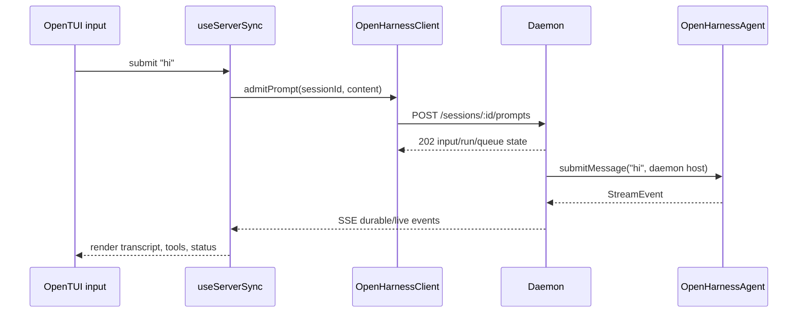

# TUI Flow

> 当前 OpenTUI/daemon 主线。完整 server 细节见 [daemon-application-architecture.md](./daemon-application-architecture.md)。

## 启动

```text
ohs
  -> apps/cli/src/index.ts
  -> commands/main.ts runTuiMode()
  -> attach explicit daemon or ensure local daemon
  -> spawn apps/frontend/dist/index.js with Bun
  -> OPENHARNESS_FRONTEND_CONFIG carries daemon URL/token/options
  -> frontend useServerSync attaches through OpenHarnessClient
```

CLI 进程是 launcher，不组装 QueryEngine，也不逐项注入 daemon services。daemon 前台入口调用 server 的 `startOpenHarnessDaemon()`。

## 输入 `hi`



前端不直接读取 agent，也不轮询 QueryEngine。它以 durable session state 为基线，通过 SSE 增量更新。

## Permission

1. daemon 通过 SSE 发布 pending permission。
2. `useServerSync` 把它映射为前端 permission prompt。
3. 用户批准或拒绝后，client 调用 permission reply API。
4. daemon resolve framework 正在等待的 permission promise。
5. 工具继续或停止，结果再经 SSE 回到 TUI。

## 代码入口

| 关注点 | 文件 |
|---|---|
| CLI 模式选择与 frontend spawn | `apps/cli/src/commands/main.ts` |
| daemon 启动/registry | `apps/cli/src/commands/daemon.ts` |
| OpenTUI 根组件 | `apps/frontend/src/App.tsx` |
| daemon hydrate、prompt、permission、SSE | `apps/frontend/src/hooks/useServerSync.ts` |
| client HTTP API | `packages/client/src/client.ts` |
| server 权威流程 | `docs/daemon-application-architecture.md` |
